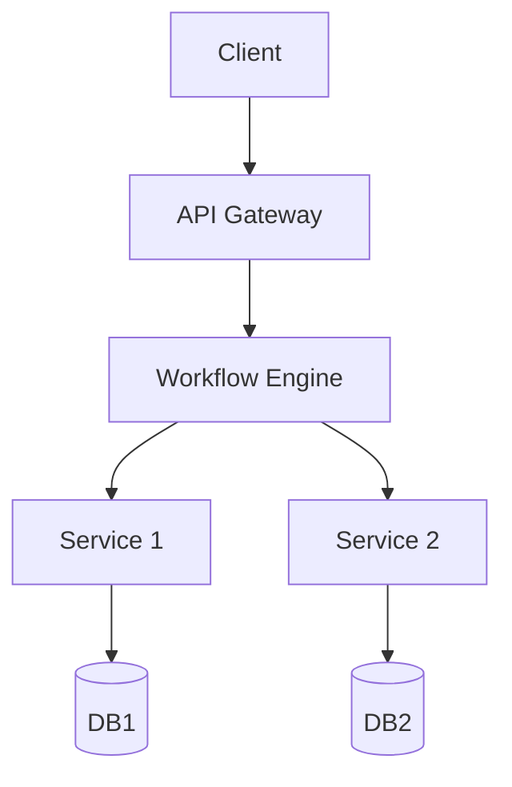

# 2.4 WorkflowDomain 工作流与微服务集成

> 本文属于2-WorkflowDomain主题，建议配合[主题树与内容索引](./00-主题树与内容索引.md)一同阅读。

## 目录

- [2.4 WorkflowDomain 工作流与微服务集成](#24-workflowdomain-工作流与微服务集成)
  - [目录](#目录)
  - [2.4.1 引言](#241-引言)
  - [2.4.2 工作流与微服务集成模式](#242-工作流与微服务集成模式)
  - [2.4.3 集成架构案例](#243-集成架构案例)
  - [2.4.5 图表与形式化分析](#245-图表与形式化分析)
  - [2.4.6 参考文献](#246-参考文献)

---

## 2.4.1 引言

工作流与微服务集成是现代分布式系统的核心需求。通过工作流引擎编排微服务，实现弹性、可观测、可扩展的业务流程。

## 2.4.2 工作流与微服务集成模式

- **编排模式**：工作流引擎统一调度各微服务。
- **编解耦模式**：事件驱动，微服务间通过消息队列/事件总线解耦。
- **Saga模式**：分布式事务，工作流协调补偿操作。
- **Choreography模式**：微服务间直接事件交互，无中心调度。

## 2.4.3 集成架构案例

**架构图**：



**Rust/Go集成伪代码**：

```rust
// Rust: 调用微服务的工作流节点
fn call_service(url: &str) -> Result<String, reqwest::Error> {
    let resp = reqwest::blocking::get(url)?.text()?;
    Ok(resp)
}
```

```go
// Go: 调用微服务的工作流节点
import "net/http"
func callService(url string) (string, error) {
    resp, err := http.Get(url)
    if err != nil { return "", err }
    defer resp.Body.Close()
    body, _ := io.ReadAll(resp.Body)
    return string(body), nil
}
```

## 2.4.4 Rust/Go集成实践

### Rust微服务集成实践

#### 架构说明
- 采用Actix-web/Tonic等Rust微服务框架，结合工作流引擎（如Temporal Rust SDK）实现服务编排。
- 支持REST/gRPC通信、异步任务、分布式事务。

#### 典型代码示例（Actix-web + reqwest）
```rust
use actix_web::{web, App, HttpServer, Responder};
async fn service1() -> impl Responder { "Service1 OK" }
async fn call_service2() -> Result<String, reqwest::Error> {
    let resp = reqwest::get("http://localhost:8081/service2").await?.text().await?;
    Ok(resp)
}
#[actix_web::main]
async fn main() -> std::io::Result<()> {
    HttpServer::new(|| App::new().route("/service1", web::get().to(service1)))
        .bind("127.0.0.1:8080")?.run().await
}
```

#### 复杂性分析
- 并发安全、类型安全、异步高效，适合高性能微服务集成。
- 复杂性主要体现在异步编排、错误处理、分布式一致性。

### Go微服务集成实践

#### 架构说明
- 采用Gin/Gorilla等Go微服务框架，结合Temporal Go SDK实现工作流与服务编排。
- 支持REST/gRPC、消息队列、分布式事务。

#### 典型代码示例（Gin + http）
```go
package main
import (
    "github.com/gin-gonic/gin"
    "net/http"
    "io/ioutil"
)
func service1(c *gin.Context) {
    c.String(http.StatusOK, "Service1 OK")
}
func callService2() string {
    resp, _ := http.Get("http://localhost:8081/service2")
    defer resp.Body.Close()
    body, _ := ioutil.ReadAll(resp.Body)
    return string(body)
}
func main() {
    r := gin.Default()
    r.GET("/service1", service1)
    r.Run(":8080")
}
```

#### 复杂性分析
- Go原生并发、易于部署，适合微服务与工作流集成。
- 复杂性主要体现在协程调度、错误恢复、分布式一致性。

### 典型场景
- 订单处理、数据管道、自动化审批、分布式事务。
- 工作流引擎统一调度，微服务独立扩展。

### 形式化分析
- 可用Petri网/状态机建模服务编排的可达性、活性、补偿。
- Rust/Go代码可与形式化模型自动映射，便于验证。

## 2.4.5 图表与形式化分析

- **Petri网/状态机建模**：可形式化分析服务编排的可达性、活性、补偿。

## 2.4.6 参考文献

- Fowler, M. "Microservices Patterns." Manning, 2018.
- Temporal官方文档
- Rust/Go微服务集成实践见2.5节。
