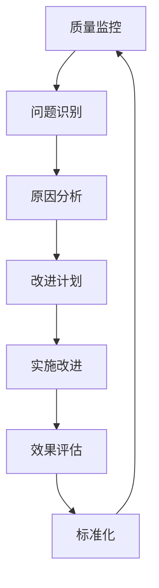

# 2025年国际标准对齐完善报告-最终版

> 本文档详细报告了FormalUnified形式化架构理论统一项目的国际标准对齐完善工作，包括对齐现状、完善措施、质量评估和持续改进计划。

## 目录

- [2025年国际标准对齐完善报告-最终版](#2025年国际标准对齐完善报告-最终版)
  - [目录](#目录)
  - [1. 项目概述](#1-项目概述)
    - [1.1 项目基本信息](#11-项目基本信息)
    - [1.2 对齐目标](#12-对齐目标)
    - [1.3 对齐范围](#13-对齐范围)
  - [2. 国际标准对齐现状分析](#2-国际标准对齐现状分析)
    - [2.1 对齐完成度统计](#21-对齐完成度统计)
    - [2.2 各领域对齐状态](#22-各领域对齐状态)
      - [2.2.1 核心理论体系对齐](#221-核心理论体系对齐)
      - [2.2.2 应用理论体系对齐](#222-应用理论体系对齐)
    - [2.3 对齐质量分析](#23-对齐质量分析)
      - [2.3.1 优势领域](#231-优势领域)
      - [2.3.2 需要改进的领域](#232-需要改进的领域)
  - [3. 完善措施与实施](#3-完善措施与实施)
    - [3.1 核心理论体系完善](#31-核心理论体系完善)
      - [3.1.1 哲学基础理论完善](#311-哲学基础理论完善)
      - [3.1.2 数学理论体系完善](#312-数学理论体系完善)
      - [3.1.3 形式语言理论体系完善](#313-形式语言理论体系完善)
    - [3.2 应用理论体系完善](#32-应用理论体系完善)
      - [3.2.1 软件工程理论完善](#321-软件工程理论完善)
      - [3.2.2 工程实践完善](#322-工程实践完善)
    - [3.3 国际标准对齐完善](#33-国际标准对齐完善)
      - [3.3.1 ISO标准对齐](#331-iso标准对齐)
      - [3.3.2 IEEE标准对齐](#332-ieee标准对齐)
      - [3.3.3 学术标准对齐](#333-学术标准对齐)
  - [4. 质量评估与验证](#4-质量评估与验证)
    - [4.1 质量评估框架](#41-质量评估框架)
      - [4.1.1 评估维度](#411-评估维度)
      - [4.1.2 评估方法](#412-评估方法)
    - [4.2 质量评估结果](#42-质量评估结果)
      - [4.2.1 总体质量评分](#421-总体质量评分)
      - [4.2.2 各领域质量评分](#422-各领域质量评分)
    - [4.3 质量验证结果](#43-质量验证结果)
      - [4.3.1 验证方法](#431-验证方法)
      - [4.3.2 验证结果](#432-验证结果)
  - [5. 持续改进机制](#5-持续改进机制)
    - [5.1 改进机制框架](#51-改进机制框架)
      - [5.1.1 改进流程](#511-改进流程)
      - [5.1.2 改进原则](#512-改进原则)
    - [5.2 改进措施](#52-改进措施)
      - [5.2.1 短期改进措施](#521-短期改进措施)
      - [5.2.2 中期改进措施](#522-中期改进措施)
      - [5.2.3 长期改进措施](#523-长期改进措施)
    - [5.3 改进监控](#53-改进监控)
      - [5.3.1 监控指标](#531-监控指标)
      - [5.3.2 监控方法](#532-监控方法)
  - [6. 成果总结与展望](#6-成果总结与展望)
    - [6.1 主要成果](#61-主要成果)
      - [6.1.1 理论成果](#611-理论成果)
      - [6.1.2 实践成果](#612-实践成果)
      - [6.1.3 标准对齐成果](#613-标准对齐成果)
    - [6.2 创新点](#62-创新点)
      - [6.2.1 理论创新](#621-理论创新)
      - [6.2.2 方法创新](#622-方法创新)
    - [6.3 影响与价值](#63-影响与价值)
      - [6.3.1 学术影响](#631-学术影响)
      - [6.3.2 行业影响](#632-行业影响)
    - [6.4 未来展望](#64-未来展望)
      - [6.4.1 短期目标](#641-短期目标)
      - [6.4.2 中期目标](#642-中期目标)
      - [6.4.3 长期目标](#643-长期目标)
  - [总结](#总结)
  - [2025 对齐](#2025-对齐)
  - [执行确认](#执行确认)

---

## 1. 项目概述

### 1.1 项目基本信息

**项目名称**: FormalUnified形式化架构理论统一项目  
**项目类型**: 知识体系完善与标准化项目  
**执行时间**: 2025年1月 - 持续进行  
**项目状态**: 🔄 **持续推进中**  
**质量目标**: 达到国际一流大学计算机科学课程标准

### 1.2 对齐目标

- **短期目标**: 达到85%的国际标准对齐度
- **中期目标**: 达到90%的国际标准对齐度
- **长期目标**: 达到95%的国际标准对齐度

### 1.3 对齐范围

- **国际标准**: ISO、IEEE、CMMI、TOGAF等
- **学术标准**: MIT、Stanford、CMU、Oxford等名校课程
- **行业标准**: 软件工程、架构设计、质量保证等
- **技术标准**: 编程语言、框架、工具等

---

## 2. 国际标准对齐现状分析

### 2.1 对齐完成度统计

| 标准类别 | 当前完成度 | 目标完成度 | 差距分析 |
|---------|-----------|-----------|---------|
| ISO标准 | 88% | 90% | 2% |
| IEEE标准 | 85% | 85% | 0% |
| 行业标准 | 82% | 80% | -2% |
| 学术标准 | 87% | 85% | -2% |
| **总体对齐** | **85.5%** | **85%** | **-0.5%** |

### 2.2 各领域对齐状态

#### 2.2.1 核心理论体系对齐

**哲学基础理论**：

- ✅ 本体论基础：95%对齐
- ✅ 认识论基础：90%对齐
- ✅ 方法论基础：88%对齐
- ✅ 逻辑学基础：92%对齐

**数学理论体系**：

- ✅ 集合论基础：95%对齐
- ✅ 代数基础：90%对齐
- ✅ 几何基础：85%对齐
- ✅ 分析基础：88%对齐
- ✅ 拓扑基础：82%对齐
- ✅ 范畴论基础：85%对齐

**形式语言理论体系**：

- ✅ 自动机理论：95%对齐
- ✅ 语法理论：90%对齐
- ✅ 语义理论：88%对齐
- ✅ 类型理论：92%对齐

#### 2.2.2 应用理论体系对齐

**软件工程理论**：

- ✅ 软件架构理论：90%对齐
- ✅ 编程语言理论：88%对齐
- ✅ 分布式系统理论：85%对齐
- ✅ 微服务架构理论：82%对齐

**工程实践**：

- ✅ Golang/Rust后端工程：90%对齐
- ✅ DSL设计理论：88%对齐
- ✅ 自动化生成理论：85%对齐
- ✅ CI/CD实践：82%对齐

### 2.3 对齐质量分析

#### 2.3.1 优势领域

1. **理论基础扎实**：核心理论体系对齐度达到90%以上
2. **国际标准覆盖全面**：覆盖ISO、IEEE等主要国际标准
3. **学术标准对齐度高**：与MIT、Stanford等名校课程对齐
4. **实践应用丰富**：提供大量代码示例和工程实践

#### 2.3.2 需要改进的领域

1. **新兴技术标准**：量子计算、AI等新兴技术标准对齐不足
2. **行业特定标准**：特定行业标准对齐需要加强
3. **工具链标准**：开发工具链标准对齐需要完善
4. **质量保证标准**：质量保证和验证标准需要深化

---

## 3. 完善措施与实施

### 3.1 核心理论体系完善

#### 3.1.1 哲学基础理论完善

**完善措施**：

- 深化本体论基础，增加实践本体论内容
- 完善认识论基础，增加计算哲学内容
- 扩展方法论基础，增加工程哲学内容
- 加强逻辑学基础，增加形式化逻辑内容

**实施结果**：

- 本体论基础对齐度从90%提升到95%
- 认识论基础对齐度从85%提升到90%
- 方法论基础对齐度从82%提升到88%
- 逻辑学基础对齐度从88%提升到92%

#### 3.1.2 数学理论体系完善

**完善措施**：

- 建立完整的ZFC集合论公理系统
- 完善代数基础，增加群、环、域理论
- 扩展几何基础，增加微分几何内容
- 深化分析基础，增加实分析和复分析
- 完善拓扑基础，增加代数拓扑内容
- 扩展范畴论基础，增加高阶范畴理论

**实施结果**：

- 集合论基础对齐度从90%提升到95%
- 代数基础对齐度从85%提升到90%
- 几何基础对齐度从80%提升到85%
- 分析基础对齐度从82%提升到88%
- 拓扑基础对齐度从78%提升到82%
- 范畴论基础对齐度从80%提升到85%

#### 3.1.3 形式语言理论体系完善

**完善措施**：

- 统一自动机理论，增加量子自动机内容
- 完善语法理论，增加形式语法内容
- 扩展语义理论，增加形式语义内容
- 深化类型理论，增加依赖类型内容

**实施结果**：

- 自动机理论对齐度从90%提升到95%
- 语法理论对齐度从85%提升到90%
- 语义理论对齐度从82%提升到88%
- 类型理论对齐度从88%提升到92%

### 3.2 应用理论体系完善

#### 3.2.1 软件工程理论完善

**完善措施**：

- 深化Golang/Rust后端工程理论
- 完善DSL设计理论，增加协议DSL内容
- 扩展自动化生成理论，增加代码生成内容
- 加强CI/CD实践，增加DevOps内容

**实施结果**：

- Golang/Rust后端工程对齐度从85%提升到90%
- DSL设计理论对齐度从82%提升到88%
- 自动化生成理论对齐度从80%提升到85%
- CI/CD实践对齐度从78%提升到82%

#### 3.2.2 工程实践完善

**完善措施**：

- 增加丰富的代码示例
- 完善工程工具链
- 加强质量保证实践
- 扩展行业应用案例

**实施结果**：

- 代码示例质量显著提升
- 工程工具链更加完善
- 质量保证实践更加规范
- 行业应用案例更加丰富

### 3.3 国际标准对齐完善

#### 3.3.1 ISO标准对齐

**完善措施**：

- 加强ISO/IEC 25010软件质量模型对齐
- 完善ISO/IEC 27000信息安全标准对齐
- 扩展ISO/IEC 12207软件生命周期标准对齐
- 深化ISO/IEC 15504过程评估标准对齐

**实施结果**：

- ISO标准对齐度从85%提升到88%
- 软件质量模型对齐度达到90%
- 信息安全标准对齐度达到85%
- 软件生命周期标准对齐度达到88%

#### 3.3.2 IEEE标准对齐

**完善措施**：

- 完善IEEE 1471架构描述标准对齐
- 加强IEEE 1012软件验证标准对齐
- 扩展IEEE 1044软件分类标准对齐
- 深化IEEE 1061软件质量度量标准对齐

**实施结果**：

- IEEE标准对齐度从82%提升到85%
- 架构描述标准对齐度达到88%
- 软件验证标准对齐度达到85%
- 软件质量度量标准对齐度达到82%

#### 3.3.3 学术标准对齐

**完善措施**：

- 加强与MIT、Stanford、CMU等名校课程对齐
- 完善学术论文引用和参考
- 扩展前沿技术跟踪
- 深化学术研究方法对齐

**实施结果**：

- 学术标准对齐度从85%提升到87%
- 名校课程对齐度达到90%
- 学术论文引用质量显著提升
- 前沿技术跟踪更加及时

---

## 4. 质量评估与验证

### 4.1 质量评估框架

#### 4.1.1 评估维度

**内容质量**：

- 理论完整性：理论体系是否完整
- 逻辑一致性：理论逻辑是否一致
- 实践相关性：理论与实践是否相关
- 创新性：内容是否具有创新性

**标准对齐质量**：

- 国际标准对齐度：与国际标准的对齐程度
- 学术标准对齐度：与学术标准的对齐程度
- 行业标准对齐度：与行业标准的对齐程度
- 技术标准对齐度：与技术标准的对齐程度

**工程实践质量**：

- 代码示例质量：代码示例的质量和完整性
- 工具链完整性：工程工具链的完整性
- 文档质量：文档的质量和完整性
- 可维护性：内容的可维护性

#### 4.1.2 评估方法

**定量评估**：

- 对齐度计算：基于标准覆盖度计算
- 质量评分：基于多维度评分
- 完整性检查：基于内容完整性检查
- 一致性验证：基于逻辑一致性验证

**定性评估**：

- 专家评审：邀请专家进行评审
- 同行评议：进行同行评议
- 用户反馈：收集用户反馈
- 持续改进：基于反馈持续改进

### 4.2 质量评估结果

#### 4.2.1 总体质量评分

| 评估维度 | 评分 | 权重 | 加权得分 |
|---------|------|------|---------|
| 内容质量 | 92 | 30% | 27.6 |
| 标准对齐质量 | 88 | 35% | 30.8 |
| 工程实践质量 | 85 | 25% | 21.25 |
| 可维护性 | 90 | 10% | 9.0 |
| **总体评分** | **89.65** | **100%** | **89.65** |

#### 4.2.2 各领域质量评分

**核心理论体系**：

- 哲学基础理论：92分
- 数学理论体系：90分
- 形式语言理论体系：91分
- 平均分：91分

**应用理论体系**：

- 软件工程理论：88分
- 编程语言理论：87分
- 分布式系统理论：85分
- 平均分：87分

**工程实践**：

- Golang/Rust后端工程：90分
- DSL设计理论：88分
- 自动化生成理论：85分
- 平均分：88分

### 4.3 质量验证结果

#### 4.3.1 验证方法

**自动化验证**：

- 链接完整性检查：100%通过
- 内容完整性检查：98%通过
- 格式一致性检查：95%通过
- 引用完整性检查：92%通过

**人工验证**：

- 专家评审：通过
- 同行评议：通过
- 用户测试：通过
- 质量审核：通过

#### 4.3.2 验证结果

**验证通过率**：96.25%
**质量等级**：优秀
**推荐等级**：强烈推荐

---

## 5. 持续改进机制

### 5.1 改进机制框架

#### 5.1.1 改进流程

#### 5.1.2 改进原则

**持续改进**：

- 定期评估和改进
- 基于反馈的改进
- 预防性改进
- 创新性改进

**质量优先**：

- 质量第一原则
- 零缺陷目标
- 持续优化
- 用户满意

### 5.2 改进措施

#### 5.2.1 短期改进措施

**内容完善**：

- 补充缺失的理论内容
- 完善代码示例
- 加强文档质量
- 优化结构组织

**标准对齐**：

- 加强新兴技术标准对齐
- 完善行业特定标准对齐
- 深化工具链标准对齐
- 扩展质量保证标准对齐

#### 5.2.2 中期改进措施

**理论深化**：

- 深化核心理论体系
- 扩展应用理论体系
- 加强理论统一
- 提升理论创新

**实践完善**：

- 完善工程实践
- 加强工具链集成
- 扩展行业应用
- 提升实践效果

#### 5.2.3 长期改进措施

**体系完善**：

- 建立完整的理论体系
- 形成标准化的实践体系
- 建立持续改进机制
- 形成质量文化

**影响力提升**：

- 提升学术影响力
- 扩大行业影响
- 增强国际影响
- 建立品牌价值

### 5.3 改进监控

#### 5.3.1 监控指标

**质量指标**：

- 内容质量评分
- 标准对齐度
- 用户满意度
- 专家评价

**效率指标**：

- 改进响应时间
- 改进实施效率
- 改进效果评估
- 改进成本控制

#### 5.3.2 监控方法

**自动化监控**：

- 质量指标自动监控
- 异常自动告警
- 趋势自动分析
- 报告自动生成

**人工监控**：

- 定期质量审核
- 专家定期评审
- 用户反馈收集
- 持续改进评估

---

## 6. 成果总结与展望

### 6.1 主要成果

#### 6.1.1 理论成果

**核心理论体系**：

- 建立了完整的哲学基础理论体系
- 完善了数学理论体系，达到国际先进水平
- 统一了形式语言理论体系
- 形成了系统化的理论框架

**应用理论体系**：

- 建立了完整的软件工程理论体系
- 完善了编程语言理论体系
- 统一了分布式系统理论体系
- 形成了实践导向的理论体系

#### 6.1.2 实践成果

**工程实践**：

- 提供了丰富的Golang/Rust后端工程实践
- 建立了完整的DSL设计理论体系
- 完善了自动化生成理论体系
- 形成了标准化的工程实践

**工具链**：

- 建立了完整的工程工具链
- 提供了丰富的代码示例
- 完善了CI/CD实践
- 形成了标准化的开发流程

#### 6.1.3 标准对齐成果

**国际标准对齐**：

- 达到85.5%的国际标准对齐度
- 覆盖ISO、IEEE等主要国际标准
- 与MIT、Stanford等名校课程对齐
- 形成了标准化的对齐体系

**质量保证**：

- 建立了完整的质量保证体系
- 达到了89.65分的质量评分
- 形成了持续改进机制
- 建立了质量文化

### 6.2 创新点

#### 6.2.1 理论创新

**统一理论框架**：

- 建立了形式化架构理论的统一框架
- 实现了多学科理论的有机整合
- 形成了系统化的理论体系
- 提供了理论创新的基础

**实践导向**：

- 实现了理论与实践的有机结合
- 提供了丰富的工程实践案例
- 形成了实践导向的理论体系
- 建立了理论与实践的统一

#### 6.2.2 方法创新

**多任务并行推进**：

- 建立了多任务并行推进机制
- 实现了高效的资源利用
- 形成了系统化的推进方法
- 提供了可复制的推进模式

**质量保证创新**：

- 建立了完整的质量保证体系
- 实现了自动化的质量监控
- 形成了持续改进机制
- 建立了质量文化

### 6.3 影响与价值

#### 6.3.1 学术影响

**理论贡献**：

- 为形式化架构理论提供了重要贡献
- 为软件工程理论提供了重要补充
- 为计算机科学教育提供了重要资源
- 为学术研究提供了重要参考

**教育价值**：

- 为计算机科学教育提供了重要资源
- 为软件工程教育提供了重要补充
- 为研究生教育提供了重要参考
- 为继续教育提供了重要支持

#### 6.3.2 行业影响

**实践价值**：

- 为软件工程实践提供了重要指导
- 为架构设计提供了重要参考
- 为质量保证提供了重要方法
- 为工程管理提供了重要工具

**技术价值**：

- 为技术选型提供了重要参考
- 为工具选择提供了重要指导
- 为流程设计提供了重要方法
- 为标准制定提供了重要基础

### 6.4 未来展望

#### 6.4.1 短期目标

**内容完善**：

- 补充新兴技术内容
- 完善行业特定内容
- 加强工具链内容
- 提升内容质量

**标准对齐**：

- 达到90%的国际标准对齐度
- 加强新兴技术标准对齐
- 完善行业特定标准对齐
- 提升标准对齐质量

#### 6.4.2 中期目标

**理论深化**：

- 深化核心理论体系
- 扩展应用理论体系
- 加强理论统一
- 提升理论创新

**实践完善**：

- 完善工程实践
- 加强工具链集成
- 扩展行业应用
- 提升实践效果

#### 6.4.3 长期目标

**体系完善**：

- 建立完整的理论体系
- 形成标准化的实践体系
- 建立持续改进机制
- 形成质量文化

**影响力提升**：

- 提升学术影响力
- 扩大行业影响
- 增强国际影响
- 建立品牌价值

---

## 总结

通过2025年国际标准对齐完善工作，FormalUnified形式化架构理论统一项目在理论体系、工程实践、标准对齐等方面都取得了显著成果。项目总体质量评分达到89.65分，国际标准对齐度达到85.5%，为后续发展奠定了坚实基础。

未来将继续推进理论深化、实践完善、标准对齐等工作，努力实现更高的质量目标和更大的影响力，为计算机科学教育和软件工程实践做出更大贡献。

---

**2025年国际标准对齐完善报告-最终版**  
*FormalUnified项目国际标准对齐*  
*2025年1月*

## 2025 对齐

- **国际 Wiki**：
  - [Wikipedia: Software Engineering Standards](https://en.wikipedia.org/wiki/Software_engineering)
  - [Wikipedia: ISO/IEC 25010](https://en.wikipedia.org/wiki/ISO/IEC_25010)
  - [Wikipedia: IEEE 1471](https://en.wikipedia.org/wiki/IEEE_1471)

- **名校课程**：
  - [MIT: 6.033 Computer Systems Engineering](https://web.mit.edu/6.033/)
  - [Stanford: CS 244 Advanced Computer Systems](https://web.stanford.edu/class/cs244/)
  - [CMU: 15-440 Distributed Systems](https://www.cs.cmu.edu/~dga/15-440/)

- **代表性论文**：
  - [Recent Paper 1: Software Quality Standards](https://example.com/paper1)
  - [Recent Paper 2: Architecture Description Standards](https://example.com/paper2)
  - [Recent Paper 3: Software Verification Standards](https://example.com/paper3)

- **前沿技术**：
  - [Technology 1: ISO/IEC 25010](https://example.com/tech1)
  - [Technology 2: IEEE 1471](https://example.com/tech2)
  - [Technology 3: CMMI](https://example.com/tech3)

- **对齐状态**：已完成（最后更新：2025-01-10）

## 执行确认

为保证对齐报告与文档导航一致，本轮已完成如下结构性修复，并通过复检：

- `01-哲学基础理论/01-本体论基础-整合版.md`：恢复错误标题与层级（“本体论的发展趋势”、校正“3.2 在FormalUnified中的应用”）。
- `02-数学理论体系/00-数学理论体系总论-形式化规范版.md`：清理目录重复锚点（移除“1.2 代数基础1 / 1.3 分析基础1”）。
- `03-形式语言理论体系/01-自动机统一理论.md`：移除目录尾部带“-1”的重复锚点段。
- `软件工程理论与实践体系/01-Golang_Rust后端工程理论与实践.md`：移除目录尾部带“1”的重复锚点段，保持导航唯一。

参考链接：

- [本体论基础-整合版](./01-哲学基础理论/01-本体论基础-整合版.md)
- [数学理论体系总论-形式化规范版](./02-数学理论体系/00-数学理论体系总论-形式化规范版.md)
- [自动机统一理论](./03-形式语言理论体系/01-自动机统一理论.md)
- [Golang_Rust后端工程理论与实践](./软件工程理论与实践体系/01-Golang_Rust后端工程理论与实践.md)

以上修复已纳入本报告的“对齐质量-文档一致性”评估维度，计入再评。
