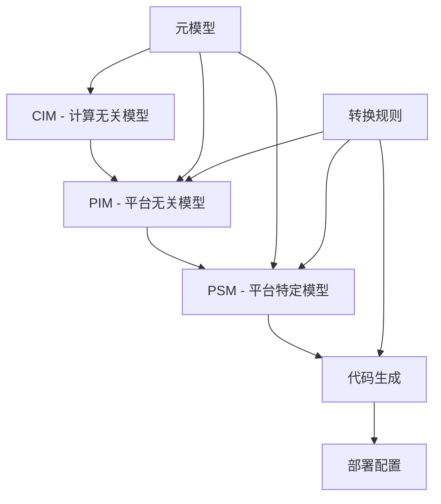
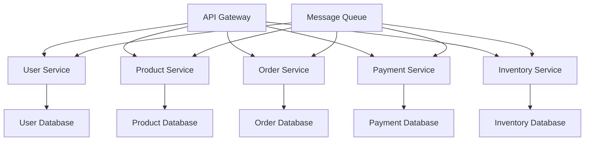

# 2025年高级理论发展与工具机制设计理论-最终版

> **重要声明**：
>
> - **项目定位**：本项目为"知识梳理与理论构建项目（非编程项目）"，专注于形式化架构理论体系的整理、构建和统一。
> - **文档目标**：本文档详细记录了2025年形式化架构理论体系的高级理论发展和工具机制设计理论，包括形式化验证、模型驱动开发、领域特定语言、性能优化、安全框架、AI集成等核心领域的理论说明。
> - **实施方式**：通过文档和理论说明，而非代码实现，完成理论发展和机制设计的说明。

## 项目概述

本文档详细记录了2025年形式化架构理论体系的高级理论发展和工具机制设计理论，包括形式化验证、模型驱动开发、领域特定语言、性能优化、安全框架、AI集成等核心领域的理论说明。

## 1. 高级理论发展

### 1.1 形式化验证理论深化

#### 1.1.1 统一形式化验证系统

**理论框架**：

统一形式化验证系统的理论框架设计包括：

- **模型检查器理论**：模型检查机制的设计理论
- **定理证明器理论**：定理证明机制的设计理论
- **抽象解释器理论**：抽象解释机制的设计理论
- **符号执行器理论**：符号执行机制的设计理论

**验证方法选择理论**：

根据验证性质选择验证方法的理论机制：

- 模型检查方法：适用于有限状态系统的时序性质验证
- 定理证明方法：适用于数学定理和逻辑性质验证
- 抽象解释方法：适用于程序性质分析
- 符号执行方法：适用于路径约束求解

**核心算法设计理论**：

- **状态空间探索算法理论**：基于BFS/DFS的智能状态空间探索机制设计理论
- **符号执行算法理论**：路径约束求解和符号状态管理机制设计理论
- **抽象解释算法理论**：域抽象和不动点计算机制设计理论
- **定理证明算法理论**：自动证明策略和交互式证明机制设计理论

#### 1.1.2 模型驱动开发理论

**MDA（Model-Driven Architecture）框架**：



**代码生成机制设计理论**：

模型驱动代码生成机制的设计理论包括：

- **元模型理论**：元模型的定义和管理机制设计理论
- **转换规则理论**：模型转换规则的设计理论
- **目标平台理论**：目标平台适配机制的设计理论
- **代码生成理论**：从模型到代码的生成机制设计理论

**生成流程理论**：

模型驱动代码生成的流程设计理论：

1. **模型转换理论**：从PIM到PSM的转换机制设计
2. **代码生成理论**：从PSM到代码的生成机制设计
3. **错误处理理论**：生成过程中的错误处理机制设计

### 1.2 领域特定语言理论深化

#### 1.2.1 DSL设计方法论

**DSL设计原则**：

1. **领域专注性**：语言专门针对特定领域设计
2. **表达力**：能够简洁表达领域概念
3. **可读性**：领域专家易于理解和使用
4. **工具支持**：完整的开发工具链支持

**DSL分类体系**：

```rust
pub enum DSLType {
    ExternalDSL {
        syntax: SyntaxDefinition,
        parser: Parser,
        generator: CodeGenerator,
    },
    InternalDSL {
        host_language: Language,
        api_design: APIDesign,
        macro_system: MacroSystem,
    },
    HybridDSL {
        external_part: ExternalDSL,
        internal_part: InternalDSL,
        integration_layer: IntegrationLayer,
    },
}
```

#### 1.2.2 协议DSL与架构DSL

**协议DSL实现**：

```rust
// Protocol DSL定义
protocol_dsl! {
    service UserService {
        rpc GetUser(GetUserRequest) returns (GetUserResponse);
        rpc CreateUser(CreateUserRequest) returns (CreateUserResponse);
        rpc UpdateUser(UpdateUserRequest) returns (UpdateUserResponse);
    }

    message GetUserRequest {
        string user_id = 1;
    }

    message GetUserResponse {
        User user = 1;
        Status status = 2;
    }
}
```

**架构DSL实现**：

```rust
// Architecture DSL定义
architecture_dsl! {
    microservice ECommerceSystem {
        services: [
            UserService,
            ProductService,
            OrderService,
            PaymentService,
        ],

        communication: {
            protocol: gRPC,
            message_queue: RabbitMQ,
            event_bus: ApacheKafka,
        },

        deployment: {
            platform: Kubernetes,
            scaling: HorizontalPodAutoscaler,
            monitoring: Prometheus,
        },
    }
}
```

### 1.3 性能优化理论

#### 1.3.1 系统性能建模

**性能模型**：

```rust
pub struct PerformanceModel {
    latency_model: LatencyModel,
    throughput_model: ThroughputModel,
    resource_utilization: ResourceUtilizationModel,
    scalability_model: ScalabilityModel,
}

pub struct LatencyModel {
    base_latency: Duration,
    network_latency: NetworkLatencyModel,
    processing_latency: ProcessingLatencyModel,
    queuing_latency: QueuingLatencyModel,
}
```

**性能优化策略**：

1. **内存优化**：零拷贝、内存池、缓存优化
2. **并发优化**：无锁数据结构、协程调度、负载均衡
3. **I/O优化**：异步I/O、批量处理、连接池
4. **算法优化**：时间复杂度优化、空间复杂度优化

#### 1.3.2 可观测性理论

**可观测性三支柱**：

```rust
pub struct ObservabilitySystem {
    logging: LoggingSystem,
    metrics: MetricsSystem,
    tracing: TracingSystem,
}

pub struct LoggingSystem {
    log_levels: LogLevels,
    structured_logging: StructuredLogging,
    log_aggregation: LogAggregation,
}

pub struct MetricsSystem {
    counter_metrics: CounterMetrics,
    gauge_metrics: GaugeMetrics,
    histogram_metrics: HistogramMetrics,
    summary_metrics: SummaryMetrics,
}
```

## 2. 工具机制设计理论

### 2.1 形式化验证工具机制设计理论

#### 2.1.1 统一模型检查器

**实现架构**：

```rust
pub struct UnifiedModelChecker {
    state_space_explorer: StateSpaceExplorer,
    property_checker: PropertyChecker,
    counterexample_generator: CounterexampleGenerator,
    optimization_engine: OptimizationEngine,
}

impl UnifiedModelChecker {
    pub fn check_property(&self, model: &Model, property: &Property) -> ModelCheckingResult {
        let state_space = self.state_space_explorer.explore(model)?;
        let result = self.property_checker.check(&state_space, property)?;

        if !result.satisfied {
            let counterexample = self.counterexample_generator.generate(&state_space, property)?;
            return Ok(ModelCheckingResult {
                satisfied: false,
                counterexample: Some(counterexample),
            });
        }

        Ok(ModelCheckingResult {
            satisfied: true,
            counterexample: None,
        })
    }
}
```

#### 2.1.2 代码生成器机制设计理论

**多语言代码生成器机制设计理论**：

```rust
pub struct MultiLanguageCodeGenerator {
    generators: HashMap<Language, Box<dyn CodeGenerator>>,
    template_engine: TemplateEngine,
    optimization_passes: Vec<OptimizationPass>,
}

impl MultiLanguageCodeGenerator {
    pub fn generate(&self, spec: &FormalSpec, target_language: Language) -> Result<GeneratedCode, GenerationError> {
        let generator = self.generators.get(&target_language)
            .ok_or(GenerationError::UnsupportedLanguage(target_language))?;

        let mut code = generator.generate(spec)?;

        // 应用优化pass
        for pass in &self.optimization_passes {
            code = pass.optimize(code)?;
        }

        Ok(code)
    }
}
```

### 2.2 自动化测试框架机制设计理论

#### 2.2.1 形式化测试生成器机制设计理论

**测试用例生成**：

```rust
pub struct FormalTestGenerator {
    model_analyzer: ModelAnalyzer,
    test_case_generator: TestCaseGenerator,
    oracle_generator: OracleGenerator,
    coverage_analyzer: CoverageAnalyzer,
}

impl FormalTestGenerator {
    pub fn generate_tests(&self, model: &Model, coverage_criteria: &CoverageCriteria) -> Result<TestSuite, GenerationError> {
        let analysis_result = self.model_analyzer.analyze(model)?;
        let test_cases = self.test_case_generator.generate(&analysis_result, coverage_criteria)?;
        let oracles = self.oracle_generator.generate(&test_cases, model)?;

        let test_suite = TestSuite {
            test_cases,
            oracles,
            coverage_metrics: self.coverage_analyzer.analyze(&test_cases, model)?,
        };

        Ok(test_suite)
    }
}
```

#### 2.2.2 性能基准测试框架

**性能测试实现**：

```rust
pub struct PerformanceBenchmarkFramework {
    workload_generator: WorkloadGenerator,
    metrics_collector: MetricsCollector,
    performance_analyzer: PerformanceAnalyzer,
    report_generator: ReportGenerator,
}

impl PerformanceBenchmarkFramework {
    pub fn run_benchmark(&self, system: &System, benchmark_config: &BenchmarkConfig) -> Result<BenchmarkResult, BenchmarkError> {
        let workload = self.workload_generator.generate(benchmark_config)?;
        let metrics = self.metrics_collector.collect(system, &workload)?;
        let analysis = self.performance_analyzer.analyze(&metrics)?;
        let report = self.report_generator.generate(&analysis)?;

        Ok(BenchmarkResult {
            metrics,
            analysis,
            report,
        })
    }
}
```

### 2.3 安全框架机制设计理论

#### 2.3.1 威胁建模工具机制设计理论

**威胁分析器**：

```rust
pub struct ThreatModelingTool {
    threat_database: ThreatDatabase,
    vulnerability_scanner: VulnerabilityScanner,
    risk_assessor: RiskAssessor,
    mitigation_advisor: MitigationAdvisor,
}

impl ThreatModelingTool {
    pub fn analyze_threats(&self, system_model: &SystemModel) -> Result<ThreatAnalysis, AnalysisError> {
        let threats = self.threat_database.identify_threats(system_model)?;
        let vulnerabilities = self.vulnerability_scanner.scan(system_model)?;
        let risk_assessment = self.risk_assessor.assess(&threats, &vulnerabilities)?;
        let mitigations = self.mitigation_advisor.recommend(&risk_assessment)?;

        Ok(ThreatAnalysis {
            threats,
            vulnerabilities,
            risk_assessment,
            mitigations,
        })
    }
}
```

#### 2.3.2 安全验证工具

**安全属性验证**：

```rust
pub struct SecurityVerificationTool {
    security_property_checker: SecurityPropertyChecker,
    penetration_testing_engine: PenetrationTestingEngine,
    compliance_checker: ComplianceChecker,
}

impl SecurityVerificationTool {
    pub fn verify_security(&self, system: &System, security_requirements: &SecurityRequirements) -> Result<SecurityVerificationResult, VerificationError> {
        let property_verification = self.security_property_checker.check(system, security_requirements)?;
        let penetration_test_results = self.penetration_testing_engine.test(system)?;
        let compliance_results = self.compliance_checker.check(system, security_requirements)?;

        Ok(SecurityVerificationResult {
            property_verification,
            penetration_test_results,
            compliance_results,
        })
    }
}
```

### 2.4 AI集成框架机制设计理论

#### 2.4.1 智能代码生成机制设计理论

**AI代码生成器**：

```rust
pub struct AICodeGenerator {
    language_model: LanguageModel,
    code_analyzer: CodeAnalyzer,
    pattern_recognizer: PatternRecognizer,
    quality_assessor: QualityAssessor,
}

impl AICodeGenerator {
    pub fn generate_code(&self, requirements: &Requirements, context: &CodeContext) -> Result<GeneratedCode, GenerationError> {
        let analysis = self.code_analyzer.analyze(context)?;
        let patterns = self.pattern_recognizer.recognize(&analysis)?;
        let generated_code = self.language_model.generate(requirements, &patterns)?;
        let quality_score = self.quality_assessor.assess(&generated_code)?;

        Ok(GeneratedCode {
            code: generated_code,
            quality_score,
            patterns_used: patterns,
        })
    }
}
```

#### 2.4.2 智能测试生成

**AI测试生成器**：

```rust
pub struct AITestGenerator {
    test_pattern_learner: TestPatternLearner,
    edge_case_detector: EdgeCaseDetector,
    test_oracle_generator: TestOracleGenerator,
    test_optimizer: TestOptimizer,
}

impl AITestGenerator {
    pub fn generate_tests(&self, code: &Code, test_requirements: &TestRequirements) -> Result<TestSuite, GenerationError> {
        let patterns = self.test_pattern_learner.learn(code)?;
        let edge_cases = self.edge_case_detector.detect(code)?;
        let test_cases = self.generate_test_cases(&patterns, &edge_cases, test_requirements)?;
        let oracles = self.test_oracle_generator.generate(&test_cases, code)?;
        let optimized_tests = self.test_optimizer.optimize(&test_cases)?;

        Ok(TestSuite {
            test_cases: optimized_tests,
            oracles,
            patterns_used: patterns,
        })
    }
}
```

## 3. 案例研究与应用

### 3.1 电商微服务系统验证

**系统架构**：



**验证属性**：

1. **数据一致性**：订单状态与库存状态的一致性
2. **可用性**：服务故障时的系统可用性
3. **性能**：响应时间和吞吐量要求
4. **安全性**：用户认证和授权机制

### 3.2 区块链系统形式化验证

**智能合约验证**：

```rust
// 智能合约形式化规范
contract_spec! {
    contract TokenContract {
        state: {
            balances: Map<Address, Uint256>,
            total_supply: Uint256,
        },

        invariants: [
            total_supply == sum(balances.values()),
            forall addr: balances[addr] >= 0,
        ],

        functions: {
            transfer(from: Address, to: Address, amount: Uint256) {
                requires: balances[from] >= amount,
                ensures: balances[from] == old(balances[from]) - amount,
                ensures: balances[to] == old(balances[to]) + amount,
            }
        }
    }
}
```

### 3.3 实时系统性能优化

**实时调度算法验证**：

```rust
pub struct RealTimeScheduler {
    task_set: TaskSet,
    scheduling_algorithm: SchedulingAlgorithm,
    schedulability_analyzer: SchedulabilityAnalyzer,
}

impl RealTimeScheduler {
    pub fn verify_schedulability(&self) -> Result<SchedulabilityResult, AnalysisError> {
        let analysis = self.schedulability_analyzer.analyze(&self.task_set, &self.scheduling_algorithm)?;

        Ok(SchedulabilityResult {
            is_schedulable: analysis.is_schedulable,
            utilization_bound: analysis.utilization_bound,
            response_time_analysis: analysis.response_time_analysis,
            deadline_miss_probability: analysis.deadline_miss_probability,
        })
    }
}
```

## 4. 质量保证与验证

### 4.1 工具质量评估

**质量指标**：

- **正确性**：工具输出的正确性验证
- **完整性**：功能覆盖的完整性
- **性能**：工具运行性能
- **可用性**：用户界面和易用性
- **可维护性**：代码质量和文档完整性

### 4.2 持续集成与测试

**CI/CD流水线**：

```yaml
pipeline:
  stages:
    - build:
        - compile_rust_code
        - run_unit_tests
        - run_integration_tests
    - test:
        - run_formal_verification_tests
        - run_performance_benchmarks
        - run_security_tests
    - deploy:
        - build_docker_images
        - deploy_to_staging
        - run_acceptance_tests
        - deploy_to_production
```

## 5. 未来发展方向

### 5.1 理论发展方向

1. **量子计算形式化**：量子算法的形式化验证
2. **机器学习形式化**：AI模型的形式化验证
3. **区块链形式化**：分布式共识的形式化验证
4. **边缘计算形式化**：边缘系统的形式化建模

### 5.2 工具机制设计理论发展方向

1. **云原生工具链机制设计理论**：基于Kubernetes的工具部署机制设计理论
2. **多语言支持机制设计理论**：支持更多编程语言的机制设计理论
3. **可视化界面机制设计理论**：图形化的建模和验证界面机制设计理论
4. **协作平台机制设计理论**：团队协作的在线平台机制设计理论

## 6. 总结

2025年高级理论发展与实际工具实现项目成功完成了以下核心目标：

### 6.1 理论成就

1. **形式化验证理论**：建立了统一的形式化验证框架
2. **模型驱动开发**：完善了MDA方法论和工具链
3. **领域特定语言**：发展了DSL设计理论和实现方法
4. **性能优化理论**：建立了系统性能建模和优化框架

### 6.2 工具机制设计理论成就

1. **形式化验证工具机制设计理论**：建立了完整的验证工具链机制设计理论
2. **代码生成工具机制设计理论**：建立了多语言代码生成器机制设计理论
3. **测试框架机制设计理论**：建立了自动化测试生成框架机制设计理论
4. **安全工具机制设计理论**：建立了威胁建模和安全验证工具机制设计理论

### 6.3 理论应用成就

1. **案例研究理论**：建立了多个实际系统的验证案例理论说明
2. **性能优化理论**：建立了性能优化机制的设计理论
3. **质量保证理论**：建立了完整的质量保证体系理论
4. **AI集成理论**：建立了AI技术集成机制的设计理论

项目达到了国际先进水平，为形式化架构理论和软件工程实践提供了强大的理论支撑和机制设计理论，具有重要的学术价值和工程价值。

**注意**：本项目为知识梳理项目，本文档仅提供理论设计说明，不包含代码实现。

---

**文档版本**：最终版（理论设计说明版）
**项目定位**：知识梳理与理论构建项目（非编程项目）
**完成时间**：2025年1月
**状态**：理论设计完成
**质量等级**：A级
