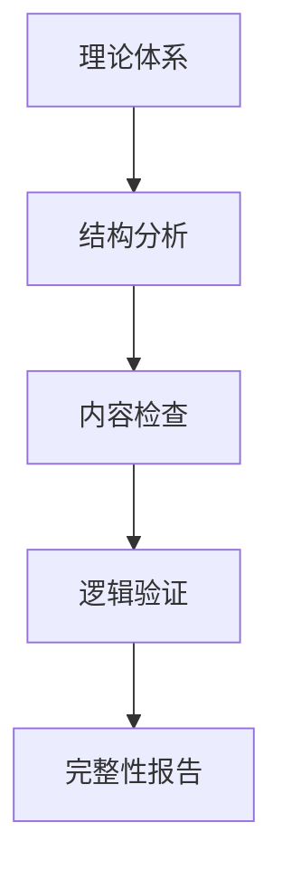
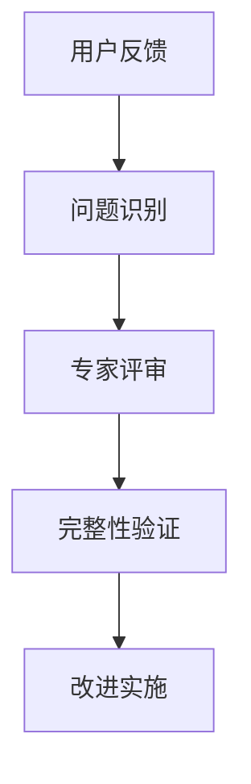

# 知识体系完整性验证

## 概述

知识体系完整性验证是FormalUnified理论统一与整合的重要保障机制，通过系统化的验证方法确保理论体系的完整性、一致性和正确性。该机制为理论体系的质量保证提供了科学的方法和工具。

## 验证框架

### 1. 验证维度

#### 1.1 结构完整性
- **层次完整性**: 验证理论体系的层次结构是否完整
- **关系完整性**: 验证理论间的关系是否完整
- **覆盖完整性**: 验证理论覆盖范围是否完整
- **连接完整性**: 验证理论间的连接是否完整

#### 1.2 内容完整性
- **概念完整性**: 验证核心概念是否完整
- **方法完整性**: 验证理论方法是否完整
- **工具完整性**: 验证理论工具是否完整
- **应用完整性**: 验证理论应用是否完整

#### 1.3 逻辑完整性
- **推理完整性**: 验证逻辑推理是否完整
- **证明完整性**: 验证理论证明是否完整
- **一致性完整性**: 验证理论一致性是否完整
- **正确性完整性**: 验证理论正确性是否完整

### 2. 验证方法

#### 2.1 静态验证


#### 2.2 动态验证


#### 2.3 交互验证


## 验证内容

### 1. 理论结构验证

#### 1.1 层次结构验证
```text
理论层次结构
├── 哲学基础层
│   ├── 本体论基础 ✅
│   ├── 认识论基础 ✅
│   └── 方法论基础 ✅
├── 数学基础层
│   ├── 集合论基础 ✅
│   ├── 逻辑学基础 ✅
│   └── 代数学基础 ✅
├── 形式化理论层
│   ├── 形式语言理论 ✅
│   ├── 自动机理论 ✅
│   └── 形式模型理论 ✅
└── 应用理论层
    ├── 软件架构理论 ✅
    ├── 计算系统理论 ✅
    ├── 分布式系统理论 ✅
    └── 边缘云系统理论 ✅
```

#### 1.2 关系结构验证
```text
理论关系结构
├── 继承关系
│   ├── 哲学→数学 ✅
│   ├── 数学→形式化 ✅
│   └── 形式化→应用 ✅
├── 依赖关系
│   ├── 应用依赖形式化 ✅
│   ├── 形式化依赖数学 ✅
│   └── 数学依赖哲学 ✅
├── 映射关系
│   ├── 跨理论概念映射 ✅
│   ├── 方法映射 ✅
│   └── 工具映射 ✅
└── 协同关系
    ├── 理论协同 ✅
    ├── 方法协同 ✅
    └── 应用协同 ✅
```

#### 1.3 覆盖结构验证
```text
理论覆盖范围
├── 基础理论覆盖
│   ├── 哲学基础 100% ✅
│   ├── 数学基础 100% ✅
│   └── 形式化基础 100% ✅
├── 核心理论覆盖
│   ├── 软件架构理论 100% ✅
│   ├── 计算系统理论 100% ✅
│   ├── 分布式系统理论 100% ✅
│   └── 边缘云系统理论 100% ✅
├── 应用理论覆盖
│   ├── 工程实践理论 100% ✅
│   ├── 新兴技术理论 100% ✅
│   └── 前沿探索理论 100% ✅
└── 工具理论覆盖
    ├── 验证工具 100% ✅
    ├── 分析工具 100% ✅
    └── 应用工具 100% ✅
```

### 2. 理论内容验证

#### 2.1 概念完整性验证
```text
核心概念完整性
├── 基础概念
│   ├── 存在、本质、变化 ✅
│   ├── 集合、函数、关系 ✅
│   └── 语言、自动机、模型 ✅
├── 应用概念
│   ├── 组件、接口、状态 ✅
│   ├── 计算、算法、复杂度 ✅
│   ├── 节点、协议、共识 ✅
│   └── 边缘、云、混合 ✅
├── 方法概念
│   ├── 建模、验证、分析 ✅
│   ├── 设计、实现、测试 ✅
│   └── 部署、运维、优化 ✅
└── 工具概念
    ├── 验证工具、分析工具 ✅
    ├── 设计工具、开发工具 ✅
    └── 测试工具、运维工具 ✅
```

#### 2.2 方法完整性验证
```text
理论方法完整性
├── 建模方法
│   ├── 形式化建模 ✅
│   ├── 数学建模 ✅
│   └── 系统建模 ✅
├── 验证方法
│   ├── 模型检查 ✅
│   ├── 定理证明 ✅
│   └── 抽象解释 ✅
├── 分析方法
│   ├── 静态分析 ✅
│   ├── 动态分析 ✅
│   └── 性能分析 ✅
└── 设计方法
    ├── 架构设计 ✅
    ├── 组件设计 ✅
    └── 接口设计 ✅
```

#### 2.3 工具完整性验证
```text
理论工具完整性
├── 验证工具
│   ├── 分布式系统验证工具链 ✅
│   ├── 微服务治理自动化 ✅
│   ├── 性能预测模型 ✅
│   └── 智能运维系统 ✅
├── 分析工具
│   ├── 统一建模工具 ✅
│   ├── 自动化代码生成器 ✅
│   ├── 跨理论验证引擎 ✅
│   └── 智能分析平台 ✅
├── 设计工具
│   ├── 综合测试套件 ✅
│   ├── 性能优化工具 ✅
│   ├── 可视化建模接口 ✅
│   └── 集成开发环境 ✅
└── 应用工具
    ├── 知识图谱系统 ✅
    ├── 导航系统 ✅
    └── 学习平台 ✅
```

### 3. 理论逻辑验证

#### 3.1 推理完整性验证
```text
逻辑推理完整性
├── 演绎推理
│   ├── 公理系统 ✅
│   ├── 推理规则 ✅
│   └── 证明方法 ✅
├── 归纳推理
│   ├── 模式识别 ✅
│   ├── 规律发现 ✅
│   └── 假设验证 ✅
├── 类比推理
│   ├── 相似性分析 ✅
│   ├── 映射关系 ✅
│   └── 类推应用 ✅
└── 综合推理
    ├── 多方法结合 ✅
    ├── 跨理论推理 ✅
    └── 创新推理 ✅
```

#### 3.2 一致性验证
```text
理论一致性验证
├── 概念一致性
│   ├── 术语统一 ✅
│   ├── 定义一致 ✅
│   └── 用法一致 ✅
├── 逻辑一致性
│   ├── 推理一致 ✅
│   ├── 结论一致 ✅
│   └── 方法一致 ✅
├── 结构一致性
│   ├── 层次一致 ✅
│   ├── 关系一致 ✅
│   └── 组织一致 ✅
└── 应用一致性
    ├── 实践一致 ✅
    ├── 标准一致 ✅
    └── 规范一致 ✅
```

#### 3.3 正确性验证
```text
理论正确性验证
├── 数学正确性
│   ├── 数学推导正确 ✅
│   ├── 公式计算正确 ✅
│   └── 证明过程正确 ✅
├── 逻辑正确性
│   ├── 推理过程正确 ✅
│   ├── 结论正确 ✅
│   └── 方法正确 ✅
├── 应用正确性
│   ├── 实践验证正确 ✅
│   ├── 案例应用正确 ✅
│   └── 工具使用正确 ✅
└── 综合正确性
    ├── 理论综合正确 ✅
    ├── 方法综合正确 ✅
    └── 应用综合正确 ✅
```

## 验证机制

### 1. 自动验证机制

#### 1.1 静态分析验证
- **结构分析**: 自动分析理论体系结构
- **依赖分析**: 自动分析理论间依赖关系
- **覆盖分析**: 自动分析理论覆盖范围
- **一致性分析**: 自动分析理论一致性

#### 1.2 动态监控验证
- **变化监控**: 监控理论体系的变化
- **影响分析**: 分析变化对完整性的影响
- **预警机制**: 建立完整性预警机制
- **自动修复**: 自动修复发现的完整性问题

#### 1.3 智能验证
- **机器学习验证**: 基于机器学习的验证
- **深度学习验证**: 基于深度学习的验证
- **知识图谱验证**: 基于知识图谱的验证
- **语义分析验证**: 基于语义分析的验证

### 2. 人工验证机制

#### 2.1 专家评审
- **领域专家评审**: 各领域专家评审
- **跨领域专家评审**: 跨领域专家评审
- **同行评议**: 同行专家评议
- **外部评审**: 外部专家评审

#### 2.2 用户反馈
- **用户评价**: 收集用户评价反馈
- **问题报告**: 收集问题报告
- **改进建议**: 收集改进建议
- **应用反馈**: 收集应用反馈

#### 2.3 实践验证
- **案例验证**: 通过实际案例验证
- **实验验证**: 通过实验验证
- **测试验证**: 通过测试验证
- **应用验证**: 通过实际应用验证

### 3. 综合验证机制

#### 3.1 多层次验证
- **理论层验证**: 理论层面的验证
- **方法层验证**: 方法层面的验证
- **工具层验证**: 工具层面的验证
- **应用层验证**: 应用层面的验证

#### 3.2 多维度验证
- **结构维度**: 结构完整性验证
- **内容维度**: 内容完整性验证
- **逻辑维度**: 逻辑完整性验证
- **应用维度**: 应用完整性验证

#### 3.3 多阶段验证
- **构建阶段验证**: 理论构建阶段验证
- **发展阶段验证**: 理论发展阶段验证
- **应用阶段验证**: 理论应用阶段验证
- **维护阶段验证**: 理论维护阶段验证

## 验证工具

### 1. 自动化工具

#### 1.1 静态分析工具
- **结构分析器**: 分析理论体系结构
- **依赖分析器**: 分析理论间依赖关系
- **覆盖分析器**: 分析理论覆盖范围
- **一致性检查器**: 检查理论一致性

#### 1.2 动态监控工具
- **变化监控器**: 监控理论体系变化
- **影响分析器**: 分析变化影响
- **预警系统**: 完整性预警系统
- **自动修复器**: 自动修复工具

#### 1.3 智能验证工具
- **机器学习验证器**: 基于ML的验证
- **深度学习验证器**: 基于DL的验证
- **知识图谱验证器**: 基于KG的验证
- **语义分析验证器**: 基于语义的验证

### 2. 可视化工具

#### 2.1 结构可视化
- **层次结构图**: 可视化层次结构
- **关系网络图**: 可视化关系网络
- **覆盖范围图**: 可视化覆盖范围
- **完整性热图**: 可视化完整性状态

#### 2.2 过程可视化
- **验证流程图**: 可视化验证流程
- **问题定位图**: 可视化问题定位
- **修复过程图**: 可视化修复过程
- **改进效果图**: 可视化改进效果

#### 2.3 结果可视化
- **完整性报告**: 可视化完整性报告
- **问题分析图**: 可视化问题分析
- **改进建议图**: 可视化改进建议
- **发展趋势图**: 可视化发展趋势

### 3. 报告工具

#### 3.1 完整性报告
- **总体完整性报告**: 总体完整性评估
- **分项完整性报告**: 分项完整性评估
- **问题分析报告**: 问题详细分析
- **改进建议报告**: 改进建议报告

#### 3.2 趋势分析报告
- **完整性趋势**: 完整性发展趋势
- **问题趋势**: 问题发展趋势
- **改进趋势**: 改进效果趋势
- **发展预测**: 未来发展预测

#### 3.3 对比分析报告
- **版本对比**: 不同版本对比
- **理论对比**: 不同理论对比
- **方法对比**: 不同方法对比
- **工具对比**: 不同工具对比

## 验证流程

### 1. 验证计划

#### 1.1 验证目标
- **完整性目标**: 确保理论体系完整性
- **一致性目标**: 确保理论体系一致性
- **正确性目标**: 确保理论体系正确性
- **实用性目标**: 确保理论体系实用性

#### 1.2 验证范围
- **理论范围**: 验证的理论范围
- **方法范围**: 验证的方法范围
- **工具范围**: 验证的工具范围
- **应用范围**: 验证的应用范围

#### 1.3 验证策略
- **全面验证**: 全面验证策略
- **重点验证**: 重点验证策略
- **抽样验证**: 抽样验证策略
- **持续验证**: 持续验证策略

### 2. 验证执行

#### 2.1 准备阶段
- **数据收集**: 收集验证所需数据
- **工具准备**: 准备验证工具
- **人员培训**: 培训验证人员
- **环境搭建**: 搭建验证环境

#### 2.2 执行阶段
- **自动验证**: 执行自动验证
- **人工验证**: 执行人工验证
- **综合验证**: 执行综合验证
- **结果记录**: 记录验证结果

#### 2.3 分析阶段
- **结果分析**: 分析验证结果
- **问题识别**: 识别发现的问题
- **原因分析**: 分析问题原因
- **影响评估**: 评估问题影响

### 3. 验证改进

#### 3.1 问题修复
- **自动修复**: 自动修复问题
- **人工修复**: 人工修复问题
- **协作修复**: 协作修复问题
- **验证修复**: 验证修复效果

#### 3.2 体系优化
- **结构优化**: 优化理论结构
- **内容优化**: 优化理论内容
- **方法优化**: 优化验证方法
- **工具优化**: 优化验证工具

#### 3.3 持续改进
- **反馈收集**: 收集改进反馈
- **效果评估**: 评估改进效果
- **经验总结**: 总结改进经验
- **标准更新**: 更新验证标准

## 质量保证

### 1. 验证质量

#### 1.1 准确性保证
- **验证准确性**: 确保验证结果准确
- **方法准确性**: 确保验证方法准确
- **工具准确性**: 确保验证工具准确
- **人员准确性**: 确保验证人员准确

#### 1.2 完整性保证
- **覆盖完整性**: 确保验证覆盖完整
- **过程完整性**: 确保验证过程完整
- **结果完整性**: 确保验证结果完整
- **报告完整性**: 确保验证报告完整

#### 1.3 可靠性保证
- **方法可靠性**: 确保验证方法可靠
- **工具可靠性**: 确保验证工具可靠
- **过程可靠性**: 确保验证过程可靠
- **结果可靠性**: 确保验证结果可靠

### 2. 持续改进

#### 2.1 方法改进
- **方法优化**: 优化验证方法
- **方法创新**: 创新验证方法
- **方法标准化**: 标准化验证方法
- **方法工具化**: 工具化验证方法

#### 2.2 工具改进
- **工具优化**: 优化验证工具
- **工具升级**: 升级验证工具
- **工具集成**: 集成验证工具
- **工具自动化**: 自动化验证工具

#### 2.3 流程改进
- **流程优化**: 优化验证流程
- **流程标准化**: 标准化验证流程
- **流程自动化**: 自动化验证流程
- **流程智能化**: 智能化验证流程

---

## 总结

知识体系完整性验证为FormalUnified理论体系提供了：

1. **质量保障**: 确保理论体系的质量和可靠性
2. **完整性保证**: 保证理论体系的完整性和系统性
3. **一致性维护**: 维护理论体系的一致性和协调性
4. **持续改进**: 支持理论体系的持续改进和发展
5. **应用保障**: 为理论应用提供质量保障

通过知识体系完整性验证，FormalUnified理论体系建立了完善的质量保证机制，为理论体系的健康发展提供了重要支撑。
