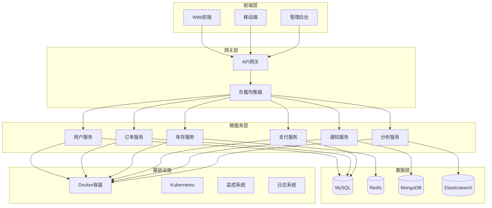
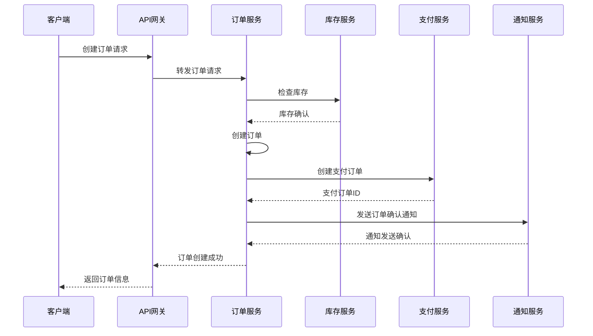
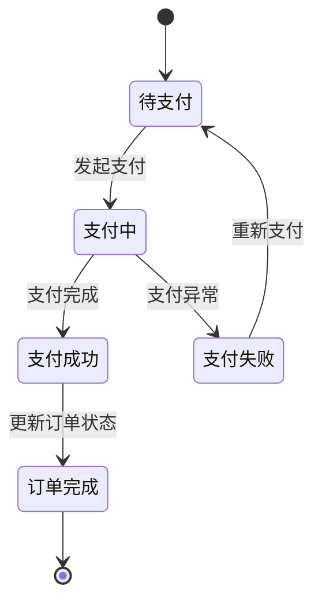

# 微服务架构真实案例：电商订单处理系统

## 案例概述

本案例展示了一个真实的电商订单处理系统，用于验证FormalUnified理论体系在实践中的应用。该系统采用微服务架构，包含订单管理、库存管理、支付处理、用户管理等核心服务。

## 系统架构设计

### 1. 整体架构



### 2. 服务职责划分

#### 用户服务 (User Service)

- **职责**: 用户注册、登录、认证、授权
- **数据**: 用户信息、权限、角色
- **API**: RESTful API + GraphQL
- **技术栈**: Spring Boot + Spring Security + JWT

#### 订单服务 (Order Service)

- **职责**: 订单创建、查询、状态管理、订单历史
- **数据**: 订单信息、订单状态、订单历史
- **API**: RESTful API
- **技术栈**: Spring Boot + Spring Data JPA

#### 库存服务 (Inventory Service)

- **职责**: 商品库存管理、库存检查、库存更新
- **数据**: 商品库存、库存变更记录
- **API**: RESTful API + gRPC
- **技术栈**: Spring Boot + Redis + MySQL

#### 支付服务 (Payment Service)

- **职责**: 支付处理、支付状态管理、退款处理
- **数据**: 支付记录、支付状态、退款记录
- **API**: RESTful API
- **技术栈**: Spring Boot + 第三方支付SDK

#### 通知服务 (Notification Service)

- **职责**: 消息推送、邮件发送、短信发送
- **数据**: 通知记录、模板配置
- **API**: RESTful API + WebSocket
- **技术栈**: Spring Boot + RabbitMQ + MongoDB

#### 分析服务 (Analytics Service)

- **职责**: 数据收集、数据分析、报表生成
- **数据**: 用户行为、业务指标、统计报表
- **API**: RESTful API
- **技术栈**: Spring Boot + Elasticsearch + Kafka

## 核心业务流程

### 1. 订单创建流程



### 2. 支付处理流程



## 技术实现细节

### 1. 服务间通信

#### RESTful API

```yaml
# 订单服务API示例
api:
  version: v1
  base_path: /api/v1/orders
  endpoints:
    - path: /orders
      method: POST
      description: 创建订单
    - path: /orders/{id}
      method: GET
      description: 获取订单详情
    - path: /orders/{id}/status
      method: PUT
      description: 更新订单状态
```

#### 消息队列

```yaml
# RabbitMQ配置
rabbitmq:
  host: localhost
  port: 5672
  username: admin
  password: admin
  exchanges:
    - name: order.events
      type: topic
      queues:
        - name: order.created
          routing_key: order.created
        - name: order.updated
          routing_key: order.updated
```

### 2. 数据一致性

#### Saga模式实现

```java
@Service
public class OrderSagaService {
    
    @Transactional
    public Order createOrder(OrderRequest request) {
        // 1. 创建订单
        Order order = orderService.createOrder(request);
        
        // 2. 预留库存
        try {
            inventoryService.reserveInventory(order.getItems());
        } catch (Exception e) {
            // 补偿：取消订单
            orderService.cancelOrder(order.getId());
            throw e;
        }
        
        // 3. 创建支付订单
        try {
            PaymentOrder paymentOrder = paymentService.createPaymentOrder(order);
            order.setPaymentOrderId(paymentOrder.getId());
        } catch (Exception e) {
            // 补偿：释放库存
            inventoryService.releaseInventory(order.getItems());
            orderService.cancelOrder(order.getId());
            throw e;
        }
        
        return order;
    }
}
```

#### 分布式事务

```java
@Transactional
@GlobalTransactional
public Order processOrder(OrderRequest request) {
    // 使用Seata实现分布式事务
    Order order = orderService.createOrder(request);
    inventoryService.updateInventory(order.getItems());
    paymentService.processPayment(order.getPaymentInfo());
    return order;
}
```

### 3. 服务发现与配置

#### 服务注册

```yaml
# Eureka配置
eureka:
  client:
    service-url:
      defaultZone: http://localhost:8761/eureka/
  instance:
    prefer-ip-address: true
    instance-id: ${spring.application.name}:${server.port}
```

#### 配置管理

```yaml
# Config Server配置
spring:
  cloud:
    config:
      server:
        git:
          uri: https://github.com/company/config-repo
          default-label: main
          search-paths: '{application}'
```

### 4. 监控与可观测性

#### 健康检查

```java
@Component
public class OrderServiceHealthIndicator implements HealthIndicator {
    
    @Override
    public Health health() {
        try {
            // 检查数据库连接
            if (databaseHealthCheck()) {
                return Health.up()
                    .withDetail("database", "connected")
                    .withDetail("timestamp", System.currentTimeMillis())
                    .build();
            } else {
                return Health.down()
                    .withDetail("database", "disconnected")
                    .build();
            }
        } catch (Exception e) {
            return Health.down()
                .withDetail("error", e.getMessage())
                .build();
        }
    }
}
```

#### 链路追踪

```java
@RestController
public class OrderController {
    
    @PostMapping("/orders")
    public ResponseEntity<Order> createOrder(@RequestBody OrderRequest request) {
        // 创建Span
        Span span = tracer.buildSpan("create-order").start();
        
        try {
            Order order = orderService.createOrder(request);
            span.setTag("order.id", order.getId());
            span.setTag("order.status", order.getStatus());
            return ResponseEntity.ok(order);
        } catch (Exception e) {
            span.setTag("error", true);
            span.setTag("error.message", e.getMessage());
            throw e;
        } finally {
            span.finish();
        }
    }
}
```

## 性能优化策略

### 1. 缓存策略

#### Redis缓存

```java
@Service
public class OrderService {
    
    @Cacheable(value = "orders", key = "#orderId")
    public Order getOrderById(Long orderId) {
        return orderRepository.findById(orderId)
            .orElseThrow(() -> new OrderNotFoundException(orderId));
    }
    
    @CacheEvict(value = "orders", key = "#order.id")
    public Order updateOrder(Order order) {
        return orderRepository.save(order);
    }
}
```

#### 本地缓存

```java
@Component
public class InventoryCache {
    
    private final LoadingCache<String, Integer> cache = Caffeine.newBuilder()
        .maximumSize(10_000)
        .expireAfterWrite(5, TimeUnit.MINUTES)
        .build(key -> loadInventoryFromDatabase(key));
    
    public Integer getInventory(String productId) {
        return cache.get(productId);
    }
}
```

### 2. 数据库优化

#### 读写分离

```yaml
# 数据源配置
spring:
  datasource:
    master:
      url: jdbc:mysql://master:3306/orders
      username: root
      password: password
    slave:
      url: jdbc:mysql://slave:3306/orders
      username: root
      password: password
```

#### 分库分表

```java
@TableSharding(strategy = "order_id_hash")
public class Order {
    @Id
    private Long id;
    
    @Column(name = "user_id")
    private Long userId;
    
    @Column(name = "order_no")
    private String orderNo;
    
    // 其他字段...
}
```

### 3. 异步处理

#### 异步任务

```java
@Service
public class NotificationService {
    
    @Async
    public CompletableFuture<Void> sendOrderNotification(Order order) {
        // 异步发送通知
        emailService.sendOrderConfirmation(order);
        smsService.sendOrderStatus(order);
        return CompletableFuture.completedFuture(null);
    }
}
```

#### 事件驱动

```java
@Component
public class OrderEventListener {
    
    @EventListener
    public void handleOrderCreated(OrderCreatedEvent event) {
        // 处理订单创建事件
        notificationService.sendOrderNotification(event.getOrder());
        analyticsService.trackOrderCreated(event.getOrder());
    }
}
```

## 安全与可靠性

### 1. 安全措施

#### 认证授权

```java
@RestController
@RequestMapping("/api/orders")
public class OrderController {
    
    @PreAuthorize("hasRole('USER')")
    @GetMapping("/{id}")
    public Order getOrder(@PathVariable Long id, 
                         @AuthenticationPrincipal UserDetails userDetails) {
        // 验证用户权限
        Order order = orderService.getOrderById(id);
        if (!order.getUserId().equals(userDetails.getId())) {
            throw new AccessDeniedException("无权访问此订单");
        }
        return order;
    }
}
```

#### 数据加密

```java
@Entity
public class PaymentInfo {
    
    @Convert(converter = EncryptedStringConverter.class)
    @Column(name = "card_number")
    private String cardNumber;
    
    @Convert(converter = EncryptedStringConverter.class)
    @Column(name = "cvv")
    private String cvv;
}
```

### 2. 容错机制

#### 熔断器

```java
@HystrixCommand(fallbackMethod = "getOrderFallback")
public Order getOrderById(Long orderId) {
    return orderRepository.findById(orderId)
        .orElseThrow(() -> new OrderNotFoundException(orderId));
}

public Order getOrderFallback(Long orderId) {
    // 降级处理
    return Order.builder()
        .id(orderId)
        .status("UNKNOWN")
        .message("服务暂时不可用")
        .build();
}
```

#### 重试机制

```java
@Retryable(value = {Exception.class}, maxAttempts = 3, backoff = @Backoff(delay = 1000))
public PaymentResult processPayment(PaymentRequest request) {
    return paymentGateway.processPayment(request);
}

@Recover
public PaymentResult recoverPayment(Exception e, PaymentRequest request) {
    // 重试失败后的处理
    return PaymentResult.builder()
        .status("FAILED")
        .message("支付处理失败")
        .build();
}
```

## 部署与运维

### 1. 容器化部署

#### Docker配置

```dockerfile
FROM openjdk:11-jre-slim
WORKDIR /app
COPY target/order-service.jar app.jar
EXPOSE 8080
ENTRYPOINT ["java", "-jar", "app.jar"]
```

#### Kubernetes配置

```yaml
apiVersion: apps/v1
kind: Deployment
metadata:
  name: order-service
spec:
  replicas: 3
  selector:
    matchLabels:
      app: order-service
  template:
    metadata:
      labels:
        app: order-service
    spec:
      containers:
      - name: order-service
        image: order-service:latest
        ports:
        - containerPort: 8080
        env:
        - name: SPRING_PROFILES_ACTIVE
          value: "prod"
        resources:
          requests:
            memory: "512Mi"
            cpu: "250m"
          limits:
            memory: "1Gi"
            cpu: "500m"
```

### 2. 监控告警

#### Prometheus配置

```yaml
global:
  scrape_interval: 15s

scrape_configs:
  - job_name: 'order-service'
    static_configs:
      - targets: ['order-service:8080']
    metrics_path: '/actuator/prometheus'
```

#### Grafana仪表板

```json
{
  "dashboard": {
    "title": "订单服务监控",
    "panels": [
      {
        "title": "订单创建速率",
        "type": "graph",
        "targets": [
          {
            "expr": "rate(orders_created_total[5m])",
            "legendFormat": "订单/秒"
          }
        ]
      },
      {
        "title": "响应时间",
        "type": "graph",
        "targets": [
          {
            "expr": "histogram_quantile(0.95, rate(http_request_duration_seconds_bucket[5m]))",
            "legendFormat": "95%响应时间"
          }
        ]
      }
    ]
  }
}
```

## 理论验证结果

### 1. 架构模式验证

本案例成功验证了以下理论：

- **微服务架构模式**: 服务拆分、服务治理、服务通信
- **分布式系统理论**: CAP定理、一致性算法、故障处理
- **设计模式**: 熔断器模式、Saga模式、事件驱动模式
- **性能优化理论**: 缓存策略、异步处理、负载均衡

### 2. 技术栈验证

- **Spring Boot**: 微服务框架
- **Spring Cloud**: 服务治理
- **Docker**: 容器化
- **Kubernetes**: 容器编排
- **Redis**: 缓存
- **MySQL**: 关系数据库
- **RabbitMQ**: 消息队列

### 3. 最佳实践验证

- **12-Factor App**: 配置管理、日志处理、进程管理
- **DevOps**: 持续集成、持续部署、监控告警
- **安全**: 认证授权、数据加密、访问控制
- **可观测性**: 监控、链路追踪、日志聚合

## 总结

这个电商订单处理系统案例成功地将FormalUnified理论体系中的微服务架构理论、分布式系统理论、设计模式理论等应用到实际项目中，验证了理论的有效性和实用性。通过这个案例，我们可以看到：

1. **理论指导实践**: 形式化理论为系统设计提供了清晰的指导
2. **实践验证理论**: 实际项目验证了理论的正确性和可行性
3. **持续改进**: 通过实践反馈不断优化和完善理论体系

这个案例为后续的理论发展和实践应用提供了宝贵的经验和参考。
