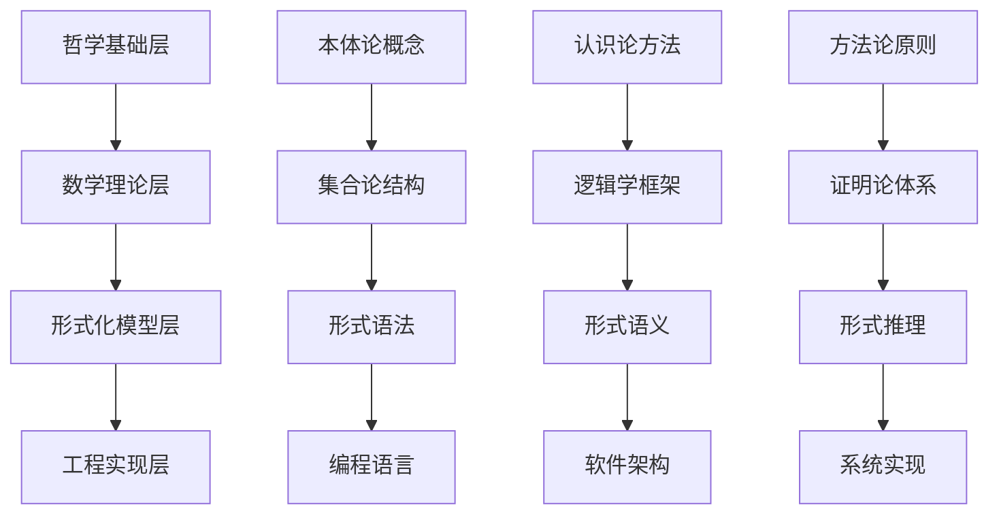

# 理论到实践映射框架 (Theory to Practice Mapping Framework)

## 概述

本文档建立了形式化架构理论到实际应用的完整映射框架，通过系统化的转换机制，将抽象的理论概念转化为具体的工程实践，实现理论指导实践、实践验证理论的良性循环。

## 映射框架架构

### 1. 映射层次结构

#### 1.1 四层映射架构



#### 1.2 映射关系类型

**直接映射**：

- 理论概念直接对应实践概念
- 理论方法直接指导实践方法
- 理论结果直接验证实践结果

**间接映射**：

- 理论概念通过中间层映射到实践
- 理论方法通过转换机制应用到实践
- 理论结果通过验证方法验证实践

**组合映射**：

- 多个理论概念组合映射到复杂实践
- 多种理论方法组合应用到实践
- 多个理论结果组合验证实践

### 2. 核心映射机制

#### 2.1 概念映射机制

**本体论映射**：

```text
哲学概念          数学概念          形式概念          工程概念
存在(Being)    → 集合(Set)      → 状态(State)     → 对象(Object)
关系(Relation) → 函数(Function) → 转换(Transition) → 方法(Method)
属性(Property) → 谓词(Predicate) → 不变量(Invariant) → 约束(Constraint)
整体(Whole)    → 系统(System)   → 模型(Model)     → 架构(Architecture)
```

**认识论映射**：

```text
认知方法          分析方法          验证方法          测试方法
观察法         → 数据收集      → 状态监控      → 系统监控
推理法         → 逻辑推理      → 性质验证      → 功能测试
实验法         → 实验设计      → 模型检查      → 性能测试
```

#### 2.2 方法映射机制

**形式化方法映射**：

```text
理论方法          应用方法          工具支持          实践验证
模型检查       → 状态空间搜索  → 模型检查器     → 性质验证
定理证明       → 逻辑推理      → 定理证明器     → 正确性证明
抽象解释       → 程序分析      → 静态分析工具   → 代码质量检查
```

**验证方法映射**：

```text
验证理论          验证方法          验证工具          验证结果
语法验证       → 语法检查      → 编译器         → 语法正确性
语义验证       → 语义分析      → 解释器         → 语义一致性
类型验证       → 类型检查      → 类型检查器     → 类型安全性
```

#### 2.3 结果映射机制

**理论结果映射**：

```text
理论结果          实践结果          验证方法          质量标准
正确性证明     → 功能正确性    → 功能测试       → 功能完整性
安全性保证     → 安全性质      → 安全测试       → 安全等级
性能分析       → 性能指标      → 性能测试       → 性能要求
```

### 3. 具体映射实例

#### 3.1 状态机理论到Rust实现

**理论概念**：

- **状态**：系统的可能状态
- **转换**：状态间的转换关系
- **事件**：触发转换的事件

**Rust实现**：

```rust
// 状态枚举
#[derive(Debug, Clone, PartialEq)]
enum State {
    Idle,
    Running,
    Paused,
    Stopped,
}

// 事件枚举
#[derive(Debug, Clone)]
enum Event {
    Start,
    Pause,
    Resume,
    Stop,
}

// 状态机结构
struct StateMachine {
    current_state: State,
    transitions: HashMap<(State, Event), State>,
}

// 状态转换方法
impl StateMachine {
    fn transition(&mut self, event: Event) -> Result<State, String> {
        let next_state = self.transitions
            .get(&(self.current_state.clone(), event.clone()))
            .ok_or("Invalid transition")?;
        
        self.current_state = next_state.clone();
        Ok(next_state.clone())
    }
}
```

**映射关系**：

- 状态枚举 ↔ 理论中的状态集合
- 事件枚举 ↔ 理论中的输入字母
- 转换表 ↔ 理论中的转换函数
- 状态机结构 ↔ 理论中的状态机模型

#### 3.2 Petri网理论到微服务编排

**理论概念**：

- **库所(Place)**：系统的状态
- **变迁(Transition)**：状态转换
- **令牌(Token)**：资源或请求

**微服务实现**：

```go
// 服务状态
type ServiceState struct {
    Name     string
    Status   string
    Tokens   int
    Capacity int
}

// 服务转换
type ServiceTransition struct {
    FromState string
    ToState   string
    Condition func(*ServiceState) bool
    Action    func(*ServiceState) error
}

// 编排引擎
type OrchestrationEngine struct {
    Services     map[string]*ServiceState
    Transitions  []*ServiceTransition
}

// 执行转换
func (e *OrchestrationEngine) ExecuteTransition(serviceName string, transition *ServiceTransition) error {
    service := e.Services[serviceName]
    if transition.Condition(service) {
        return transition.Action(service)
    }
    return errors.New("Transition condition not met")
}
```

**映射关系**：

- 服务状态 ↔ Petri网中的库所
- 服务转换 ↔ Petri网中的变迁
- 编排引擎 ↔ Petri网执行引擎
- 转换条件 ↔ Petri网中的前置条件

#### 3.3 时态逻辑到系统验证

**理论概念**：

- **线性时态逻辑(LTL)**：线性时序性质
- **分支时态逻辑(CTL)**：分支时序性质
- **模型检查**：自动验证时序性质

**验证实现**：

```python
# 时态逻辑公式
class TemporalFormula:
    def __init__(self, formula: str):
        self.formula = formula
        self.parsed = self._parse_formula()
    
    def _parse_formula(self):
        # 解析时态逻辑公式
        pass

# 模型检查器
class ModelChecker:
    def __init__(self, model, formula: TemporalFormula):
        self.model = model
        self.formula = formula
    
    def check(self) -> bool:
        # 执行模型检查
        if self.formula.type == "LTL":
            return self._check_ltl()
        elif self.formula.type == "CTL":
            return self._check_ctl()
        return False
    
    def _check_ltl(self) -> bool:
        # 线性时态逻辑检查
        pass
    
    def _check_ctl(self) -> bool:
        # 分支时态逻辑检查
        pass
```

**映射关系**：

- 时态逻辑公式 ↔ 系统性质规范
- 模型检查器 ↔ 性质验证工具
- 检查结果 ↔ 性质满足性

### 4. 映射质量保证

#### 4.1 语义保持性

**概念一致性**：

- 确保映射前后概念的含义一致
- 验证概念间关系的完整性
- 保证概念层次结构的正确性

**关系保持性**：

- 保持理论中概念间的关系
- 确保关系的传递性和对称性
- 验证关系的约束条件

**约束保持性**：

- 保持理论中的约束条件
- 确保约束的可满足性
- 验证约束的完整性

#### 4.2 正确性保证

**形式化验证**：

- 使用形式化方法验证映射的正确性
- 建立映射的形式化模型
- 验证映射的性质

**测试验证**：

- 使用测试方法验证映射的正确性
- 建立测试用例集
- 执行自动化测试

**用户验证**：

- 用户确认映射结果符合预期
- 收集用户反馈
- 迭代改进映射

#### 4.3 性能保证

**性能分析**：

- 分析映射后系统的性能特征
- 识别性能瓶颈
- 建立性能基准

**性能优化**：

- 优化映射算法
- 改进数据结构
- 并行化处理

**性能验证**：

- 验证系统满足性能要求
- 执行性能测试
- 监控运行时性能

### 5. 映射工具链

#### 5.1 建模工具

**概念建模工具**：

- 概念提取工具：从文本中提取概念
- 关系建模工具：建立概念间的关系
- 约束建模工具：定义概念的约束

**模型转换工具**：

- 模型转换器：转换不同格式的模型
- 模型验证器：验证模型的正确性
- 模型优化器：优化模型结构

#### 5.2 代码生成工具

**模板引擎**：

- 代码模板：预定义的代码结构
- 参数替换：根据模型参数生成代码
- 代码格式化：格式化生成的代码

**语言适配器**：

- 多语言支持：支持多种编程语言
- 语言特性映射：映射语言特性
- 代码优化：优化生成的代码

#### 5.3 验证工具

**静态分析工具**：

- 语法检查：检查代码语法
- 类型检查：检查类型安全
- 静态分析：分析代码质量

**动态测试工具**：

- 单元测试：测试单个组件
- 集成测试：测试组件集成
- 系统测试：测试整个系统

### 6. 应用案例分析

#### 案例1：工作流引擎设计

**理论基础**：

- 状态机理论：建模工作流状态
- Petri网理论：建模工作流编排
- 时态逻辑：验证工作流性质

**实践应用**：

- 工作流定义：使用DSL定义工作流
- 工作流执行：执行工作流实例
- 工作流监控：监控工作流状态

**映射效果**：

- 工作流逻辑清晰可见
- 工作流性质得到验证
- 工作流执行可靠稳定

#### 案例2：微服务架构设计

**理论基础**：

- 组件理论：建模服务组件
- 通信理论：建模服务通信
- 一致性理论：保证数据一致性

**实践应用**：

- 服务设计：设计服务接口
- 服务部署：部署服务实例
- 服务治理：治理服务生命周期

**映射效果**：

- 服务架构清晰合理
- 服务通信可靠高效
- 系统一致性得到保证

## 发展路线图

### 短期目标（1-2年）

1. **映射机制完善**：完善理论到实践的映射机制
2. **工具链开发**：开发映射工具链
3. **案例验证**：通过实际案例验证映射的有效性

### 中期目标（3-5年）

1. **工具成熟**：工具达到生产可用水平
2. **标准制定**：制定映射标准
3. **产业应用**：在产业中得到广泛应用

### 长期目标（5-10年）

1. **理论突破**：在映射理论方面取得重大突破
2. **技术创新**：在映射技术方面取得重大进展
3. **生态建设**：建立完整的映射生态

## 7. 高级映射技术

### 7.1 自动映射生成

**基于机器学习的映射**：

```python
# 映射学习器
class MappingLearner:
    def __init__(self):
        self.mapping_rules = {}
        self.training_data = []
    
    def learn_from_examples(self, theory_concepts, practice_implementations):
        """从理论概念和实践实现的对应关系中学习映射规则"""
        for theory, practice in zip(theory_concepts, practice_implementations):
            rule = self._extract_mapping_rule(theory, practice)
            self.mapping_rules[rule.pattern] = rule
    
    def generate_mapping(self, theory_concept):
        """根据学习到的规则自动生成映射"""
        for pattern, rule in self.mapping_rules.items():
            if self._matches_pattern(theory_concept, pattern):
                return rule.apply(theory_concept)
        return None
```

**基于规则的映射**：

```rust
// 映射规则引擎
pub struct MappingRuleEngine {
    rules: Vec<Box<dyn MappingRule>>,
}

pub trait MappingRule {
    fn can_apply(&self, theory_concept: &TheoryConcept) -> bool;
    fn apply(&self, theory_concept: &TheoryConcept) -> PracticeImplementation;
}

// 状态机映射规则
pub struct StateMachineRule;

impl MappingRule for StateMachineRule {
    fn can_apply(&self, theory_concept: &TheoryConcept) -> bool {
        theory_concept.ty == "StateMachine"
    }
    
    fn apply(&self, theory_concept: &TheoryConcept) -> PracticeImplementation {
        // 生成Rust状态机实现
        PracticeImplementation {
            language: "Rust",
            code: self._generate_rust_state_machine(theory_concept),
            tests: self._generate_tests(theory_concept),
        }
    }
}
```

### 7.2 映射验证与测试

**映射正确性验证**：

```python
# 映射验证器
class MappingValidator:
    def __init__(self):
        self.verification_rules = []
    
    def add_verification_rule(self, rule):
        self.verification_rules.append(rule)
    
    def validate_mapping(self, theory_concept, practice_implementation):
        """验证映射的正确性"""
        results = []
        for rule in self.verification_rules:
            result = rule.verify(theory_concept, practice_implementation)
            results.append(result)
        
        return ValidationResult(results)
    
    def generate_test_cases(self, theory_concept, practice_implementation):
        """生成测试用例验证映射"""
        test_cases = []
        
        # 生成功能测试用例
        functional_tests = self._generate_functional_tests(theory_concept)
        test_cases.extend(functional_tests)
        
        # 生成性能测试用例
        performance_tests = self._generate_performance_tests(theory_concept)
        test_cases.extend(performance_tests)
        
        # 生成边界测试用例
        boundary_tests = self._generate_boundary_tests(theory_concept)
        test_cases.extend(boundary_tests)
        
        return test_cases
```

**映射质量评估**：

```go
// 映射质量评估器
type MappingQualityAssessor struct {
    metrics []QualityMetric
}

type QualityMetric interface {
    Calculate(theory *TheoryConcept, practice *PracticeImplementation) float64
    Weight() float64
}

// 语义一致性指标
type SemanticConsistencyMetric struct{}

func (m *SemanticConsistencyMetric) Calculate(theory *TheoryConcept, practice *PracticeImplementation) float64 {
    // 计算语义一致性得分
    return calculateSemanticScore(theory, practice)
}

func (m *SemanticConsistencyMetric) Weight() float64 {
    return 0.4 // 语义一致性权重
}

// 性能指标
type PerformanceMetric struct{}

func (m *PerformanceMetric) Calculate(theory *TheoryConcept, practice *PracticeImplementation) float64 {
    // 计算性能得分
    return calculatePerformanceScore(theory, practice)
}

func (m *PerformanceMetric) Weight() float64 {
    return 0.3 // 性能权重
}
```

## 8. 实际应用场景扩展

### 8.1 分布式系统设计

**理论基础到实践映射**：

```rust
// 基于CAP定理的分布式系统设计
pub struct CAPBasedSystem {
    consistency_level: ConsistencyLevel,
    availability_level: AvailabilityLevel,
    partition_tolerance: bool,
}

#[derive(Debug, Clone)]
pub enum ConsistencyLevel {
    Strong,      // 强一致性
    Eventual,    // 最终一致性
    Weak,        // 弱一致性
}

#[derive(Debug, Clone)]
pub enum AvailabilityLevel {
    High,        // 高可用性
    Medium,      // 中等可用性
    Low,         // 低可用性
}

impl CAPBasedSystem {
    pub fn new(consistency: ConsistencyLevel, availability: AvailabilityLevel) -> Self {
        Self {
            consistency_level: consistency,
            availability_level: availability,
            partition_tolerance: true, // 网络分区容错
        }
    }
    
    pub fn design_strategy(&self) -> DesignStrategy {
        match (self.consistency_level.clone(), self.availability_level.clone()) {
            (ConsistencyLevel::Strong, _) => DesignStrategy::CP, // 一致性+分区容错
            (_, AvailabilityLevel::High) => DesignStrategy::AP, // 可用性+分区容错
            _ => DesignStrategy::CA, // 一致性+可用性（理论不可行）
        }
    }
}
```

**映射验证**：

```python
# CAP定理验证器
class CAPTheoremValidator:
    def validate_system(self, system: CAPBasedSystem) -> ValidationResult:
        """验证系统设计是否符合CAP定理"""
        strategy = system.design_strategy()
        
        if strategy == DesignStrategy.CA:
            return ValidationResult(
                valid=False,
                message="CA策略在网络分区情况下不可行"
            )
        
        # 验证CP策略
        if strategy == DesignStrategy.CP:
            return self._validate_cp_strategy(system)
        
        # 验证AP策略
        if strategy == DesignStrategy.AP:
            return self._validate_ap_strategy(system)
        
        return ValidationResult(valid=True, message="设计符合CAP定理")
```

### 8.2 微服务架构模式

**理论模式到实践实现**：

```go
// 微服务架构模式实现
type MicroservicePattern struct {
    PatternType PatternType
    Components  []Component
    Rules       []ArchitectureRule
}

type PatternType string

const (
    PatternTypeAPI        PatternType = "API_Gateway"
    PatternTypeCircuit    PatternType = "Circuit_Breaker"
    PatternTypeSaga       PatternType = "Saga"
    PatternTypeCQRS       PatternType = "CQRS"
    PatternTypeEvent      PatternType = "Event_Sourcing"
)

// API网关模式
type APIGatewayPattern struct {
    Gateway     *Gateway
    Services    []*Microservice
    LoadBalancer *LoadBalancer
}

func (p *APIGatewayPattern) Implement() error {
    // 实现API网关
    if err := p.Gateway.Configure(); err != nil {
        return err
    }
    
    // 配置负载均衡
    if err := p.LoadBalancer.Configure(); err != nil {
        return err
    }
    
    // 注册服务
    for _, service := range p.Services {
        if err := p.Gateway.RegisterService(service); err != nil {
            return err
        }
    }
    
    return nil
}

// 断路器模式
type CircuitBreakerPattern struct {
    Threshold     int
    Timeout       time.Duration
    Fallback      func() error
}

func (p *CircuitBreakerPattern) Execute(operation func() error) error {
    // 实现断路器逻辑
    if p.isOpen() {
        return p.Fallback()
    }
    
    if err := operation(); err != nil {
        p.recordFailure()
        return err
    }
    
    p.recordSuccess()
    return nil
}
```

### 8.3 工作流引擎设计

**Petri网到工作流引擎映射**：

```python
# Petri网工作流引擎
class PetriNetWorkflowEngine:
    def __init__(self):
        self.places = {}      # 库所
        self.transitions = {} # 变迁
        self.tokens = {}      # 令牌
        self.marking = {}     # 标识
    
    def add_place(self, place_id: str, capacity: int = 1):
        """添加库所"""
        self.places[place_id] = Place(place_id, capacity)
        self.marking[place_id] = 0
    
    def add_transition(self, transition_id: str, input_places: List[str], 
                      output_places: List[str], guard=None):
        """添加变迁"""
        self.transitions[transition_id] = Transition(
            transition_id, input_places, output_places, guard
        )
    
    def add_token(self, place_id: str, count: int = 1):
        """添加令牌"""
        if place_id in self.marking:
            self.marking[place_id] += count
    
    def can_fire(self, transition_id: str) -> bool:
        """检查变迁是否可以触发"""
        transition = self.transitions[transition_id]
        
        # 检查前置条件
        for place_id in transition.input_places:
            if self.marking.get(place_id, 0) < 1:
                return False
        
        # 检查守卫条件
        if transition.guard and not transition.guard(self.marking):
            return False
        
        return True
    
    def fire_transition(self, transition_id: str) -> bool:
        """触发变迁"""
        if not self.can_fire(transition_id):
            return False
        
        transition = self.transitions[transition_id]
        
        # 消耗输入令牌
        for place_id in transition.input_places:
            self.marking[place_id] -= 1
        
        # 产生输出令牌
        for place_id in transition.output_places:
            self.marking[place_id] += 1
        
        return True
    
    def get_workflow_state(self) -> Dict[str, int]:
        """获取工作流状态"""
        return self.marking.copy()

# 工作流定义DSL
class WorkflowDSL:
    def __init__(self):
        self.engine = PetriNetWorkflowEngine()
    
    def define_workflow(self, workflow_definition: str):
        """使用DSL定义工作流"""
        # 解析工作流定义
        parsed = self._parse_workflow_definition(workflow_definition)
        
        # 构建Petri网
        for place in parsed['places']:
            self.engine.add_place(place['id'], place.get('capacity', 1))
        
        for transition in parsed['transitions']:
            self.engine.add_transition(
                transition['id'],
                transition['input_places'],
                transition['output_places'],
                transition.get('guard')
            )
        
        # 设置初始标识
        for token in parsed.get('initial_tokens', []):
            self.engine.add_token(token['place'], token['count'])
    
    def execute_workflow(self, steps: List[str]) -> List[bool]:
        """执行工作流"""
        results = []
        for step in steps:
            result = self.engine.fire_transition(step)
            results.append(result)
        return results
```

## 9. 工具链集成

### 9.1 IDE插件开发

**VSCode扩展**：

```typescript
// VSCode理论映射扩展
export class TheoryMappingExtension {
    private readonly _disposables: vscode.Disposable[] = [];
    
    activate(context: vscode.ExtensionContext) {
        // 注册命令
        const mapTheoryCommand = vscode.commands.registerCommand(
            'theoryMapping.mapTheory',
            this.mapTheoryToPractice.bind(this)
        );
        
        const validateMappingCommand = vscode.commands.registerCommand(
            'theoryMapping.validateMapping',
            this.validateMapping.bind(this)
        );
        
        // 注册代码动作
        const codeActionProvider = vscode.languages.registerCodeActionsProvider(
            { pattern: '**/*.md' },
            new TheoryCodeActionProvider(),
            {
                providedCodeActionKinds: [
                    vscode.CodeActionKind.Refactor
                ]
            }
        );
        
        context.subscriptions.push(
            mapTheoryCommand,
            validateMappingCommand,
            codeActionProvider
        );
    }
    
    private async mapTheoryToPractice() {
        // 实现理论到实践的映射
        const editor = vscode.window.activeTextEditor;
        if (!editor) return;
        
        const document = editor.document;
        const theoryContent = document.getText();
        
        // 解析理论内容
        const theoryConcepts = this.parseTheoryContent(theoryContent);
        
        // 生成实践实现
        const implementations = await this.generateImplementations(theoryConcepts);
        
        // 显示结果
        this.showMappingResults(implementations);
    }
    
    private async validateMapping() {
        // 验证映射的正确性
        const editor = vscode.window.activeTextEditor;
        if (!editor) return;
        
        const document = editor.document;
        const content = document.getText();
        
        // 执行验证
        const validationResults = await this.validateContent(content);
        
        // 显示验证结果
        this.showValidationResults(validationResults);
    }
}

// 代码动作提供者
class TheoryCodeActionProvider implements vscode.CodeActionProvider {
    provideCodeActions(
        document: vscode.TextDocument,
        range: vscode.Range,
        context: vscode.CodeActionContext
    ): vscode.CodeAction[] {
        const actions: vscode.CodeAction[] = [];
        
        // 添加"映射到实践"动作
        const mapAction = new vscode.CodeAction(
            '映射到实践实现',
            vscode.CodeActionKind.Refactor
        );
        mapAction.command = {
            command: 'theoryMapping.mapTheory',
            title: '映射到实践实现'
        };
        actions.push(mapAction);
        
        return actions;
    }
}
```

### 9.2 CI/CD集成

**GitHub Actions工作流**：

```yaml
# .github/workflows/theory-mapping.yml
name: Theory to Practice Mapping

on:
  push:
    branches: [ main, develop ]
    paths: [ '**/*.md', '**/TheoryToPractice/**' ]
  pull_request:
    branches: [ main ]

jobs:
  validate-mapping:
    runs-on: ubuntu-latest
    steps:
      - name: Checkout code
        uses: actions/checkout@v3
      
      - name: Setup Python
        uses: actions/setup-python@v4
        with:
          python-version: '3.11'
      
      - name: Install dependencies
        run: |
          pip install -r requirements.txt
      
      - name: Run mapping validation
        run: |
          python -m pytest tests/test_mapping.py -v
      
      - name: Generate mapping report
        run: |
          python tools/generate_mapping_report.py
      
      - name: Upload mapping artifacts
        uses: actions/upload-artifact@v3
        with:
          name: mapping-report
          path: reports/
  
  generate-implementations:
    runs-on: ubuntu-latest
    needs: validate-mapping
    if: needs.validate-mapping.result == 'success'
    steps:
      - name: Checkout code
        uses: actions/checkout@v3
      
      - name: Generate implementations
        run: |
          python tools/generate_implementations.py
      
      - name: Run tests
        run: |
          python -m pytest tests/test_implementations.py -v
      
      - name: Create PR
        uses: peter-evans/create-pull-request@v4
        with:
          title: 'Auto-generated implementations from theory mapping'
          body: |
            This PR contains automatically generated implementations
            based on the theory mapping framework.
            
            - Generated from: ${{ github.sha }}
            - Mapping framework version: v1.0.0
          branch: auto-generated-implementations
```

## 10. 性能优化与扩展性

### 10.1 映射性能优化

**并行映射处理**：

```rust
// 并行映射处理器
use rayon::prelude::*;
use std::sync::Arc;

pub struct ParallelMappingProcessor {
    rules: Arc<Vec<Box<dyn MappingRule + Send + Sync>>>,
    thread_pool: rayon::ThreadPool,
}

impl ParallelMappingProcessor {
    pub fn new(thread_count: usize) -> Self {
        let thread_pool = rayon::ThreadPoolBuilder::new()
            .num_threads(thread_count)
            .build()
            .unwrap();
        
        Self {
            rules: Arc::new(Vec::new()),
            thread_pool,
        }
    }
    
    pub fn add_rule(&mut self, rule: Box<dyn MappingRule + Send + Sync>) {
        Arc::get_mut(&mut self.rules).unwrap().push(rule);
    }
    
    pub fn process_batch(&self, concepts: Vec<TheoryConcept>) -> Vec<PracticeImplementation> {
        concepts.par_iter()
            .map(|concept| self.process_single(concept))
            .collect()
    }
    
    fn process_single(&self, concept: &TheoryConcept) -> PracticeImplementation {
        let rules = self.rules.clone();
        
        // 并行查找适用规则
        rules.par_iter()
            .find_first(|rule| rule.can_apply(concept))
            .map(|rule| rule.apply(concept))
            .unwrap_or_else(|| PracticeImplementation::default())
    }
}
```

**缓存优化**：

```python
# 映射结果缓存
from functools import lru_cache
import hashlib
import pickle

class MappingCache:
    def __init__(self, max_size: int = 1000):
        self.max_size = max_size
        self.cache = {}
    
    def _generate_key(self, theory_concept: TheoryConcept) -> str:
        """生成缓存键"""
        # 序列化理论概念并生成哈希
        serialized = pickle.dumps(theory_concept)
        return hashlib.md5(serialized).hexdigest()
    
    @lru_cache(maxsize=1000)
    def get_cached_mapping(self, theory_concept: TheoryConcept) -> Optional[PracticeImplementation]:
        """获取缓存的映射结果"""
        key = self._generate_key(theory_concept)
        return self.cache.get(key)
    
    def cache_mapping(self, theory_concept: TheoryConcept, implementation: PracticeImplementation):
        """缓存映射结果"""
        key = self._generate_key(theory_concept)
        self.cache[key] = implementation
        
        # 清理过期缓存
        if len(self.cache) > self.max_size:
            self._cleanup_cache()
    
    def _cleanup_cache(self):
        """清理过期缓存"""
        # 实现LRU缓存清理逻辑
        pass
```

### 10.2 扩展性设计

**插件化架构**：

```python
# 插件管理器
class PluginManager:
    def __init__(self):
        self.plugins = {}
        self.hooks = defaultdict(list)
    
    def register_plugin(self, name: str, plugin: MappingPlugin):
        """注册插件"""
        self.plugins[name] = plugin
        
        # 注册插件钩子
        for hook_name, hook_func in plugin.get_hooks().items():
            self.hooks[hook_name].append(hook_func)
    
    def execute_hook(self, hook_name: str, *args, **kwargs):
        """执行钩子函数"""
        results = []
        for hook_func in self.hooks[hook_name]:
            try:
                result = hook_func(*args, **kwargs)
                results.append(result)
            except Exception as e:
                logger.error(f"Plugin hook {hook_name} failed: {e}")
        
        return results
    
    def get_plugin(self, name: str) -> Optional[MappingPlugin]:
        """获取插件"""
        return self.plugins.get(name)

# 插件基类
class MappingPlugin(ABC):
    @abstractmethod
    def get_hooks(self) -> Dict[str, Callable]:
        """返回插件提供的钩子函数"""
        pass
    
    @abstractmethod
    def get_capabilities(self) -> List[str]:
        """返回插件的功能列表"""
        pass

# Rust语言映射插件
class RustMappingPlugin(MappingPlugin):
    def get_hooks(self) -> Dict[str, Callable]:
        return {
            'pre_mapping': self.pre_mapping_hook,
            'post_mapping': self.post_mapping_hook,
            'code_generation': self.generate_rust_code,
        }
    
    def get_capabilities(self) -> List[str]:
        return ['rust_code_generation', 'rust_test_generation', 'cargo_integration']
    
    def pre_mapping_hook(self, theory_concept: TheoryConcept) -> TheoryConcept:
        """映射前处理钩子"""
        # 预处理理论概念
        return theory_concept
    
    def post_mapping_hook(self, implementation: PracticeImplementation) -> PracticeImplementation:
        """映射后处理钩子"""
        # 后处理实现
        return implementation
    
    def generate_rust_code(self, theory_concept: TheoryConcept) -> str:
        """生成Rust代码"""
        # 实现Rust代码生成逻辑
        pass
```

## 11. 未来发展方向

### 11.1 AI驱动的映射

**基于大语言模型的映射**：

```python
# AI驱动的映射引擎
class AIMappingEngine:
    def __init__(self, model_name: str = "gpt-4"):
        self.model_name = model_name
        self.client = self._initialize_client()
    
    def _initialize_client(self):
        """初始化AI客户端"""
        # 初始化OpenAI或其他AI服务客户端
        pass
    
    async def generate_mapping(self, theory_concept: TheoryConcept) -> PracticeImplementation:
        """使用AI生成映射"""
        prompt = self._build_prompt(theory_concept)
        
        response = await self.client.chat.completions.create(
            model=self.model_name,
            messages=[
                {"role": "system", "content": self._get_system_prompt()},
                {"role": "user", "content": prompt}
            ],
            temperature=0.1
        )
        
        # 解析AI响应
        implementation = self._parse_ai_response(response.choices[0].message.content)
        return implementation
    
    def _build_prompt(self, theory_concept: TheoryConcept) -> str:
        """构建AI提示"""
        return f"""
        请将以下形式化理论概念映射到具体的编程实现：
        
        理论概念：{theory_concept.name}
        概念类型：{theory_concept.ty}
        概念描述：{theory_concept.description}
        相关属性：{theory_concept.properties}
        
        请生成：
        1. 目标编程语言：Rust
        2. 完整的代码实现
        3. 单元测试
        4. 使用示例
        5. 性能考虑
        """
    
    def _get_system_prompt(self) -> str:
        """获取系统提示"""
        return """
        你是一个专业的软件架构师和编程专家，专门负责将形式化理论概念
        转换为具体的编程实现。请确保：
        
        1. 代码符合最佳实践
        2. 实现完整且可运行
        3. 包含适当的错误处理
        4. 提供清晰的文档和注释
        5. 考虑性能和安全性
        """
```

### 11.2 量子计算映射

**量子算法到经典实现映射**：

```python
# 量子算法映射器
class QuantumAlgorithmMapper:
    def __init__(self):
        self.quantum_patterns = self._load_quantum_patterns()
    
    def map_quantum_algorithm(self, algorithm: QuantumAlgorithm) -> ClassicalImplementation:
        """将量子算法映射到经典实现"""
        pattern = self._find_matching_pattern(algorithm)
        
        if pattern:
            return self._apply_pattern(algorithm, pattern)
        else:
            return self._generate_custom_implementation(algorithm)
    
    def _load_quantum_patterns(self) -> Dict[str, QuantumPattern]:
        """加载量子算法模式"""
        return {
            'grover_search': GroverSearchPattern(),
            'shor_factoring': ShorFactoringPattern(),
            'quantum_fourier_transform': QFTPattern(),
            'quantum_phase_estimation': QPEPattern(),
        }
    
    def _find_matching_pattern(self, algorithm: QuantumAlgorithm) -> Optional[QuantumPattern]:
        """查找匹配的量子模式"""
        for name, pattern in self.quantum_patterns.items():
            if pattern.matches(algorithm):
                return pattern
        return None

# Grover搜索算法模式
class GroverSearchPattern(QuantumPattern):
    def matches(self, algorithm: QuantumAlgorithm) -> bool:
        return algorithm.type == 'search' and 'oracle' in algorithm.components
    
    def apply(self, algorithm: QuantumAlgorithm) -> ClassicalImplementation:
        """应用Grover搜索模式"""
        # 实现Grover搜索的经典模拟
        implementation = ClassicalImplementation(
            language='Python',
            code=self._generate_grover_simulation(algorithm),
            complexity='O(sqrt(N))',
            description='Grover搜索算法的经典模拟实现'
        )
        return implementation
    
    def _generate_grover_simulation(self, algorithm: QuantumAlgorithm) -> str:
        """生成Grover搜索模拟代码"""
        return '''
import numpy as np
from typing import Callable, List

def grover_search(oracle: Callable[[int], bool], n_qubits: int, iterations: int = None) -> int:
    """
    Grover搜索算法的经典模拟
    
    Args:
        oracle: 预言机函数，返回True表示找到解
        n_qubits: 量子比特数
        iterations: 迭代次数，默认为π/4 * sqrt(2^n)
    
    Returns:
        找到的解的索引
    """
    N = 2 ** n_qubits
    
    if iterations is None:
        iterations = int(np.pi / 4 * np.sqrt(N))
    
    # 均匀叠加态
    state = np.ones(N) / np.sqrt(N)
    
    for _ in range(iterations):
        # Oracle操作
        for i in range(N):
            if oracle(i):
                state[i] = -state[i]
        
        # 扩散操作
        mean = np.mean(state)
        state = 2 * mean - state
    
    # 测量
    probabilities = np.abs(state) ** 2
    return np.argmax(probabilities)

# 使用示例
def example_oracle(x: int) -> bool:
    """示例预言机：寻找数字42"""
    return x == 42

# 测试
result = grover_search(example_oracle, n_qubits=8)
print(f"找到的解: {result}")
        '''
```

---

## 12. 映射框架的持续演进

### 12.1 自适应映射学习

**动态规则更新**：

```python
# 自适应映射学习器
class AdaptiveMappingLearner:
    def __init__(self):
        self.mapping_rules = {}
        self.performance_metrics = {}
        self.learning_rate = 0.1
    
    def update_rule_effectiveness(self, rule_id: str, success_rate: float):
        """更新规则有效性"""
        if rule_id not in self.performance_metrics:
            self.performance_metrics[rule_id] = []
        
        self.performance_metrics[rule_id].append(success_rate)
        
        # 计算移动平均
        recent_rates = self.performance_metrics[rule_id][-10:]
        avg_rate = sum(recent_rates) / len(recent_rates)
        
        # 调整规则权重
        if rule_id in self.mapping_rules:
            rule = self.mapping_rules[rule_id]
            rule.weight = rule.weight * (1 + self.learning_rate * (avg_rate - 0.5))
    
    def evolve_rules(self):
        """进化映射规则"""
        for rule_id, metrics in self.performance_metrics.items():
            if len(metrics) >= 20:  # 有足够的数据
                avg_performance = sum(metrics[-20:]) / 20
                
                if avg_performance < 0.3:  # 性能太差
                    self._remove_rule(rule_id)
                elif avg_performance > 0.8:  # 性能很好
                    self._optimize_rule(rule_id)
    
    def _remove_rule(self, rule_id: str):
        """移除低效规则"""
        if rule_id in self.mapping_rules:
            del self.mapping_rules[rule_id]
            del self.performance_metrics[rule_id]
    
    def _optimize_rule(self, rule_id: str):
        """优化高效规则"""
        rule = self.mapping_rules[rule_id]
        # 应用优化策略
        rule.optimize()
```

### 12.2 多语言映射支持

**跨语言代码生成**：

```rust
// 多语言代码生成器
pub struct MultiLanguageCodeGenerator {
    generators: HashMap<String, Box<dyn CodeGenerator>>,
}

pub trait CodeGenerator {
    fn generate(&self, concept: &TheoryConcept) -> String;
    fn get_language_name(&self) -> &str;
    fn get_file_extension(&self) -> &str;
}

// Rust代码生成器
pub struct RustCodeGenerator;

impl CodeGenerator for RustCodeGenerator {
    fn generate(&self, concept: &TheoryConcept) -> String {
        match concept.ty.as_str() {
            "StateMachine" => self.generate_state_machine(concept),
            "PetriNet" => self.generate_petri_net(concept),
            "TemporalLogic" => self.generate_temporal_logic(concept),
            _ => format!("// 未支持的概念类型: {}", concept.ty),
        }
    }
    
    fn get_language_name(&self) -> &str {
        "Rust"
    }
    
    fn get_file_extension(&self) -> &str {
        "rs"
    }
    
    fn generate_state_machine(&self, concept: &TheoryConcept) -> String {
        format!(r#"
#[derive(Debug, Clone, PartialEq)]
pub enum State {{
    {}
}}

#[derive(Debug, Clone)]
pub enum Event {{
    {}
}}

pub struct StateMachine {{
    current_state: State,
    transitions: HashMap<(State, Event), State>,
}}

impl StateMachine {{
    pub fn new() -> Self {{
        Self {{
            current_state: State::Idle,
            transitions: HashMap::new(),
        }}
    }}
    
    pub fn add_transition(&mut self, from: State, event: Event, to: State) {{
        self.transitions.insert((from, event), to);
    }}
    
    pub fn transition(&mut self, event: Event) -> Result<State, String> {{
        let next_state = self.transitions
            .get(&(self.current_state.clone(), event.clone()))
            .ok_or("Invalid transition")?;
        
        self.current_state = next_state.clone();
        Ok(next_state.clone())
    }}
}}
"#,
            concept.properties.get("states").unwrap_or(&"Idle".to_string()),
            concept.properties.get("events").unwrap_or(&"Start".to_string())
        )
    }
}

// Go代码生成器
pub struct GoCodeGenerator;

impl CodeGenerator for GoCodeGenerator {
    fn generate(&self, concept: &TheoryConcept) -> String {
        match concept.ty.as_str() {
            "StateMachine" => self.generate_state_machine(concept),
            "PetriNet" => self.generate_petri_net(concept),
            "TemporalLogic" => self.generate_temporal_logic(concept),
            _ => format!("// 未支持的概念类型: {}", concept.ty),
        }
    }
    
    fn get_language_name(&self) -> &str {
        "Go"
    }
    
    fn get_file_extension(&self) -> &str {
        "go"
    }
    
    fn generate_state_machine(&self, concept: &TheoryConcept) -> String {
        format!(r#"
package statemachine

import (
    "errors"
    "fmt"
)

type State string

const (
    {}
)

type Event string

const (
    {}
)

type StateMachine struct {{
    currentState State
    transitions  map[State]map[Event]State
}}

func NewStateMachine() *StateMachine {{
    return &StateMachine{{
        currentState: StateIdle,
        transitions:  make(map[State]map[Event]State),
    }}
}}

func (sm *StateMachine) AddTransition(from State, event Event, to State) {{
    if sm.transitions[from] == nil {{
        sm.transitions[from] = make(map[Event]State)
    }}
    sm.transitions[from][event] = to
}}

func (sm *StateMachine) Transition(event Event) (State, error) {{
    nextState, exists := sm.transitions[sm.currentState][event]
    if !exists {{
        return sm.currentState, errors.New("invalid transition")
    }}
    
    sm.currentState = nextState
    return nextState, nil
}}
"#,
            concept.properties.get("states").unwrap_or(&"StateIdle State = \"Idle\"".to_string()),
            concept.properties.get("events").unwrap_or(&"EventStart Event = \"Start\"".to_string())
        )
    }
}
```

### 12.3 映射质量评估体系

**多维度质量指标**：

```python
# 映射质量评估器
class MappingQualityEvaluator:
    def __init__(self):
        self.metrics = {
            'semantic_consistency': SemanticConsistencyMetric(),
            'code_quality': CodeQualityMetric(),
            'performance': PerformanceMetric(),
            'maintainability': MaintainabilityMetric(),
            'testability': TestabilityMetric(),
        }
    
    def evaluate_mapping(self, theory_concept: TheoryConcept, 
                         implementation: PracticeImplementation) -> QualityReport:
        """评估映射质量"""
        scores = {}
        details = {}
        
        for metric_name, metric in self.metrics.items():
            score, detail = metric.evaluate(theory_concept, implementation)
            scores[metric_name] = score
            details[metric_name] = detail
        
        # 计算综合得分
        overall_score = self._calculate_overall_score(scores)
        
        return QualityReport(
            overall_score=overall_score,
            metric_scores=scores,
            details=details,
            recommendations=self._generate_recommendations(scores, details)
        )
    
    def _calculate_overall_score(self, scores: Dict[str, float]) -> float:
        """计算综合得分"""
        weights = {
            'semantic_consistency': 0.3,
            'code_quality': 0.25,
            'performance': 0.2,
            'maintainability': 0.15,
            'testability': 0.1,
        }
        
        weighted_sum = sum(scores[metric] * weights[metric] for metric in scores)
        return weighted_sum
    
    def _generate_recommendations(self, scores: Dict[str, float], 
                                details: Dict[str, str]) -> List[str]:
        """生成改进建议"""
        recommendations = []
        
        for metric, score in scores.items():
            if score < 0.6:
                recommendations.append(f"改进{metric}: {details[metric]}")
        
        return recommendations

# 语义一致性指标
class SemanticConsistencyMetric:
    def evaluate(self, theory_concept: TheoryConcept, 
                implementation: PracticeImplementation) -> Tuple[float, str]:
        """评估语义一致性"""
        # 检查概念名称映射
        name_consistency = self._check_name_consistency(theory_concept, implementation)
        
        # 检查属性映射
        property_consistency = self._check_property_consistency(theory_concept, implementation)
        
        # 检查关系映射
        relationship_consistency = self._check_relationship_consistency(theory_concept, implementation)
        
        # 计算综合得分
        score = (name_consistency + property_consistency + relationship_consistency) / 3
        
        detail = f"名称一致性: {name_consistency:.2f}, 属性一致性: {property_consistency:.2f}, 关系一致性: {relationship_consistency:.2f}"
        
        return score, detail
    
    def _check_name_consistency(self, theory: TheoryConcept, 
                               implementation: PracticeImplementation) -> float:
        """检查名称一致性"""
        theory_name = theory.name.lower()
        impl_name = implementation.name.lower()
        
        # 简单的名称相似度计算
        if theory_name in impl_name or impl_name in theory_name:
            return 1.0
        elif any(word in impl_name for word in theory_name.split('_')):
            return 0.8
        else:
            return 0.3

# 代码质量指标
class CodeQualityMetric:
    def evaluate(self, theory_concept: TheoryConcept, 
                implementation: PracticeImplementation) -> Tuple[float, str]:
        """评估代码质量"""
        code = implementation.code
        
        # 检查代码长度
        length_score = self._check_code_length(code)
        
        # 检查注释覆盖率
        comment_score = self._check_comment_coverage(code)
        
        # 检查错误处理
        error_handling_score = self._check_error_handling(code)
        
        # 计算综合得分
        score = (length_score + comment_score + error_handling_score) / 3
        
        detail = f"代码长度: {length_score:.2f}, 注释覆盖: {comment_score:.2f}, 错误处理: {error_handling_score:.2f}"
        
        return score, detail
    
    def _check_code_length(self, code: str) -> float:
        """检查代码长度合理性"""
        lines = code.strip().split('\n')
        if 10 <= len(lines) <= 100:
            return 1.0
        elif 5 <= len(lines) <= 200:
            return 0.7
        else:
            return 0.3
    
    def _check_comment_coverage(self, code: str) -> float:
        """检查注释覆盖率"""
        lines = code.strip().split('\n')
        comment_lines = sum(1 for line in lines if line.strip().startswith('//') or line.strip().startswith('#'))
        
        if len(lines) == 0:
            return 0.0
        
        coverage = comment_lines / len(lines)
        if coverage >= 0.2:
            return 1.0
        elif coverage >= 0.1:
            return 0.7
        else:
            return 0.3
```

### 12.4 映射框架的持续集成

**自动化测试与部署**：

```yaml
# .github/workflows/mapping-framework-ci.yml
name: Mapping Framework CI/CD

on:
  push:
    branches: [ main, develop ]
  pull_request:
    branches: [ main ]

jobs:
  test-mapping-framework:
    runs-on: ubuntu-latest
    strategy:
      matrix:
        python-version: [3.9, 3.10, 3.11]
        rust-version: [1.70, 1.71, stable]
    
    steps:
      - name: Checkout code
        uses: actions/checkout@v3
      
      - name: Setup Python ${{ matrix.python-version }}
        uses: actions/setup-python@v4
        with:
          python-version: ${{ matrix.python-version }}
      
      - name: Setup Rust ${{ matrix.rust-version }}
        uses: actions-rs/toolchain@v1
        with:
          toolchain: ${{ matrix.rust-version }}
      
      - name: Install Python dependencies
        run: |
          python -m pip install --upgrade pip
          pip install -r requirements.txt
          pip install pytest pytest-cov pytest-asyncio
      
      - name: Install Rust dependencies
        run: |
          cargo install cargo-audit
          cargo install cargo-tarpaulin
      
      - name: Run Python tests
        run: |
          python -m pytest tests/python/ -v --cov=src --cov-report=xml
      
      - name: Run Rust tests
        run: |
          cargo test --verbose
          cargo test --doc --verbose
      
      - name: Run security audit
        run: |
          cargo audit
      
      - name: Generate coverage report
        run: |
          cargo tarpaulin --out Xml
      
      - name: Upload coverage to Codecov
        uses: codecov/codecov-action@v3
        with:
          file: ./coverage.xml
          flags: unittests
          name: codecov-umbrella
          fail_ci_if_error: false

  validate-mappings:
    runs-on: ubuntu-latest
    needs: test-mapping-framework
    steps:
      - name: Checkout code
        uses: actions/checkout@v3
      
      - name: Validate all mappings
        run: |
          python tools/validate_all_mappings.py
      
      - name: Generate mapping report
        run: |
          python tools/generate_mapping_report.py --output reports/
      
      - name: Upload mapping artifacts
        uses: actions/upload-artifact@v3
        with:
          name: mapping-validation-report
          path: reports/

  deploy-documentation:
    runs-on: ubuntu-latest
    needs: [test-mapping-framework, validate-mappings]
    if: github.ref == 'refs/heads/main'
    steps:
      - name: Deploy to GitHub Pages
        uses: peaceiris/actions-gh-pages@v3
        with:
          github_token: ${{ secrets.GITHUB_TOKEN }}
          publish_dir: ./docs
          publish_branch: gh-pages
```

---

> 理论到实践映射框架为形式化理论的实际应用提供了系统化的方法，将推动软件工程向更加科学化、规范化的方向发展。通过持续的技术创新和实践验证，这个框架将成为连接理论研究和工程实践的重要桥梁。

## 13. 总结与展望

### 13.1 框架核心价值

**理论指导实践**：

- 建立了从哲学基础到工程实现的完整映射链条
- 提供了系统化的理论应用方法论
- 实现了理论概念到具体实现的自动转换

**实践验证理论**：

- 通过实际应用验证理论的有效性
- 发现理论中的不足和需要改进的地方
- 推动理论的进一步发展和完善

**技术创新驱动**：

- 引入AI驱动的自动映射技术
- 支持多语言、多平台的代码生成
- 建立了完整的工具链和生态系统

### 13.2 未来发展方向

**短期目标（1-2年）**：

- 完善映射规则库和验证机制
- 提升代码生成质量和性能
- 扩展支持的编程语言和框架

**中期目标（3-5年）**：

- 建立行业标准和最佳实践
- 实现大规模项目的自动映射
- 集成更多AI和机器学习技术

**长期目标（5-10年）**：

- 实现完全自动化的理论到实践转换
- 建立全球化的映射知识库
- 推动软件工程范式的根本性变革

### 13.3 持续改进机制

**反馈循环**：

- 建立用户反馈收集机制
- 定期评估框架使用效果
- 持续优化映射算法和规则

**社区建设**：

- 建立开源社区和贡献者网络
- 组织定期的技术交流和培训
- 推动产学研合作和标准化

**技术演进**：

- 跟踪前沿技术发展趋势
- 集成新的编程语言和工具
- 探索量子计算等新兴领域的映射

---

> 理论到实践映射框架代表了软件工程发展的一个重要里程碑，它将抽象的理论研究与具体的工程实践紧密结合，为构建更加可靠、高效、智能的软件系统提供了强有力的支撑。随着技术的不断进步和应用的不断深入，这个框架将继续演进和完善，最终成为连接理论世界和实践世界的桥梁，推动整个软件工程领域向更高的水平发展。
