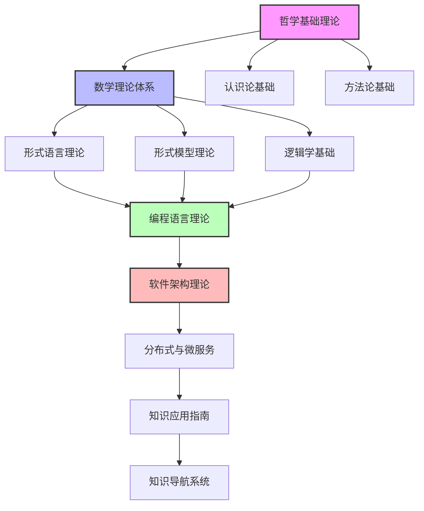

# 知识图谱

## 概述

知识图谱是FormalUnified理论体系的核心导航工具，通过可视化的方式展示各理论体系间的关联关系，帮助学习者理解知识的整体结构和内在联系。

## 图谱结构

### 核心理论体系关系图



### 理论层次结构

#### 第一层：哲学基础层

- **本体论**: 探讨存在的本质和形式
- **认识论**: 研究知识的来源和验证
- **方法论**: 提供思维和研究的系统方法

#### 第二层：数学基础层

- **集合论**: 为所有理论提供基础概念
- **逻辑学**: 提供推理和证明的基础
- **代数学**: 处理抽象结构和运算

#### 第三层：形式化理论层

- **形式语言**: 定义符号和语法规则
- **形式模型**: 建立抽象的系统模型
- **形式验证**: 确保系统的正确性

#### 第四层：应用理论层

- **编程语言**: 实现计算和算法
- **软件架构**: 设计系统结构
- **分布式系统**: 处理大规模系统

#### 第五层：实践应用层

- **知识应用**: 理论到实践的转换
- **知识导航**: 知识获取和检索

## 概念关联网络

### 核心概念映射

#### 状态概念网络

```text
状态机理论 ←→ 自动机理论 ←→ 形式语言理论
     ↓              ↓              ↓
Petri网理论 ←→ 并发理论 ←→ 分布式理论
     ↓              ↓              ↓
时序逻辑 ←→ 模型检查 ←→ 形式验证
```

#### 类型概念网络

```text
类型理论 ←→ 集合论 ←→ 范畴论
   ↓         ↓         ↓
类型系统 ←→ 类型检查 ←→ 类型安全
   ↓         ↓         ↓
编程语言 ←→ 编译器 ←→ 运行时系统
```

#### 架构概念网络

```text
组件理论 ←→ 设计模式 ←→ 架构模式
   ↓         ↓         ↓
微服务 ←→ 服务治理 ←→ 分布式架构
   ↓         ↓         ↓
工作流 ←→ 业务流程 ←→ 系统集成
```

### 跨领域概念映射

#### 哲学-数学映射

- **存在性** (哲学) ↔ **集合存在** (数学)
- **因果关系** (哲学) ↔ **函数映射** (数学)
- **整体性** (哲学) ↔ **系统结构** (数学)

#### 数学-计算机映射

- **集合** (数学) ↔ **数据类型** (计算机)
- **函数** (数学) ↔ **算法** (计算机)
- **关系** (数学) ↔ **数据结构** (计算机)

#### 计算机-工程映射

- **算法** (计算机) ↔ **设计模式** (工程)
- **数据结构** (计算机) ↔ **组件设计** (工程)
- **系统** (计算机) ↔ **架构设计** (工程)

## 知识路径图

### 学习路径网络

#### 基础路径

```text
哲学基础 → 数学基础 → 形式化基础 → 应用基础
    ↓         ↓         ↓         ↓
本体论    → 集合论   → 自动机 → 编程语言
    ↓         ↓         ↓         ↓
认识论    → 逻辑学 → 形式语法 → 软件架构
    ↓         ↓         ↓         ↓
方法论    → 代数学 → 形式模型 → 分布式系统
```

#### 专业路径

```text
软件工程路径:
编程语言 → 软件架构 → 分布式系统 → 微服务

形式化方法路径:
形式语言 → 形式模型 → 形式验证 → 模型检查

数学基础路径:
集合论 → 范畴论 → 代数 → 拓扑
```

#### 整合路径

```text
跨学科整合:
哲学+数学 → 数学+计算机 → 计算机+工程 → 统一理论
```

## 知识密度分布

### 理论深度分布

- **高密度区域**: 数学理论、形式化理论
- **中密度区域**: 编程语言、软件架构
- **低密度区域**: 哲学基础、实践应用

### 应用广度分布

- **广泛应用**: 软件架构、分布式系统
- **中等应用**: 编程语言、形式化方法
- **专业应用**: 数学理论、哲学基础

### 创新潜力分布

- **高创新潜力**: 跨领域整合、新理论构建
- **中等创新潜力**: 理论应用、方法改进
- **基础创新潜力**: 理论深化、概念扩展

## 知识演化路径

### 历史发展脉络

```text
古典哲学 → 现代数学 → 计算理论 → 软件工程
    ↓         ↓         ↓         ↓
形式逻辑 → 集合论 → 自动机 → 编程语言
    ↓         ↓         ↓         ↓
科学方法 → 公理化 → 形式化 → 工程化
```

### 未来发展趋势

```text
统一理论 → 跨学科整合 → 智能化应用 → 知识自动化
    ↓         ↓         ↓         ↓
理论融合 → 方法创新 → 工具发展 → 平台建设
    ↓         ↓         ↓         ↓
知识图谱 → 智能导航 → 个性化学习 → 自适应系统
```

## 知识检索系统

### 检索维度

#### 按理论体系检索

- 哲学基础理论
- 数学理论体系
- 形式语言理论
- 形式模型理论
- 编程语言理论
- 软件架构理论
- 分布式与微服务

#### 按概念类型检索

- 基础概念
- 核心理论
- 应用方法
- 实践案例
- 工具技术

#### 按应用领域检索

- 软件开发
- 系统设计
- 算法研究
- 形式验证
- 知识管理

### 检索方法

#### 关键词检索

- 精确匹配
- 模糊匹配
- 语义匹配
- 关联匹配

#### 路径检索

- 学习路径
- 应用路径
- 发展路径
- 创新路径

#### 关系检索

- 概念关系
- 理论关系
- 应用关系
- 发展关系

## 知识更新机制

### 更新策略

- **定期更新**: 按计划更新知识内容
- **动态更新**: 根据发展动态更新
- **反馈更新**: 根据用户反馈更新
- **创新更新**: 根据新理论创新更新

### 质量控制

- **内容审核**: 确保内容的准确性和完整性
- **关系验证**: 验证概念关系的正确性
- **一致性检查**: 检查理论间的一致性
- **实用性评估**: 评估知识的实用性

---

**知识图谱** - 理论体系的导航地图  
*FormalUnified知识体系核心导航工具*  
*2025年8月12日*
