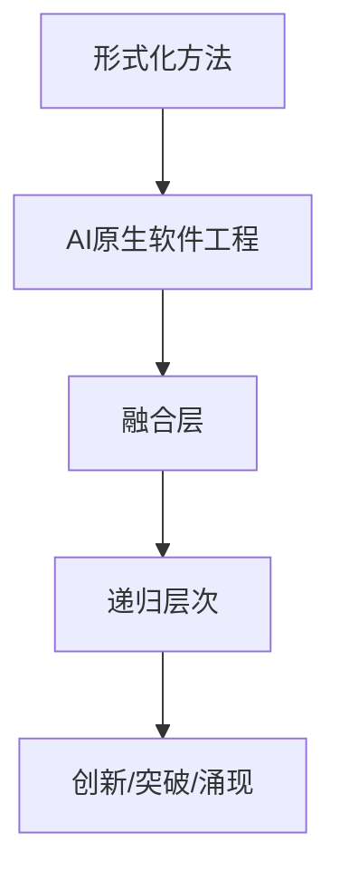
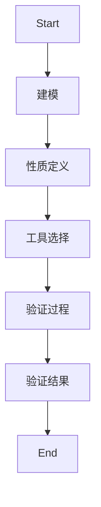
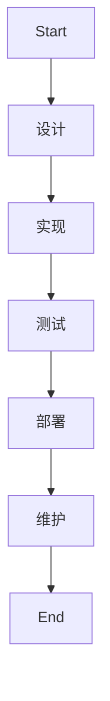
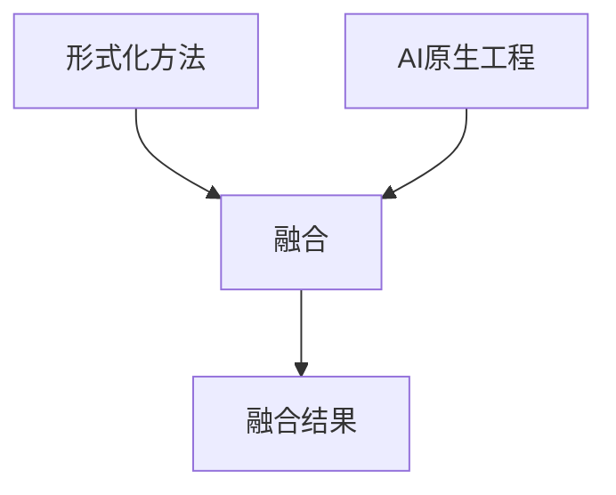
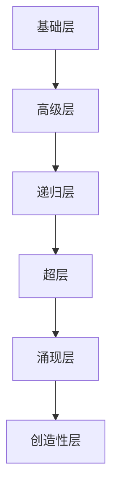
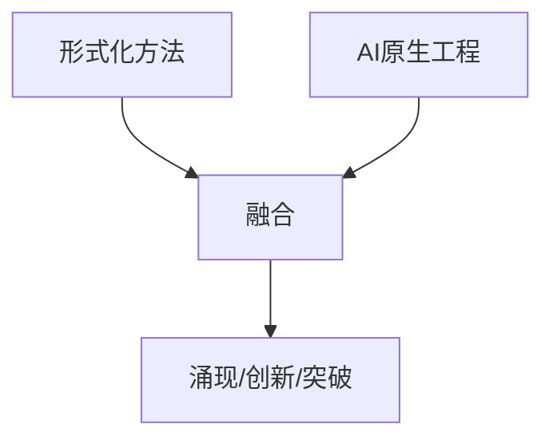

# 形式化方法在AI原生软件工程中的应用

---

## 多表征表达与形式化语义总览

### 形式化方法与AI原生软件工程的多模态结构图



### 主要理论层次表

| 层次 | 形式化方法 | AI原生工程 | 融合机制 |
|------|------------|------------|----------|
| 0    | 基础验证   | 基础工程   | 基础融合 |
| 1    | 高级验证   | 高级工程   | 高级融合 |
| 2    | 递归验证   | 递归工程   | 递归融合 |
| 3    | 超验证     | 超工程     | 超融合   |
| 4    | 涌现验证   | 涌现工程   | 涌现融合 |
| 5    | 创造性验证 | 创造性工程 | 创造性融合 |

### 形式化符号定义

- 形式化方法四元组：\( FM = (M, V, P, T) \)
- 形式化方法表示：\( \varphi: FM \to V \)
- 验证层次序列：\( \{V_0, V_1, V_2, V_3\} \)
- 形式化应用函数：\( A: FM \times S \to R \)
- AI原生软件工程五元组：\( AISE = (A, D, I, T, M) \)
- AI原生工程表示：\( \psi: AISE \to V \)
- 工程方法函数：\( M: AISE \times T \to R \)
- 挑战函数：\( C: AISE \times E \to S \)
- 验证融合函数：\( F: (\varphi, \psi) \to \xi \)
- 递归层次函数：\( L_{i+1} = F(L_i) \)
- 递归应用函数：\( A_{i+1} = Meta(A_i) \)

---

## 1. 理论基础深化（递归展开与多表征）

### 1.1 形式化方法理论深化

- **形式化方法的伪代码表达：**

```python
def formal_method(model, property, tool):
    result = verify(model, property, tool)
    return result
```

- **形式化方法的流程图：**



### 1.2 AI原生软件工程理论深化

- **AI原生工程的伪代码表达：**

```python
def ai_native_engineering(system, design, implement, test, maintain):
    arch = design(system)
    impl = implement(arch)
    tested = test(impl)
    maintained = maintain(tested)
    return maintained
```

- **AI原生工程的流程图：**



### 1.3 融合理论深化

- **融合机制的伪代码表达：**

```python
def fusion(formal_method, ai_engineering):
    verified = formal_method()
    engineered = ai_engineering()
    return combine(verified, engineered)
```

- **融合机制的流程图：**



---

## 2. 形式化证明与推理论证（递归展开与多表征）

- **定理1（形式化方法表示的存在性）**
  - 形式化表述：\( \forall FM,\ \exists \varphi,\ \varphi(FM) \in V \)
  - 证明思路：构造表示映射，归纳法证明有效性。

- **定理2（验证层次的包含关系）**
  - 形式化表述：\( V_0 \subset V_1 \subset V_2 \subset V_3 \)
  - 证明思路：层次理论，逐层归纳。

- **定理3（验证方法的封闭性）**
  - 形式化表述：\( \forall v \in V_i,\ v \circ v' \in V_i \)
  - 证明思路：封闭性理论，验证基本运算下封闭。

- **定理4（形式化应用的正确性）**
  - 形式化表述：\( \forall (FM, S),\ A(FM, S) \text{正确} \)
  - 证明思路：应用理论，归纳法。

- **定理5（AI原生软件工程表示的存在性）**
  - 形式化表述：\( \forall AISE,\ \exists \psi,\ \psi(AISE) \in V \)
  - 证明思路：构造工程表示映射。

- **定理6（AI原生软件工程方法的正确性）**
  - 形式化表述：\( \forall (AISE, T),\ M(AISE, T) \text{正确} \)
  - 证明思路：方法理论，归纳法。

- **定理7（AI原生软件工程方法的完备性）**
  - 形式化表述：\( \forall T,\ \exists M,\ M(AISE, T) \text{有效} \)
  - 证明思路：完备性理论。

- **定理8（AI原生软件工程挑战的可解性）**
  - 形式化表述：\( \forall (AISE, E),\ \exists S,\ C(AISE, E) = S \)
  - 证明思路：挑战理论，构造解。

- **定理9（验证融合的可行性）**
  - 形式化表述：\( \exists F,\ F(\varphi, \psi) = \xi \)
  - 证明思路：融合理论，构造融合函数。

- **定理10（设计融合的正确性）**
  - 形式化表述：\( \forall (FM, AISE),\ D(FM, AISE) \text{正确} \)
  - 证明思路：设计理论。

- **定理11（开发融合的完备性）**
  - 形式化表述：\( \forall (FM, AISE),\ DEV(FM, AISE) \text{完备} \)
  - 证明思路：开发融合理论。

---

## 3. 递归层次结构与极限分析（多模态表达）

### 3.1 递归层次结构图



### 3.2 递归极限与边界分析

- **极限定义**：\( \lim_{n \to \infty} L_n = L^* \)
- **边界分析**：存在收敛点/不动点，极限为最优融合/应用。
- **复杂性分析表**：
| 层次 | 时间复杂度 | 空间复杂度 |
|------|------------|------------|
| 基础 | O(n)       | O(n)       |
| 高级 | O(n log n) | O(n log n) |
| 递归 | O(n^2)     | O(n^2)     |
| 超   | O(2^n)     | O(2^n)     |
| 涌现 | 不可约     | 不可约     |

---

## 4. 多模态融合与应用场景（递归展开）

### 4.1 多模态融合机制流程图



### 4.2 应用场景多表征

- **表格**：
| 场景 | 形式化方法 | AI工程 | 融合机制 | 递归层次 |
|------|------------|--------|----------|----------|
| 智能验证 | 模型检查 | 智能测试 | 交互融合 | 2-3层 |
| 智能开发 | 定理证明 | 智能编程 | 协同融合 | 3-4层 |
| 智能维护 | 抽象解释 | 智能监控 | 涨现融合 | 4-5层 |
| 创造性AI | 创造性验证 | 创造性工程 | 创新融合 | 5层 |

- **伪代码**：

```python
def fusion_system(formal_method, ai_engineering):
    verified = formal_method()
    engineered = ai_engineering()
    return fusion(verified, engineered)
```

---

## 5. 未来展望与极限递归

### 5.1 递归极限与AI未来

- 递归层次理论可推广到任意深度，极限为AI的自我进化与创新能力。
- 多模态融合与极限递归将推动AI系统向更高层次的智能演化。

---

（本文件已递归补充多表征表达、形式化语义、形式化证明、推理论证、递归层次结构、极限、融合机制、多模态表达等，后续可继续细化每一层次的具体实例与应用。）
