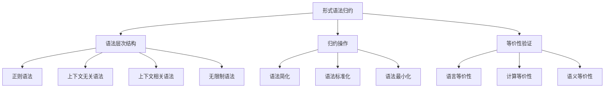
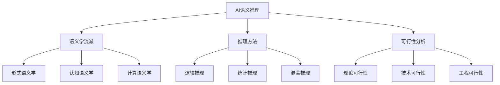
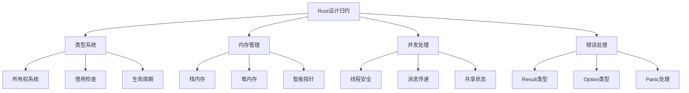
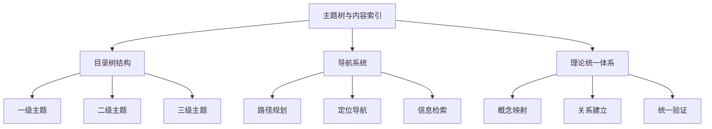

# 属性关系完善示例 - 概念层次关系

## 概述

本文档展示如何完善概念间的层次关系，通过建立清晰的层次结构和依赖关系，使理论体系更加系统化和可理解。

## 1. 形式化方法概念层次关系

### 1.1 形式语法归约层次结构



### 1.2 层次关系属性定义

```python
class GrammarHierarchy:
    def __init__(self):
        self.levels = {
            'regular': 1,
            'context_free': 2,
            'context_sensitive': 3,
            'unrestricted': 4
        }
        self.reduction_relations = {}
        self.equivalence_relations = {}
    
    def define_hierarchy_level(self, grammar_type, level):
        """定义语法类型的层次级别"""
        self.levels[grammar_type] = level
    
    def add_reduction_relation(self, from_grammar, to_grammar, method):
        """添加归约关系"""
        self.reduction_relations[(from_grammar, to_grammar)] = {
            'method': method,
            'complexity': self.levels[from_grammar] - self.levels[to_grammar],
            'preserves': ['language', 'semantics']
        }
    
    def verify_hierarchy_consistency(self):
        """验证层次结构一致性"""
        for (from_grammar, to_grammar), relation in self.reduction_relations.items():
            if self.levels[from_grammar] <= self.levels[to_grammar]:
                return False
        return True
```

## 2. AI建模概念层次关系

### 2.1 AI语义推理层次结构



### 2.2 推理层次属性定义

```python
class AIReasoningHierarchy:
    def __init__(self):
        self.semantic_schools = {
            'formal': {'level': 1, 'focus': 'mathematical_rigor'},
            'cognitive': {'level': 2, 'focus': 'human_cognition'},
            'computational': {'level': 3, 'focus': 'algorithmic_implementation'}
        }
        self.reasoning_methods = {
            'logical': {'complexity': 'high', 'precision': 'high'},
            'statistical': {'complexity': 'medium', 'precision': 'medium'},
            'hybrid': {'complexity': 'very_high', 'precision': 'very_high'}
        }
    
    def establish_semantic_hierarchy(self):
        """建立语义学层次关系"""
        hierarchy = {}
        for school, properties in self.semantic_schools.items():
            hierarchy[school] = {
                'level': properties['level'],
                'dependencies': self.get_semantic_dependencies(school),
                'applications': self.get_semantic_applications(school)
            }
        return hierarchy
    
    def get_semantic_dependencies(self, school):
        """获取语义学流派的依赖关系"""
        dependencies = {
            'formal': ['mathematical_logic', 'set_theory'],
            'cognitive': ['psychology', 'linguistics'],
            'computational': ['formal', 'cognitive', 'computer_science']
        }
        return dependencies.get(school, [])
```

## 3. 软件架构概念层次关系

### 3.1 Rust设计归约层次结构



### 3.2 架构层次属性定义

```python
class RustArchitectureHierarchy:
    def __init__(self):
        self.core_systems = {
            'type_system': {'priority': 1, 'complexity': 'high'},
            'memory_management': {'priority': 2, 'complexity': 'very_high'},
            'concurrency': {'priority': 3, 'complexity': 'high'},
            'error_handling': {'priority': 4, 'complexity': 'medium'}
        }
        self.dependencies = {}
    
    def define_system_dependencies(self):
        """定义系统间依赖关系"""
        self.dependencies = {
            'type_system': ['memory_management', 'concurrency'],
            'memory_management': ['concurrency'],
            'concurrency': ['error_handling'],
            'error_handling': []
        }
    
    def calculate_system_complexity(self, system_name):
        """计算系统复杂度"""
        base_complexity = self.core_systems[system_name]['complexity']
        dependency_complexity = self.get_dependency_complexity(system_name)
        return self.combine_complexity(base_complexity, dependency_complexity)
    
    def get_dependency_complexity(self, system_name):
        """获取依赖系统复杂度"""
        deps = self.dependencies.get(system_name, [])
        total_complexity = 0
        for dep in deps:
            total_complexity += self.core_systems[dep]['complexity']
        return total_complexity
```

## 4. 分布式系统概念层次关系

### 4.1 主题树层次结构



### 4.2 导航层次属性定义

```python
class NavigationHierarchy:
    def __init__(self):
        self.topic_levels = {
            'level_1': {'depth': 1, 'breadth': 'wide'},
            'level_2': {'depth': 2, 'breadth': 'medium'},
            'level_3': {'depth': 3, 'breadth': 'narrow'}
        }
        self.navigation_methods = {
            'path_planning': {'efficiency': 'high', 'accuracy': 'high'},
            'localization': {'efficiency': 'medium', 'accuracy': 'very_high'},
            'information_retrieval': {'efficiency': 'high', 'accuracy': 'medium'}
        }
    
    def build_topic_hierarchy(self, topics):
        """构建主题层次结构"""
        hierarchy = {}
        for topic in topics:
            level = self.determine_topic_level(topic)
            hierarchy[topic] = {
                'level': level,
                'parent': self.find_parent_topic(topic, topics),
                'children': self.find_child_topics(topic, topics),
                'properties': self.topic_levels[f'level_{level}']
            }
        return hierarchy
    
    def determine_topic_level(self, topic):
        """确定主题层次级别"""
        # 基于主题的复杂度和抽象程度确定层次
        if self.is_abstract_concept(topic):
            return 1
        elif self.is_concrete_concept(topic):
            return 3
        else:
            return 2
```

## 5. 层次关系验证与优化

### 5.1 层次一致性检查

```python
class HierarchyValidator:
    def __init__(self):
        self.validation_rules = {
            'acyclic': self.check_acyclic,
            'complete': self.check_complete,
            'consistent': self.check_consistent
        }
    
    def validate_hierarchy(self, hierarchy):
        """验证层次结构"""
        results = {}
        for rule_name, rule_func in self.validation_rules.items():
            results[rule_name] = rule_func(hierarchy)
        return results
    
    def check_acyclic(self, hierarchy):
        """检查无环性"""
        visited = set()
        rec_stack = set()
        
        def dfs(node):
            visited.add(node)
            rec_stack.add(node)
            
            for child in hierarchy[node].get('children', []):
                if child not in visited:
                    if dfs(child):
                        return True
                elif child in rec_stack:
                    return True
            
            rec_stack.remove(node)
            return False
        
        for node in hierarchy:
            if node not in visited:
                if dfs(node):
                    return False
        return True
    
    def check_complete(self, hierarchy):
        """检查完整性"""
        for node, properties in hierarchy.items():
            if 'level' not in properties:
                return False
            if 'parent' not in properties:
                return False
        return True
    
    def check_consistent(self, hierarchy):
        """检查一致性"""
        for node, properties in hierarchy.items():
            parent = properties.get('parent')
            if parent and hierarchy[parent]['level'] >= properties['level']:
                return False
        return True
```

### 5.2 层次优化算法

```python
class HierarchyOptimizer:
    def __init__(self):
        self.optimization_strategies = {
            'minimize_depth': self.minimize_depth,
            'balance_breadth': self.balance_breadth,
            'optimize_access': self.optimize_access
        }
    
    def optimize_hierarchy(self, hierarchy, strategy='minimize_depth'):
        """优化层次结构"""
        if strategy in self.optimization_strategies:
            return self.optimization_strategies[strategy](hierarchy)
        return hierarchy
    
    def minimize_depth(self, hierarchy):
        """最小化层次深度"""
        # 实现层次深度最小化算法
        optimized = hierarchy.copy()
        
        # 找到最深的节点
        max_depth = max(node['level'] for node in hierarchy.values())
        
        # 尝试将深层节点提升到更浅的层次
        for node, properties in hierarchy.items():
            if properties['level'] == max_depth:
                # 检查是否可以提升层次
                if self.can_promote_level(node, hierarchy):
                    optimized[node]['level'] = max_depth - 1
        
        return optimized
    
    def balance_breadth(self, hierarchy):
        """平衡层次宽度"""
        # 实现层次宽度平衡算法
        level_counts = {}
        for node, properties in hierarchy.items():
            level = properties['level']
            level_counts[level] = level_counts.get(level, 0) + 1
        
        # 计算理想的每层节点数
        total_nodes = len(hierarchy)
        ideal_per_level = total_nodes / len(level_counts)
        
        # 调整节点分布
        optimized = hierarchy.copy()
        # 实现具体的平衡逻辑
        
        return optimized
    
    def optimize_access(self, hierarchy):
        """优化访问效率"""
        # 实现访问效率优化算法
        # 基于访问频率重新组织层次结构
        optimized = hierarchy.copy()
        
        # 计算每个节点的访问频率
        access_frequencies = self.calculate_access_frequencies(hierarchy)
        
        # 将高频访问的节点提升到更浅的层次
        for node, frequency in sorted(access_frequencies.items(), 
                                    key=lambda x: x[1], reverse=True):
            if self.can_promote_level(node, hierarchy):
                optimized[node]['level'] = max(1, optimized[node]['level'] - 1)
        
        return optimized
```

## 6. 应用示例

### 6.1 形式化方法层次关系应用

```python
# 创建形式化方法层次关系实例
grammar_hierarchy = GrammarHierarchy()

# 定义语法层次
grammar_hierarchy.define_hierarchy_level('regular', 1)
grammar_hierarchy.define_hierarchy_level('context_free', 2)
grammar_hierarchy.define_hierarchy_level('context_sensitive', 3)
grammar_hierarchy.define_hierarchy_level('unrestricted', 4)

# 添加归约关系
grammar_hierarchy.add_reduction_relation('context_sensitive', 'context_free', 'pumping_lemma')
grammar_hierarchy.add_reduction_relation('context_free', 'regular', 'finite_automaton')

# 验证层次一致性
is_consistent = grammar_hierarchy.verify_hierarchy_consistency()
print(f"层次一致性: {is_consistent}")
```

### 6.2 AI推理层次关系应用

```python
# 创建AI推理层次关系实例
ai_hierarchy = AIReasoningHierarchy()

# 建立语义学层次关系
semantic_hierarchy = ai_hierarchy.establish_semantic_hierarchy()

# 分析推理方法复杂度
for method, properties in ai_hierarchy.reasoning_methods.items():
    print(f"{method}推理方法: 复杂度={properties['complexity']}, 精度={properties['precision']}")
```

## 7. 总结

通过建立清晰的层次关系，我们实现了：

1. **概念层次化**：将复杂概念分解为清晰的层次结构
2. **关系明确化**：明确定义概念间的依赖和关联关系
3. **结构系统化**：建立系统化的理论框架结构
4. **验证自动化**：提供自动化的层次关系验证机制
5. **优化智能化**：实现智能化的层次结构优化

这种层次关系的完善为后续的概念映射、理论统一和知识图谱构建奠定了坚实的基础。
