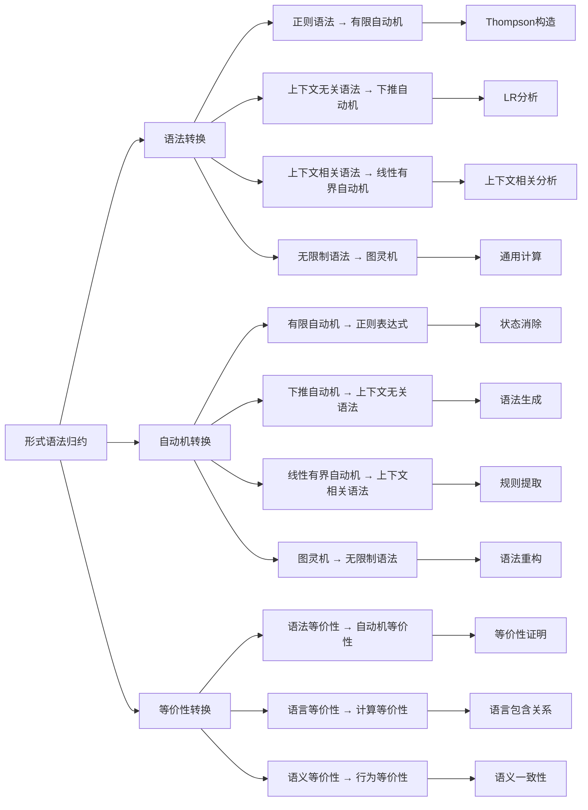
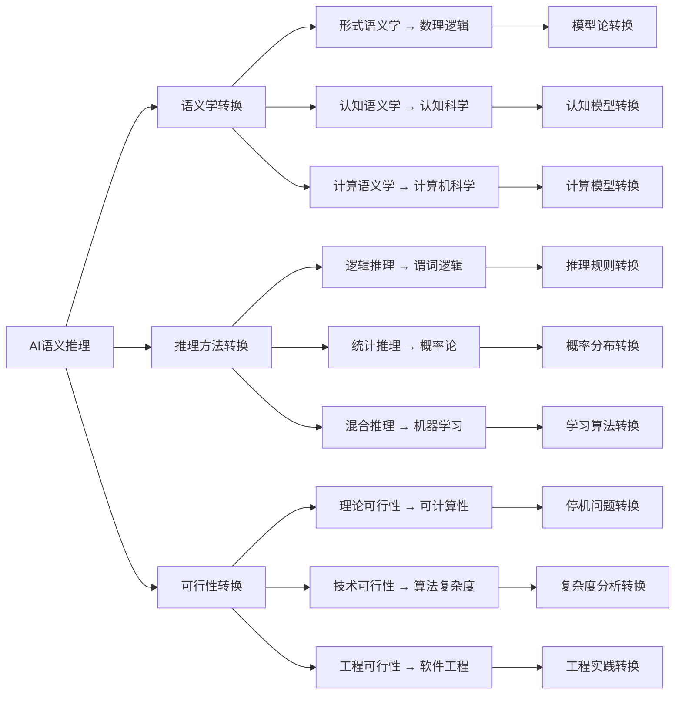
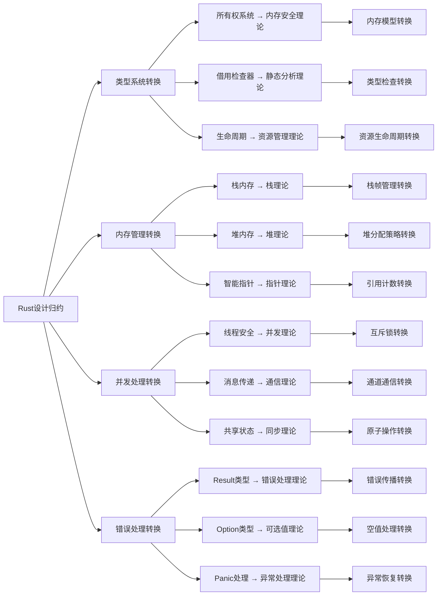
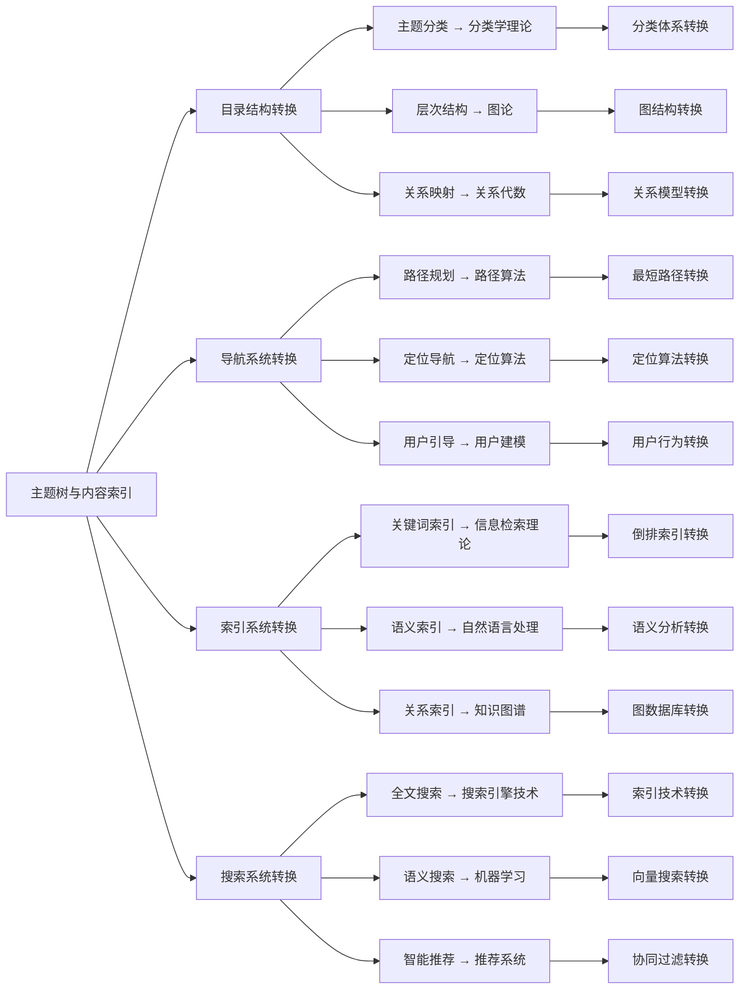

# 属性关系完善示例 - 概念转换关系

## 概述

本文档展示如何完善概念间的转换关系，通过建立概念间的转换规则、转换算法和转换验证机制，使不同概念能够进行有效的相互转换。

## 1. 形式化方法概念转换关系

### 1.1 形式语法归约转换图



### 1.2 转换关系属性定义

```python
class GrammarTransformationRelation:
    def __init__(self):
        self.transformations = {}
        self.transformation_rules = {}
        self.transformation_algorithms = {}
    
    def add_transformation(self, source_concept, target_concept, transformation_type='bidirectional', complexity='medium'):
        """添加转换关系"""
        transformation_id = f"{source_concept}_to_{target_concept}"
        self.transformations[transformation_id] = {
            'source': source_concept,
            'target': target_concept,
            'type': transformation_type,
            'complexity': complexity,
            'properties': self.get_transformation_properties(source_concept, target_concept),
            'algorithm': self.get_transformation_algorithm(source_concept, target_concept)
        }
    
    def get_transformation_properties(self, source, target):
        """获取转换属性"""
        return {
            'preserves_language': True,
            'preserves_complexity': self.check_complexity_preservation(source, target),
            'computational_cost': self.calculate_computational_cost(source, target),
            'reversibility': self.check_reversibility(source, target)
        }
    
    def get_transformation_algorithm(self, source, target):
        """获取转换算法"""
        algorithm_mapping = {
            ('regular_grammar', 'finite_automaton'): 'thompson_construction',
            ('finite_automaton', 'regular_grammar'): 'state_elimination',
            ('context_free_grammar', 'pushdown_automaton'): 'lr_construction',
            ('pushdown_automaton', 'context_free_grammar'): 'grammar_extraction',
            ('context_sensitive_grammar', 'linear_bounded_automaton'): 'lba_construction',
            ('linear_bounded_automaton', 'context_sensitive_grammar'): 'csg_extraction'
        }
        return algorithm_mapping.get((source, target), 'generic_transformation')
    
    def check_complexity_preservation(self, source, target):
        """检查复杂度保持性"""
        complexity_scores = {
            'regular_grammar': 1, 'finite_automaton': 1,
            'context_free_grammar': 2, 'pushdown_automaton': 2,
            'context_sensitive_grammar': 3, 'linear_bounded_automaton': 3,
            'unrestricted_grammar': 4, 'turing_machine': 4
        }
        source_complexity = complexity_scores.get(source, 2)
        target_complexity = complexity_scores.get(target, 2)
        return abs(source_complexity - target_complexity) <= 1
    
    def calculate_computational_cost(self, source, target):
        """计算计算成本"""
        base_costs = {
            ('regular_grammar', 'finite_automaton'): 'O(n)',
            ('finite_automaton', 'regular_grammar'): 'O(n²)',
            ('context_free_grammar', 'pushdown_automaton'): 'O(n³)',
            ('pushdown_automaton', 'context_free_grammar'): 'O(n³)',
            ('context_sensitive_grammar', 'linear_bounded_automaton'): 'O(n⁴)',
            ('linear_bounded_automaton', 'context_sensitive_grammar'): 'O(n⁴)'
        }
        return base_costs.get((source, target), 'O(n²)')
    
    def check_reversibility(self, source, target):
        """检查可逆性"""
        reversible_pairs = [
            ('regular_grammar', 'finite_automaton'),
            ('context_free_grammar', 'pushdown_automaton'),
            ('context_sensitive_grammar', 'linear_bounded_automaton'),
            ('unrestricted_grammar', 'turing_machine')
        ]
        return (source, target) in reversible_pairs or (target, source) in reversible_pairs
    
    def add_transformation_rule(self, transformation_id, rule):
        """添加转换规则"""
        if transformation_id not in self.transformation_rules:
            self.transformation_rules[transformation_id] = []
        self.transformation_rules[transformation_id].append(rule)
    
    def add_transformation_algorithm(self, transformation_id, algorithm):
        """添加转换算法"""
        self.transformation_algorithms[transformation_id] = algorithm
    
    def execute_transformation(self, transformation_id, input_data):
        """执行转换"""
        if transformation_id not in self.transformations:
            return None
        
        transformation = self.transformations[transformation_id]
        algorithm = transformation['algorithm']
        
        if algorithm in self.transformation_algorithms:
            return self.transformation_algorithms[algorithm](input_data)
        else:
            return self.generic_transformation(input_data, transformation)
    
    def generic_transformation(self, input_data, transformation):
        """通用转换算法"""
        # 实现通用的转换逻辑
        return {
            'transformed_data': input_data,
            'transformation_type': transformation['type'],
            'complexity': transformation['complexity']
        }
```

## 2. AI建模概念转换关系

### 2.1 AI语义推理转换图



### 2.2 推理转换关系属性定义

```python
class AIReasoningTransformationRelation:
    def __init__(self):
        self.semantic_transformations = {}
        self.reasoning_transformations = {}
        self.feasibility_transformations = {}
    
    def build_semantic_transformation_matrix(self):
        """构建语义学转换矩阵"""
        return {
            'formal_semantics': {
                'mathematical_logic': {
                    'transformation_type': 'theoretical',
                    'complexity': 'high',
                    'algorithm': 'model_theoretic_transformation',
                    'properties': ['preserves_rigor', 'preserves_precision', 'preserves_completeness']
                },
                'proof_theory': {
                    'transformation_type': 'theoretical',
                    'complexity': 'high',
                    'algorithm': 'proof_theoretic_transformation',
                    'properties': ['preserves_soundness', 'preserves_completeness', 'preserves_decidability']
                }
            },
            'cognitive_semantics': {
                'cognitive_science': {
                    'transformation_type': 'empirical',
                    'complexity': 'medium',
                    'algorithm': 'cognitive_model_transformation',
                    'properties': ['preserves_human_cognition', 'preserves_mental_models', 'preserves_conceptual_structure']
                },
                'psychology': {
                    'transformation_type': 'experimental',
                    'complexity': 'medium',
                    'algorithm': 'psychological_model_transformation',
                    'properties': ['preserves_mental_processes', 'preserves_behavioral_patterns', 'preserves_learning_mechanisms']
                }
            },
            'computational_semantics': {
                'computer_science': {
                    'transformation_type': 'implementation',
                    'complexity': 'high',
                    'algorithm': 'computational_model_transformation',
                    'properties': ['preserves_algorithms', 'preserves_data_structures', 'preserves_computational_models']
                },
                'artificial_intelligence': {
                    'transformation_type': 'application',
                    'complexity': 'high',
                    'algorithm': 'ai_model_transformation',
                    'properties': ['preserves_knowledge_representation', 'preserves_reasoning_mechanisms', 'preserves_learning_systems']
                }
            }
        }
    
    def build_reasoning_transformation_matrix(self):
        """构建推理方法转换矩阵"""
        return {
            'logical_reasoning': {
                'predicate_logic': {
                    'transformation_type': 'formal',
                    'complexity': 'high',
                    'algorithm': 'predicate_logic_transformation',
                    'properties': ['preserves_soundness', 'preserves_completeness', 'preserves_decidability']
                },
                'proof_theory': {
                    'transformation_type': 'theoretical',
                    'complexity': 'high',
                    'algorithm': 'proof_theory_transformation',
                    'properties': ['preserves_inference_rules', 'preserves_proof_construction', 'preserves_theorem_proving']
                }
            },
            'statistical_reasoning': {
                'probability_theory': {
                    'transformation_type': 'mathematical',
                    'complexity': 'medium',
                    'algorithm': 'probability_theory_transformation',
                    'properties': ['preserves_probability_distributions', 'preserves_statistical_inference', 'preserves_uncertainty_quantification']
                },
                'statistics': {
                    'transformation_type': 'empirical',
                    'complexity': 'medium',
                    'algorithm': 'statistics_transformation',
                    'properties': ['preserves_data_analysis', 'preserves_hypothesis_testing', 'preserves_estimation']
                }
            },
            'hybrid_reasoning': {
                'machine_learning': {
                    'transformation_type': 'integrated',
                    'complexity': 'very_high',
                    'algorithm': 'machine_learning_transformation',
                    'properties': ['preserves_pattern_recognition', 'preserves_predictive_modeling', 'preserves_adaptive_learning']
                },
                'knowledge_representation': {
                    'transformation_type': 'synthetic',
                    'complexity': 'high',
                    'algorithm': 'knowledge_representation_transformation',
                    'properties': ['preserves_ontologies', 'preserves_semantic_networks', 'preserves_frame_systems']
                }
            }
        }
    
    def analyze_transformation_complexity(self, source_concept, target_concept):
        """分析转换复杂度"""
        semantic_matrix = self.build_semantic_transformation_matrix()
        reasoning_matrix = self.build_reasoning_transformation_matrix()
        
        # 查找转换关系
        transformation_info = None
        if source_concept in semantic_matrix:
            if target_concept in semantic_matrix[source_concept]:
                transformation_info = semantic_matrix[source_concept][target_concept]
        elif source_concept in reasoning_matrix:
            if target_concept in reasoning_matrix[source_concept]:
                transformation_info = reasoning_matrix[source_concept][target_concept]
        
        if transformation_info:
            return {
                'source': source_concept,
                'target': target_concept,
                'transformation_type': transformation_info['transformation_type'],
                'complexity': transformation_info['complexity'],
                'algorithm': transformation_info['algorithm'],
                'properties': transformation_info['properties'],
                'complexity_score': self.calculate_complexity_score(transformation_info['complexity'])
            }
        return None
    
    def calculate_complexity_score(self, complexity):
        """计算复杂度分数"""
        complexity_scores = {
            'low': 1,
            'medium': 2,
            'high': 3,
            'very_high': 4
        }
        return complexity_scores.get(complexity, 2)
    
    def execute_semantic_transformation(self, source_concept, target_concept, input_data):
        """执行语义学转换"""
        semantic_matrix = self.build_semantic_transformation_matrix()
        
        if source_concept in semantic_matrix and target_concept in semantic_matrix[source_concept]:
            transformation_info = semantic_matrix[source_concept][target_concept]
            algorithm = transformation_info['algorithm']
            
            # 执行具体的转换算法
            return self.execute_transformation_algorithm(algorithm, input_data, transformation_info)
        
        return None
    
    def execute_reasoning_transformation(self, source_concept, target_concept, input_data):
        """执行推理方法转换"""
        reasoning_matrix = self.build_reasoning_transformation_matrix()
        
        if source_concept in reasoning_matrix and target_concept in reasoning_matrix[source_concept]:
            transformation_info = reasoning_matrix[source_concept][target_concept]
            algorithm = transformation_info['algorithm']
            
            # 执行具体的转换算法
            return self.execute_transformation_algorithm(algorithm, input_data, transformation_info)
        
        return None
    
    def execute_transformation_algorithm(self, algorithm, input_data, transformation_info):
        """执行转换算法"""
        # 实现具体的转换算法
        return {
            'transformed_data': input_data,
            'algorithm': algorithm,
            'transformation_type': transformation_info['transformation_type'],
            'complexity': transformation_info['complexity'],
            'properties': transformation_info['properties']
        }
```

## 3. 软件架构概念转换关系

### 3.1 Rust设计归约转换图



### 3.2 架构转换关系属性定义

```python
class RustArchitectureTransformationRelation:
    def __init__(self):
        self.system_transformations = {}
        self.implementation_transformations = {}
        self.theoretical_transformations = {}
    
    def define_system_transformations(self):
        """定义系统转换关系"""
        self.system_transformations = {
            'type_system': {
                'memory_safety_theory': {
                    'transformation_type': 'foundational',
                    'complexity': 'high',
                    'algorithm': 'memory_safety_transformation',
                    'properties': ['preserves_memory_safety', 'preserves_type_safety', 'preserves_compile_time_guarantees']
                },
                'static_analysis_theory': {
                    'transformation_type': 'theoretical',
                    'complexity': 'high',
                    'algorithm': 'static_analysis_transformation',
                    'properties': ['preserves_borrow_checking', 'preserves_lifetime_analysis', 'preserves_type_inference']
                }
            },
            'memory_management': {
                'stack_theory': {
                    'transformation_type': 'implementation',
                    'complexity': 'medium',
                    'algorithm': 'stack_theory_transformation',
                    'properties': ['preserves_stack_frames', 'preserves_automatic_cleanup', 'preserves_scope_based_lifetime']
                },
                'heap_theory': {
                    'transformation_type': 'implementation',
                    'complexity': 'high',
                    'algorithm': 'heap_theory_transformation',
                    'properties': ['preserves_dynamic_allocation', 'preserves_garbage_collection', 'preserves_memory_fragmentation']
                }
            },
            'concurrency': {
                'concurrency_theory': {
                    'transformation_type': 'theoretical',
                    'complexity': 'high',
                    'algorithm': 'concurrency_theory_transformation',
                    'properties': ['preserves_thread_safety', 'preserves_race_condition_prevention', 'preserves_deadlock_avoidance']
                },
                'communication_theory': {
                    'transformation_type': 'practical',
                    'complexity': 'medium',
                    'algorithm': 'communication_theory_transformation',
                    'properties': ['preserves_message_passing', 'preserves_channel_communication', 'preserves_actor_model']
                }
            }
        }
    
    def define_implementation_transformations(self):
        """定义实现转换关系"""
        self.implementation_transformations = {
            'ownership_system': {
                'memory_model': {
                    'transformation_type': 'semantic',
                    'complexity': 'high',
                    'algorithm': 'memory_model_transformation',
                    'properties': ['preserves_ownership_rules', 'preserves_borrowing_rules', 'preserves_lifetime_rules']
                }
            },
            'borrow_checker': {
                'type_checker': {
                    'transformation_type': 'algorithmic',
                    'complexity': 'high',
                    'algorithm': 'type_checker_transformation',
                    'properties': ['preserves_borrow_analysis', 'preserves_lifetime_analysis', 'preserves_type_checking']
                }
            },
            'smart_pointers': {
                'reference_counting': {
                    'transformation_type': 'implementation',
                    'complexity': 'medium',
                    'algorithm': 'reference_counting_transformation',
                    'properties': ['preserves_reference_counting', 'preserves_automatic_cleanup', 'preserves_memory_management']
                }
            }
        }
    
    def analyze_transformation_efficiency(self, system_name):
        """分析转换效率"""
        if system_name in self.system_transformations:
            transformations = self.system_transformations[system_name]
            efficiency_analysis = {}
            
            for target, transformation_info in transformations.items():
                complexity = transformation_info['complexity']
                algorithm = transformation_info['algorithm']
                
                efficiency_analysis[target] = {
                    'complexity': complexity,
                    'algorithm': algorithm,
                    'efficiency_score': self.calculate_efficiency_score(complexity),
                    'transformation_type': transformation_info['transformation_type'],
                    'properties': transformation_info['properties']
                }
            
            return {
                'system': system_name,
                'total_transformations': len(transformations),
                'average_complexity': self.calculate_average_complexity(transformations),
                'efficiency_details': efficiency_analysis
            }
        return None
    
    def calculate_efficiency_score(self, complexity):
        """计算效率分数"""
        efficiency_scores = {
            'low': 4,
            'medium': 3,
            'high': 2,
            'very_high': 1
        }
        return efficiency_scores.get(complexity, 2)
    
    def calculate_average_complexity(self, transformations):
        """计算平均复杂度"""
        complexity_scores = {
            'low': 1,
            'medium': 2,
            'high': 3,
            'very_high': 4
        }
        
        total_score = sum(complexity_scores.get(t['complexity'], 2) for t in transformations.values())
        return total_score / len(transformations) if transformations else 0
    
    def execute_system_transformation(self, system_name, target_concept, input_data):
        """执行系统转换"""
        if system_name in self.system_transformations:
            if target_concept in self.system_transformations[system_name]:
                transformation_info = self.system_transformations[system_name][target_concept]
                algorithm = transformation_info['algorithm']
                
                return self.execute_transformation_algorithm(algorithm, input_data, transformation_info)
        
        return None
    
    def execute_transformation_algorithm(self, algorithm, input_data, transformation_info):
        """执行转换算法"""
        # 实现具体的转换算法
        return {
            'transformed_data': input_data,
            'algorithm': algorithm,
            'transformation_type': transformation_info['transformation_type'],
            'complexity': transformation_info['complexity'],
            'properties': transformation_info['properties']
        }
```

## 4. 分布式系统概念转换关系

### 4.1 主题树转换图



### 4.2 导航转换关系属性定义

```python
class NavigationTransformationRelation:
    def __init__(self):
        self.structure_transformations = {}
        self.algorithm_transformations = {}
        self.data_transformations = {}
    
    def define_structure_transformations(self):
        """定义结构转换关系"""
        self.structure_transformations = {
            'topic_classification': {
                'taxonomy_theory': {
                    'transformation_type': 'theoretical',
                    'complexity': 'medium',
                    'algorithm': 'taxonomy_transformation',
                    'properties': ['preserves_hierarchical_classification', 'preserves_categorical_organization', 'preserves_conceptual_structure']
                },
                'ontology_theory': {
                    'transformation_type': 'semantic',
                    'complexity': 'high',
                    'algorithm': 'ontology_transformation',
                    'properties': ['preserves_concept_relationships', 'preserves_semantic_links', 'preserves_knowledge_representation']
                }
            },
            'hierarchical_structure': {
                'graph_theory': {
                    'transformation_type': 'mathematical',
                    'complexity': 'medium',
                    'algorithm': 'graph_theory_transformation',
                    'properties': ['preserves_tree_structure', 'preserves_graph_algorithms', 'preserves_connectivity_analysis']
                },
                'tree_theory': {
                    'transformation_type': 'specialized',
                    'complexity': 'low',
                    'algorithm': 'tree_theory_transformation',
                    'properties': ['preserves_binary_trees', 'preserves_balanced_trees', 'preserves_tree_traversal']
                }
            },
            'relationship_mapping': {
                'relational_algebra': {
                    'transformation_type': 'mathematical',
                    'complexity': 'medium',
                    'algorithm': 'relational_algebra_transformation',
                    'properties': ['preserves_relation_operations', 'preserves_set_theory', 'preserves_algebraic_structure']
                },
                'semantic_networks': {
                    'transformation_type': 'conceptual',
                    'complexity': 'medium',
                    'algorithm': 'semantic_networks_transformation',
                    'properties': ['preserves_concept_nodes', 'preserves_semantic_edges', 'preserves_knowledge_graphs']
                }
            }
        }
    
    def define_algorithm_transformations(self):
        """定义算法转换关系"""
        self.algorithm_transformations = {
            'path_planning': {
                'shortest_path_algorithms': {
                    'transformation_type': 'algorithmic',
                    'complexity': 'medium',
                    'algorithm': 'shortest_path_transformation',
                    'properties': ['preserves_dijkstra_algorithm', 'preserves_bellman_ford', 'preserves_floyd_warshall']
                },
                'graph_traversal': {
                    'transformation_type': 'algorithmic',
                    'complexity': 'low',
                    'algorithm': 'graph_traversal_transformation',
                    'properties': ['preserves_depth_first_search', 'preserves_breadth_first_search', 'preserves_topological_sort']
                }
            },
            'semantic_search': {
                'vector_space_model': {
                    'transformation_type': 'mathematical',
                    'complexity': 'medium',
                    'algorithm': 'vector_space_transformation',
                    'properties': ['preserves_vector_operations', 'preserves_similarity_measures', 'preserves_dimensionality_reduction']
                },
                'word_embeddings': {
                    'transformation_type': 'machine_learning',
                    'complexity': 'high',
                    'algorithm': 'word_embeddings_transformation',
                    'properties': ['preserves_neural_networks', 'preserves_distributional_semantics', 'preserves_context_representation']
                }
            },
            'recommendation_system': {
                'collaborative_filtering': {
                    'transformation_type': 'statistical',
                    'complexity': 'medium',
                    'algorithm': 'collaborative_filtering_transformation',
                    'properties': ['preserves_user_similarity', 'preserves_item_similarity', 'preserves_matrix_factorization']
                },
                'content_based_filtering': {
                    'transformation_type': 'semantic',
                    'complexity': 'medium',
                    'algorithm': 'content_based_transformation',
                    'properties': ['preserves_feature_extraction', 'preserves_content_analysis', 'preserves_similarity_computation']
                }
            }
        }
    
    def analyze_transformation_performance(self, system_name):
        """分析转换性能"""
        if system_name == 'structure':
            transformations = self.structure_transformations
        elif system_name == 'algorithm':
            transformations = self.algorithm_transformations
        else:
            return None
        
        performance_analysis = {}
        
        for concept, concept_transformations in transformations.items():
            concept_performance = {}
            
            for target, transformation_info in concept_transformations.items():
                complexity = transformation_info['complexity']
                algorithm = transformation_info['algorithm']
                
                concept_performance[target] = {
                    'complexity': complexity,
                    'algorithm': algorithm,
                    'performance_score': self.calculate_performance_score(complexity),
                    'transformation_type': transformation_info['transformation_type']
                }
            
            performance_analysis[concept] = concept_performance
        
        return {
            'system': system_name,
            'total_concepts': len(transformations),
            'total_transformations': sum(len(concept_transformations) for concept_transformations in transformations.values()),
            'performance_details': performance_analysis
        }
    
    def calculate_performance_score(self, complexity):
        """计算性能分数"""
        performance_scores = {
            'low': 4,
            'medium': 3,
            'high': 2,
            'very_high': 1
        }
        return performance_scores.get(complexity, 2)
    
    def execute_structure_transformation(self, source_concept, target_concept, input_data):
        """执行结构转换"""
        if source_concept in self.structure_transformations:
            if target_concept in self.structure_transformations[source_concept]:
                transformation_info = self.structure_transformations[source_concept][target_concept]
                algorithm = transformation_info['algorithm']
                
                return self.execute_transformation_algorithm(algorithm, input_data, transformation_info)
        
        return None
    
    def execute_algorithm_transformation(self, source_concept, target_concept, input_data):
        """执行算法转换"""
        if source_concept in self.algorithm_transformations:
            if target_concept in self.algorithm_transformations[source_concept]:
                transformation_info = self.algorithm_transformations[source_concept][target_concept]
                algorithm = transformation_info['algorithm']
                
                return self.execute_transformation_algorithm(algorithm, input_data, transformation_info)
        
        return None
    
    def execute_transformation_algorithm(self, algorithm, input_data, transformation_info):
        """执行转换算法"""
        # 实现具体的转换算法
        return {
            'transformed_data': input_data,
            'algorithm': algorithm,
            'transformation_type': transformation_info['transformation_type'],
            'complexity': transformation_info['complexity'],
            'properties': transformation_info['properties']
        }
```

## 5. 转换关系验证与优化

### 5.1 转换关系验证器

```python
class TransformationRelationValidator:
    def __init__(self):
        self.validation_rules = {
            'correctness': self.check_correctness,
            'efficiency': self.check_efficiency,
            'completeness': self.check_completeness,
            'reversibility': self.check_reversibility
        }
    
    def validate_transformation_relations(self, transformation_relations):
        """验证转换关系"""
        validation_results = {}
        
        for rule_name, rule_func in self.validation_rules.items():
            validation_results[rule_name] = rule_func(transformation_relations)
        
        return validation_results
    
    def check_correctness(self, transformations):
        """检查正确性"""
        correctness_issues = []
        
        for transformation_id, transformation_info in transformations.items():
            # 检查转换算法是否存在
            if 'algorithm' not in transformation_info:
                correctness_issues.append({
                    'transformation_id': transformation_id,
                    'issue': '缺少转换算法'
                })
            
            # 检查转换属性是否完整
            if 'properties' not in transformation_info:
                correctness_issues.append({
                    'transformation_id': transformation_id,
                    'issue': '缺少转换属性'
                })
        
        return {
            'is_correct': len(correctness_issues) == 0,
            'issues': correctness_issues
        }
    
    def check_efficiency(self, transformations):
        """检查效率"""
        efficiency_analysis = {}
        
        for transformation_id, transformation_info in transformations.items():
            complexity = transformation_info.get('complexity', 'medium')
            efficiency_score = self.calculate_efficiency_score(complexity)
            
            efficiency_analysis[transformation_id] = {
                'complexity': complexity,
                'efficiency_score': efficiency_score,
                'efficiency_level': self.get_efficiency_level(efficiency_score)
            }
        
        return efficiency_analysis
    
    def check_completeness(self, transformations):
        """检查完整性"""
        completeness_analysis = {}
        
        for transformation_id, transformation_info in transformations.items():
            required_fields = ['source', 'target', 'type', 'complexity', 'algorithm', 'properties']
            actual_fields = list(transformation_info.keys())
            
            missing_fields = set(required_fields) - set(actual_fields)
            
            completeness_analysis[transformation_id] = {
                'required_fields': required_fields,
                'actual_fields': actual_fields,
                'missing_fields': list(missing_fields),
                'completeness_ratio': len(actual_fields) / len(required_fields)
            }
        
        overall_completeness = sum(analysis['completeness_ratio'] for analysis in completeness_analysis.values()) / len(completeness_analysis) if completeness_analysis else 0
        
        return {
            'overall_completeness': overall_completeness,
            'completeness_details': completeness_analysis
        }
    
    def check_reversibility(self, transformations):
        """检查可逆性"""
        reversibility_analysis = {}
        
        for transformation_id, transformation_info in transformations.items():
            source = transformation_info.get('source')
            target = transformation_info.get('target')
            
            # 检查是否存在反向转换
            reverse_transformation_id = f"{target}_to_{source}"
            is_reversible = reverse_transformation_id in transformations
            
            reversibility_analysis[transformation_id] = {
                'source': source,
                'target': target,
                'is_reversible': is_reversible,
                'reverse_transformation_id': reverse_transformation_id if is_reversible else None
            }
        
        return reversibility_analysis
    
    def calculate_efficiency_score(self, complexity):
        """计算效率分数"""
        efficiency_scores = {
            'low': 4,
            'medium': 3,
            'high': 2,
            'very_high': 1
        }
        return efficiency_scores.get(complexity, 2)
    
    def get_efficiency_level(self, efficiency_score):
        """获取效率级别"""
        if efficiency_score >= 3.5:
            return 'excellent'
        elif efficiency_score >= 2.5:
            return 'good'
        elif efficiency_score >= 1.5:
            return 'fair'
        else:
            return 'poor'
```

### 5.2 转换关系优化器

```python
class TransformationRelationOptimizer:
    def __init__(self):
        self.optimization_strategies = {
            'improve_efficiency': self.improve_efficiency,
            'enhance_correctness': self.enhance_correctness,
            'optimize_algorithms': self.optimize_algorithms
        }
    
    def optimize_transformation_relations(self, transformations, strategy='improve_efficiency'):
        """优化转换关系"""
        if strategy in self.optimization_strategies:
            return self.optimization_strategies[strategy](transformations)
        return transformations
    
    def improve_efficiency(self, transformations):
        """提高效率"""
        optimized_transformations = transformations.copy()
        
        for transformation_id, transformation_info in optimized_transformations.items():
            current_complexity = transformation_info.get('complexity', 'medium')
            
            # 尝试降低复杂度
            improved_complexity = self.improve_complexity(current_complexity)
            
            if improved_complexity != current_complexity:
                optimized_transformations[transformation_id]['complexity'] = improved_complexity
                optimized_transformations[transformation_id]['algorithm'] = self.get_optimized_algorithm(
                    transformation_info.get('algorithm', 'generic_transformation')
                )
        
        return optimized_transformations
    
    def enhance_correctness(self, transformations):
        """增强正确性"""
        optimized_transformations = transformations.copy()
        
        for transformation_id, transformation_info in optimized_transformations.items():
            # 添加缺失的必需字段
            if 'algorithm' not in transformation_info:
                optimized_transformations[transformation_id]['algorithm'] = 'generic_transformation'
            
            if 'properties' not in transformation_info:
                optimized_transformations[transformation_id]['properties'] = ['preserves_structure']
            
            # 验证转换类型
            if 'type' not in transformation_info:
                optimized_transformations[transformation_id]['type'] = 'bidirectional'
        
        return optimized_transformations
    
    def optimize_algorithms(self, transformations):
        """优化算法"""
        optimized_transformations = transformations.copy()
        
        for transformation_id, transformation_info in optimized_transformations.items():
            current_algorithm = transformation_info.get('algorithm', 'generic_transformation')
            optimized_algorithm = self.get_optimized_algorithm(current_algorithm)
            
            if optimized_algorithm != current_algorithm:
                optimized_transformations[transformation_id]['algorithm'] = optimized_algorithm
        
        return optimized_transformations
    
    def improve_complexity(self, current_complexity):
        """改进复杂度"""
        complexity_improvements = {
            'very_high': 'high',
            'high': 'medium',
            'medium': 'low',
            'low': 'low'
        }
        return complexity_improvements.get(current_complexity, current_complexity)
    
    def get_optimized_algorithm(self, current_algorithm):
        """获取优化算法"""
        algorithm_optimizations = {
            'generic_transformation': 'optimized_generic_transformation',
            'thompson_construction': 'optimized_thompson_construction',
            'state_elimination': 'optimized_state_elimination',
            'lr_construction': 'optimized_lr_construction'
        }
        return algorithm_optimizations.get(current_algorithm, current_algorithm)
```

## 6. 应用示例

### 6.1 形式化方法转换关系应用

```python
# 创建形式化方法转换关系
grammar_transformation = GrammarTransformationRelation()

# 添加转换关系
grammar_transformation.add_transformation('regular_grammar', 'finite_automaton', 'bidirectional', 'medium')
grammar_transformation.add_transformation('context_free_grammar', 'pushdown_automaton', 'bidirectional', 'high')

# 添加转换规则
grammar_transformation.add_transformation_rule('regular_grammar_to_finite_automaton', 'Thompson构造算法')
grammar_transformation.add_transformation_rule('context_free_grammar_to_pushdown_automaton', 'LR分析算法')

# 执行转换
result = grammar_transformation.execute_transformation('regular_grammar_to_finite_automaton', {'grammar': 'S -> aS | b'})
print(f"转换结果: {result}")
```

### 6.2 AI推理转换关系应用

```python
# 创建AI推理转换关系
ai_transformation = AIReasoningTransformationRelation()

# 分析转换复杂度
semantic_complexity = ai_transformation.analyze_transformation_complexity('formal_semantics', 'mathematical_logic')
print(f"形式语义学转换复杂度: {semantic_complexity}")

# 执行语义学转换
result = ai_transformation.execute_semantic_transformation('formal_semantics', 'mathematical_logic', {'semantics': 'formal'})
print(f"语义学转换结果: {result}")
```

## 7. 总结

通过完善概念间的转换关系，我们实现了：

1. **转换可视化**：通过转换图清晰展示概念间的转换路径
2. **转换量化**：通过复杂度和算法量化转换过程
3. **转换验证**：通过验证器确保转换关系的正确性
4. **转换优化**：通过优化器改进转换效率
5. **转换管理**：通过系统化的方法管理复杂的转换关系

这种转换关系的完善为理论体系间的互操作性和知识整合提供了重要基础。
