# 形式化架构理论项目进展总结-v69

## 1. 项目概述

形式化架构理论项目旨在建立统一的理论框架，整合不同形式化方法和架构理论，为软件系统的设计、验证和演化提供坚实的理论基础。本文档总结了项目当前的进展、主要成果和后续工作计划。

## 2. 项目进展概览

形式化架构理论项目目前处于v69版本阶段，取得了显著进展。统一状态转换系统理论(USTS)已完成(100%)，统一模块化系统理论(UMS)已完成(85%)，理论统一与整合框架已完成(90%)，知识图谱可视化工具(70%)和理论导航系统(60%)的开发也稳步推进；同时在智能化模块研究方面，特别是量子模块理论研究方面取得了新的突破。

以下是项目主要工作的进展情况：

```mermaid
graph TD
    %% 主要理论体系
    FA[形式化架构理论] --> PHI[哲学基础理论]
    FA --> MT[数学理论体系]
    FA --> FLT[形式语言理论体系]
    FA --> PLT[编程语言理论体系]
    FA --> FMT[形式模型理论体系]
    FA --> SAT[软件架构理论体系]
    
    %% 统一理论
    FA --> UT[统一理论]
    UT --> USTS[统一状态转换系统]
    UT --> UMS[统一模块化系统]
    UT --> UFPF[统一形式化证明框架]
    
    %% 理论统一与整合
    FA --> TUI[理论统一与整合]
    TUI --> TM[理论映射关系]
    TUI --> USS[统一符号体系]
    TUI --> CDP[跨领域证明]
    TUI --> AF[应用框架]
    
    %% 工具开发
    FA --> TOOLS[工具开发]
    TOOLS --> KGV[知识图谱可视化工具]
    TOOLS --> TNS[理论导航系统]
    TOOLS --> AVT[自动化验证工具]
    
    %% 应用拓展
    FA --> APP[应用拓展]
    APP --> IAM[智能化模块研究]
    APP --> EMT[新兴模块类型研究]
    APP --> CDA[跨领域应用研究]
    
    %% 项目进展
    USTS -.->|100%| SM[状态机理论]
    USTS -.->|100%| PN[Petri网理论]
    UMS -.->|85%| CT[组件理论]
    UMS -.->|85%| IT[接口理论]
    TM -.->|95%| TM1[USTS-UMS映射]
    USS -.->|90%| USS1[符号映射]
    CDP -.->|85%| CDP1[证明策略]
    AF -.->|80%| AF1[应用模板]
    KGV -.->|70%| KGV1[数据可视化]
    KGV -.->|70%| KGV2[查询分析]
    TNS -.->|60%| TNS1[导航功能]
    TNS -.->|60%| TNS2[搜索功能]
    IAM -.->|30%| QM[量子模块理论]
    
    %% 样式设置
    classDef complete fill:#9f9,stroke:#333,stroke-width:1px
    classDef progress fill:#ff9,stroke:#333,stroke-width:1px
    classDef planned fill:#f99,stroke:#333,stroke-width:1px
    
    class USTS complete
    class UMS progress
    class TM progress
    class USS progress
    class CDP progress
    class AF progress
    class KGV progress
    class TNS progress
    class QM planned
```

## 3. 主要成果

### 3.1 统一状态转换系统理论

统一状态转换系统(USTS)理论已完成，成功统一了状态机理论和Petri网理论的核心概念和分析方法。主要成果包括：

1. **形式化定义**：建立了USTS的七元组形式化定义 $(S, E, R, M, I, F, L)$，统一表示状态元素、事件、关系、标记、初始状态、终止状态和关系权重
2. **执行语义**：定义了USTS的启用规则和执行规则，统一了状态机的状态转换和Petri网的标记变化
3. **映射关系**：建立了状态机到USTS和Petri网到USTS的映射关系，证明了USTS的表达能力
4. **统一分析方法**：整合了可达性分析、不变量分析、时序性质验证和结构分析等方法
5. **理论扩展**：设计了时间扩展、层次扩展、数据扩展和随机扩展等理论扩展
6. **应用案例**：开发了通信协议、生产者-消费者和实时控制系统等应用案例
7. **一致性检查**：完成了所有一致性检查项目，确保理论的完整性和正确性

### 3.2 统一模块化系统理论

统一模块化系统(UMS)理论已基本完成，成功统一了组件理论和接口理论的核心概念。主要成果包括：

1. **概念映射**：建立了组件理论和接口理论的概念映射表和映射关系
2. **形式化定义**：设计了UMS的七元组形式化定义 $(S, B, P, R, I, C, V)$，统一表示模块状态空间、行为模型、提供功能、依赖功能、实现细节、交互契约和版本信息
3. **转换规则**：定义了组件到UMS和接口到UMS的转换规则
4. **交互语义**：整合了同步、异步和事件驱动的交互语义，以及契约语义和组合语义
5. **验证方法**：建立了兼容性验证、组合验证和契约满足验证等方法
6. **理论扩展**：设计了质量属性扩展、动态适应扩展和领域专业化扩展
7. **案例映射**：实现了典型案例的映射示例

### 3.3 理论统一与整合框架

理论统一与整合框架已基本完成，为USTS和UMS理论提供了统一的映射、符号和证明框架。主要成果包括：

1. **理论映射关系**：建立了USTS与UMS之间的概念映射、结构映射和语义映射
   - 状态到组件的映射
   - 转换到接口的映射
   - 事件到消息的映射
   - 约束到契约的映射

2. **统一符号体系**：设计了USTS-UMS符号映射规则和冲突解决策略
   - 符号映射规则
   - 冲突检测和解决
   - 语义保持验证

3. **跨领域证明**：建立了USTS-UMS证明策略和验证方法
   - 映射正确性证明
   - 行为等价性证明
   - 性质保持证明

4. **应用框架**：开发了USTS和UMS的应用模板
   - 架构设计模板
   - 形式化验证模板
   - 具体应用案例

### 3.4 知识图谱可视化工具

知识图谱可视化工具开发取得显著进展，已完成基础框架和核心功能。主要成果包括：

1. **基础框架**：完成前端框架搭建、状态管理、路由系统和API通信层
2. **数据模型**：定义了节点模型、关系模型、属性模型和图谱模型
3. **可视化功能**：实现了基本图谱渲染、多种布局算法和样式自定义
4. **交互功能**：实现了节点选择、关系高亮、节点拖拽和详情面板
5. **查询功能**：实现了关键词搜索和基本过滤功能
6. **数据处理**：实现了基本Markdown解析和简单知识提取

### 3.5 理论导航系统

理论导航系统开发稳步推进，已完成系统架构和基础功能。主要成果包括：

1. **系统架构**：设计了用户界面层、业务逻辑层、数据层和集成层的系统架构
2. **数据模型**：定义了理论实体模型、索引模型、导航路径模型和用户模型
3. **导航功能**：实现了层次结构导航和概念关系导航
4. **搜索功能**：实现了关键词搜索和基本过滤
5. **用户界面**：设计了主界面布局和交互设计

### 3.6 量子模块理论研究

量子模块理论研究取得初步成果，为智能化模块研究提供了新方向。主要成果包括：

1. **形式化定义**：提出了量子模块(QM)的九元组形式化定义 $(Q, G, C, I_q, O_q, I_c, O_c, T, S)$，统一表示量子比特集合、量子门操作、经典位集合、量子输入接口、量子输出接口、经典输入接口、经典输出接口、量子转换函数和语义规范
2. **UMS映射**：建立了量子模块到UMS的映射关系
3. **组合规则**：定义了量子模块的序列组合、并行组合、条件组合和迭代组合规则
4. **验证方法**：提出了量子状态验证、功能正确性验证和资源消耗分析方法
5. **应用场景**：探索了量子算法库、量子-经典混合系统、分布式量子计算和量子错误纠正等应用场景

## 4. 后续工作计划

### 4.1 短期计划（1-3个月）

1. **完成统一模块化系统理论**
   - 完成剩余的理论扩展工作
   - 完善验证方法
   - 发布最终文档

2. **完善理论统一与整合框架**
   - 完成跨领域证明的剩余工作
   - 完善应用框架模板
   - 发布完整框架文档

3. **推进知识图谱可视化工具**
   - 完成高级查询语言开发
   - 完成导航功能开发
   - 推进图谱分析功能

4. **深化理论导航系统开发**
   - 实现高级搜索功能
   - 推进推荐功能
   - 完善用户界面

### 4.2 中期计划（4-6个月）

1. **完成工具开发**
   - 完成知识图谱可视化工具
   - 完成理论导航系统
   - 开始自动化验证工具开发

2. **推进统一形式化证明框架研究**
   - 设计证明框架架构
   - 整合不同证明方法
   - 开发证明辅助工具

3. **深化智能化模块研究**
   - 推进自适应模块研究
   - 深化AI增强模块研究
   - 继续量子模块理论研究

4. **工具协同发展**
   - 实现工具间数据共享
   - 统一用户界面风格
   - 开发工具间通信机制

### 4.3 长期计划（7-12个月）

1. **跨领域验证技术研究**
   - 研究跨领域验证方法
   - 设计验证框架
   - 开发验证工具

2. **新兴模块类型研究**
   - 深化量子模块研究
   - 研究边缘模块理论
   - 探索区块链模块理论

3. **应用案例开发**
   - 开发企业应用案例
   - 开发云计算案例
   - 开发物联网案例

4. **理论推广和应用**
   - 学术论文发表
   - 开源工具发布
   - 行业应用推广

## 5. 挑战与对策

### 5.1 理论整合挑战

**挑战**：不同理论体系间的概念差异和语义冲突。

**对策**：

1. 建立详细的概念映射表
2. 设计多层次的理论模型
3. 引入中间表示和转换规则
4. 验证整合理论的一致性和完整性

### 5.2 工具开发挑战

**挑战**：复杂理论的可视化和交互设计。

**对策**：

1. 采用渐进式开发方法
2. 建立用户反馈机制
3. 使用现代前端技术栈
4. 注重用户体验设计

### 5.3 应用推广挑战

**挑战**：理论成果的实用化和产业化。

**对策**：

1. 开发具体应用案例
2. 建立开源社区
3. 与行业合作伙伴合作
4. 提供培训和文档支持

## 6. 总结

形式化架构理论项目在v69版本阶段取得了重大进展，USTS理论已完成，UMS理论基本完成，理论统一与整合框架基本完成。项目已建立了完整的理论体系，为软件系统的形式化设计、验证和演化提供了坚实的理论基础。

后续工作将重点推进工具开发、应用推广和理论深化，力争在下一版本中实现理论成果的实用化和产业化，为软件工程领域提供有价值的理论贡献和实践工具。

---

**版本**: v1.0  
**创建时间**: 2024年8月  
**状态**: ✅ 已完成  
**最后更新**: 2024年8月
