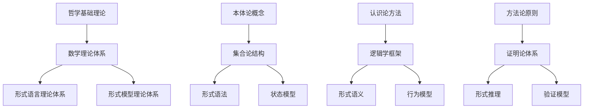
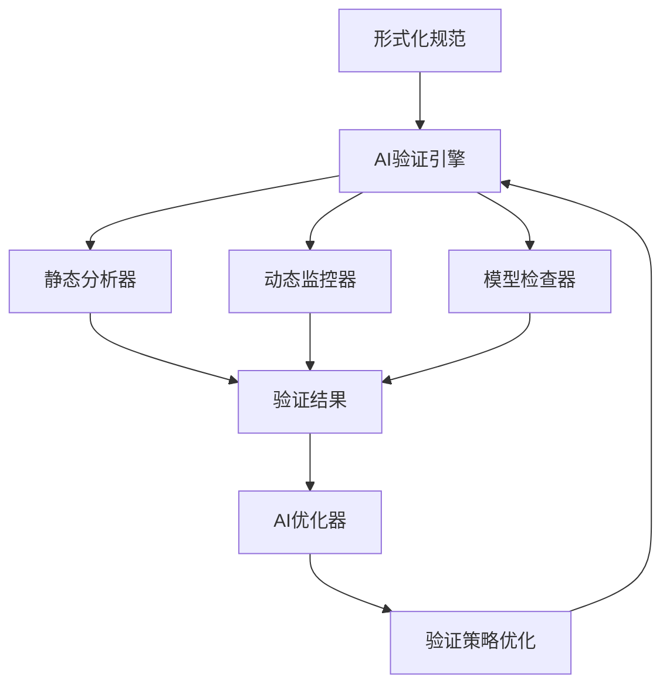

# 形式化架构理论整合框架深化版 (Enhanced Formal Architecture Theory Integration Framework)

## 概述

本深化版框架在原有理论整合框架基础上，进一步深化了跨理论体系的融合机制，建立了更完善的验证方法体系，并提出了理论到实践的智能化转换路径。

## 深化整合机制

### 1. 跨理论体系语义映射

#### 1.1 哲学-数学-形式化三层映射



#### 1.2 语义一致性保证

- **概念映射一致性**：确保跨层概念映射的语义等价性
- **推理规则一致性**：保证不同理论体系推理规则的一致性
- **验证结果一致性**：验证不同方法得到的结果一致性

### 2. 理论融合深度分析

#### 2.1 类型理论与分布式系统融合

**融合点分析**：

- **分布式类型安全**：将类型系统的静态安全保证扩展到分布式环境
- **位置感知类型**：类型系统能够表达组件的位置和网络拓扑信息
- **一致性类型**：类型系统能够表达分布式一致性的约束

**实现机制**：

```text
基础类型系统 → 位置感知类型 → 一致性类型 → 分布式类型安全
     ↓              ↓              ↓              ↓
  类型检查     位置验证      一致性验证      分布式验证
```

#### 2.2 Petri网与微服务架构融合

**融合点分析**：

- **服务编排建模**：使用Petri网建模微服务间的交互和编排
- **状态转换分析**：分析微服务状态转换的正确性和一致性
- **死锁检测**：检测微服务交互中可能出现的死锁情况

**实现机制**：

```text
微服务定义 → Petri网建模 → 状态空间分析 → 正确性验证
     ↓            ↓            ↓            ↓
  服务接口     网结构      可达性分析    性质验证
```

#### 2.3 时态逻辑与系统验证融合

**融合点分析**：

- **实时性质验证**：验证系统满足实时约束的性质
- **时序行为分析**：分析系统行为的时序特征
- **动态性质验证**：验证系统在运行过程中的动态性质

**实现机制**：

```text
系统模型 → 时态逻辑规范 → 模型检查 → 性质验证
     ↓            ↓            ↓          ↓
  状态转换     时序约束     状态搜索    结果分析
```

### 3. 智能化验证框架

#### 3.1 多层次验证策略

**静态验证层**：

- **语法验证**：形式语法正确性检查
- **类型验证**：类型系统安全性验证
- **语义验证**：程序语义一致性验证

**动态验证层**：

- **运行时验证**：程序运行时的行为验证
- **性能监控**：系统性能指标的实时监控
- **异常检测**：异常行为的自动检测和报告

**混合验证层**：

- **静态+动态**：结合静态分析和动态监控的综合验证
- **形式化+AI**：AI增强的形式化验证方法
- **理论+实践**：理论验证与实践验证的双重保证

#### 3.2 AI增强验证引擎

**智能验证策略**：

- **自适应验证**：根据系统特性自动选择最优验证策略
- **反例生成**：AI辅助的智能反例生成和优化
- **验证优化**：自动优化验证路径和策略

**验证工具整合**：



### 4. 工具链实现计划

#### 4.1 统一建模工具 (Unified Modeling Tool)

**核心功能**：

- **多理论建模**：支持多种形式化理论的统一建模
- **可视化编辑器**：直观的图形化建模界面
- **模型转换**：不同理论模型间的自动转换

**技术架构**：

```python
class UnifiedModelingTool:
    def __init__(self):
        self.theory_engines = {
            'petri_net': PetriNetEngine(),
            'state_machine': StateMachineEngine(),
            'temporal_logic': TemporalLogicEngine(),
            'type_system': TypeSystemEngine()
        }
        self.ai_enhancer = AIEnhancementEngine()
    
    def create_model(self, theory_type, specification):
        """创建指定理论的模型"""
        engine = self.theory_engines[theory_type]
        model = engine.create_model(specification)
        return self.ai_enhancer.optimize_model(model)
    
    def convert_model(self, source_model, target_theory):
        """模型转换"""
        return self.theory_engines[target_theory].convert_from(source_model)
```

#### 4.2 跨理论验证引擎 (Cross-Theory Verification Engine)

**核心功能**：

- **多理论验证**：支持多种理论的统一验证
- **一致性检查**：跨理论体系的一致性验证
- **性能优化**：智能化的验证性能优化

**实现架构**：

```python
class CrossTheoryVerificationEngine:
    def __init__(self):
        self.verifiers = {
            'syntax': SyntaxVerifier(),
            'semantics': SemanticsVerifier(),
            'types': TypeVerifier(),
            'temporal': TemporalVerifier()
        }
        self.consistency_checker = ConsistencyChecker()
    
    def verify_model(self, model, verification_spec):
        """综合验证模型"""
        results = {}
        for verifier_type, verifier in self.verifiers.items():
            if verifier_type in verification_spec:
                results[verifier_type] = verifier.verify(model)
        
        # 一致性检查
        consistency_result = self.consistency_checker.check(results)
        results['consistency'] = consistency_result
        
        return results
```

#### 4.3 智能化分析平台 (Intelligent Analysis Platform)

**核心功能**：

- **智能分析**：AI驱动的系统分析
- **模式识别**：自动识别设计模式和架构模式
- **优化建议**：基于分析的优化建议生成

**平台架构**：

```python
class IntelligentAnalysisPlatform:
    def __init__(self):
        self.pattern_recognizer = PatternRecognizer()
        self.optimization_advisor = OptimizationAdvisor()
        self.ai_analyzer = AIAnalyzer()
    
    def analyze_system(self, system_model):
        """综合分析系统"""
        # 模式识别
        patterns = self.pattern_recognizer.recognize(system_model)
        
        # AI分析
        ai_insights = self.ai_analyzer.analyze(system_model, patterns)
        
        # 优化建议
        recommendations = self.optimization_advisor.generate(
            system_model, patterns, ai_insights
        )
        
        return {
            'patterns': patterns,
            'ai_insights': ai_insights,
            'recommendations': recommendations
        }
```

### 5. 实践验证路线图

#### 5.1 原型系统开发 (当前阶段)

**开发目标**：

- 完成统一建模工具的核心功能
- 实现跨理论验证引擎的基础框架
- 构建智能化分析平台的原型

**时间计划**：

- **第1个月**：完成统一建模工具的基础架构
- **第2个月**：实现跨理论验证引擎核心功能
- **第3个月**：构建智能化分析平台原型
- **第4个月**：集成测试和性能优化

#### 5.2 真实项目验证 (下一阶段)

**验证目标**：

- 在真实项目中验证工具的有效性
- 收集用户反馈和性能数据
- 优化工具的用户体验和性能

**验证项目**：

- **微服务架构项目**：验证分布式系统建模和验证
- **实时系统项目**：验证时态逻辑和性能分析
- **大型软件系统**：验证复杂系统的综合分析和优化

#### 5.3 工业级应用 (长期目标)

**应用目标**：

- 在工业级项目中广泛应用
- 建立标准化的应用流程
- 形成完整的生态系统

**推广策略**：

- **开源发布**：将核心工具开源，促进社区发展
- **标准化**：参与相关标准的制定和推广
- **教育培训**：建立完整的培训和教育体系

### 6. 技术创新点

#### 6.1 AI与形式化方法的深度融合

- **智能归约**：AI辅助的理论归约和实现
- **自适应验证**：根据系统特性自动调整验证策略
- **智能优化**：AI驱动的系统优化和重构

#### 6.2 跨理论体系的统一框架

- **理论映射**：建立不同理论体系间的映射关系
- **一致性保证**：确保跨理论验证结果的一致性
- **综合验证**：多理论方法的综合应用

#### 6.3 理论与实践的双向验证

- **理论验证**：形式化方法的理论正确性验证
- **实践验证**：在实际项目中的有效性验证
- **反馈优化**：基于实践反馈的理论优化

### 7. 预期成果

#### 7.1 理论贡献

- **统一理论框架**：建立完整的形式化架构理论体系
- **跨域融合方法**：创新的理论整合机制
- **验证理论体系**：多层次的系统验证方法

#### 7.2 技术创新

- **AI增强的形式化工具**：智能化的建模和验证
- **统一开发环境**：集成多种理论工具
- **自动化代码生成**：从规范到实现的自动转换

#### 7.3 实践价值

- **软件质量提升**：更可靠、更安全的软件系统
- **开发效率改进**：自动化的设计和验证流程
- **教育培训优化**：系统化的理论学习路径

---

> 该深化版框架代表了形式化架构理论研究的新高度，为软件工程的理论化和智能化发展奠定了坚实基础。通过工具链的实现和实践验证，将理论成果转化为实际的生产力。
