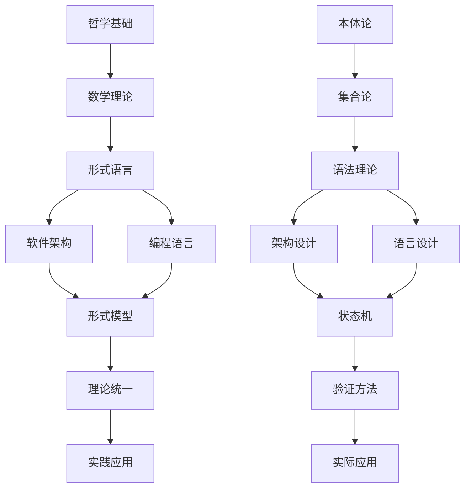

# 形式化架构理论体系

## 项目概述

本项目构建了一个完整的、形式化的软件架构理论体系，从哲学基础到实践应用，形成了层次化的知识结构。该体系以严格的数学基础为支撑，以现代软件工程实践为导向，为软件架构设计提供了理论指导和方法论支持。

## 核心特色

### 🔬 理论特色
- **形式化程度高**: 所有理论都有严格的数学定义和证明
- **层次结构清晰**: 从哲学基础到实践应用的完整体系
- **跨领域整合**: 建立了不同理论领域之间的关联
- **实践导向**: 紧密结合实际软件开发需求

### 💻 技术特色
- **Rust/Go实践**: 使用现代系统编程语言进行实践
- **开源组件**: 基于成熟的开源组件进行架构设计
- **形式验证**: 提供形式化验证方法和工具
- **持续集成**: 支持持续开发和维护

## 理论体系结构

### 1. 哲学基础理论 (01-哲学基础理论/)
- **本体论基础**: 存在、实体、属性、关系
- **认识论基础**: 知识、真理、证明、验证
- **方法论基础**: 形式化、抽象化、系统化
- **价值论基础**: 正确性、可靠性、效率性

### 2. 数学理论体系 (02-数学理论体系/)
- **集合论基础**: 集合、关系、函数、基数
- **逻辑学基础**: 命题、谓词、推理、证明
- **代数结构**: 群、环、域、模
- **拓扑学基础**: 空间、连续性、连通性
- **范畴论基础**: 对象、态射、函子、自然变换

### 3. 形式语言理论 (03-形式语言理论/)
- **形式语法理论**: 产生式、推导、语法树
- **语义学理论**: 指称语义、操作语义、公理语义
- **类型论基础**: 类型系统、类型检查、类型推导
- **证明论基础**: 证明系统、证明搜索、证明检查

### 4. 软件架构理论 (04-软件架构理论/)
- **架构设计原理**: 设计原则、架构模式、架构评估
- **组件化理论**: 组件设计、模块化、依赖管理
- **接口设计理论**: 接口规范、API设计、契约设计
- **架构模式理论**: 设计模式、架构模式、反模式

### 5. 编程语言理论 (05-编程语言理论/)
- **语言设计原理**: 语言原理、语法设计、语义设计
- **类型系统理论**: 类型理论、类型安全、类型推导
- **语义模型理论**: 语义定义、执行模型、内存模型
- **编译器理论**: 编译原理、代码生成、优化技术

### 6. 形式模型理论 (06-形式模型理论/)
- **状态机理论**: 有限状态机、自动机理论、状态转换
- **进程代数**: 进程理论、并发模型、通信协议
- **时序逻辑**: 线性时序逻辑、分支时序逻辑、时间建模
- **模型检测**: 检测算法、状态空间、反例生成

### 7. 理论统一与整合 (07-理论统一与整合/)
- **理论统一框架**: 理论整合、跨领域关联、形式化统一
- **跨领域整合**: 领域融合、理论映射、知识整合
- **形式化验证**: 验证方法、证明技术、工具支持
- **实践应用**: 应用框架、实施指南、最佳实践

### 8. 实践应用开发 (08-实践应用开发/)
- **Rust实践**: 系统编程、内存安全、并发编程
- **Go实践**: 并发模型、网络编程、微服务
- **架构实现**: 架构模式、组件设计、系统集成
- **案例分析**: 实际项目、问题解决、经验总结

### 9. 索引与导航系统 (09-索引与导航/)
- **总体索引**: 完整的目录结构导航和理论关联图
- **快速导航指南**: 多路径学习指南和按需查找功能
- **概念索引**: 按领域分类的概念查找系统
- **持续性上下文提醒**: 项目状态跟踪和中断恢复指南
- **主题索引**: 按主题分类的内容组织和学习路径

## 快速开始

### 新用户推荐路径
1. **[总体分析框架](./00-总体分析框架-v34.md)** - 了解整体理论体系
2. **[哲学基础理论](./01-哲学基础理论/)** - 建立理论基础
3. **[软件架构理论](./04-软件架构理论/)** - 学习架构设计
4. **[实践应用开发](./08-实践应用开发/)** - 动手实践

### 开发者推荐路径
1. **[编程语言理论](./05-编程语言理论/)** - 深入语言设计
2. **[形式模型理论](./06-形式模型理论/)** - 学习形式化建模
3. **[Rust实践](./08-实践应用开发/01-Rust实践.md)** - 系统编程实践
4. **[Go实践](./08-实践应用开发/02-Go实践.md)** - 并发编程实践

### 研究者推荐路径
1. **[数学理论体系](./02-数学理论体系/)** - 建立数学基础
2. **[形式语言理论](./03-形式语言理论/)** - 学习形式化方法
3. **[理论统一与整合](./07-理论统一与整合/)** - 探索理论整合
4. **[形式化验证](./07-理论统一与整合/03-形式化验证.md)** - 深入研究验证

## 导航系统

### 核心导航
- **[总体索引](./09-索引与导航/00-总体索引.md)** - 完整的理论体系导航
- **[快速导航指南](./09-索引与导航/01-快速导航指南.md)** - 便捷的查找和导航
- **[概念索引](./09-索引与导航/02-概念索引.md)** - 按概念分类的查找系统
- **[主题索引](./09-索引与导航/04-主题索引.md)** - 按主题分类的内容组织

### 项目状态
- **[项目总结报告](./项目总结报告.md)** - 项目完成情况总结
- **[进度跟踪](./进度跟踪-v38.md)** - 最新项目进度
- **[持续性上下文提醒](./09-索引与导航/03-持续性上下文提醒.md)** - 项目状态跟踪

## 理论关联图

## 质量保证

### 理论质量
- **形式化程度**: 所有理论都有严格的数学定义和证明
- **一致性**: 概念使用一致，符号规范统一
- **完整性**: 理论体系完整，不重复、不遗漏、不矛盾
- **相关性**: 建立了清晰的理论关联和层次结构

### 实践质量
- **代码示例**: 使用Rust和Go提供实际可运行的代码
- **架构设计**: 基于成熟的开源组件进行架构设计
- **形式验证**: 提供形式化验证方法和工具支持
- **最佳实践**: 结合实际项目经验总结最佳实践

## 项目价值

### 🎓 学术价值
1. **理论贡献**: 建立了完整的软件架构形式化理论体系
2. **方法创新**: 提出了跨领域理论整合的方法
3. **实践指导**: 为软件架构设计提供了理论指导

### 💼 实践价值
1. **开发指导**: 为软件开发提供了理论指导
2. **架构设计**: 为软件架构设计提供了方法论
3. **质量保证**: 为软件质量提供了形式化保证

### 🌍 社会价值
1. **知识传播**: 促进了软件工程知识的传播
2. **技术发展**: 推动了软件技术的发展
3. **人才培养**: 为人才培养提供了理论支持

## 技术栈

### 理论工具
- **数学**: LaTeX数学公式，支持复杂的数学表达式
- **图表**: Mermaid图表，可视化理论关联和流程
- **文档**: Markdown格式，支持结构化文档组织

### 实践工具
- **编程语言**: Rust, Go
- **架构模式**: 微服务、事件驱动、CQRS等
- **开源组件**: 基于成熟的开源生态系统

## 贡献指南

### 理论贡献
1. **概念定义**: 提供严格的形式化定义
2. **证明过程**: 给出完整的数学证明
3. **关联分析**: 建立与其他理论的关联

### 实践贡献
1. **代码示例**: 提供可运行的代码示例
2. **架构设计**: 展示实际的架构设计
3. **经验总结**: 分享实际项目经验

## 许可证

本项目采用开源许可证，欢迎学术界和工业界的研究者和开发者使用和贡献。

## 联系方式

如有问题或建议，请通过以下方式联系：
- 项目仓库: [GitHub Repository]
- 问题反馈: [Issues]
- 讨论交流: [Discussions]

---

**项目状态**: 理论体系构建完成，索引系统建立完成  
**最后更新**: 2024年  
**维护状态**: 活跃开发中
