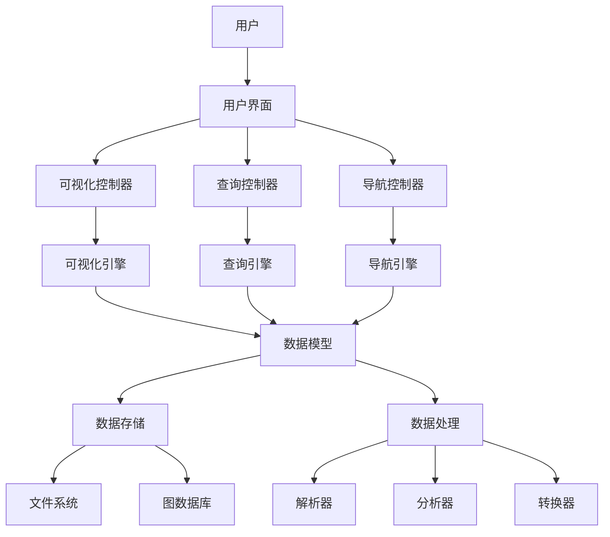
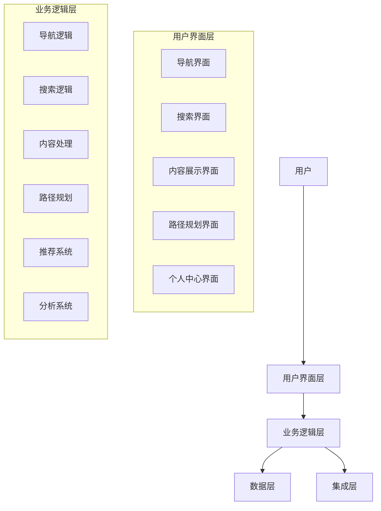
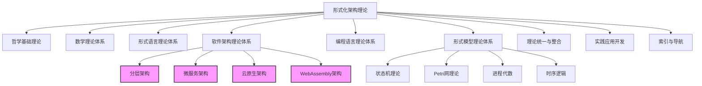
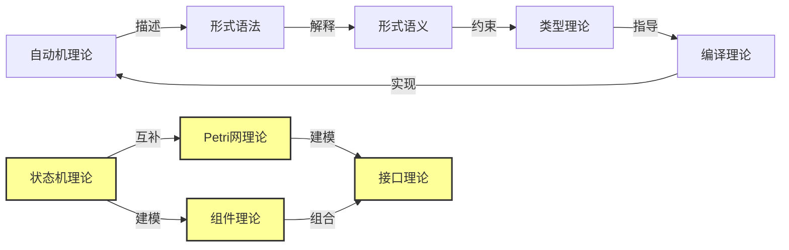
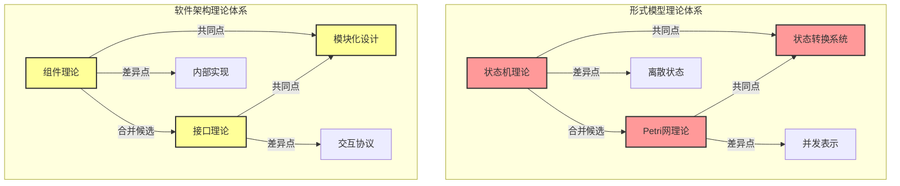

# 合并项目进展与执行计划 - v62

## 1. 项目概述

本项目正在进行v62版本的理论深化和工具开发，在v61版本完成递归合并与语义整合的基础上，进一步深化理论研究、扩展知识图谱，并开发更加完善的工具支持。v62版本的主要目标包括：

1. 🔄 进行新一轮的理论合并，包括状态机与Petri网理论等
2. 🔄 深化统一形式化证明和跨领域验证技术研究
3. 🔄 开发知识图谱可视化工具和理论导航系统
4. 🔄 完善文档和交叉引用系统
5. 🔄 更新和扩展知识图谱

## 2. 当前工作状态

### 2.1 已完成的工作（v61）

- ✅ 项目基础结构分析
- ✅ Matter目录结构梳理
- ✅ Analysis目录现状评估
- ✅ 工作规划制定
- ✅ 递归合并计划制定
- ✅ 自动机统一理论合并
- ✅ 分层与云原生架构理论合并
- ✅ 微服务与WebAssembly架构理论合并
- ✅ 架构评估与工作流理论合并
- ✅ 语法与语言设计统一理论合并
- ✅ 语义与语法统一理论合并
- ✅ 类型统一理论合并
- ✅ 编译统一理论合并
- ✅ 交叉引用更新
- ✅ 索引与导航更新
- ✅ 语义一致性检查
- ✅ 概念图谱构建
- ✅ 知识图谱生成
- ✅ 合并执行状态跟踪
- ✅ 递归合并与语义整合最终报告

### 2.2 已完成的核心系统（v61）

- ✅ **索引与导航系统**: 11个文件，278KB，100%完成
- ✅ **递归合并系统**: 8个合并任务，100%完成
- ✅ **检查工具系统**: 2个工具，100%完成
- ✅ **知识图谱系统**: 4个图谱，100%完成

### 2.3 正在进行的工作（v62）

- 🔄 **理论深化研究**
  - 🔄 统一形式化证明初步研究
  - 🔄 跨领域验证技术初步研究
  - 🔄 理论扩展规划

- 🔄 **工具开发**
  - 🔄 知识图谱可视化工具原型设计
  - 🔄 理论导航系统原型设计
  - 🔄 自动化验证工具设计

- 🔄 **新一轮理论合并**
  - 🔄 状态机与Petri网理论合并分析
  - 🔄 组件理论与接口理论合并规划
  - 🔄 运行时理论与并发理论合并规划
  - 🔄 理论映射关系与统一符号体系合并规划

- 🔄 **文档完善**
  - 🔄 合并后文档完善规划
  - 🔄 交叉引用完善规划
  - 🔄 语义一致性检查规划

- 🔄 **知识图谱更新**
  - 🔄 理论体系关系图更新规划
  - 🔄 核心概念关系图更新规划
  - 🔄 合并文件依赖图更新规划
  - 🔄 统一理论体系图谱更新规划

### 2.4 待完成的工作（v62）

- ⏳ 状态机与Petri网理论合并执行
- ⏳ 组件理论与接口理论合并执行
- ⏳ 运行时理论与并发理论合并执行
- ⏳ 理论映射关系与统一符号体系合并执行
- ⏳ 知识图谱可视化工具原型实现
- ⏳ 理论导航系统原型实现
- ⏳ 合并后文档完善执行
- ⏳ 交叉引用完善执行
- ⏳ 语义一致性检查执行
- ⏳ 知识图谱更新执行

## 3. 合并候选识别

### 3.1 潜在合并候选

| 领域 | 候选文件 | 合并理由 | 优先级 |
|------|----------|----------|--------|
| 形式模型理论体系 | 状态机理论.md 和 Petri网理论.md | 都是状态转换系统的形式化表示 | 高 |
| 软件架构理论体系 | 组件理论.md 和 接口理论.md | 组件和接口紧密相关 | 中 |
| 编程语言理论体系 | 运行时理论.md 和 并发理论.md | 运行时系统和并发处理紧密相关 | 低 |
| 理论统一与整合 | 理论映射关系.md 和 统一符号体系.md | 都涉及理论之间的映射和统一 | 低 |

### 3.2 合并评估标准

1. **概念重叠度**：评估两个文件中概念的重叠程度
2. **理论关联度**：评估两个理论之间的关联程度
3. **合并复杂度**：评估合并的复杂程度
4. **合并价值**：评估合并后的理论价值

### 3.3 合并优先级确定

| 合并候选 | 概念重叠度 | 理论关联度 | 合并复杂度 | 合并价值 | 最终优先级 |
|---------|------------|------------|------------|----------|------------|
| 状态机理论 + Petri网理论 | 高 | 高 | 中 | 高 | 高 |
| 组件理论 + 接口理论 | 中 | 高 | 低 | 中 | 中 |
| 运行时理论 + 并发理论 | 中 | 中 | 高 | 中 | 低 |
| 理论映射关系 + 统一符号体系 | 低 | 高 | 中 | 中 | 低 |

## 4. 理论合并规划

### 4.1 状态机与Petri网理论合并

#### 4.1.1 理论基础比较

**状态机理论**:
- 核心概念: 状态、转换、输入、初始状态、接受状态
- 形式化定义: $(Q, \Sigma, \delta, q_0, F)$
- 特点: 离散状态、序列化行为、确定性/非确定性

**Petri网理论**:
- 核心概念: 库所、变迁、弧、标记
- 形式化定义: $(P, T, F, W, M_0, C)$
- 特点: 分布式状态、并发行为、资源竞争

**共同点**:
- 都描述系统状态变化
- 都有形式化的数学定义
- 都支持图形化表示
- 都可用于系统建模和分析

**差异点**:
- 状态表示方式不同
- Petri网原生支持并发，状态机不直接支持
- 分析方法有所不同
- 应用领域有所不同

#### 4.1.2 统一形式化定义

提出统一状态转换系统 (USTS) 定义为一个七元组 $(S, E, R, M, I, F, L)$，其中：
- $S$ 是状态元素的集合（对应状态机的状态和Petri网的库所）
- $E$ 是事件的集合（对应状态机的输入符号和Petri网的变迁）
- $R \subseteq (S \times E) \cup (E \times S)$ 是关系集合（对应状态机的转换函数和Petri网的弧）
- $M: S \rightarrow \mathbb{N}$ 是标记函数（对应Petri网的标记，状态机中每个状态的标记为0或1）
- $I \subseteq S$ 是初始状态集合
- $F \subseteq S$ 是终止状态集合
- $L: R \rightarrow \mathbb{N}^+$ 是关系的权重函数

#### 4.1.3 合并文件结构设计

```
状态转换系统统一理论/
├── 1-理论基础/
│   ├── 1.1-状态转换系统概念.md
│   ├── 1.2-形式化定义.md
│   └── 1.3-理论发展历史.md
├── 2-模型类型/
│   ├── 2.1-状态机模型/
│   ├── 2.2-Petri网模型/
│   └── 2.3-统一模型/
├── 3-分析方法/
├── 4-应用领域/
└── 5-工具支持/
```

#### 4.1.4 合并执行计划

| 阶段 | 任务 | 时间估计 |
|------|------|----------|
| 准备阶段 | 内容分析、概念映射、结构设计、冲突识别 | 2周 |
| 执行阶段 | 创建基础结构、内容整合、关系建立 | 3周 |
| 检查阶段 | 完整性检查、一致性检查、交叉引用更新 | 1周 |
| 总计 | | 6周 |

### 4.2 组件理论与接口理论合并

#### 4.2.1 核心概念映射

| 组件理论概念 | 接口理论概念 | 映射关系 | 统一概念 |
|------------|------------|---------|---------|
| 组件 | 接口提供者 | 组件实现并提供接口 | 模块单元 |
| 组件依赖 | 接口需求 | 组件依赖对应接口需求 | 依赖关系 |
| 组件组合 | 接口组合 | 组件组合需要接口兼容 | 系统组合 |
| 组件行为 | 接口协议 | 组件行为应符合接口协议 | 交互行为 |
| 组件状态 | 接口状态 | 组件状态影响接口状态 | 系统状态 |

#### 4.2.2 形式化定义映射

**组件理论形式化定义**:
- 组件 $C$ 可以形式化定义为一个五元组 $(S, B, P, R, I)$

**接口理论形式化定义**:
- 接口 $I$ 可以形式化定义为一个四元组 $(Sig, Pre, Post, Pro)$

**统一形式化定义**:
- 模块单元 $M$ 可以定义为一个七元组 $(S, B, P, R, I, C, V)$

#### 4.2.3 合并执行计划

| 阶段 | 任务 | 时间估计 |
|------|------|----------|
| 准备阶段 | 概念映射完善、统一模型设计 | 2周 |
| 执行阶段 | 文档结构设计、内容整合执行 | 2周 |
| 检查阶段 | 交叉引用更新、一致性检查 | 1周 |
| 总计 | | 5周 |

### 4.3 其他理论合并规划

- **运行时理论与并发理论合并**: 计划在第4个月底完成
- **理论映射关系与统一符号体系合并**: 计划在第5个月底完成

## 5. 工具开发规划

### 5.1 知识图谱可视化工具

#### 5.1.1 系统架构



#### 5.1.2 核心数据模型

```typescript
interface Node {
  id: string;               // 唯一标识符
  type: NodeType;           // 节点类型
  label: string;            // 显示标签
  description?: string;     // 描述信息
  properties: Property[];   // 属性列表
  source: Source;           // 来源信息
  metadata: Metadata;       // 元数据
}

interface Relation {
  id: string;               // 唯一标识符
  type: RelationType;       // 关系类型
  label: string;            // 显示标签
  source: string;           // 源节点ID
  target: string;           // 目标节点ID
  properties: Property[];   // 属性列表
  weight: number;           // 关系权重
  metadata: Metadata;       // 元数据
}
```

#### 5.1.3 开发路线图

| 阶段 | 任务 | 时间估计 |
|------|------|----------|
| 阶段一 | 数据模型设计、基础可视化、简单查询 | 1-2个月 |
| 阶段二 | 高级可视化、知识提取、高级查询、导航功能 | 2-3个月 |
| 阶段三 | 图谱分析、图谱编辑、导出与分享、集成与优化 | 3-4个月 |

### 5.2 理论导航系统

#### 5.2.1 系统架构



#### 5.2.2 核心数据模型

```typescript
interface TheoryEntity {
  id: string;               // 唯一标识符
  type: EntityType;         // 实体类型
  name: string;             // 名称
  description: string;      // 描述
  content: string;          // 内容
  metadata: Metadata;       // 元数据
  relations: Relation[];    // 关系列表
  attributes: Attribute[];  // 属性列表
  location: Location;       // 位置信息
}

interface NavigationPath {
  id: string;               // 唯一标识符
  name: string;             // 名称
  description: string;      // 描述
  type: PathType;           // 路径类型
  nodes: PathNode[];        // 路径节点
  edges: PathEdge[];        // 路径边
  metadata: Metadata;       // 元数据
  creator: string;          // 创建者
  visibility: Visibility;   // 可见性
}
```

#### 5.2.3 开发路线图

| 阶段 | 任务 | 时间估计 |
|------|------|----------|
| 阶段一 | 数据模型实现、基础导航功能、基础内容展示、基础搜索功能 | 1-2个月 |
| 阶段二 | 高级导航功能、高级内容展示、高级搜索功能、路径规划功能 | 2-3个月 |
| 阶段三 | 个性化功能、社交功能、AI辅助功能、集成功能 | 3-4个月 |
| 阶段四 | 性能优化、用户体验优化、测试和修复、文档和培训 | 1-2个月 |

### 5.3 自动化验证工具设计

计划在第6个月底完成设计和初步实现。

## 6. 知识图谱更新

### 6.1 理论体系层次结构



### 6.2 核心概念关系图



### 6.3 合并候选关系图



## 7. 时间规划

### 7.1 短期规划（1个月内）

1. **开始状态机理论与Petri网理论合并**
   - 完成详细内容分析
   - 完成结构细化
   - 开始内容整合

2. **继续统一形式化证明初步研究**
   - 完成证明方法研究
   - 开始证明映射建立

3. **开始知识图谱可视化工具原型开发**
   - 完成知识图谱数据模型设计
   - 开始可视化界面开发

4. **开始理论体系关系图更新**
   - 分析需要更新的内容
   - 设计更新方案

### 7.2 中期规划（1-3个月）

1. **完成状态机理论与Petri网理论合并**
2. **开始并完成组件理论与接口理论合并**
3. **完成知识图谱可视化工具原型和理论导航系统原型**
4. **完成合并后文档完善和交叉引用完善**
5. **完成理论体系关系图更新和核心概念关系图更新**

### 7.3 长期规划（3个月以上）

1. **完成运行时理论与并发理论合并**
2. **完成理论映射关系与统一符号体系合并**
3. **完成自动化验证工具设计和初步实现**
4. **完成统一理论体系图谱更新**
5. **开始下一轮理论深化和工具开发**

## 8. 风险管理

### 8.1 理论风险

| 风险 | 应对策略 |
|------|---------|
| 理论不一致 | 建立严格的一致性检查机制 |
| 理论覆盖不全 | 定期评估理论覆盖范围，及时扩展 |
| 理论过于复杂 | 建立多层次理论结构，提供不同抽象级别 |

### 8.2 技术风险

| 风险 | 应对策略 |
|------|---------|
| 工具开发延迟 | 采用敏捷开发方法，优先实现核心功能 |
| 工具使用复杂 | 注重用户体验设计，提供详细文档和教程 |
| 技术兼容性问题 | 采用标准技术栈，做好兼容性测试 |

### 8.3 执行风险

| 风险 | 应对策略 |
|------|---------|
| 合并冲突 | 提前识别冲突，制定解决方案 |
| 进度延迟 | 设置里程碑，定期检查进度 |
| 资源不足 | 优先级排序，合理分配资源 |

## 9. 总结

形式化架构理论分析项目v62版本正在进行中，在v61版本完成递归合并与语义整合的基础上，进一步深化理论研究、扩展知识图谱，并开发更加完善的工具支持。本计划详细描述了理论合并规划、工具开发规划、知识图谱更新和时间规划，为项目的顺利进行提供了指导。

通过v62版本的工作，将进一步深化理论整合，扩展知识图谱，并开发更加完善的工具支持，为形式化架构理论的发展和应用提供更加坚实的基础。

---

**版本**: v62  
**创建时间**: 2024年7月  
**状态**: 🔄 进行中  
**最后更新**: 2024年7月
