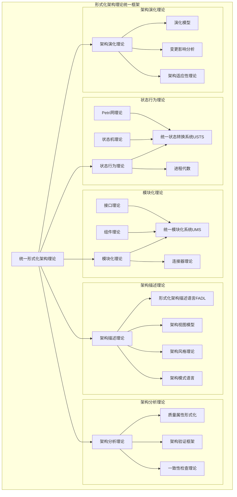
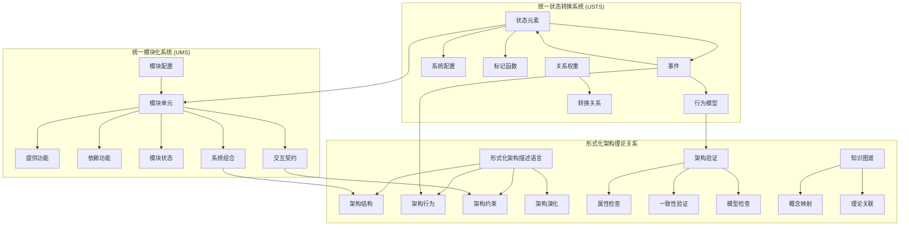
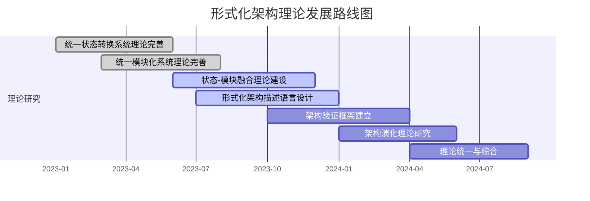
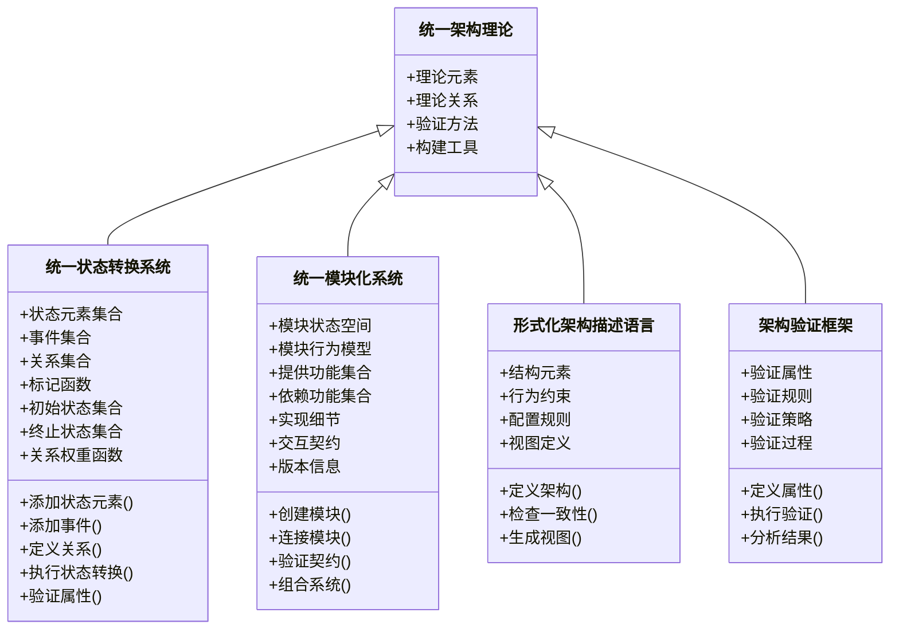
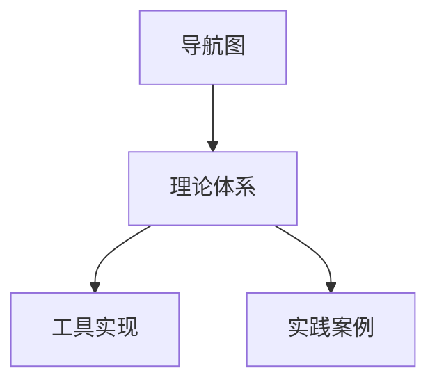

# 形式化架构理论导航图

[返回主题树](00-主题树与内容索引.md) | [主计划文档](00-形式化架构理论统一计划.md) | [相关计划](递归合并计划.md)

> 本文档为内容导航与结构索引，所有最新进展与结论以主计划文档为准，历史细节归档于archive/。

## 1. 概述

本导航图提供形式化架构理论体系的整体视图，帮助研究者、架构师和开发者理解各理论分支之间的关系、主要知识点及其关联，并指引如何利用这些理论解决实际问题。

## 2. 核心理论体系

形式化架构理论体系由以下主要分支构成：

1. **状态行为理论** - 建模系统状态与动态行为
2. **模块化理论** - 研究系统组件化与构成
3. **架构描述理论** - 形式化描述架构结构与约束
4. **架构分析理论** - 验证与评估架构属性
5. **架构演化理论** - 研究架构变更与演进

各分支关系及子理论详见下图:

## 3. 理论关键知识点索引

### 3.1 统一状态转换系统理论 (USTS)

| 知识点 | 简述 | 相关文档 |
|-------|------|---------|
| 状态元素 | USTS中的基本状态单位，对应状态机状态或Petri网库所 | [统一状态转换系统理论-概念映射.md](统一状态转换系统理论-概念映射.md#2-核心概念映射表) |
| 事件 | 触发状态变化的条件，对应状态机输入符号或Petri网变迁 | [统一状态转换系统理论-概念映射.md](统一状态转换系统理论-概念映射.md#2-核心概念映射表) |
| 系统配置 | 系统在特定时间点的整体状态 | [统一状态转换系统理论-概念映射.md](统一状态转换系统理论-概念映射.md#3-形式化表示映射) |
| 转换关系 | 定义事件如何改变状态 | [统一状态转换系统理论-概念映射.md](统一状态转换系统理论-概念映射.md#4-语义映射) |
| 并发语义 | 描述多个事件如何并发执行 | [统一状态转换系统理论-概念映射.md](统一状态转换系统理论-概念映射.md#4.2-并发语义) |
| 分析方法 | USTS的形式化分析技术 | [统一状态转换系统理论-概念映射.md](统一状态转换系统理论-概念映射.md#5.2-分析方法) |

### 3.2 统一模块化系统理论 (UMS)

| 知识点 | 简述 | 相关文档 |
|-------|------|---------|
| 模块单元 | UMS的基本构建单位，集成组件和接口概念 | [统一模块化系统理论-概念映射.md](统一模块化系统理论-概念映射.md#2-核心概念映射表) |
| 模块状态 | 模块内部状态空间 | [统一模块化系统理论-概念映射.md](统一模块化系统理论-概念映射.md#3-形式化表示映射) |
| 交互行为 | 模块如何响应事件和请求 | [统一模块化系统理论-概念映射.md](统一模块化系统理论-概念映射.md#4.1-交互语义) |
| 模块契约 | 定义模块提供和请求的保证 | [统一模块化系统理论-概念映射.md](统一模块化系统理论-概念映射.md#4.2-契约语义) |
| 系统组合 | 如何将多个模块组合成更大系统 | [统一模块化系统理论-概念映射.md](统一模块化系统理论-概念映射.md#5.2-系统集成特性) |
| 替换兼容性 | 模块替换的条件和保障机制 | [统一模块化系统理论-概念映射.md](统一模块化系统理论-概念映射.md#2-核心概念映射表) |

### 3.3 形式化架构描述语言 (FADL)

| 知识点 | 简述 | 相关文档 |
|-------|------|---------|
| 架构结构元素 | 描述系统结构的基本单位 | [形式化架构理论统一计划-v64.md](形式化架构理论统一计划-v64.md#4-架构描述语言) |
| 架构行为约束 | 对系统行为的形式化约束 | [形式化架构理论统一计划-v64.md](形式化架构理论统一计划-v64.md#4-架构描述语言) |
| 架构风格 | 特定领域架构模式的形式化描述 | [形式化架构理论统一计划-v64.md](形式化架构理论统一计划-v64.md#4-架构描述语言) |
| 架构视图 | 不同视角的架构表示 | [形式化架构理论统一计划-v64.md](形式化架构理论统一计划-v64.md#4-架构描述语言) |
| 架构决策 | 形式化表达架构决策及其理由 | [形式化架构理论统一计划-v64.md](形式化架构理论统一计划-v64.md#4-架构描述语言) |

### 3.4 架构验证理论

| 知识点 | 简述 | 相关文档 |
|-------|------|---------|
| 一致性检查 | 验证架构描述内部一致性 | [形式化架构理论统一计划-v64.md](形式化架构理论统一计划-v64.md#5.1-架构验证) |
| 属性验证 | 验证架构是否满足特定属性 | [形式化架构理论统一计划-v64.md](形式化架构理论统一计划-v64.md#5.2-质量属性) |
| 模型检查 | 自动验证系统状态空间 | [形式化架构理论统一计划-v64.md](形式化架构理论统一计划-v64.md#5.1-架构验证) |
| 定理证明 | 基于逻辑演算的架构验证 | [形式化架构理论统一计划-v64.md](形式化架构理论统一计划-v64.md#5.1-架构验证) |

### 3.5 架构演化理论

| 知识点 | 简述 | 相关文档 |
|-------|------|---------|
| 演化模型 | 描述架构如何随时间演变 | [形式化架构理论统一计划-v64.md](形式化架构理论统一计划-v64.md#6-架构演化) |
| 变更影响 | 分析架构变更的连锁影响 | [形式化架构理论统一计划-v64.md](形式化架构理论统一计划-v64.md#6-架构演化) |
| 演化规则 | 指导架构演化的形式化规则 | [形式化架构理论统一计划-v64.md](形式化架构理论统一计划-v64.md#6-架构演化) |
| 版本兼容性 | 确保架构版本间的兼容性 | [形式化架构理论统一计划-v64.md](形式化架构理论统一计划-v64.md#6-架构演化) |

## 4. 理论整合关系

不同理论分支之间存在深度整合关系。下图展示了核心概念如何跨理论连接：

## 5. 理论应用路径

根据不同的架构问题，可选择合适的理论应用路径：

### 5.1 架构设计路径

1. 使用**统一模块化系统理论**定义系统模块结构
2. 应用**统一状态转换系统理论**描述模块行为
3. 使用**形式化架构描述语言**表达整体架构
4. 采用**架构验证理论**验证架构属性
5. 应用**架构演化理论**规划未来演进

### 5.2 系统分析路径

1. 使用**形式化架构描述语言**建立现有系统模型
2. 应用**统一状态转换系统理论**分析系统行为
3. 使用**架构验证理论**评估系统属性
4. 应用**统一模块化系统理论**分析模块关系
5. 采用**架构演化理论**识别改进机会

### 5.3 理论研究路径

1. 研究**统一状态转换系统**与**统一模块化系统**的融合
2. 扩展**形式化架构描述语言**支持新领域特性
3. 增强**架构验证理论**的分析能力
4. 深化**架构演化理论**的预测模型
5. 构建跨理论的统一形式语义

## 6. 工具支持

形式化架构理论的应用需要工具支持，主要工具包括：

1. **可视化建模工具** - 支持理论的图形化表达
2. **形式化验证工具** - 提供属性验证和一致性检查
3. **代码生成工具** - 将形式化描述转换为实现代码
4. **知识导航工具** - 支持理论知识的检索和关联
5. **协同设计工具** - 支持多人协作的架构设计

详细的工具需求，请参考[形式化架构理论-可视化工具需求规格说明.md](形式化架构理论-可视化工具需求规格说明.md)。

## 7. 理论发展路线

形式化架构理论的发展遵循以下路线图：

## 8. 参考模型

形式化架构理论体系基于以下核心模型：

## 9. 如何使用本导航图

1. **初学者**: 从第2节开始，了解整体理论框架，然后深入感兴趣的分支
2. **研究者**: 使用第3节的知识点索引查找特定概念，通过第4节了解跨理论整合
3. **实践者**: 参考第5节的应用路径，根据具体问题选择合适的理论组合
4. **工具开发者**: 参考第6节的工具需求，开发支持形式化架构理论的工具
5. **理论贡献者**: 根据第7节的发展路线，识别可贡献的研究方向

通过本导航图，可以更好地理解、应用和扩展形式化架构理论体系，推动理论研究和实践应用的深入发展。

## 【理论映射关系表】

| 源理论 | 目标理论 | 映射方式 | 应用场景 |
|---|---|---|---|
| 导航图 | 理论体系 | 路径-主题映射 | 知识导航 |
| 理论体系 | 工具实现 | 理论-实现映射 | 工程应用 |
| 理论体系 | 实践案例 | 理论-案例映射 | 实践指导 |

## Mermaid可视化代码

## 国际对比与批判

- 本导航图方法与国际主流知识导航与可视化体系（如Wikidata Graph Navigator、ACM/IEEE导航系统等）相比，强调理论体系与工程实现的紧密结合，突出知识导航与实践指导。
- 优势：结构清晰、理论与实践结合紧密。
- 不足：与部分国际导航体系的互操作性和开放性有待提升。
- 建议：加强与国际知识导航标准的对接，提升全球互操作性。
