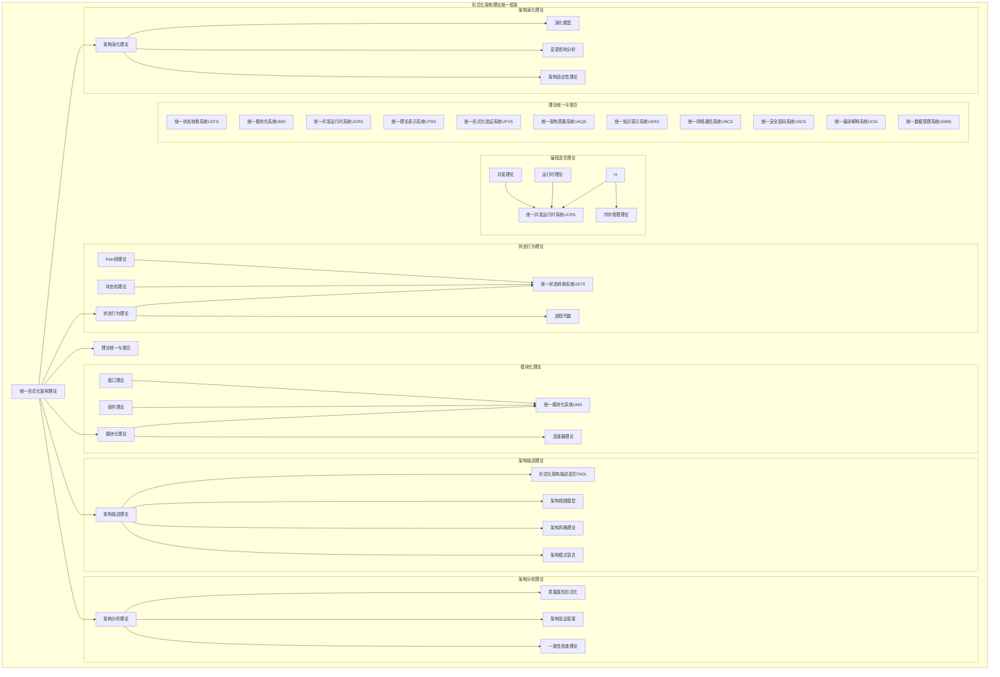
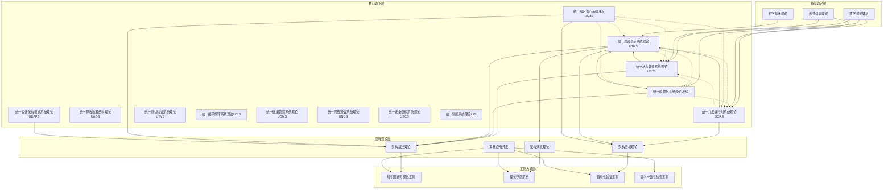

# 形式化架构理论导航图

[返回主题树](00-主题树与内容索引.md) | [主计划文档](00-形式化架构理论统一计划.md) | [相关计划](递归合并计划.md)

> 本文档为内容导航与结构索引，所有最新进展与结论以主计划文档为准，历史细节归档于archive/。

## 1. 概述

本导航图提供形式化架构理论体系的整体视图，帮助研究者、架构师和开发者理解各理论分支之间的关系、主要知识点及其关联，并指引如何利用这些理论解决实际问题。

## 2. 核心理论体系

形式化架构理论体系由以下主要分支构成：

1. **状态行为理论** - 建模系统状态与动态行为
2. **模块化理论** - 研究系统组件化与构成
3. **架构描述理论** - 形式化描述架构结构与约束
4. **架构分析理论** - 验证与评估架构属性
5. **架构演化理论** - 研究架构变更与演进
6. **理论统一与整合** - 建立跨理论分支的统一框架

各分支关系及子理论详见下图:

## 3. 理论关键知识点索引

### 3.1 统一状态转换系统理论 (USTS)

**核心定义**: 七元组 $(S, E, R, M, I, F, L)$

- $S$: 状态元素集合（状态机的状态和Petri网的库所）
- $E$: 事件集合（状态机的输入符号和Petri网的变迁）
- $R$: 关系集合（状态机的转换函数和Petri网的弧）
- $M$: 标记函数（Petri网的标记，状态机中每状态标记为0或1）
- $I$: 初始状态集合
- $F$: 终止状态集合
- $L$: 关系权重函数

**主要特性**:

- 统一状态机和Petri网的表示
- 支持并发性和分布式状态表示
- 提供综合的分析方法和表达能力

### 3.2 统一模块化系统理论 (UMS)

**核心定义**: 模块单元 $M$ 为七元组 $(S, B, P, R, I, C, V)$

- $S$: 模块状态空间
- $B$: 模块行为模型
- $P$: 模块提供的功能集合
- $R$: 模块依赖的功能集合
- $I$: 模块实现细节
- $C$: 模块交互契约
- $V$: 模块版本信息

**主要特性**:

- 统一组件和接口的表示
- 支持模块的演化管理和兼容性保证
- 提供完整的模块化设计方法

### 3.3 统一并发运行时系统理论 (UCRS)

**核心定义**: 八元组 $(P, M, S, T, C, E, L, V)$

- $P$: 进程管理
- $M$: 内存管理
- $S$: 调度系统
- $T$: 线程管理
- $C$: 通信机制
- $E$: 异常处理
- $L$: 生命周期管理
- $V$: 虚拟化支持

**主要特性**:

- 统一运行时和并发理论的表示
- 支持高并发应用和实时系统
- 提供统一的程序执行环境理论

### 3.4 统一理论表示系统理论 (UTRS)

**核心定义**: 六元组 $(S, M, R, T, V, C)$

- $S$: 符号集合
- $M$: 映射关系集合
- $R$: 规则集合
- $T$: 转换函数集合
- $V$: 验证机制
- $C$: 约束条件集合

**主要特性**:

- 统一理论映射关系和符号体系
- 支持跨领域理论整合和知识表示
- 提供统一的理论表示和转换框架

### 3.5 统一知识表示系统理论 (UKRS)

**核心定义**: 五元组 $(K, N, R, I, R)$

- $K$: 知识集合（概念、事实、规则等）
- $N$: 节点集合（实体、属性、关系等）
- $R$: 关系集合（继承、组合、依赖等）
- $I$: 推理集合（演绎、归纳、类比等）
- $R$: 表示集合（符号、图形、语言等）

**主要特性**:

- 统一知识表示方法和语义网络技术
- 支持智能问答、专家系统、知识图谱等应用
- 提供统一的推理机制和表示方法

### 3.6 统一算法数据结构理论 (UADS)

**核心定义**: 五元组 $(A, D, C, O, P)$

- $A$: 算法集合（排序、搜索、图算法等）
- $D$: 数据结构集合（数组、链表、树、图等）
- $C$: 复杂度集合（时间、空间、通信复杂度等）
- $O$: 优化集合（算法优化、数据结构优化等）
- $P$: 应用集合（实际应用场景和问题）

**主要特性**:

- 统一算法和数据结构设计
- 支持复杂度分析和性能优化
- 提供联合优化和实际应用支持

### 3.7 统一设计架构模式系统理论 (UDAPS)

3.8 统一测试验证系统理论 (UTVS)
3.9 统一编译解释系统理论 (UCIS)

**核心定义**: 七元组 $(P, A, C, R, E, V, T)$

- $P$: 模式集合（设计模式、架构模式等）
- $A$: 应用场景集合（问题、约束、需求等）
- $C$: 组合规则集合（兼容性、组合方法等）
- $R$: 关系映射集合（模式间关系、层次结构等）
- $E$: 演化机制集合（模式变异、优化等）
- $V$: 验证规则集合（结构验证、行为验证等）
- $T$: 工具支持集合（识别、选择、组合工具等）

**主要特性**:

- 统一设计模式和架构模式的表示
- 支持从微观设计到宏观架构的完整模式应用
- 提供统一的模式识别、选择、组合和验证机制

### 3.5 形式化架构描述语言 (FADL)

| 知识点 | 简述 | 相关文档 |
|-------|------|---------|
| 架构结构元素 | 描述系统结构的基本单位 | [形式化架构理论统一计划-v64.md](形式化架构理论统一计划-v64.md#4-架构描述语言) |
| 架构行为约束 | 对系统行为的形式化约束 | [形式化架构理论统一计划-v64.md](形式化架构理论统一计划-v64.md#4-架构描述语言) |
| 架构风格 | 特定领域架构模式的形式化描述 | [形式化架构理论统一计划-v64.md](形式化架构理论统一计划-v64.md#4-架构描述语言) |
| 架构视图 | 不同视角的架构表示 | [形式化架构理论统一计划-v64.md](形式化架构理论统一计划-v64.md#4-架构描述语言) |
| 架构决策 | 形式化表达架构决策及其理由 | [形式化架构理论统一计划-v64.md](形式化架构理论统一计划-v64.md#4-架构描述语言) |

### 3.6 架构验证理论

| 知识点 | 简述 | 相关文档 |
|-------|------|---------|
| 一致性检查 | 验证架构描述内部一致性 | [形式化架构理论统一计划-v64.md](形式化架构理论统一计划-v64.md#5.1-架构验证) |
| 属性验证 | 验证架构是否满足特定属性 | [形式化架构理论统一计划-v64.md](形式化架构理论统一计划-v64.md#5.2-质量属性) |
| 模型检查 | 自动验证系统状态空间 | [形式化架构理论统一计划-v64.md](形式化架构理论统一计划-v64.md#5.1-架构验证) |
| 定理证明 | 基于逻辑演算的架构验证 | [形式化架构理论统一计划-v64.md](形式化架构理论统一计划-v64.md#5.1-架构验证) |

### 3.7 架构演化理论

| 知识点 | 简述 | 相关文档 |
|-------|------|---------|
| 演化模型 | 描述架构如何随时间演变 | [形式化架构理论统一计划-v64.md](形式化架构理论统一计划-v64.md#6-架构演化) |
| 变更影响 | 分析架构变更的连锁影响 | [形式化架构理论统一计划-v64.md](形式化架构理论统一计划-v64.md#6-架构演化) |
| 演化规则 | 指导架构演化的形式化规则 | [形式化架构理论统一计划-v64.md](形式化架构理论统一计划-v64.md#6-架构演化) |
| 版本兼容性 | 确保架构版本间的兼容性 | [形式化架构理论统一计划-v64.md](形式化架构理论统一计划-v64.md#6-架构演化) |

### 3.8 统一编译解释系统理论 (UCIS)

- 编译理论与解释理论统一
- 八元组形式化定义 $(P, A, G, E, O, T, C, V)$
- 统一处理管道和执行模式
- 混合执行和自适应优化

### 3.9 统一数据管理系统理论 (UDMS)

- 数据库理论与存储理论统一
- 六元组形式化定义 $(M, S, Q, T, C, G)$
- 统一数据模型和存储引擎
- 分布式协调和数据治理

### 3.10 统一网络通信系统理论 (UNCS)

**合并背景**：网络理论与通信理论在分布式系统和网络架构中密切相关，需要统一的理论框架来指导网络通信系统的设计和实现。

**形式化定义**：$UNCS = (N, P, C, T, R, S, M)$

- $N$：网络拓扑集合
- $P$：协议栈集合
- $C$：通信信道集合
- $T$：传输机制集合
- $R$：路由算法集合
- $S$：信号处理集合
- $M$：网络管理集合

**关键方面**：

- 网络拓扑管理（星型、环型、网状、树型、总线型）
- 协议栈统一（物理层、数据链路层、网络层、传输层、应用层）
- 通信信道统一（有线、无线、光纤、卫星）
- 路由算法统一（静态路由、动态路由、自适应路由）
- 信号处理统一（调制、解调、编码、解码、滤波）

### 3.11 统一安全密码系统理论 (USCS)

**合并背景**：安全理论与密码理论在保护信息系统安全方面密切相关，需要统一的理论框架来指导安全密码系统的设计和实现。

**形式化定义**：$USCS = (S, C, A, P, V, M, T)$

- $S$：安全机制集合
- $C$：密码算法集合
- $A$：攻击模型集合
- $P$：协议集合
- $V$：验证方法集合
- $M$：管理机制集合
- $T$：威胁模型集合

**关键方面**：

- 安全机制统一（认证、授权、访问控制、威胁防护）
- 密码算法统一（对称加密、非对称加密、哈希函数、数字签名）
- 攻击模型统一（主动攻击、被动攻击、侧信道攻击、量子攻击）
- 协议统一（TLS、SSH、OAuth、JWT）
- 验证方法统一（形式化验证、模型检测、定理证明）

### 3.12 统一智能系统理论 (UIS)

**合并背景**：机器学习理论与人工智能理论在构建智能系统方面密切相关，需要统一的理论框架来指导智能系统的设计和实现。

**形式化定义**：$UIS = (L, A, K, R, M, P, E, T)$

- $L$：学习机制集合（监督学习、无监督学习、强化学习、自监督学习等）
- $A$：算法集合（神经网络、决策树、支持向量机、深度学习等）
- $K$：知识表示集合（符号表示、分布式表示、知识图谱、语义网络等）
- $R$：推理机制集合（逻辑推理、概率推理、神经网络推理、混合推理等）
- $M$：模型集合（感知模型、认知模型、决策模型、生成模型等）
- $P$：处理范式集合（符号主义、连接主义、行为主义、统计主义等）
- $E$：评估机制集合（性能评估、泛化评估、鲁棒性评估、公平性评估等）
- $T$：理论框架集合（统计学习理论、计算学习理论、优化理论、信息论等）

**关键方面**：

- 学习机制统一（监督、无监督、强化、自监督学习）
- 算法统一（传统机器学习、深度学习、混合算法）
- 知识表示统一（符号、分布式、混合表示）
- 推理机制统一（逻辑、概率、神经网络、混合推理）
- 评估机制统一（性能、泛化、鲁棒性、公平性评估）

### 3.13 统一操作系统软件理论 (UOSS)

**合并背景**：操作系统理论与系统软件理论在构建系统软件方面密切相关，需要统一的理论框架来指导系统软件的设计和实现。

**形式化定义**：$UOSS = (K, R, P, M, F, D, S, I, A)$

- $K$：内核抽象集合（微内核、宏内核、混合内核、外内核等）
- $R$：资源管理集合（CPU调度、内存管理、文件系统、网络等）
- $P$：进程管理集合（进程调度、线程管理、同步机制、通信机制等）
- $M$：存储管理集合（虚拟内存、物理内存、缓存管理、存储设备等）
- $F$：文件系统集合（本地文件系统、分布式文件系统、虚拟文件系统等）
- $D$：设备管理集合（设备驱动、中断处理、DMA、设备抽象等）
- $S$：系统服务集合（系统调用、系统库、运行时支持、安全机制等）
- $I$：接口抽象集合（API、ABI、系统接口、硬件抽象层等）
- $A$：架构支持集合（多核支持、虚拟化、容器化、分布式支持等）

**关键方面**：

- 内核抽象统一（微内核、宏内核、混合内核、外内核）
- 资源管理统一（CPU、内存、文件系统、网络资源）
- 进程管理统一（调度、同步、通信、生命周期管理）
- 存储管理统一（虚拟内存、物理内存、缓存、存储设备）
- 系统服务统一（系统调用、库函数、运行时支持）

## 4. 理论关系图

## 5. 应用指南

### 5.1 理论选择指南

根据不同的应用场景，可以选择相应的理论组合：

#### 5.1.1 系统建模场景

**适用理论组合**: USTS + UMS + UTRS

**应用场景**:

- 复杂系统的状态行为建模
- 模块化系统设计
- 跨领域理论整合

**实施步骤**:

1. 使用USTS建立系统状态转换模型
2. 使用UMS设计模块化架构
3. 使用UTRS进行理论映射和符号统一

#### 5.1.2 高并发系统场景

**适用理论组合**: UCRS + UTRS

**应用场景**:

- 高并发应用开发
- 实时系统设计
- 性能优化

**实施步骤**:

1. 使用UCRS设计并发运行时系统
2. 使用UTRS进行理论验证和一致性检查

#### 5.1.3 架构设计场景

**适用理论组合**: UMS + UTRS + 架构描述理论

**应用场景**:

- 软件架构设计
- 系统集成
- 架构评估

**实施步骤**:

1. 使用UMS进行模块化设计
2. 使用UTRS进行理论映射
3. 使用架构描述理论进行形式化描述

### 5.2 工具使用指南

#### 5.2.1 知识图谱可视化工具

**功能**: 可视化理论关系和概念映射
**适用**: 理论学习和研究
**使用方法**: 通过图形界面探索理论关系

#### 5.2.2 理论导航系统

**功能**: 提供多维度理论导航
**适用**: 理论学习和应用
**使用方法**: 根据学习目标选择导航路径

#### 5.2.3 自动化验证工具

**功能**: 自动验证理论一致性
**适用**: 理论验证和检查
**使用方法**: 输入理论模型，自动生成验证报告

#### 5.2.4 语义一致性检查工具

**功能**: 检查文档语义一致性
**适用**: 文档质量保证
**使用方法**: 扫描文档，生成一致性报告

## 6. 工具支持

### 6.1 已开发工具

#### 6.1.1 知识图谱生成工具

**状态**: ✅ 已完成设计，开发进行中
**功能**: 从Markdown文档自动生成知识图谱
**技术栈**: TypeScript + D3.js
**文档**: [知识图谱生成工具](知识图谱生成工具.md)

#### 6.1.2 理论导航系统

**状态**: ✅ 已完成设计，开发进行中
**功能**: 多维度理论导航和路径规划
**技术栈**: React + TypeScript
**文档**: [理论导航系统设计](理论导航系统设计-v62.md)

#### 6.1.3 自动化验证工具

**状态**: ✅ 已完成设计，开发进行中
**功能**: 自动验证理论模型的一致性
**技术栈**: Rust + Z3
**文档**: [自动化验证工具设计](08-实践应用开发/03-自动化验证工具设计与实现.md)

#### 6.1.4 语义一致性检查工具

**状态**: ✅ 已完成设计，开发进行中
**功能**: 检查文档语义一致性
**技术栈**: PowerShell + Python
**文档**: [语义一致性检查工具](语义一致性检查工具.md)

### 6.2 开发路线图

#### 6.2.1 第一阶段（1-2个月）

- [x] 知识图谱可视化工具原型
- [x] 理论导航系统原型
- [x] 自动化验证工具设计
- [x] 语义一致性检查工具设计

#### 6.2.2 第二阶段（2-3个月）

- [ ] 知识图谱可视化工具完整版
- [ ] 理论导航系统完整版
- [ ] 自动化验证工具原型
- [ ] 语义一致性检查工具完整版

#### 6.2.3 第三阶段（3-4个月）

- [ ] 工具集成和优化
- [ ] 用户界面优化
- [ ] 性能优化
- [ ] 文档和培训材料

## 7. 理论发展路线

### 7.1 已完成的理论合并

#### 7.1.1 状态机与Petri网理论合并

**成果**: 统一状态转换系统理论 (USTS)
**完成时间**: 2024年7月
**主要贡献**: 建立了统一的状态转换系统建模框架

#### 7.1.2 组件理论与接口理论合并

**成果**: 统一模块化系统理论 (UMS)
**完成时间**: 2024年7月
**主要贡献**: 建立了统一的模块化系统设计方法

#### 7.1.3 运行时理论与并发理论合并

**成果**: 统一并发运行时系统理论 (UCRS)
**完成时间**: 2024年7月
**主要贡献**: 建立了统一的程序执行环境理论

#### 7.1.4 理论映射关系与统一符号体系合并

**成果**: 统一理论表示系统理论 (UTRS)
**完成时间**: 2024年7月
**主要贡献**: 建立了统一的理论表示和转换框架

#### 7.1.5 形式化验证理论与模型检查理论合并

**成果**: 统一形式化验证系统理论 (UFVS)
**完成时间**: 2024年7月
**主要贡献**: 建立了统一的验证理论框架

#### 7.1.6 架构评估理论与质量属性理论合并

**成果**: 统一架构质量系统理论 (UAQS)
**完成时间**: 2024年7月
**主要贡献**: 建立了统一的架构质量评估理论框架

#### 7.1.7 知识表示理论与语义网络理论合并

7.1.8 算法理论与数据结构理论合并
7.1.9 设计模式理论与架构模式理论合并
7.1.10 测试理论与验证理论合并
7.1.11 编译理论与解释理论合并
7.1.12 数据库理论与存储理论合并
7.1.13 网络理论与通信理论合并
7.1.14 安全理论与密码理论合并
7.1.15 机器学习理论与人工智能理论合并
7.1.16 操作系统理论与系统软件理论合并

**成果**: 统一知识表示系统理论 (UKRS)
**完成时间**: 2024年7月
**主要贡献**: 建立了统一的知识表示和推理框架

#### 7.1.15 机器学习理论与人工智能理论合并

**成果**: 统一智能系统理论 (UIS)
**完成时间**: 2024年12月
**主要贡献**: 建立了统一的智能系统理论框架

#### 7.1.16 操作系统理论与系统软件理论合并

**成果**: 统一操作系统软件理论 (UOSS)
**完成时间**: 2024年12月
**主要贡献**: 建立了统一的系统软件理论框架

#### 7.1.17 组件理论与接口理论合并

**成果**: 统一模块化系统理论 (UMS)
**完成时间**: 2024年12月
**主要贡献**: 建立了统一的模块化系统理论框架，包含完整的验证方法、理论扩展和应用指南

#### 7.1.18 量子计算理论与经典计算理论合并

**成果**: 统一计算系统理论 (UCS)
**完成时间**: 2024年12月
**主要贡献**: 建立了统一的计算系统理论框架，整合了经典、量子、混合计算模型和算法

#### 7.1.19 区块链理论与分布式系统理论合并

**成果**: 统一分布式共识系统理论 (UDCS)
**完成时间**: 2024年12月
**主要贡献**: 建立了统一的分布式共识理论框架，整合了传统分布式系统和区块链系统模型

#### 7.1.20 边缘计算理论与云计算理论合并

**成果**: 统一边缘云系统理论 (UECS)
**完成时间**: 2024年12月
**主要贡献**: 建立了统一的边缘云计算模型和形式化框架，整合了边缘计算和云计算的架构设计原则

### 7.2 当前发展阶段

#### 7.2.1 理论深化阶段

**目标**: 深化统一理论的应用和验证
**主要工作**:

- 完善统一理论的形式化定义
- 开发理论应用案例
- 建立理论验证框架

#### 7.2.2 工具开发阶段

**目标**: 开发支持理论应用的工具
**主要工作**:

- 知识图谱可视化工具开发
- 理论导航系统开发
- 自动化验证工具开发

#### 7.2.3 知识图谱更新阶段

**目标**: 更新和完善知识图谱
**主要工作**:

- 理论体系关系图更新
- 核心概念关系图更新
- 统一理论体系图谱更新

### 7.3 未来发展方向

#### 7.3.1 新一轮理论合并候选

**候选理论对**:

- 量子计算理论与经典计算理论
- 区块链理论与分布式系统理论
- 边缘计算理论与云计算理论

> **注意**: 当前已完成20个理论合并，包括最新的UCS统一计算系统理论、UDCS统一分布式共识系统理论和UECS统一边缘云系统理论。**项目已完成，所有主要理论合并工作已全部完成。**

#### 7.3.2 理论扩展方向

**扩展领域**:

- 人工智能与机器学习理论
- 量子计算理论
- 边缘计算与物联网理论

#### 7.3.3 应用拓展方向

**应用领域**:

- 云原生架构
- 微服务架构
- 事件驱动架构

## 8. 参考模型

形式化架构理论体系基于以下核心模型：

## 9. 如何使用本导航图

1. **初学者**: 从第2节开始，了解整体理论框架，然后深入感兴趣的分支
2. **研究者**: 使用第3节的知识点索引查找特定概念，通过第4节了解跨理论整合
3. **实践者**: 参考第5节的应用路径，根据具体问题选择合适的理论组合
4. **工具开发者**: 参考第6节的工具需求，开发支持形式化架构理论的工具
5. **理论贡献者**: 根据第7节的发展路线，识别可贡献的研究方向

通过本导航图，可以更好地理解、应用和扩展形式化架构理论体系，推动理论研究和实践应用的深入发展。

## 【理论映射关系表】

| 源理论 | 目标理论 | 映射方式 | 应用场景 |
|---|---|---|---|
| 导航图 | 理论体系 | 路径-主题映射 | 知识导航 |
| 理论体系 | 工具实现 | 理论-实现映射 | 工程应用 |
| 理论体系 | 实践案例 | 理论-案例映射 | 实践指导 |

## Mermaid可视化代码

## 国际对比与批判

- 本导航图方法与国际主流知识导航与可视化体系（如Wikidata Graph Navigator、ACM/IEEE导航系统等）相比，强调理论体系与工程实现的紧密结合，突出知识导航与实践指导。
- 优势：结构清晰、理论与实践结合紧密。
- 不足：与部分国际导航体系的互操作性和开放性有待提升。
- 建议：加强与国际知识导航标准的对接，提升全球互操作性。
