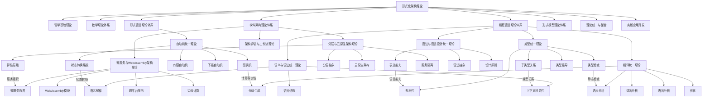
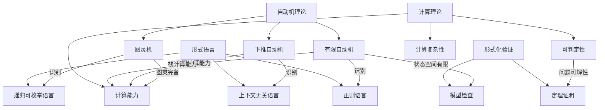
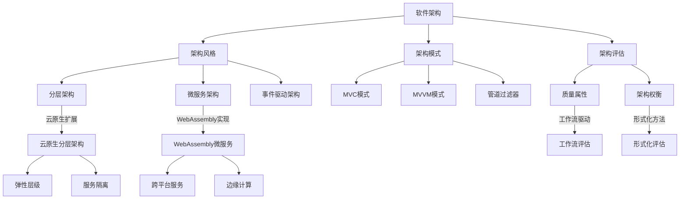
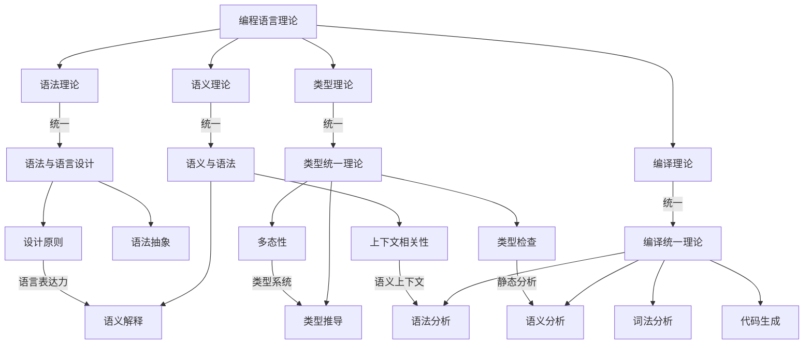
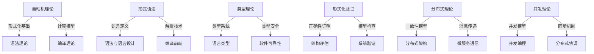
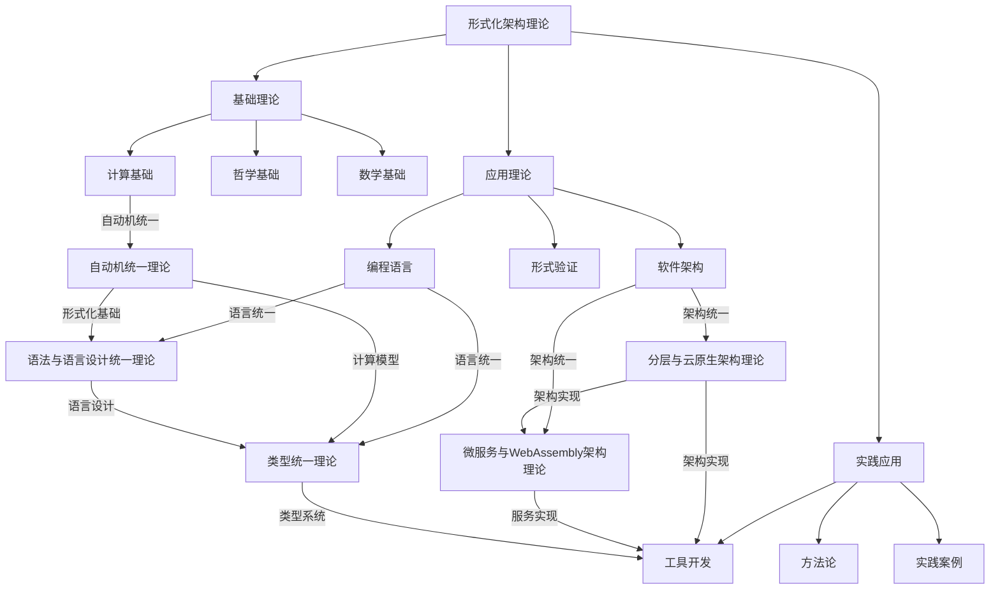

# 形式化架构理论概念图谱

## 1. 概述

本文档展示了形式化架构理论的核心概念及其关系，通过多层次的图谱展示，帮助理解理论体系的整体结构和内部联系。

## 2. 顶层概念图谱

```mermaid
graph TD
    A[形式化架构理论] --> B1[哲学基础]
    A --> B2[数学基础]
    A --> B3[形式语言]
    A --> B4[软件架构]
    A --> B5[编程语言]
    A --> B6[形式模型]
    A --> B7[理论统一]
    A --> B8[实践应用]
    
    B1 --> C1[本体论]
    B1 --> C2[认识论]
    B1 --> C3[逻辑学]
    
    B2 --> C4[集合论]
    B2 --> C5[代数]
    B2 --> C6[分析]
    
    B3 --> C7[自动机理论]
    B3 --> C8[形式语法]
    B3 --> C9[语义理论]
    
    B4 --> C10[架构模式]
    B4 --> C11[组件理论]
    B4 --> C12[分布式架构]
    
    B5 --> C13[语法理论]
    B5 --> C14[语义理论]
    B5 --> C15[类型理论]
    
    B6 --> C16[状态机]
    B6 --> C17[Petri网]
    B6 --> C18[时序逻辑]
    
    B7 --> C19[理论映射]
    B7 --> C20[统一符号]
    B7 --> C21[跨领域证明]
    
    B8 --> C22[Rust工具]
    B8 --> C23[Go工具]
    B8 --> C24[验证工具]
```

## 3. 合并后的概念图谱

## 4. 核心概念关系

### 4.1 自动机与形式语言

### 4.2 软件架构概念关系

### 4.3 编程语言概念关系

## 5. 跨领域概念映射

## 6. 理论统一视图

## 7. 后续图谱扩展计划

1. **细化概念关系**
   - 增加更多细节层次的概念关系
   - 展示概念之间的依赖和影响关系

2. **动态视图**
   - 添加理论发展的时间维度
   - 展示概念演化和理论融合过程

3. **应用场景图谱**
   - 展示理论在不同应用场景中的应用
   - 建立理论与实践的映射关系

4. **交互式图谱**
   - 开发交互式图谱浏览工具
   - 支持按需展开和折叠节点
   - 支持按关系类型过滤视图
