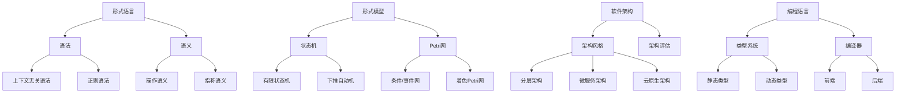
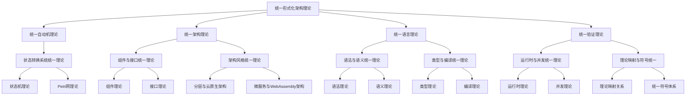
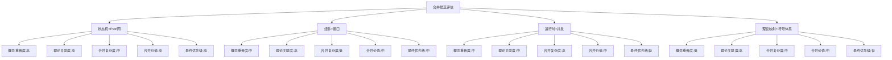
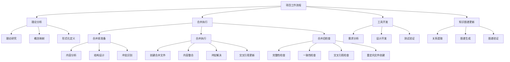
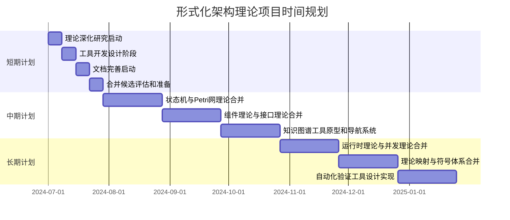

# 形式化架构理论知识图谱 - v62

## 1. 概述

本文档提供形式化架构理论项目的知识图谱，展示理论体系、核心概念及其关系，帮助理解项目的整体结构和内容。

## 2. 顶层理论体系图谱

```mermaid
graph TD
    A[形式化架构理论] --> B[哲学基础理论]
    A --> C[数学理论体系]
    A --> D[形式语言理论体系]
    A --> E[软件架构理论体系]
    A --> F[编程语言理论体系]
    A --> G[形式模型理论体系]
    A --> H[理论统一与整合]
    A --> I[实践应用开发]
    
    B --> B1[逻辑学]
    B --> B2[认知科学]
    B --> B3[科学哲学]
    
    C --> C1[集合论]
    C --> C2[范畴论]
    C --> C3[图论]
    C --> C4[代数学]
    
    D --> D1[形式语法]
    D --> D2[自动机理论]
    D --> D3[计算理论]
    
    E --> E1[架构风格]
    E --> E2[架构评估]
    E --> E3[架构描述语言]
    
    F --> F1[语法理论]
    F --> F2[语义理论]
    F --> F3[类型理论]
    F --> F4[编译理论]
    
    G --> G1[状态机]
    G --> G2[Petri网]
    G --> G3[进程代数]
    G --> G4[时序逻辑]
    
    H --> H1[理论映射关系]
    H --> H2[统一符号体系]
    H --> H3[跨领域验证]
    
    I --> I1[工具开发]
    I --> I2[案例研究]
    I --> I3[实践指南]
```

## 3. 核心概念关系图谱

## 4. 合并后理论关系图谱

## 5. 项目进展图谱

```mermaid
graph TD
    A[形式化架构理论项目] --> B[已完成工作v61]
    A --> C[正在进行v62]
    A --> D[待完成工作v62]
    
    B --> B1[递归合并系统]
    B --> B2[语义整合工作]
    B --> B3[知识图谱工作]
    B --> B4[索引与导航系统]
    
    B1 --> B1a[自动机统一理论合并]
    B1 --> B1b[架构相关理论合并]
    B1 --> B1c[语言相关理论合并]
    
    B2 --> B2a[概念定义统一]
    B2 --> B2b[术语使用统一]
    B2 --> B2c[形式化表示统一]
    
    B3 --> B3a[理论体系关系图]
    B3 --> B3b[核心概念关系图]
    B3 --> B3c[合并文件依赖图]
    B3 --> B3d[统一理论体系图谱]
    
    C --> C1[理论深化研究]
    C --> C2[工具开发]
    C --> C3[新一轮理论合并]
    C --> C4[文档完善]
    C --> C5[知识图谱更新]
    
    C1 --> C1a[统一形式化证明研究]
    C1 --> C1b[跨领域验证技术研究]
    C1 --> C1c[理论扩展规划]
    
    C2 --> C2a[知识图谱可视化工具]
    C2 --> C2b[理论导航系统]
    C2 --> C2c[自动化验证工具]
    
    C3 --> C3a[状态机与Petri网理论]
    C3 --> C3b[组件理论与接口理论]
    C3 --> C3c[运行时理论与并发理论]
    C3 --> C3d[理论映射与符号体系]
    
    D --> D1[合并执行]
    D --> D2[工具实现]
    D --> D3[文档与图谱更新]
```

## 6. 合并候选评估图谱

## 7. 工作流程图谱

## 8. 时间规划图谱

## 9. 概念定义映射

| 概念 | 定义 | 相关理论 | 形式化表示 |
|------|------|----------|------------|
| 状态机 | 描述系统状态变化的数学模型 | 形式模型理论 | $(Q, \Sigma, \delta, q_0, F)$ |
| Petri网 | 描述分布式系统的数学模型 | 形式模型理论 | $(P, T, F, M_0)$ |
| 形式语言 | 由字符串集合构成的语言 | 形式语言理论 | $L \subseteq \Sigma^*$ |
| 上下文无关语法 | 一种形式语法 | 形式语言理论 | $G = (V, \Sigma, R, S)$ |
| 架构风格 | 系统结构的组织模式 | 软件架构理论 | 模式定义+约束 |
| 类型系统 | 对程序中值的分类系统 | 编程语言理论 | 类型规则集合 |

## 10. 总结

本知识图谱展示了形式化架构理论项目的整体结构、核心概念及其关系，为理解项目内容和进展提供了可视化的参考。通过图谱可以清晰地看到不同理论体系之间的联系，以及项目的工作流程和规划。这些图谱将随着项目的进展不断更新和完善，为项目的发展提供指导和支持。

---

**版本**: v62  
**创建时间**: 2024年7月  
**状态**: 🔄 进行中  
**最后更新**: 2024年7月 