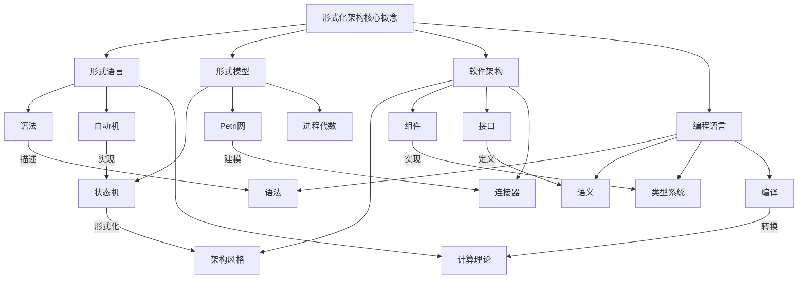
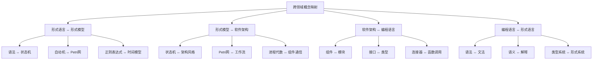
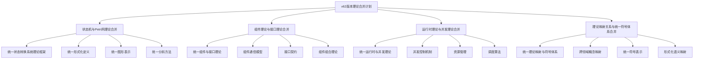
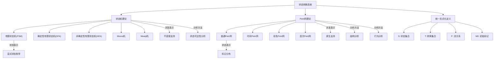
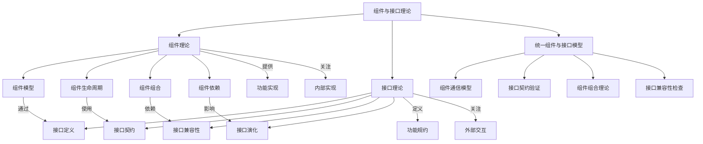
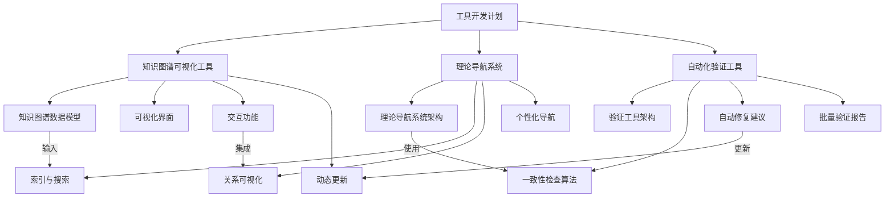
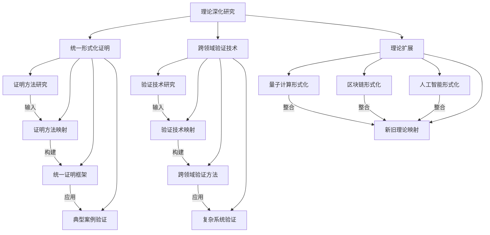

# 形式化架构理论知识图谱

## 1. 概述

本文档提供形式化架构理论项目的知识图谱可视化，展示不同理论体系之间的关系、核心概念之间的关系以及跨领域概念映射。这些知识图谱有助于理解形式化架构理论的整体结构和内在联系，为理论研究和应用提供指导。

## 2. 理论体系关系图

下图展示了形式化架构理论项目中不同理论体系之间的关系：

```mermaid
graph TD
    A["形式化架构理论"] --> B["哲学基础理论"]
    A --> C["数学理论体系"]
    A --> D["形式语言理论体系"]
    A --> E["软件架构理论体系"]
    A --> F["编程语言理论体系"]
    A --> G["形式模型理论体系"]
    A --> H["理论统一与整合"]
    A --> I["实践应用开发"]
    A --> J["索引与导航"]
    
    B --> B1["哲学基础"]
    B --> B2["认知科学"]
    
    C --> C1["集合论"]
    C --> C2["逻辑学"]
    C --> C3["范畴论"]
    
    D --> D1["形式语法"]
    D --> D2["自动机理论"]
    D --> D3["计算理论"]
    
    E --> E1["分层架构"]
    E --> E2["微服务架构"]
    E --> E3["云原生架构"]
    E --> E4["WebAssembly架构"]
    E --> E5["架构评估"]
    E --> E6["工作流架构"]
    
    F --> F1["语法理论"]
    F --> F2["语义理论"]
    F --> F3["类型理论"]
    F --> F4["编译理论"]
    F --> F5["语言设计"]
    
    G --> G1["状态机理论"]
    G --> G2["Petri网理论"]
    G --> G3["进程代数"]
    G --> G4["时间模型"]
    
    H --> H1["理论映射关系"]
    H --> H2["统一符号体系"]
    H --> H3["跨领域验证"]
    H --> H4["统一形式化证明"]
    
    I --> I1["工具开发"]
    I --> I2["案例研究"]
    I --> I3["实践指南"]
    
    J --> J1["概念索引"]
    J --> J2["理论导航"]
    J --> J3["交叉引用"]
```

## 3. 核心概念关系图

下图展示了形式化架构理论项目中核心概念之间的关系：

## 4. 跨领域概念映射

下图展示了不同理论领域之间的概念映射关系：

## 5. 理论合并关系图

下图展示了v62版本中计划进行的理论合并关系：

## 6. 状态机与Petri网理论关系图

下图展示了状态机理论和Petri网理论之间的关系：

## 7. 组件与接口理论关系图

下图展示了组件理论和接口理论之间的关系：

## 8. 工具开发计划图

下图展示了形式化架构理论项目的工具开发计划：

## 9. 理论深化研究图

下图展示了形式化架构理论项目的理论深化研究计划：

## 10. 总结

本文档提供了形式化架构理论项目的知识图谱可视化，展示不同理论体系之间的关系、核心概念之间的关系、跨领域概念映射、理论合并关系、状态机与Petri网理论关系、组件与接口理论关系、工具开发计划以及理论深化研究计划。这些知识图谱有助于理解形式化架构理论的整体结构和内在联系，为理论研究和应用提供指导。

随着项目的进展，这些知识图谱将不断更新和完善，以反映最新的理论发展和研究成果。

---

**版本**: v1.0  
**创建时间**: 2024年7月  
**状态**: 🔄 进行中  
**最后更新**: 2024年7月
