# 形式化架构理论统一计划-v67

## 1. 项目概述

形式化架构理论项目v67版本整合了v66版本的统一计划和后续工作计划，提供了更全面的项目视图并更新了最新进展。本项目旨在深化理论整合，扩展知识图谱，并开发更完善的工具支持，为形式化架构理论的研究和应用提供坚实基础。

### 1.1 主要目标

1. 深化理论合并与整合，包括统一形式化证明框架和跨领域验证技术
2. 完善知识图谱可视化工具和理论导航系统
3. 开发自动化验证工具
4. 完善文档和交叉引用系统
5. 扩展理论应用领域，包括智能化模块和新兴领域

### 1.2 项目历程

本项目从v62版本开始，已经完成了组件与接口统一理论、统一状态转换系统理论的构建，以及知识图谱可视化工具原型的开发等工作。v63-v66版本进一步完善了理论合并与整合工作，开展了新的工具开发和应用研究。v67版本继续深化已有工作，并启动新的理论研究和工具开发。

### 1.3 知识图谱总览

以下是形式化架构理论的整体知识图谱，展示了主要理论体系和它们之间的关系：

```mermaid
graph TD
    %% 顶层理论体系
    FA[形式化架构理论] --> PHI[哲学基础理论]
    FA --> MT[数学理论体系]
    FA --> FLT[形式语言理论体系]
    FA --> SAT[软件架构理论体系]
    FA --> PLT[编程语言理论体系]
    FA --> FMT[形式模型理论体系]
    
    %% 统一理论
    FA --> UT[统一理论]
    UT --> USTS[统一状态转换系统]
    UT --> UMS[统一模块化系统]
    UT --> UFPF[统一形式化证明框架]
    UT --> CVTF[跨领域验证技术]
    
    %% 统一状态转换系统
    USTS --> S1[状态元素集合]
    USTS --> E1[事件集合]
    USTS --> R1[关系集合]
    USTS --> M1[标记函数]
    USTS --> I1[初始状态集合]
    USTS --> F1[终止状态集合]
    USTS --> L1[关系权重函数]
    
    %% 统一模块化系统
    UMS --> S2[模块状态空间]
    UMS --> B2[模块行为模型]
    UMS --> P2[提供功能集合]
    UMS --> R2[依赖功能集合]
    UMS --> I2[模块实现细节]
    UMS --> C2[模块交互契约]
    UMS --> V2[模块版本信息]
    
    %% 哲学基础理论
    PHI --> LOG[逻辑学]
    PHI --> CS[认知科学]
    PHI --> SP[科学哲学]
    
    %% 数学理论体系
    MT --> ST[集合论]
    MT --> CT[范畴论]
    MT --> GT[图论]
    MT --> ALG[代数学]
    
    %% 形式语言理论体系
    FLT --> FG[形式语法]
    FLT --> FS[形式语义]
    FLT --> AT[自动机理论]
    
    %% 软件架构理论体系
    SAT --> LA[分层架构]
    SAT --> MS[微服务架构]
    SAT --> CN[云原生架构]
    SAT --> WA[WebAssembly架构]
    SAT --> CT2[组件理论]
    SAT --> IT[接口理论]
    
    %% 编程语言理论体系
    PLT --> SYN[语法理论]
    PLT --> SEM[语义理论]
    PLT --> TT[类型理论]
    PLT --> CPT[编译理论]
    
    %% 形式模型理论体系
    FMT --> SM[状态机理论]
    FMT --> PN[Petri网理论]
    FMT --> PA[进程代数]
    FMT --> TL[时序逻辑]
    
    %% 工具开发
    FA --> TOOLS[工具开发]
    TOOLS --> KGV[知识图谱可视化工具]
    TOOLS --> TNS[理论导航系统]
    TOOLS --> AVT[自动化验证工具]
    
    %% 应用拓展
    FA --> APP[应用拓展]
    APP --> IAM[智能化模块研究]
    APP --> EMT[新兴模块类型研究]
    APP --> CDA[跨领域应用研究]
    
    style FA fill:#f9f,stroke:#333,stroke-width:2px
    style UT fill:#bbf,stroke:#333,stroke-width:2px
    style TOOLS fill:#bfb,stroke:#333,stroke-width:2px
    style APP fill:#fbb,stroke:#333,stroke-width:2px
```



## 2. 当前工作状态

### 2.1 已完成工作（v62-v66）

- ✅ 组件与接口统一理论构建
- ✅ 统一状态转换系统理论构建
- ✅ 知识图谱可视化工具原型开发
- ✅ 递归合并系统：完成8个合并任务
- ✅ 自动机理论相关文件合并
- ✅ 分层架构与云原生架构理论合并
- ✅ 微服务架构与WebAssembly架构理论合并
- ✅ 架构评估与工作流架构理论合并
- ✅ 语法理论与语言设计理论合并
- ✅ 语义理论与语法理论合并
- ✅ 类型理论与类型系统合并
- ✅ 编译理论与编译器理论合并
- ✅ 概念定义统一、术语使用统一、形式化表示统一
- ✅ 知识图谱生成：理论体系关系图、核心概念关系图等
- ✅ 交叉引用更新
- ✅ 索引与导航更新
- ✅ 语义一致性检查
- ✅ 概念图谱构建
- ✅ 合并执行状态跟踪
- ✅ 递归合并与语义整合最终报告

### 2.2 进行中工作（v67）

- 🔄 **理论深化研究**
  - 🔄 统一形式化证明框架研究 (40%)
  - 🔄 跨领域验证技术研究 (40%)
  - 🔄 理论扩展规划 (35%)

- 🔄 **工具开发**
  - 🔄 知识图谱可视化工具完善 (50%)
  - 🔄 理论导航系统开发 (40%)
  - 🔄 自动化验证工具开发 (30%)

- 🔄 **新一轮理论合并**
  - 🔄 状态机与Petri网理论合并 (45%)
  - 🔄 组件理论与接口理论合并 (45%)
  - 🔄 运行时理论与并发理论合并 (20%)
  - 📝 理论映射关系与统一符号体系合并 (10%)

- 🔄 **文档完善**
  - 🔄 合并后文档完善 (45%)
  - 🔄 用户文档编写 (35%)
  - 🔄 教程和示例编写 (30%)

## 3. 理论深化计划

### 3.1 统一形式化证明框架

**目标**：建立跨理论体系的统一形式化证明框架，支持不同理论之间的证明转换和复用。

**主要工作**：

1. **证明方法系统化研究**
   - 深入研究形式语言、形式模型、软件架构等领域的证明方法
   - 分析不同证明方法的特点、优势和局限性
   - 建立证明方法分类体系

2. **证明映射关系完善**
   - 完善不同理论体系中证明方法的映射关系
   - 研究证明转换的条件和规则
   - 建立证明等价性的判定方法

3. **统一证明框架设计**
   - 设计统一的证明表示形式
   - 设计证明转换和复用的机制
   - 设计证明验证的方法和工具

4. **案例研究与验证**
   - 选择典型案例进行统一证明框架的应用
   - 验证统一证明框架的有效性和实用性
   - 根据验证结果优化统一证明框架

**预期成果**：

- 统一形式化证明框架文档
- 跨理论证明案例集
- 证明方法映射表

**当前进度**：

- 已完成证明方法分类体系初步设计 (85%)
- 已开始不同理论间证明映射关系研究 (60%)
- 已开始证明等价性判定方法研究 (40%)
- 已规划统一证明框架结构设计 (30%)

### 3.2 跨领域验证技术

**目标**：建立跨越不同理论领域的验证技术框架，支持跨领域系统的验证。

**主要工作**：

1. **验证技术系统化研究**
   - 深入研究形式语言、形式模型、软件架构等领域的验证技术
   - 分析不同验证技术的特点、优势和局限性
   - 建立验证技术分类体系

2. **验证技术映射关系完善**
   - 完善不同理论领域中验证技术的映射关系
   - 研究验证技术转换的条件和规则
   - 建立验证等价性的判定方法

3. **跨领域验证框架设计**
   - 设计统一的验证表示形式
   - 设计验证技术转换和复用的机制
   - 设计跨领域验证的方法和工具

4. **案例研究与验证**
   - 选择典型案例进行跨领域验证框架的应用
   - 验证跨领域验证框架的有效性和实用性
   - 根据验证结果优化跨领域验证框架

**预期成果**：

- 跨领域验证方法文档
- 验证技术映射表
- 复杂系统验证案例集

**当前进度**：

- 已完成验证技术分类体系设计 (80%)
- 已开始验证技术映射关系研究 (55%)
- 已开始跨领域验证框架初步设计 (40%)
- 已规划典型验证案例集 (30%)

### 3.3 理论扩展研究

**目标**：扩展统一理论，覆盖更多的理论领域，提高理论的完整性和适用性。

**主要工作**：

1. **理论扩展需求分析**
   - 分析当前理论体系的覆盖范围和局限性
   - 识别需要扩展的理论领域
   - 评估扩展的必要性和可行性

2. **理论扩展规划**
   - 制定详细的理论扩展计划
   - 设定扩展的优先级
   - 规划扩展的时间和资源

3. **高优先级理论扩展执行**
   - 执行高优先级的理论扩展
   - 整合新的理论内容
   - 更新相关的交叉引用和知识图谱

4. **理论扩展评估**
   - 评估理论扩展的效果
   - 验证扩展后理论的一致性和完整性
   - 根据评估结果优化理论扩展

**预期成果**：

- 扩展理论文档
- 新兴领域形式化方法映射表
- 扩展统一理论框架

**当前进度**：

- 已完成理论体系覆盖范围分析 (90%)
- 已完成需要扩展的理论领域识别 (75%)
- 已开始理论扩展详细规划 (50%)
- 已开始高优先级理论扩展前期准备 (30%)

## 4. 合并计划与进度

### 4.1 已完成合并任务（v62-v66）

| 序号 | 合并任务 | 状态 | 完成时间 | 主要成果 | 备注 |
|------|---------|------|---------|---------|------|
| 1 | 自动机理论相关文件合并 | ✅ 已完成 | 2023-12 | 统一自动机理论框架 | 合并了有限自动机、下推自动机和图灵机相关文档 |
| 2 | 分层架构与云原生架构理论合并 | ✅ 已完成 | 2024-01 | 统一架构层次理论 | 建立了架构层次化通用框架 |
| 3 | 微服务架构与WebAssembly架构理论合并 | ✅ 已完成 | 2024-02 | 分布式模块化架构理论 | 建立了模块化分布系统理论框架 |
| 4 | 架构评估与工作流架构理论合并 | ✅ 已完成 | 2024-02 | 架构评估框架 | 包含质量属性与工作流评估方法 |
| 5 | 语法理论与语言设计理论合并 | ✅ 已完成 | 2024-03 | 语言设计统一理论 | 建立了从语法到设计的连贯理论体系 |
| 6 | 语义理论与语法理论合并 | ✅ 已完成 | 2024-03 | 语法语义统一理论 | 建立了语义与语法的映射关系 |
| 7 | 类型理论与类型系统合并 | ✅ 已完成 | 2024-04 | 统一类型理论 | 包含理论基础和实际类型系统 |
| 8 | 编译理论与编译器理论合并 | ✅ 已完成 | 2024-04 | 编译理论与实践框架 | 从理论到实现的完整体系 |

### 4.2 v67 计划合并任务

| 序号 | 合并任务 | 当前状态 | 计划完成时间 | 预期成果 | 优先级 |
|------|---------|---------|-------------|----------|--------|
| 1 | 状态机与Petri网理论合并 | 🔄 进行中 (45%) | 2024-08 | 统一状态转换系统理论 | 高 |
| 2 | 组件理论与接口理论合并 | 🔄 进行中 (45%) | 2024-10 | 统一模块化系统理论 | 中 |
| 3 | 运行时理论与并发理论合并 | 🔄 进行中 (20%) | 2024-12 | 运行时并发统一模型 | 低 |
| 4 | 理论映射关系与统一符号体系合并 | 🔄 进行中 (10%) | 2025-02 | 理论统一表示框架 | 低 |

### 4.3 重点合并任务分析

#### 4.3.1 状态机与Petri网理论合并

##### 统一状态转换系统理论

提出统一状态转换系统 (USTS) 定义为一个七元组 $(S, E, R, M, I, F, L)$，其中：

- $S$ 是状态元素集合（状态机的状态和Petri网的库所）
- $E$ 是事件集合（状态机的输入符号和Petri网的变迁）
- $R$ 是关系集合（状态机的转换函数和Petri网的弧）
- $M$ 是标记函数（Petri网的标记，状态机中每状态标记为0或1）
- $I$ 是初始状态集合
- $F$ 是终止状态集合
- $L$ 是关系权重函数

##### 理论比较

| 特性 | 状态机 | Petri网 | 统一状态转换系统 |
|------|--------|--------|-----------------|
| 并发性 | 不直接支持 | 原生支持 | 支持 |
| 状态表示 | 离散状态 | 分布式状态（标记） | 广义状态元素 |
| 事件表示 | 输入驱动转换 | 变迁触发条件 | 广义事件触发 |
| 图形表示 | 状态转换图 | 二部图 | 统一图形表示 |
| 分析方法 | 状态可达性分析 | 可达性分析、不变量分析 | 综合分析方法 |
| 表达能力 | 正则语言 | 超越正则语言 | 统一表达框架 |

##### 合并执行计划

| 阶段 | 起始日期 | 结束日期 | 主要任务 | 完成状态 |
|------|---------|---------|---------|---------|
| 准备阶段 | 2024-07-01 | 2024-07-14 | 内容分析、概念映射、结构设计、冲突识别 | ✅ 已完成 |
| 执行阶段 | 2024-07-15 | 2024-08-04 | 创建基础结构、内容整合、关系建立 | 🔄 进行中 (60%) |
| 检查阶段 | 2024-08-05 | 2024-08-11 | 完整性检查、一致性检查、交叉引用更新 | 📝 未开始 |

##### 主要挑战与风险

- 两个理论对并发性表达方式不同
- 形式化语义统一难度大
- 保持各自理论优势的同时实现统一

#### 4.3.2 组件理论与接口理论合并

##### 统一模块化系统理论

提出模块单元 $M$ 定义为一个七元组 $(S, B, P, R, I, C, V)$，其中：

- $S$ 是模块状态空间
- $B$ 是模块行为模型
- $P$ 是模块提供的功能集合
- $R$ 是模块依赖的功能集合
- $I$ 是模块实现细节
- $C$ 是模块交互契约
- $V$ 是模块版本信息

##### 概念映射表

| 组件理论概念 | 接口理论概念 | 映射关系 | 统一概念 |
|------------|------------|---------|---------|
| 组件 | 接口提供者 | 组件实现并提供接口 | 模块单元 |
| 组件依赖 | 接口需求 | 组件依赖对应接口需求 | 依赖关系 |
| 组件组合 | 接口组合 | 组件组合需要接口兼容 | 系统组合 |
| 组件行为 | 接口协议 | 组件行为应符合接口协议 | 交互行为 |
| 组件状态 | 接口状态 | 组件状态影响接口状态 | 系统状态 |
| 组件生命周期 | 接口版本 | 组件生命周期包含接口版本演化 | 演化模型 |
| 组件替换性 | 接口兼容性 | 组件替换需要接口兼容 | 替换兼容性 |

##### 合并执行计划2

| 阶段 | 起始日期 | 结束日期 | 主要任务 | 完成状态 |
|------|---------|---------|---------|---------|
| 准备阶段 | 2024-09-01 | 2024-09-14 | 概念映射完善、统一模型设计 | ✅ 已完成 |
| 执行阶段 | 2024-09-15 | 2024-09-28 | 文档结构设计、内容整合执行 | 🔄 进行中 (55%) |
| 检查阶段 | 2024-09-29 | 2024-10-05 | 交叉引用更新、一致性检查 | 📝 未开始 |

##### 主要挑战与风险2

- 接口与组件生命周期管理差异
- 组件运行时状态与接口状态的映射关系复杂
- 保持向下兼容性的同时实现更丰富的语义表达

### 4.4 合并后文档计划

| 序号 | 合并结果文档 | 计划完成时间 | 内容概述 | 负责人 |
|------|------------|-------------|---------|--------|
| 1 | 统一状态转换系统理论.md | 2024-08-15 | 统一状态机和Petri网的形式化定义和应用 | TBD |
| 2 | 统一模块化系统理论.md | 2024-10-15 | 统一组件和接口的概念、关系和应用 | TBD |
| 3 | 运行时并发统一模型.md | 2025-01-15 | 运行时系统与并发处理的统一理论 | TBD |
| 4 | 理论统一表示框架.md | 2025-03-15 | 跨理论域的符号表示与映射 | TBD |

### 4.5 最新进展追踪

#### 状态机与Petri网理论合并 (更新日期: 2024-07-20)

- 已完成所有概念映射表和映射关系定义
- 已设计统一状态转换系统七元组形式化定义及其语义
- 已完成文档结构设计和内容整合框架
- 已完成执行语义、并发语义的映射关系说明
- 正在设计典型案例示例和实现验证案例
- 已开始整合状态机和Petri网的分析方法

#### 组件理论与接口理论合并 (更新日期: 2024-07-20)

- 已完成完整概念分析和映射表
- 已提出并细化统一模块单元七元组形式化定义
- 已完善交互语义和契约语义的映射关系
- 已设计组件到UMS和接口到UMS的转换规则
- 正在进行案例映射示例实现
- 已开始整合文档结构设计和统一图形表示方法

### 4.6 执行方法

#### 4.6.1 合并前准备

1. **内容分析**：分析待合并文件的内容，识别共同主题和独特内容
2. **结构设计**：设计合并后文件的结构，确保逻辑清晰和内容完整
3. **冲突识别**：识别可能的概念冲突和术语冲突

#### 4.6.2 合并执行步骤

1. **创建合并文件**：创建新的合并文件，设计合适的文件名和结构
2. **内容整合**：将不同文件的内容整合到新结构中，消除冗余，保留所有有价值的内容
3. **冲突解决**：解决概念冲突和术语冲突，确保语义一致性
4. **交叉引用更新**：更新所有相关文件中的交叉引用

#### 4.6.3 合并后检查

1. **完整性检查**：检查合并后的文件是否包含所有原始内容
2. **一致性检查**：检查合并后的文件是否在语义上保持一致
3. **交叉引用检查**：检查交叉引用是否正确更新
4. **重定向文件创建**：为被合并的文件创建重定向文件

## 5. 工具开发计划

### 5.1 知识图谱可视化工具完善

**目标**：完善知识图谱可视化工具，提供更加强大和易用的知识图谱可视化功能。

**主要工作**：

1. **高级可视化功能实现**
   - 实现多种布局算法
   - 支持自定义样式
   - 实现高级交互功能

2. **知识提取功能实现**
   - 实现Markdown解析
   - 实现概念和关系提取
   - 构建初始知识图谱

3. **高级查询功能实现**
   - 实现高级查询语言
   - 支持复杂过滤
   - 实现相似性查询

4. **导航功能实现**
   - 实现导航历史
   - 实现书签管理
   - 实现导航推荐

5. **图谱分析功能实现**
   - 实现中心性分析
   - 实现社区发现
   - 实现路径分析

6. **图谱编辑功能实现**
   - 实现节点和关系编辑
   - 支持批量操作
   - 实现版本管理

7. **导出与分享功能实现**
   - 支持多种导出格式
   - 实现交互式HTML导出
   - 实现分享功能

#### 5.1.1 系统架构

知识图谱可视化工具的核心组件包括：

1. **用户界面 (UI)**
   - 图谱显示区域
   - 控制面板
   - 查询界面
   - 导航界面
   - 详情面板

2. **可视化引擎 (VE)**
   - 图形渲染器
   - 布局管理器
   - 交互控制器
   - 样式管理器

3. **查询引擎 (QE)**
   - 查询解析器
   - 查询执行器
   - 结果格式化器
   - 缓存管理器

4. **数据模型 (DM)**
   - 节点模型
   - 关系模型
   - 属性模型
   - 图谱模型
   - 视图模型

5. **数据处理 (DP)**
   - Markdown解析器
   - 知识提取器
   - 关系分析器
   - 图谱转换器

#### 5.1.2 核心数据结构

```typescript
interface Node {
  id: string;               // 唯一标识符
  type: NodeType;           // 节点类型
  label: string;            // 显示标签
  description?: string;     // 描述信息
  properties: Property[];   // 属性列表
  source: Source;           // 来源信息
  metadata: Metadata;       // 元数据
}

interface Relation {
  id: string;               // 唯一标识符
  type: RelationType;       // 关系类型
  label: string;            // 显示标签
  source: string;           // 源节点ID
  target: string;           // 目标节点ID
  properties: Property[];   // 属性列表
  weight: number;           // 关系权重
  metadata: Metadata;       // 元数据
}

interface KnowledgeGraph {
  id: string;               // 唯一标识符
  name: string;             // 图谱名称
  description?: string;     // 描述信息
  nodes: Node[];            // 节点列表
  relations: Relation[];    // 关系列表
  metadata: Metadata;       // 元数据
  views: View[];            // 视图列表
}
```

#### 5.1.3 开发进度与里程碑

| 阶段 | 完成状态 | 里程碑 | 计划时间 |
|------|---------|--------|---------|
| 阶段一：基础框架 | ✅ 已完成 | 数据模型设计、基础可视化、简单查询 | 2024-05 |
| 阶段二：核心功能 | 🔄 进行中 (65%) | 高级可视化、知识提取、高级查询、导航功能 | 2024-08 |
| 阶段三：高级功能 | 📝 未开始 | 图谱分析、图谱编辑、导出与分享、集成与优化 | 2024-11 |

### 5.2 理论导航系统开发

**目标**：开发理论导航系统，支持在理论体系中的导航和搜索。

**主要工作**：

1. **导航系统架构完善**
   - 完善理论导航系统架构
   - 设计导航数据模型
   - 设计导航接口

2. **导航功能实现**
   - 实现层次导航
   - 实现关系导航
   - 实现历史导航

3. **搜索功能实现**
   - 实现关键词搜索
   - 实现语义搜索
   - 实现高级搜索

4. **推荐功能实现**
   - 实现相关理论推荐
   - 实现学习路径推荐
   - 实现个性化推荐

5. **用户界面实现**
   - 设计直观的用户界面
   - 实现响应式设计
   - 优化用户体验

#### 5.2.1 系统架构

理论导航系统的核心组件包括：

1. **用户界面层**
   - 导航界面
   - 搜索界面
   - 内容展示界面
   - 路径规划界面
   - 个人中心界面

2. **业务逻辑层**
   - 导航逻辑
   - 搜索逻辑
   - 内容处理
   - 路径规划
   - 推荐系统
   - 分析系统

3. **数据层**
   - 索引数据
   - 理论数据
   - 用户数据
   - 路径数据
   - 分析数据

4. **集成层**
   - 知识图谱集成
   - 文档系统集成
   - API集成
   - 外部系统集成

#### 5.2.2 核心数据结构

```typescript
interface TheoryEntity {
  id: string;               // 唯一标识符
  type: EntityType;         // 实体类型
  name: string;             // 名称
  description: string;      // 描述
  content: string;          // 内容
  metadata: Metadata;       // 元数据
  relations: Relation[];    // 关系列表
  attributes: Attribute[];  // 属性列表
  location: Location;       // 位置信息
}

interface NavigationPath {
  id: string;               // 唯一标识符
  name: string;             // 名称
  description: string;      // 描述
  type: PathType;           // 路径类型
  nodes: PathNode[];        // 路径节点
  edges: PathEdge[];        // 路径边
  metadata: Metadata;       // 元数据
  creator: string;          // 创建者
  visibility: Visibility;   // 可见性
}
```

#### 5.2.3 开发进度与里程碑

| 阶段 | 完成状态 | 里程碑 | 计划时间 |
|------|---------|--------|---------|
| 阶段一：基础架构 | ✅ 已完成 | 数据模型实现、基础导航功能、基础内容展示、基础搜索功能 | 2024-06 |
| 阶段二：核心功能 | 🔄 进行中 (45%) | 高级导航功能、高级内容展示、高级搜索功能、路径规划功能 | 2024-09 |
| 阶段三：高级功能 | 📝 未开始 | 个性化功能、社交功能、AI辅助功能、集成功能 | 2024-12 |
| 阶段四：优化完善 | 📝 未开始 | 性能优化、用户体验优化、测试和修复、文档和培训 | 2025-02 |

### 5.3 自动化验证工具开发

**目标**：开发自动化验证工具，支持对系统进行自动化验证。

**主要工作**：

1. **验证工具架构设计**
   - 完成自动化验证工具架构设计
   - 设计验证数据模型
   - 设计验证接口

2. **验证规则和算法定义**
   - 定义验证规则
   - 设计验证算法
   - 建立规则库

3. **核心功能实现**
   - 实现规则解析
   - 实现验证执行
   - 实现结果分析

4. **验证报告生成**
   - 设计报告格式
   - 实现报告生成
   - 支持报告导出

5. **集成与优化**
   - 与其他工具集成
   - 优化性能
   - 提高可用性

#### 5.3.1 系统架构

自动化验证工具的核心组件包括：

1. **用户界面层**
   - 验证任务管理界面
   - 规则管理界面
   - 报告查看界面
   - 配置界面

2. **业务逻辑层**
   - 验证任务管理
   - 规则管理
   - 验证执行
   - 结果分析
   - 报告生成

3. **数据层**
   - 规则库
   - 验证结果
   - 报告存储
   - 配置数据

4. **集成层**
   - 理论模型集成
   - 知识图谱集成
   - 外部工具集成

#### 5.3.2 开发进度与里程碑

| 阶段 | 完成状态 | 里程碑 | 计划时间 |
|------|---------|--------|---------|
| 阶段一：基础架构 | 🔄 进行中 (75%) | 架构设计、数据模型设计、验证规则设计 | 2024-08 |
| 阶段二：核心功能 | 📝 未开始 | 核心功能实现、报告生成、基础集成 | 2024-11 |
| 阶段三：高级功能 | 📝 未开始 | 高级功能、全面集成、性能优化、用户体验改进 | 2025-02 |

### 5.4 工具整合与协同

**目标**：实现三个核心工具的整合与协同工作，提供统一的用户体验。

**主要工作**：

1. **统一数据模型**
   - 设计共享数据模型
   - 实现数据转换
   - 确保数据一致性

2. **统一用户界面**
   - 设计统一界面风格
   - 实现无缝导航
   - 提供一致的交互方式

3. **工具间通信**
   - 设计通信协议
   - 实现事件机制
   - 支持数据同步

4. **集成认证与权限**
   - 实现统一认证
   - 设计权限模型
   - 支持跨工具授权

#### 5.4.1 开发进度与里程碑

| 阶段 | 完成状态 | 里程碑 | 计划时间 |
|------|---------|--------|---------|
| 阶段一：规划设计 | 🔄 进行中 (55%) | 整合需求分析、架构设计、接口设计 | 2024-09 |
| 阶段二：基础整合 | 📝 未开始 | 数据模型整合、基础通信、简单导航 | 2024-12 |
| 阶段三：全面整合 | 📝 未开始 | 全面功能整合、高级协同、统一体验 | 2025-03 |

### 5.5 工具开发技术选型

#### 5.5.1 前端技术栈

- **核心框架**: React 18 + TypeScript 5
- **状态管理**: Redux Toolkit / React Context API
- **UI组件库**: Material-UI / Ant Design
- **可视化库**: D3.js / ECharts / Cytoscape.js
- **路由**: React Router
- **查询**: React Query / SWR
- **测试**: Jest / React Testing Library

#### 5.5.2 后端技术栈

- **运行时**: Node.js / Deno
- **API框架**: Express / NestJS / Fastify
- **数据库**: MongoDB (图谱数据) / PostgreSQL (关系数据)
- **图数据库**: Neo4j / ArangoDB (可选)
- **搜索引擎**: Elasticsearch
- **缓存**: Redis
- **消息队列**: RabbitMQ (可选)

#### 5.5.3 开发与部署工具

- **构建工具**: Vite / Webpack
- **包管理**: npm / yarn / pnpm
- **CI/CD**: GitHub Actions / Jenkins
- **容器化**: Docker / Kubernetes
- **监控**: Prometheus / Grafana
- **日志**: ELK Stack

## 6. 应用拓展计划

### 6.1 智能化模块研究

**目标**：研究智能化模块，探索人工智能与形式化架构理论的结合。

**主要工作**：

1. **自适应模块研究**
   - 研究自适应模块的理论基础
   - 设计自适应模块的形式化定义
   - 开发自适应模块的原型

2. **AI增强模块研究**
   - 研究AI增强模块的理论基础
   - 设计AI增强模块的形式化定义
   - 开发AI增强模块的原型

3. **智能决策模块研究**
   - 研究智能决策模块的理论基础
   - 设计智能决策模块的形式化定义
   - 开发智能决策模块的原型

4. **案例研究与验证**
   - 选择典型案例进行智能化模块的应用
   - 验证智能化模块的有效性和实用性
   - 根据验证结果优化智能化模块

#### 6.1.1 自适应模块形式化定义

自适应模块 $AM$ 可以形式化定义为一个六元组 $(S, I, O, A, L, T)$，其中：

- $S$ 是模块的状态空间
- $I$ 是模块的输入空间
- $O$ 是模块的输出空间
- $A$ 是适应性规则集合
- $L$ 是学习机制
- $T$ 是触发条件集合

#### 6.1.2 AI增强模块架构

AI增强模块包含以下核心组件：

1. **基础功能层**：提供模块的基本功能
2. **AI推理层**：提供AI推理能力
3. **知识表示层**：存储和管理领域知识
4. **学习适应层**：实现学习和适应机制
5. **接口层**：提供与其他模块的交互接口

#### 6.1.3 研究进度

| 研究方向 | 完成状态 | 主要成果 | 计划时间 |
|---------|---------|---------|---------|
| 自适应模块理论基础 | 🔄 进行中 (40%) | 基本概念定义、适应性分类体系 | 2024-09 |
| AI增强模块形式化定义 | 🔄 进行中 (30%) | 初步形式化框架、基本架构设计 | 2024-10 |
| 智能决策模块案例研究 | 📝 未开始 | - | 2024-11 |

### 6.2 新兴模块类型研究

**目标**：研究新兴模块类型，探索形式化架构理论在新兴领域的应用。

**主要工作**：

1. **量子模块研究**
   - 研究量子模块的理论基础
   - 设计量子模块的形式化定义
   - 开发量子模块的原型

2. **边缘模块研究**
   - 研究边缘模块的理论基础
   - 设计边缘模块的形式化定义
   - 开发边缘模块的原型

3. **区块链模块研究**
   - 研究区块链模块的理论基础
   - 设计区块链模块的形式化定义
   - 开发区块链模块的原型

4. **案例研究与验证**
   - 选择典型案例进行新兴模块类型的应用
   - 验证新兴模块类型的有效性和实用性
   - 根据验证结果优化新兴模块类型

#### 6.2.1 量子模块特性

量子模块的核心特性包括：

1. **量子状态**：基于量子比特的状态表示
2. **量子操作**：量子门操作和量子算法
3. **量子纠缠**：模块间的纠缠关系
4. **量子接口**：经典-量子交互接口

#### 6.2.2 边缘模块架构

边缘模块架构包含以下层次：

1. **设备层**：物理边缘设备
2. **连接层**：通信和协议
3. **计算层**：边缘计算能力
4. **服务层**：边缘服务组件
5. **协调层**：云-边协调机制

#### 6.2.3 研究进度

| 研究方向 | 完成状态 | 主要成果 | 计划时间 |
|---------|---------|---------|---------|
| 量子模块理论基础 | 🔄 进行中 (25%) | 量子状态表示、量子操作定义 | 2024-11 |
| 边缘模块形式化模型 | 🔄 进行中 (35%) | 边缘计算模型、通信模型 | 2024-10 |
| 区块链模块案例研究 | 📝 未开始 | - | 2025-01 |

### 6.3 跨领域应用研究

**目标**：研究形式化架构理论在不同领域的应用，扩大理论的影响力和价值。

**主要工作**：

1. **企业应用研究**
   - 研究形式化架构理论在企业应用中的应用
   - 设计企业应用的形式化架构
   - 开发企业应用的原型

2. **云计算应用研究**
   - 研究形式化架构理论在云计算中的应用
   - 设计云计算的形式化架构
   - 开发云计算的原型

3. **物联网应用研究**
   - 研究形式化架构理论在物联网中的应用
   - 设计物联网的形式化架构
   - 开发物联网的原型

4. **人工智能应用研究**
   - 研究形式化架构理论在人工智能中的应用
   - 设计人工智能的形式化架构
   - 开发人工智能的原型

#### 6.3.1 企业应用架构

企业应用架构基于形式化架构理论的核心组件：

1. **业务逻辑层**：使用统一模块化系统建模
2. **数据管理层**：使用形式化数据模型
3. **集成层**：使用形式化接口定义
4. **用户交互层**：使用交互状态模型

#### 6.3.2 物联网应用特点

物联网应用中形式化架构的特点：

1. **分布式状态**：使用统一状态转换系统建模
2. **异构设备集成**：使用形式化接口适配
3. **资源约束**：使用形式化资源模型
4. **实时性要求**：使用时间扩展的形式化模型

#### 6.3.3 研究进度

| 研究方向 | 完成状态 | 主要成果 | 计划时间 |
|---------|---------|---------|---------|
| 企业应用架构模型 | 🔄 进行中 (40%) | 业务流程形式化模型、集成模式 | 2024-10 |
| 云计算架构验证 | 🔄 进行中 (30%) | 云服务组合验证方法、弹性模型 | 2024-11 |
| 物联网形式化模型 | 📝 未开始 | - | 2025-01 |
| 人工智能系统验证 | 📝 未开始 | - | 2025-02 |

### 6.4 应用推广

#### 6.4.1 教育资源开发

**目标**：基于统一理论开发教育资源

**任务**：

1. 设计课程体系
2. 开发教材和讲义
3. 创建练习和案例
4. 建立在线学习平台

**预期成果**：

- 课程体系文档
- 教材和讲义
- 练习和案例集
- 在线学习平台

#### 6.4.2 实践指南编写

**目标**：编写实践指南，指导理论应用

**任务**：

1. 收集实践需求
2. 设计实践方法
3. 编写实践指南
4. 开发实践工具

**预期成果**：

- 实践需求报告
- 实践方法文档
- 实践指南
- 实践工具集

#### 6.4.3 社区建设

**目标**：建立形式化架构理论社区

**任务**：

1. 建立社区平台
2. 组织线上线下活动
3. 推动开源工具开发
4. 促进学术和产业交流

**预期成果**：

- 社区网站
- 定期活动机制
- 开源工具生态
- 学术和产业合作网络

## 7. 时间规划

### 7.1 短期规划（1-3个月）

| 时间 | 工作重点 |
|------|---------|
| 2024年8月 | 完善知识图谱可视化工具，实现高级可视化功能和知识提取功能，完成状态机与Petri网理论合并 |
| 2024年9月 | 继续理论导航系统开发，完成导航系统架构和核心导航功能，推进自适应模块理论基础研究 |
| 2024年10月 | 深化统一形式化证明研究，完成证明方法系统化研究，完成组件理论与接口理论合并，开展企业应用架构研究 |

### 7.2 中期规划（4-6个月）

| 时间 | 工作重点 |
|------|---------|
| 2024年11月 | 完成理论导航系统核心开发，实现搜索功能和推荐功能，开展量子模块和云计算架构研究 |
| 2024年12月 | 推进自动化验证工具开发，完成验证工具核心功能，完成运行时理论与并发理论合并，开始工具基础整合 |
| 2025年1月 | 深化跨领域验证技术研究，完成验证技术系统化研究，开展物联网和区块链模块研究 |

### 7.3 长期规划（7-12个月）

| 时间 | 工作重点 |
|------|---------|
| 2025年2-3月 | 完成自动化验证工具开发，实现核心功能和验证报告生成，完成理论映射关系与统一符号体系合并，开展人工智能系统验证研究 |
| 2025年4-5月 | 完善工具整合与协同，开始智能化模块研究的深入实现，推进应用推广工作 |
| 2025年6-7月 | 完成新兴模块类型研究，开展社区建设，发布整合工具套件 |

## 8. 资源需求

### 8.1 人力资源

| 角色 | 数量 | 职责 |
|------|------|------|
| 理论研究员 | 2-3人 | 负责理论深化研究，包括统一形式化证明框架、跨领域验证技术、新兴模块理论等 |
| 工具开发工程师 | 2-3人 | 负责工具开发，包括知识图谱可视化工具、理论导航系统、自动化验证工具等 |
| 文档编写员 | 1-2人 | 负责文档完善和编写，包括理论文档、用户手册、教程等 |
| 应用研究员 | 1-2人 | 负责应用拓展研究，包括智能化模块研究、跨领域应用研究等 |
| 项目管理员 | 1人 | 负责项目管理和协调，包括进度跟踪、资源调配、风险管理等 |

### 8.2 技术资源

| 资源类型 | 需求 |
|---------|------|
| 开发环境 | 支持JavaScript/TypeScript、React、D3.js等技术的开发环境 |
| 测试环境 | 支持自动化测试和性能测试的环境 |
| 部署环境 | 支持Web应用部署的环境 |
| 存储资源 | 支持大规模知识图谱存储的数据库 |
| 计算资源 | 支持复杂计算和分析的服务器 |
| AI工具 | 支持AI模型训练和推理的环境 |
| 量子计算资源 | 用于量子模块研究（可选，视研究进展而定） |

### 8.3 其他资源

| 资源类型 | 需求 |
|---------|------|
| 文献资源 | 相关领域的学术文献和技术资料 |
| 工具资源 | 相关的开发工具和库 |
| 社区资源 | 相关的技术社区和专家网络 |
| 会议和交流 | 学术会议和行业交流活动 |
| 出版资源 | 支持理论研究成果的出版和推广 |

## 9. 风险管理

### 9.1 理论风险

| 风险 | 可能性 | 影响度 | 应对策略 |
|------|-------|--------|---------|
| 理论不一致 | 中 | 高 | 建立严格的一致性检查机制，定期进行理论审查，使用形式化方法验证理论一致性 |
| 理论覆盖不全 | 低 | 中 | 定期评估理论覆盖范围，及时扩展，建立开放的理论扩展机制 |
| 理论过于复杂 | 高 | 中 | 建立多层次理论结构，提供不同抽象级别，开发直观的可视化工具辅助理解 |
| 形式化定义不严谨 | 中 | 高 | 使用现有形式化工具验证定义，邀请专家审查，建立验证案例库 |

### 9.2 技术风险

| 风险 | 可能性 | 影响度 | 应对策略 |
|------|-------|--------|---------|
| 工具开发延迟 | 高 | 中 | 采用敏捷开发方法，优先实现核心功能，设置合理的里程碑，定期评估进度 |
| 工具使用复杂 | 中 | 高 | 注重用户体验设计，提供详细文档和教程，收集用户反馈并持续改进 |
| 技术兼容性问题 | 中 | 中 | 采用标准技术栈，做好兼容性测试，设计灵活的接口适配机制 |
| 性能瓶颈 | 中 | 高 | 提前进行性能测试，设计可扩展的架构，实施性能优化策略 |
| 安全问题 | 低 | 高 | 采用安全开发实践，进行安全审计，及时更新依赖库 |

### 9.3 执行风险

| 风险 | 可能性 | 影响度 | 应对策略 |
|------|-------|--------|---------|
| 合并冲突 | 高 | 中 | 提前识别冲突，制定解决方案，采用渐进式合并策略 |
| 资源不足 | 高 | 高 | 优先级排序，合理分配资源，寻求外部支持，调整计划范围 |
| 进度延迟 | 高 | 中 | 设置里程碑，定期检查进度，建立缓冲机制，及时调整计划 |
| 需求变更 | 中 | 中 | 采用敏捷方法，灵活应对变更，建立变更管理流程 |
| 团队协作问题 | 中 | 高 | 改善沟通机制，明确责任分工，定期团队建设活动 |

### 9.4 风险监控与应对

1. **风险监控**: 建立风险监控机制，定期评估风险状态
2. **预警机制**: 设置风险预警指标，及时发现潜在问题
3. **应急计划**: 为高影响风险制定应急计划
4. **定期复审**: 定期复审风险管理策略，根据项目进展调整

## 10. 理论体系与知识图谱

### 10.1 核心统一理论体系

形式化架构理论的核心统一理论体系包括：

1. **统一状态转换系统 (USTS)**
   - 形式化定义：七元组 $(S, E, R, M, I, F, L)$
   - 状态机理论与Petri网理论的统一
   - 支持并发性和状态表示的统一框架

2. **统一模块化系统 (UMS)**
   - 形式化定义：七元组 $(S, B, P, R, I, C, V)$
   - 组件理论与接口理论的统一
   - 支持模块组合与交互的统一框架

3. **统一形式化证明框架**
   - 跨理论体系的证明方法映射
   - 证明转换与复用机制
   - 支持跨理论证明的统一框架

4. **跨领域验证技术**
   - 验证技术映射与转换
   - 验证结果组合与分析
   - 支持跨领域系统验证的统一框架

### 10.2 理论层次结构

形式化架构理论的层次结构包括：

- **哲学基础理论层**：逻辑学、认知科学、科学哲学
- **数学理论体系层**：集合论、范畴论、图论、代数学
- **形式语言理论层**：形式语法、形式语义、自动机理论
- **软件架构理论层**：分层架构、微服务架构、云原生架构等
- **编程语言理论层**：语法理论、语义理论、类型理论等
- **形式模型理论层**：状态机理论、Petri网理论、进程代数等
- **统一理论层**：统一状态转换系统、统一模块化系统等
- **应用理论层**：智能化模块理论、新兴模块理论、领域应用理论

## 11. 总结

形式化架构理论项目v67版本在v66基础上进一步整合了统一计划和后续工作计划，提供了更加全面和深入的项目视图，并更新了最新进展。项目继续深化理论研究，完善工具开发，扩展应用领域，为形式化架构理论的发展和应用提供更加坚实的基础。

本版本的主要工作包括：

1. **理论深化研究**：包括统一形式化证明框架、跨领域验证技术和理论扩展研究，探索理论的深度和广度
2. **新一轮理论合并**：状态机与Petri网理论合并、组件理论与接口理论合并等工作继续推进，构建更完整的统一理论体系
3. **工具开发**：知识图谱可视化工具、理论导航系统和自动化验证工具的开发进一步深化，提供更强大的工具支持
4. **应用拓展**：智能化模块研究、新兴模块类型研究和跨领域应用研究深入开展，扩大理论的应用范围和影响力
5. **文档完善**：合并后文档完善和用户文档编写持续推进，提高理论的可访问性和可用性

通过这些工作，项目将进一步完善形式化架构理论体系，提高理论的可用性和应用价值，促进理论与实践的结合，为软件系统的设计与验证提供更加强大的理论支持和工具支持。

---

**版本**: v67  
**创建时间**: 2024年7月  
**状态**: 🔄 进行中  
**最后更新**: 2024年7月
