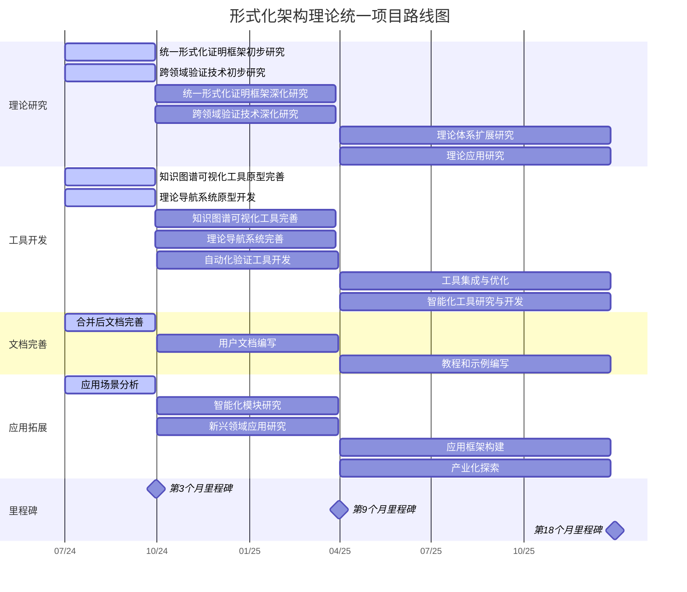

# 形式化架构理论项目路线图

## 1. 概述

本文档提供形式化架构理论统一项目的详细路线图，指导项目的后续发展方向。基于v62版本的成果，路线图涵盖了理论研究、工具开发、文档完善和应用拓展等多个方面，并提供了时间线和里程碑，以确保项目的有序推进。

## 2. 理论研究路线图

### 2.1 短期目标（1-3个月）

#### 2.1.1 统一形式化证明框架初步研究

- **第1个月**：完成不同理论体系中证明方法的系统化研究
  - 调研形式语言、形式模型、软件架构等领域的证明方法
  - 分析不同证明方法的特点、优势和局限性
  - 建立初步的证明方法分类体系

- **第2个月**：建立初步的证明方法映射关系
  - 识别不同理论体系中证明方法的对应关系
  - 分析证明方法之间的转换条件
  - 构建证明方法映射表

- **第3个月**：提出统一形式化证明框架的初步设计
  - 设计统一的证明表示形式
  - 设计证明转换的基本机制
  - 选择典型案例进行初步验证

#### 2.1.2 跨领域验证技术初步研究

- **第1个月**：完成不同领域验证技术的系统化研究
  - 调研形式语言、形式模型、软件架构等领域的验证技术
  - 分析不同验证技术的特点、优势和局限性
  - 建立初步的验证技术分类体系

- **第2个月**：建立初步的验证技术映射关系
  - 识别不同领域验证技术的对应关系
  - 分析验证技术之间的转换条件
  - 构建验证技术映射表

- **第3个月**：提出跨领域验证框架的初步设计
  - 设计统一的验证表示形式
  - 设计验证技术转换的基本机制
  - 选择典型案例进行初步验证

### 2.2 中期目标（4-9个月）

#### 2.2.1 统一形式化证明框架深化研究

- **第4-6个月**：完善统一形式化证明框架
  - 深化证明方法的形式化表示
  - 完善证明转换和复用机制
  - 设计证明验证的方法和工具

- **第7-9个月**：进行案例研究与验证
  - 选择多个典型案例进行应用
  - 验证统一证明框架的有效性和实用性
  - 根据验证结果优化统一证明框架

#### 2.2.2 跨领域验证技术深化研究

- **第4-6个月**：完善跨领域验证框架
  - 深化验证技术的形式化表示
  - 完善验证技术转换和复用机制
  - 设计跨领域验证的方法和工具

- **第7-9个月**：进行案例研究与验证
  - 选择多个典型案例进行应用
  - 验证跨领域验证框架的有效性和实用性
  - 根据验证结果优化跨领域验证框架

### 2.3 长期目标（10-18个月）

#### 2.3.1 理论体系扩展研究

- **第10-12个月**：理论扩展需求分析与规划
  - 分析当前理论体系的覆盖范围和局限性
  - 识别需要扩展的理论领域
  - 制定详细的理论扩展计划

- **第13-15个月**：高优先级理论扩展执行
  - 执行高优先级的理论扩展
  - 整合新的理论内容
  - 更新相关的交叉引用和知识图谱

- **第16-18个月**：理论体系整合与评估
  - 整合扩展后的理论体系
  - 验证理论体系的一致性和完整性
  - 根据评估结果优化理论体系

#### 2.3.2 理论应用研究

- **第10-12个月**：应用场景分析与规划
  - 分析理论在不同领域的应用场景
  - 识别理论应用的挑战和机会
  - 制定理论应用研究计划

- **第13-15个月**：应用案例开发
  - 开发典型应用案例
  - 验证理论在实际场景中的适用性
  - 根据应用结果优化理论

- **第16-18个月**：应用框架构建
  - 构建理论应用框架
  - 提供应用指南和最佳实践
  - 推广理论的应用

## 3. 工具开发路线图

### 3.1 短期目标（1-3个月）

#### 3.1.1 知识图谱可视化工具原型完善

- **第1个月**：完成基础功能实现
  - 完善知识图谱数据模型
  - 实现基本的可视化界面
  - 实现基本的交互功能

- **第2个月**：实现核心功能
  - 实现多种布局算法
  - 实现节点和关系的样式定制
  - 实现基本的查询功能

- **第3个月**：进行测试和优化
  - 进行功能测试和性能测试
  - 优化用户界面和交互体验
  - 修复发现的问题

#### 3.1.2 理论导航系统原型开发

- **第1个月**：完成系统架构设计
  - 设计导航系统架构
  - 设计导航数据模型
  - 设计导航接口

- **第2个月**：实现核心功能
  - 实现层次导航功能
  - 实现关系导航功能
  - 实现基本的搜索功能

- **第3个月**：进行测试和优化
  - 进行功能测试和性能测试
  - 优化用户界面和交互体验
  - 修复发现的问题

### 3.2 中期目标（4-9个月）

#### 3.2.1 知识图谱可视化工具完善

- **第4-6个月**：实现高级功能
  - 实现知识提取功能
  - 实现高级查询功能
  - 实现导航功能

- **第7-9个月**：实现分析和编辑功能
  - 实现图谱分析功能
  - 实现图谱编辑功能
  - 实现导出与分享功能

#### 3.2.2 理论导航系统完善

- **第4-6个月**：实现高级功能
  - 实现语义搜索功能
  - 实现推荐功能
  - 完善用户界面

- **第7-9个月**：实现个性化和社交功能
  - 实现个性化设置
  - 实现社交分享功能
  - 实现用户反馈机制

#### 3.2.3 自动化验证工具开发

- **第4-6个月**：完成工具架构设计
  - 设计验证工具架构
  - 设计验证数据模型
  - 设计验证接口

- **第7-9个月**：实现核心功能
  - 实现规则解析
  - 实现验证执行
  - 实现结果分析和报告生成

### 3.3 长期目标（10-18个月）

#### 3.3.1 工具集成与优化

- **第10-12个月**：工具集成
  - 集成知识图谱可视化工具和理论导航系统
  - 集成自动化验证工具
  - 构建统一的用户界面

- **第13-15个月**：工具优化
  - 优化性能和可扩展性
  - 提高用户体验
  - 增强工具的可靠性和安全性

- **第16-18个月**：工具生态构建
  - 开发插件系统
  - 构建开发者社区
  - 提供API和SDK

#### 3.3.2 智能化工具研究与开发

- **第10-12个月**：智能化需求分析与规划
  - 分析工具智能化的需求
  - 研究适用的AI技术
  - 制定智能化工具开发计划

- **第13-15个月**：智能化功能开发
  - 开发AI辅助理论分析功能
  - 开发AI辅助知识图谱构建功能
  - 开发AI辅助验证功能

- **第16-18个月**：智能化工具评估与优化
  - 评估智能化功能的效果
  - 优化AI模型和算法
  - 扩展智能化功能的应用场景

## 4. 文档完善路线图

### 4.1 短期目标（1-3个月）

#### 4.1.1 合并后文档完善

- **第1个月**：内容完善
  - 补充缺失的内容
  - 完善概念定义
  - 更新形式化表示

- **第2个月**：示例和图表添加
  - 添加更多示例
  - 添加更多图表
  - 提高内容的可理解性

- **第3个月**：交叉引用和格式统一
  - 检查和修复交叉引用
  - 统一文档格式
  - 统一术语使用

### 4.2 中期目标（4-9个月）

#### 4.2.1 用户文档编写

- **第4-6个月**：工具使用手册编写
  - 编写知识图谱可视化工具使用手册
  - 编写理论导航系统使用手册
  - 编写自动化验证工具使用手册

- **第7-9个月**：理论应用指南编写
  - 编写组件与接口统一理论应用指南
  - 编写统一状态转换系统理论应用指南
  - 编写其他理论的应用指南

### 4.3 长期目标（10-18个月）

#### 4.3.1 教程和示例编写

- **第10-12个月**：入门教程编写
  - 编写理论入门教程
  - 编写工具入门教程
  - 提供简单的示例

- **第13-15个月**：高级教程编写
  - 编写理论高级教程
  - 编写工具高级教程
  - 提供复杂的示例

- **第16-18个月**：综合案例编写
  - 编写跨领域应用案例
  - 编写工具组合使用案例
  - 提供完整的项目示例

## 5. 应用拓展路线图

### 5.1 短期目标（1-3个月）

#### 5.1.1 应用场景分析

- **第1个月**：现有应用场景分析
  - 分析理论在软件架构设计中的应用
  - 分析理论在系统验证中的应用
  - 分析理论在教育培训中的应用

- **第2-3个月**：潜在应用场景探索
  - 探索理论在新兴领域的应用
  - 分析理论与其他技术的结合
  - 识别应用的挑战和机会

### 5.2 中期目标（4-9个月）

#### 5.2.1 智能化模块研究

- **第4-6个月**：AI辅助理论研究
  - 研究AI辅助理论分析方法
  - 开发AI辅助理论推理工具原型
  - 验证AI辅助理论研究的有效性

- **第7-9个月**：智能验证技术研究
  - 研究基于AI的验证技术
  - 开发智能验证工具原型
  - 验证智能验证技术的有效性

#### 5.2.2 新兴领域应用研究

- **第4-6个月**：量子计算领域应用研究
  - 研究形式化架构理论在量子计算中的应用
  - 开发量子计算相关的形式化模型
  - 验证形式化架构理论在量子计算中的有效性

- **第7-9个月**：区块链领域应用研究
  - 研究形式化架构理论在区块链中的应用
  - 开发区块链相关的形式化模型
  - 验证形式化架构理论在区块链中的有效性

### 5.3 长期目标（10-18个月）

#### 5.3.1 应用框架构建

- **第10-12个月**：应用框架设计
  - 设计通用应用框架
  - 定义应用接口和规范
  - 开发应用框架原型

- **第13-15个月**：应用框架实现
  - 实现应用框架核心功能
  - 开发应用框架工具集
  - 提供应用框架文档

- **第16-18个月**：应用案例开发
  - 开发典型应用案例
  - 验证应用框架的有效性
  - 推广应用框架的使用

#### 5.3.2 产业化探索

- **第10-12个月**：产业需求分析
  - 分析产业对形式化架构理论的需求
  - 识别产业应用的机会和挑战
  - 制定产业化策略

- **第13-15个月**：产品原型开发
  - 开发面向产业的产品原型
  - 进行市场验证和用户反馈
  - 优化产品设计

- **第16-18个月**：产业合作推进
  - 寻找产业合作伙伴
  - 开展产业应用试点
  - 推动产业标准制定

## 6. 里程碑与交付物

### 6.1 第3个月里程碑

- **理论研究**：
  - 统一形式化证明框架初步设计文档
  - 跨领域验证技术初步设计文档

- **工具开发**：
  - 知识图谱可视化工具原型V1.0
  - 理论导航系统原型V1.0

- **文档完善**：
  - 合并后文档完善V1.0

- **应用拓展**：
  - 应用场景分析报告

### 6.2 第9个月里程碑

- **理论研究**：
  - 统一形式化证明框架V1.0
  - 跨领域验证框架V1.0

- **工具开发**：
  - 知识图谱可视化工具V1.0
  - 理论导航系统V1.0
  - 自动化验证工具原型V1.0

- **文档完善**：
  - 工具使用手册V1.0
  - 理论应用指南V1.0

- **应用拓展**：
  - AI辅助理论研究报告
  - 新兴领域应用研究报告

### 6.3 第18个月里程碑

- **理论研究**：
  - 理论体系扩展报告
  - 理论应用研究报告

- **工具开发**：
  - 集成工具套件V1.0
  - 智能化工具V1.0

- **文档完善**：
  - 教程和示例集V1.0
  - 综合案例集V1.0

- **应用拓展**：
  - 应用框架V1.0
  - 产业化探索报告

## 7. 资源规划

### 7.1 人力资源需求

- **理论研究团队**：
  - 理论研究负责人：1人
  - 理论研究人员：3-5人

- **工具开发团队**：
  - 工具开发负责人：1人
  - 前端开发人员：2-3人
  - 后端开发人员：2-3人
  - 测试人员：1-2人

- **文档团队**：
  - 文档负责人：1人
  - 文档编写人员：2-3人

- **应用研究团队**：
  - 应用研究负责人：1人
  - 应用研究人员：2-3人

### 7.2 技术资源需求

- **开发环境**：
  - 代码仓库：Git
  - 持续集成/持续部署：Jenkins
  - 项目管理：Jira

- **开发技术**：
  - 前端：React/Vue
  - 后端：Node.js/Go
  - 数据库：MongoDB/PostgreSQL
  - 可视化：D3.js/ECharts

- **基础设施**：
  - 开发服务器
  - 测试服务器
  - 生产服务器

### 7.3 资金需求

- **人力成本**：根据团队规模和工作时间估算
- **技术资源成本**：包括软件许可、服务器租用等
- **运营成本**：包括办公场所、设备、日常运营等
- **外部合作成本**：包括咨询、培训、外部服务等

## 8. 风险管理

### 8.1 理论研究风险

| 风险 | 可能性 | 影响 | 应对策略 |
|------|--------|------|----------|
| 理论不一致性 | 中 | 高 | 建立严格的一致性检查机制，定期进行理论审查 |
| 理论覆盖不全 | 低 | 中 | 定期评估理论覆盖范围，及时识别和填补理论空白 |
| 理论过于复杂 | 高 | 中 | 建立多层次理论结构，提供不同抽象级别的理论表示 |

### 8.2 工具开发风险

| 风险 | 可能性 | 影响 | 应对策略 |
|------|--------|------|----------|
| 开发进度延迟 | 高 | 中 | 采用敏捷开发方法，优先实现核心功能，定期检查进度 |
| 工具使用复杂 | 中 | 高 | 注重用户体验设计，提供详细文档和教程，收集用户反馈 |
| 技术选型不当 | 低 | 高 | 充分调研技术选型，进行技术验证，保持技术灵活性 |

### 8.3 应用拓展风险

| 风险 | 可能性 | 影响 | 应对策略 |
|------|--------|------|----------|
| 应用场景不明确 | 中 | 高 | 深入分析应用场景，与潜在用户沟通，进行应用验证 |
| 产业接受度低 | 高 | 高 | 加强产业合作，提供成功案例，展示应用价值 |
| 技术变革影响 | 中 | 中 | 保持对技术趋势的关注，保持理论和工具的灵活性 |

## 9. 路线图可视化

以下Gantt图展示了项目的整体时间线和各个任务的依赖关系：

## 10. 总结

本路线图为形式化架构理论统一项目提供了详细的发展规划，涵盖了理论研究、工具开发、文档完善和应用拓展等多个方面。通过短期、中期和长期目标的设定，以及里程碑和交付物的明确，为项目的有序推进提供了指导。同时，通过资源规划和风险管理，为项目的顺利实施提供了保障。

随着项目的推进，路线图将根据实际情况进行调整和完善，以确保项目能够适应变化的需求和环境，实现形式化架构理论的统一和应用。

---

**版本**: v62  
**创建时间**: 2024年7月  
**状态**: 🔄 进行中  
**最后更新**: 2024年7月 