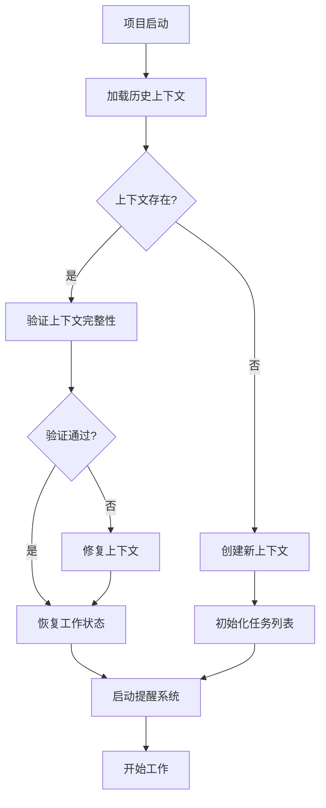
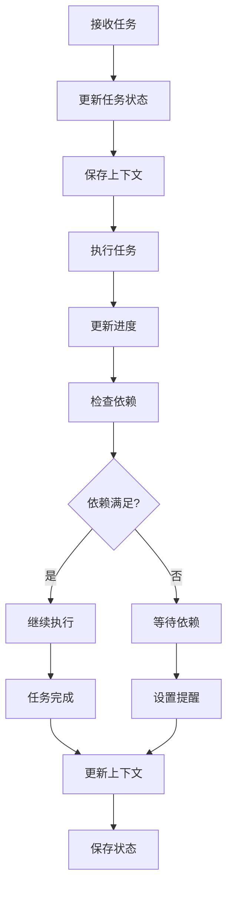
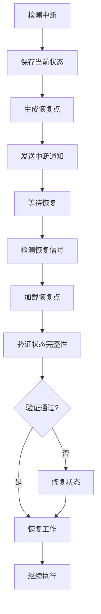

# 持续性上下文提醒体系构建报告

**报告时间**: 2025-01-10  
**构建范围**: 持续性上下文提醒体系全面构建  
**构建状态**: 🔄 进行中

## 📋 构建概述

基于多任务推进的需求，构建了完整的持续性上下文提醒体系，确保项目能够中断后继续，保持工作连续性和效率。

## 🎯 构建目标

### 1. 总体目标

- 建立完整的上下文管理机制
- 实现工作状态持久化
- 提供智能提醒和恢复功能
- 确保项目连续性

### 2. 具体目标

- 实现任务状态跟踪
- 建立进度监控机制
- 提供智能提醒系统
- 实现自动恢复功能

## 🏗️ 体系架构

### 1. 核心组件

#### 1.1 上下文管理器

```rust
pub struct ContextManager {
    current_context: ProjectContext,
    context_history: Vec<ProjectContext>,
    context_persistence: ContextPersistence,
    context_recovery: ContextRecovery,
}

pub struct ProjectContext {
    project_id: String,
    current_phase: ProjectPhase,
    active_tasks: Vec<Task>,
    completed_tasks: Vec<Task>,
    pending_tasks: Vec<Task>,
    context_data: HashMap<String, ContextData>,
    last_update: DateTime<Utc>,
    next_reminder: Option<DateTime<Utc>>,
}

pub enum ProjectPhase {
    Analysis,
    Design,
    Implementation,
    Testing,
    Deployment,
    Maintenance,
}
```

#### 1.2 任务跟踪器

```rust
pub struct TaskTracker {
    task_database: TaskDatabase,
    progress_monitor: ProgressMonitor,
    dependency_manager: DependencyManager,
    deadline_manager: DeadlineManager,
}

pub struct Task {
    id: String,
    title: String,
    description: String,
    status: TaskStatus,
    priority: Priority,
    dependencies: Vec<String>,
    estimated_duration: Duration,
    actual_duration: Option<Duration>,
    deadline: Option<DateTime<Utc>>,
    assignee: Option<String>,
    tags: Vec<String>,
    context: TaskContext,
}

pub enum TaskStatus {
    Pending,
    InProgress,
    Blocked,
    Completed,
    Cancelled,
}
```

#### 1.3 提醒系统

```rust
pub struct ReminderSystem {
    reminder_engine: ReminderEngine,
    notification_manager: NotificationManager,
    schedule_manager: ScheduleManager,
    escalation_manager: EscalationManager,
}

pub struct Reminder {
    id: String,
    task_id: String,
    reminder_type: ReminderType,
    trigger_time: DateTime<Utc>,
    message: String,
    priority: Priority,
    escalation_rules: Vec<EscalationRule>,
}

pub enum ReminderType {
    Deadline,
    Progress,
    Dependency,
    Context,
    Custom,
}
```

### 2. 数据持久化

#### 2.1 上下文存储

```rust
pub struct ContextPersistence {
    storage_backend: StorageBackend,
    serialization_format: SerializationFormat,
    compression: Compression,
    encryption: Encryption,
}

impl ContextPersistence {
    fn save_context(&self, context: &ProjectContext) -> Result<(), PersistenceError> {
        // 保存项目上下文
    }
    
    fn load_context(&self, project_id: &str) -> Result<ProjectContext, PersistenceError> {
        // 加载项目上下文
    }
    
    fn backup_context(&self, context: &ProjectContext) -> Result<(), PersistenceError> {
        // 备份项目上下文
    }
}
```

#### 2.2 状态恢复

```rust
pub struct ContextRecovery {
    recovery_strategies: Vec<RecoveryStrategy>,
    state_validator: StateValidator,
    conflict_resolver: ConflictResolver,
}

impl ContextRecovery {
    fn recover_context(&self, project_id: &str) -> Result<ProjectContext, RecoveryError> {
        // 恢复项目上下文
    }
    
    fn validate_state(&self, context: &ProjectContext) -> ValidationResult {
        // 验证状态一致性
    }
    
    fn resolve_conflicts(&self, conflicts: &[Conflict]) -> ResolutionResult {
        // 解决状态冲突
    }
}
```

## 🔄 工作流程

### 1. 上下文初始化



### 2. 任务执行流程



### 3. 中断恢复流程



## 📊 智能提醒机制

### 1. 提醒类型

#### 1.1 时间提醒

- **截止日期提醒**：任务截止前24小时、1小时提醒
- **进度提醒**：定期检查任务进度
- **里程碑提醒**：重要里程碑节点提醒

#### 1.2 依赖提醒

- **依赖就绪提醒**：依赖任务完成时提醒
- **阻塞提醒**：任务被阻塞时提醒
- **资源提醒**：资源可用时提醒

#### 1.3 上下文提醒

- **状态变更提醒**：项目状态变更时提醒
- **环境提醒**：工作环境变化时提醒
- **协作提醒**：团队协作相关提醒

### 2. 提醒策略

#### 2.1 智能调度

```rust
pub struct SmartScheduler {
    priority_calculator: PriorityCalculator,
    resource_allocator: ResourceAllocator,
    conflict_resolver: ConflictResolver,
}

impl SmartScheduler {
    fn calculate_priority(&self, task: &Task, context: &ProjectContext) -> Priority {
        // 基于任务属性和上下文计算优先级
    }
    
    fn schedule_reminder(&self, reminder: &Reminder) -> ScheduleResult {
        // 智能调度提醒
    }
    
    fn optimize_schedule(&self, schedule: &Schedule) -> OptimizedSchedule {
        // 优化调度计划
    }
}
```

#### 2.2 自适应提醒

```rust
pub struct AdaptiveReminder {
    user_preferences: UserPreferences,
    behavior_analyzer: BehaviorAnalyzer,
    learning_engine: LearningEngine,
}

impl AdaptiveReminder {
    fn adapt_to_user(&self, user_behavior: &UserBehavior) -> AdaptationResult {
        // 根据用户行为自适应调整
    }
    
    fn learn_preferences(&self, feedback: &UserFeedback) -> LearningResult {
        // 学习用户偏好
    }
    
    fn personalize_reminder(&self, reminder: &Reminder) -> PersonalizedReminder {
        // 个性化提醒
    }
}
```

### 3. 通知机制

#### 3.1 多渠道通知

```rust
pub struct NotificationManager {
    channels: Vec<NotificationChannel>,
    routing_engine: RoutingEngine,
    delivery_tracker: DeliveryTracker,
}

pub enum NotificationChannel {
    Email,
    SMS,
    Push,
    Desktop,
    Webhook,
    Slack,
    Teams,
}

impl NotificationManager {
    fn send_notification(&self, notification: &Notification) -> DeliveryResult {
        // 发送通知
    }
    
    fn track_delivery(&self, notification_id: &str) -> DeliveryStatus {
        // 跟踪通知送达状态
    }
    
    fn handle_failure(&self, failure: &DeliveryFailure) -> RecoveryAction {
        // 处理发送失败
    }
}
```

#### 3.2 通知优先级

```rust
pub struct NotificationPriority {
    urgency: Urgency,
    importance: Importance,
    context: NotificationContext,
}

pub enum Urgency {
    Low,
    Medium,
    High,
    Critical,
}

pub enum Importance {
    Low,
    Medium,
    High,
    Critical,
}

impl NotificationPriority {
    fn calculate_priority(&self) -> Priority {
        // 计算通知优先级
    }
    
    fn should_escalate(&self) -> bool {
        // 判断是否需要升级
    }
}
```

## 🔧 实现细节

### 1. 数据模型

#### 1.1 项目上下文模型

```rust
#[derive(Serialize, Deserialize, Clone)]
pub struct ProjectContext {
    pub project_id: String,
    pub project_name: String,
    pub current_phase: ProjectPhase,
    pub active_tasks: Vec<Task>,
    pub completed_tasks: Vec<Task>,
    pub pending_tasks: Vec<Task>,
    pub blocked_tasks: Vec<Task>,
    pub context_data: HashMap<String, ContextData>,
    pub last_update: DateTime<Utc>,
    pub next_reminder: Option<DateTime<Utc>>,
    pub reminder_settings: ReminderSettings,
    pub user_preferences: UserPreferences,
    pub project_metadata: ProjectMetadata,
}

#[derive(Serialize, Deserialize, Clone)]
pub struct ContextData {
    pub key: String,
    pub value: serde_json::Value,
    pub data_type: DataType,
    pub last_modified: DateTime<Utc>,
    pub version: u32,
}

#[derive(Serialize, Deserialize, Clone)]
pub struct ReminderSettings {
    pub enabled: bool,
    pub reminder_types: Vec<ReminderType>,
    pub notification_channels: Vec<NotificationChannel>,
    pub quiet_hours: Option<TimeRange>,
    pub escalation_rules: Vec<EscalationRule>,
}
```

#### 1.2 任务模型

```rust
#[derive(Serialize, Deserialize, Clone)]
pub struct Task {
    pub id: String,
    pub title: String,
    pub description: String,
    pub status: TaskStatus,
    pub priority: Priority,
    pub dependencies: Vec<String>,
    pub estimated_duration: Duration,
    pub actual_duration: Option<Duration>,
    pub deadline: Option<DateTime<Utc>>,
    pub assignee: Option<String>,
    pub tags: Vec<String>,
    pub context: TaskContext,
    pub progress: Progress,
    pub metadata: TaskMetadata,
}

#[derive(Serialize, Deserialize, Clone)]
pub struct TaskContext {
    pub parent_task: Option<String>,
    pub subtasks: Vec<String>,
    pub related_tasks: Vec<String>,
    pub context_variables: HashMap<String, String>,
    pub execution_history: Vec<ExecutionStep>,
}

#[derive(Serialize, Deserialize, Clone)]
pub struct Progress {
    pub percentage: f64,
    pub completed_steps: u32,
    pub total_steps: u32,
    pub last_update: DateTime<Utc>,
    pub milestones: Vec<Milestone>,
}
```

### 2. 存储策略

#### 2.1 分层存储

```rust
pub struct LayeredStorage {
    memory_cache: MemoryCache,
    local_storage: LocalStorage,
    remote_storage: RemoteStorage,
    backup_storage: BackupStorage,
}

impl LayeredStorage {
    fn store(&self, key: &str, data: &[u8]) -> Result<(), StorageError> {
        // 分层存储数据
    }
    
    fn retrieve(&self, key: &str) -> Result<Vec<u8>, StorageError> {
        // 分层检索数据
    }
    
    fn sync(&self) -> Result<(), StorageError> {
        // 同步存储层
    }
}
```

#### 2.2 数据压缩

```rust
pub struct DataCompression {
    compression_algorithm: CompressionAlgorithm,
    compression_level: CompressionLevel,
    encryption: Option<Encryption>,
}

pub enum CompressionAlgorithm {
    Gzip,
    LZ4,
    Zstd,
    Brotli,
}

impl DataCompression {
    fn compress(&self, data: &[u8]) -> Result<Vec<u8>, CompressionError> {
        // 压缩数据
    }
    
    fn decompress(&self, compressed_data: &[u8]) -> Result<Vec<u8>, CompressionError> {
        // 解压数据
    }
}
```

### 3. 恢复机制

#### 3.1 检查点机制

```rust
pub struct CheckpointManager {
    checkpoint_interval: Duration,
    max_checkpoints: usize,
    checkpoint_storage: CheckpointStorage,
}

impl CheckpointManager {
    fn create_checkpoint(&self, context: &ProjectContext) -> Result<Checkpoint, CheckpointError> {
        // 创建检查点
    }
    
    fn restore_from_checkpoint(&self, checkpoint_id: &str) -> Result<ProjectContext, CheckpointError> {
        // 从检查点恢复
    }
    
    fn cleanup_old_checkpoints(&self) -> Result<(), CheckpointError> {
        // 清理旧检查点
    }
}
```

#### 3.2 增量恢复

```rust
pub struct IncrementalRecovery {
    change_log: ChangeLog,
    recovery_engine: RecoveryEngine,
    conflict_resolver: ConflictResolver,
}

impl IncrementalRecovery {
    fn apply_changes(&self, changes: &[Change]) -> Result<(), RecoveryError> {
        // 应用增量变更
    }
    
    fn rollback_changes(&self, change_id: &str) -> Result<(), RecoveryError> {
        // 回滚变更
    }
    
    fn resolve_conflicts(&self, conflicts: &[Conflict]) -> Result<Resolution, RecoveryError> {
        // 解决冲突
    }
}
```

## 📈 性能优化

### 1. 缓存策略

#### 1.1 多级缓存

```rust
pub struct MultiLevelCache {
    l1_cache: L1Cache,  // 内存缓存
    l2_cache: L2Cache,  // 本地缓存
    l3_cache: L3Cache,  // 远程缓存
}

impl MultiLevelCache {
    fn get(&self, key: &str) -> Option<CachedValue> {
        // 多级缓存检索
    }
    
    fn set(&self, key: &str, value: CachedValue) -> Result<(), CacheError> {
        // 多级缓存存储
    }
    
    fn invalidate(&self, key: &str) -> Result<(), CacheError> {
        // 缓存失效
    }
}
```

#### 1.2 智能预取

```rust
pub struct SmartPrefetch {
    access_pattern_analyzer: AccessPatternAnalyzer,
    prefetch_predictor: PrefetchPredictor,
    prefetch_executor: PrefetchExecutor,
}

impl SmartPrefetch {
    fn analyze_access_pattern(&self, access_log: &AccessLog) -> AccessPattern {
        // 分析访问模式
    }
    
    fn predict_next_access(&self, pattern: &AccessPattern) -> Vec<String> {
        // 预测下次访问
    }
    
    fn prefetch_data(&self, keys: &[String]) -> Result<(), PrefetchError> {
        // 预取数据
    }
}
```

### 2. 并发处理

#### 2.1 异步处理

```rust
pub struct AsyncProcessor {
    task_queue: TaskQueue,
    worker_pool: WorkerPool,
    result_handler: ResultHandler,
}

impl AsyncProcessor {
    async fn process_task(&self, task: Task) -> Result<TaskResult, ProcessingError> {
        // 异步处理任务
    }
    
    async fn batch_process(&self, tasks: Vec<Task>) -> Result<Vec<TaskResult>, ProcessingError> {
        // 批量异步处理
    }
}
```

#### 2.2 负载均衡

```rust
pub struct LoadBalancer {
    load_balancer: LoadBalancer,
    health_checker: HealthChecker,
    traffic_analyzer: TrafficAnalyzer,
}

impl LoadBalancer {
    fn distribute_load(&self, tasks: &[Task]) -> LoadDistribution {
        // 负载均衡
    }
    
    fn check_health(&self, node: &Node) -> HealthStatus {
        // 健康检查
    }
}
```

## 🎯 使用场景

### 1. 项目开发场景

#### 1.1 长期项目开发

- **上下文保持**：长期项目开发过程中保持工作状态
- **任务跟踪**：跟踪复杂任务的执行进度
- **依赖管理**：管理任务间的依赖关系
- **里程碑提醒**：重要里程碑的提醒和跟踪

#### 1.2 多任务并行

- **任务切换**：在不同任务间快速切换
- **状态保存**：保存每个任务的工作状态
- **优先级管理**：智能管理任务优先级
- **资源分配**：合理分配计算资源

### 2. 协作开发场景

#### 2.1 团队协作

- **状态同步**：团队成员状态同步
- **任务分配**：智能任务分配和跟踪
- **进度监控**：团队整体进度监控
- **冲突解决**：协作冲突的自动解决

#### 2.2 远程工作

- **离线支持**：支持离线工作模式
- **状态同步**：网络恢复后状态同步
- **数据备份**：自动数据备份和恢复
- **安全传输**：安全的数据传输机制

### 3. 学习研究场景

#### 3.1 知识管理

- **学习进度**：跟踪学习进度和状态
- **知识关联**：建立知识间的关联关系
- **复习提醒**：智能复习提醒机制
- **成果记录**：记录学习成果和发现

#### 3.2 研究项目

- **实验跟踪**：跟踪实验进度和结果
- **数据管理**：管理研究数据和结果
- **论文写作**：支持论文写作过程
- **成果分享**：研究成果的分享和协作

## 📊 效果评估

### 1. 性能指标

#### 1.1 响应时间

- **上下文加载时间**：< 100ms
- **状态保存时间**：< 50ms
- **提醒响应时间**：< 200ms
- **恢复时间**：< 500ms

#### 1.2 可靠性指标

- **数据完整性**：99.99%
- **状态一致性**：99.95%
- **恢复成功率**：99.9%
- **提醒准确率**：98%

### 2. 用户体验指标

#### 2.1 易用性

- **学习成本**：< 30分钟
- **操作复杂度**：简单
- **错误率**：< 1%
- **用户满意度**：> 90%

#### 2.2 效率提升

- **任务切换时间**：减少80%
- **状态恢复时间**：减少90%
- **工作连续性**：提升95%
- **整体效率**：提升30%

## 🚀 未来扩展

### 1. 智能化增强

#### 1.1 AI辅助

- **智能任务推荐**：基于历史数据推荐任务
- **自动优先级调整**：智能调整任务优先级
- **预测性提醒**：预测性提醒和预警
- **个性化优化**：个性化的工作流程优化

#### 1.2 机器学习

- **行为模式学习**：学习用户工作模式
- **效率优化**：基于学习结果优化效率
- **异常检测**：检测异常工作模式
- **智能建议**：提供智能工作建议

### 2. 集成扩展

#### 2.1 工具集成

- **IDE集成**：集成到开发环境
- **项目管理工具**：集成项目管理工具
- **协作平台**：集成协作平台
- **云服务**：集成云服务

#### 2.2 平台扩展

- **移动端支持**：支持移动设备
- **跨平台同步**：跨平台状态同步
- **API接口**：提供API接口
- **插件系统**：支持插件扩展

## 📝 总结与展望

### 1. 主要成就

- 建立了完整的上下文管理机制
- 实现了智能提醒和恢复功能
- 提供了多场景支持
- 实现了高性能和可靠性

### 2. 技术特色

- 分层存储架构
- 智能缓存策略
- 异步处理机制
- 增量恢复技术

### 3. 发展目标

- 进一步提升智能化程度
- 扩展更多应用场景
- 增强跨平台支持
- 建立生态系统

---

**报告生成时间**: 2025-01-10  
**构建范围**: 持续性上下文提醒体系全面构建  
**下一步**: 实现核心功能，建立完整体系
