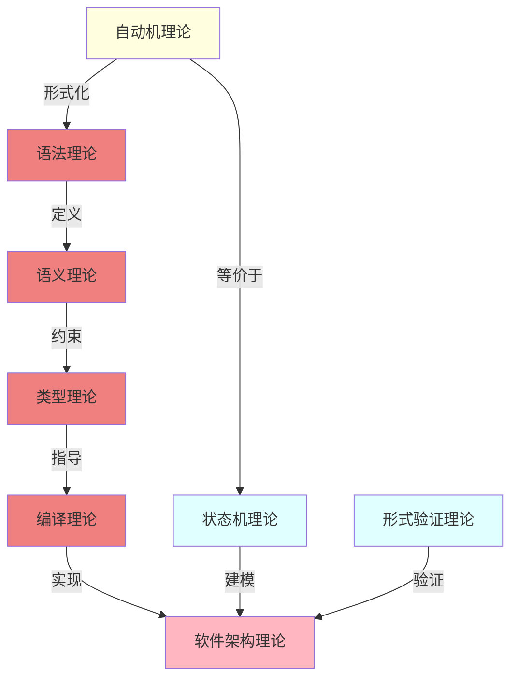

# 核心概念关系图

```mermaid
graph TD
    auto[自动机理论]
    grammar[语法理论]
    semantics[语义理论]
    type[类型理论]
    compile[编译理论]
    arch[软件架构理论]
    state[状态机理论]
    verify[形式验证理论]
    
    auto -->|形式化| grammar
    grammar -->|定义| semantics
    semantics -->|约束| type
    type -->|指导| compile
    compile -->|实现| arch
    state -->|建模| arch
    verify -->|验证| arch
    auto -->|等价于| state
    
    style auto fill:lightyellow
    style grammar fill:lightcoral
    style semantics fill:lightcoral
    style type fill:lightcoral
    style compile fill:lightcoral
    style arch fill:lightpink
    style state fill:lightcyan
    style verify fill:lightcyan
```
