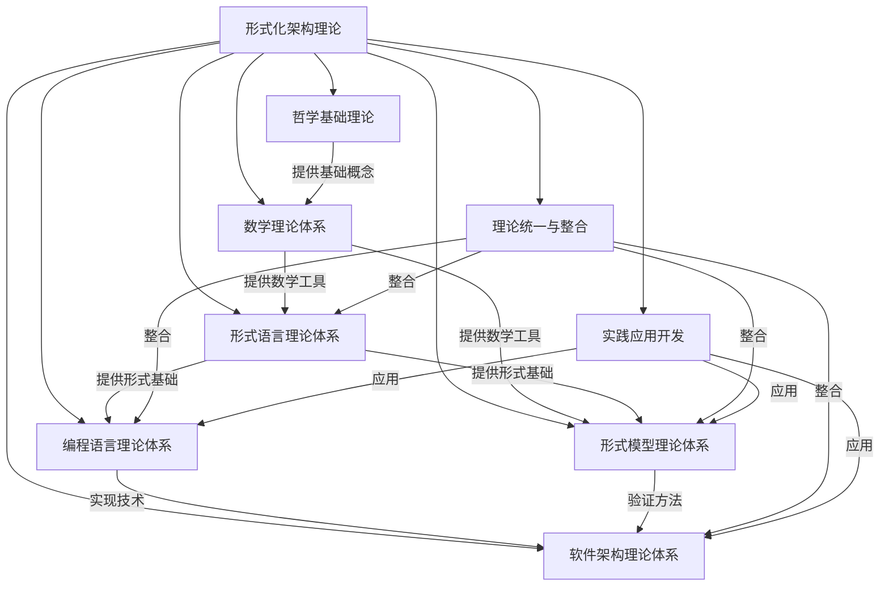
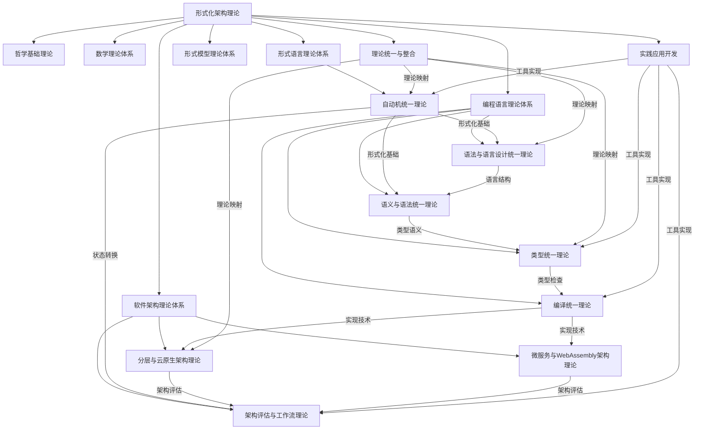
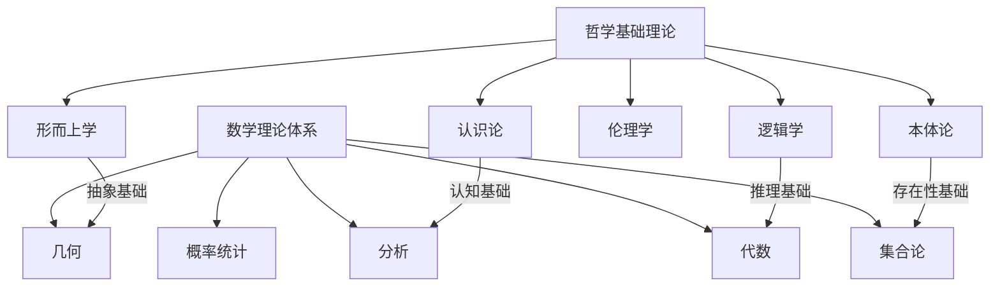
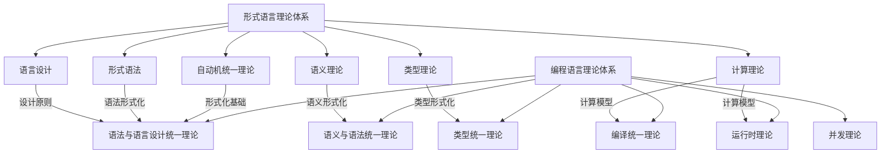
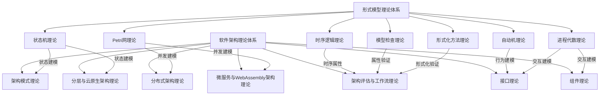
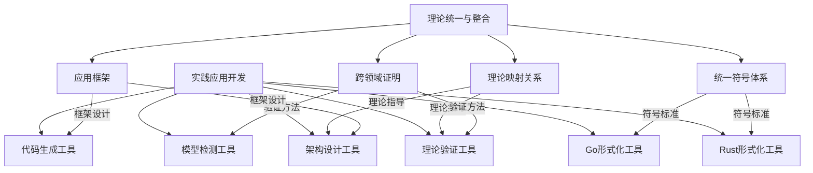
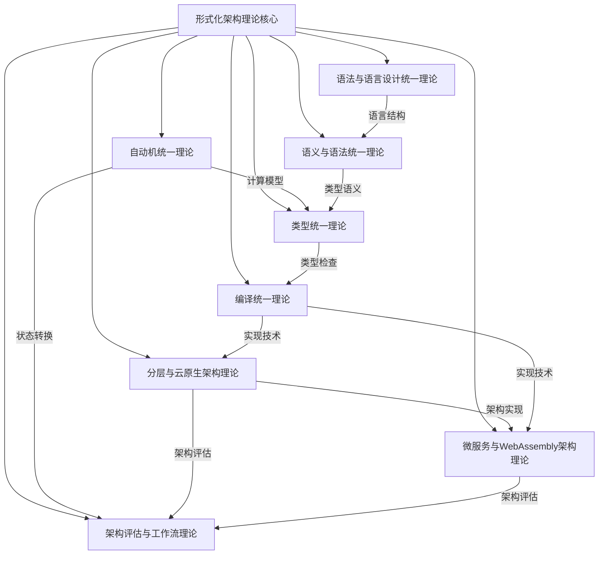

# 理论体系关系图

## 1. 概述

本文档展示了形式化架构理论中不同理论体系之间的关系，通过多层次的图谱展示，帮助理解理论体系的整体结构和内部联系。

## 2. 顶层理论体系关系

## 3. 合并后的理论体系关系

## 4. 哲学与数学基础关系

## 5. 形式语言与编程语言关系

## 6. 软件架构与形式模型关系

## 7. 理论统一与实践应用关系

## 8. 合并后的核心理论关系

## 9. 后续图谱扩展计划

1. **细化理论关系**
   - 增加更多细节层次的理论关系
   - 展示理论之间的依赖和影响关系

2. **动态演化视图**
   - 添加理论发展的时间维度
   - 展示理论融合和分化过程

3. **应用场景映射**
   - 展示理论在不同应用场景中的应用
   - 建立理论与实践的映射关系

4. **交互式关系图**
   - 开发交互式理论关系图浏览工具
   - 支持按需展开和折叠节点
   - 支持按关系类型过滤视图
