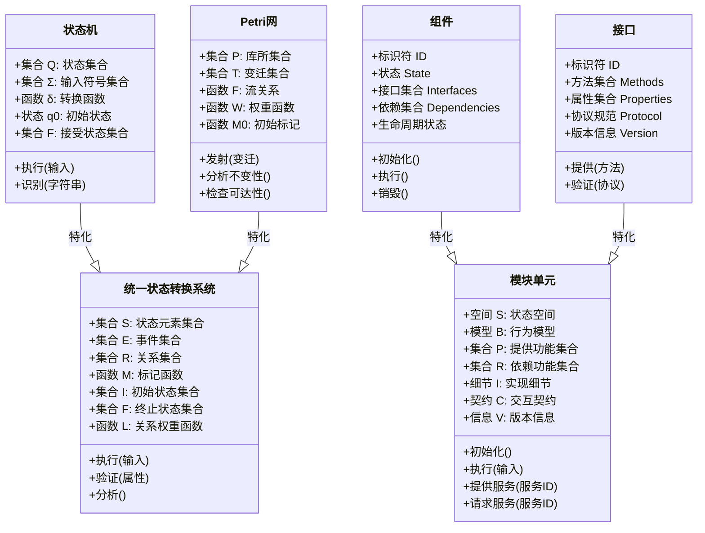

# 理论体系关系图

## 1. 概述

本文档展示了形式化架构理论中不同理论体系之间的关系，通过多层次的图谱展示，帮助理解理论体系的整体结构和内部联系。

## 2. 顶层理论体系关系

## 3. 合并后的理论体系关系

## 4. 哲学与数学基础关系

## 5. 形式语言与编程语言关系

## 6. 软件架构与形式模型关系

## 7. 理论统一与实践应用关系

## 8. 合并后的核心理论关系

## 9. 后续图谱扩展计划

1. **细化理论关系**
   - 增加更多细节层次的理论关系
   - 展示理论之间的依赖和影响关系

2. **动态演化视图**
   - 添加理论发展的时间维度
   - 展示理论融合和分化过程

3. **应用场景映射**
   - 展示理论在不同应用场景中的应用
   - 建立理论与实践的映射关系

4. **交互式关系图**
   - 开发交互式理论关系图浏览工具
   - 支持按需展开和折叠节点
   - 支持按关系类型过滤视图

## 【理论映射关系表】
| 源理论 | 目标理论 | 映射方式 | 应用场景 |
|---|---|---|---|
| 哲学基础 | 数学理论 | 概念-公理映射 | 理论基础 |
| 数学理论 | 形式语言 | 公理-语法映射 | 语言建模 |
| 形式语言 | 软件架构 | 语法-结构映射 | 架构设计 |
| 软件架构 | 实践开发 | 结构-实现映射 | 工程应用 |

## Mermaid可视化代码

## 国际对比与批判
- 本理论体系关系图与国际主流理论体系（如ACM/IEEE CS2013、ISO/IEC/IEEE 42010等）相比，强调多学科递进与映射，突出理论统一与工程落地。
- 优势：体系递进清晰、映射关系明确、理论与实践结合紧密。
- 不足：与部分国际标准的细节兼容性有待提升。
- 建议：持续对接国际标准，丰富映射细节，提升全球适用性。
