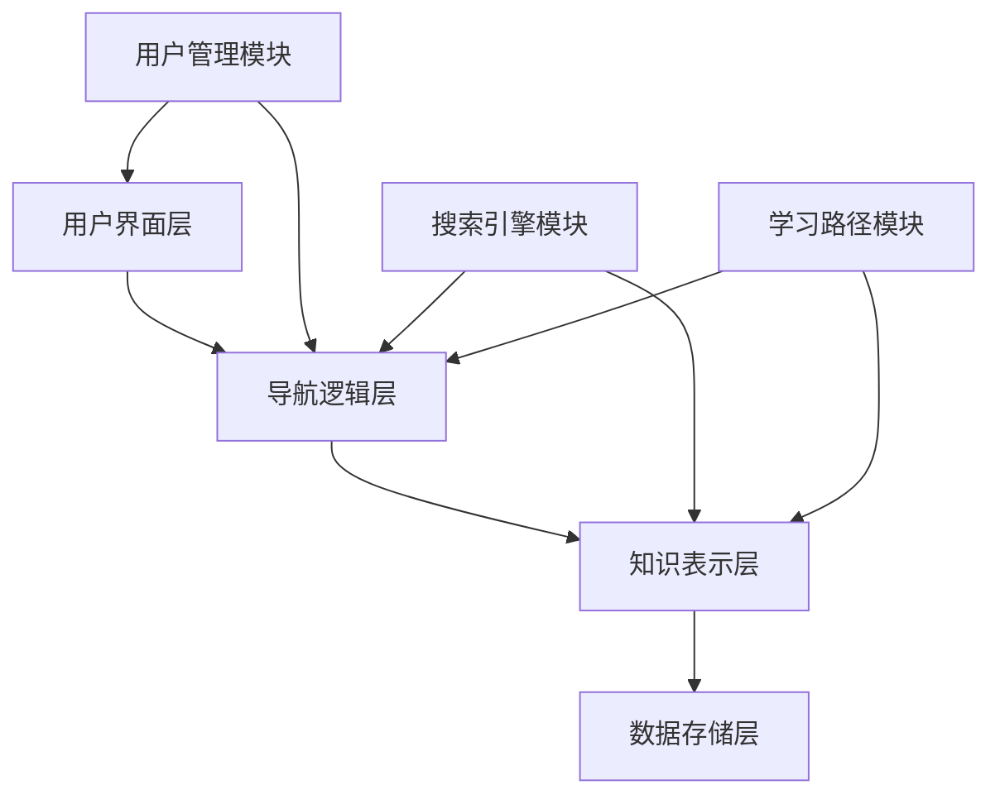

# 理论导航系统设计 - v62

## 1. 概述

本文档描述形式化架构理论项目的理论导航系统设计。该系统旨在为用户提供一个直观、高效的理论探索工具，帮助用户在复杂的形式化架构理论体系中快速定位、理解和应用相关理论。

## 2. 设计目标

1. **理论体系导航**：提供形式化架构理论体系的整体导航
2. **概念关系探索**：支持概念间关系的探索和理解
3. **学习路径规划**：为不同背景的用户提供个性化学习路径
4. **理论应用指导**：指导理论在实际问题中的应用
5. **知识更新跟踪**：跟踪理论体系的更新和演化
6. **交互式学习支持**：提供交互式学习和理解工具

## 3. 系统架构

### 3.1 整体架构



### 3.2 模块说明

1. **用户界面层**
   - 导航界面：提供理论体系的可视化导航
   - 搜索界面：提供概念和理论搜索
   - 学习界面：提供个性化学习路径和内容
   - 应用界面：提供理论应用指导

2. **导航逻辑层**
   - 导航控制：管理导航流程和状态
   - 搜索逻辑：处理搜索请求和结果
   - 学习路径生成：生成个性化学习路径
   - 应用场景映射：将理论映射到应用场景

3. **知识表示层**
   - 理论体系模型：表示理论体系的结构和关系
   - 概念关系模型：表示概念间的关系
   - 学习依赖模型：表示学习内容的依赖关系
   - 应用模式模型：表示理论应用的模式

4. **数据存储层**
   - 理论内容存储：存储理论文档和资源
   - 关系数据存储：存储概念和理论间的关系
   - 用户数据存储：存储用户偏好和学习进度
   - 应用案例存储：存储理论应用案例

5. **用户管理模块**
   - 用户配置：管理用户偏好和设置
   - 学习进度：跟踪用户学习进度
   - 个性化推荐：基于用户特征推荐内容
   - 协作功能：支持用户间协作学习

6. **搜索引擎模块**
   - 全文搜索：支持理论内容全文搜索
   - 语义搜索：支持基于语义的概念搜索
   - 关系搜索：支持基于关系的相关内容搜索
   - 应用场景搜索：支持基于应用场景的理论搜索

7. **学习路径模块**
   - 路径生成：基于用户背景和目标生成学习路径
   - 进度跟踪：跟踪用户在学习路径上的进度
   - 路径调整：根据用户反馈调整学习路径
   - 学习评估：评估用户的学习效果

## 4. 数据模型

### 4.1 理论节点模型

```json
{
  "id": "string",             // 理论唯一标识符
  "name": "string",           // 理论名称
  "type": "string",           // 理论类型（基础理论、应用理论等）
  "description": "string",    // 理论描述
  "content": "string",        // 理论内容或链接
  "prerequisites": [],        // 前置理论列表
  "related": [],              // 相关理论列表
  "applications": [],         // 应用场景列表
  "difficulty": "number",     // 难度级别
  "keywords": [],             // 关键词列表
  "metadata": {               // 元数据
    "created": "timestamp",
    "modified": "timestamp",
    "version": "string",
    "author": "string"
  }
}
```

### 4.2 概念节点模型

```json
{
  "id": "string",             // 概念唯一标识符
  "name": "string",           // 概念名称
  "definition": "string",     // 概念定义
  "theories": [],             // 相关理论列表
  "related_concepts": [],     // 相关概念列表
  "examples": [],             // 示例列表
  "formal_notation": "string", // 形式化表示
  "metadata": {               // 元数据
    "created": "timestamp",
    "modified": "timestamp",
    "version": "string"
  }
}
```

### 4.3 关系模型

```json
{
  "id": "string",             // 关系唯一标识符
  "source": "string",         // 源节点ID
  "target": "string",         // 目标节点ID
  "type": "string",           // 关系类型
  "description": "string",    // 关系描述
  "strength": "number",       // 关系强度
  "bidirectional": "boolean", // 是否双向关系
  "metadata": {               // 元数据
    "created": "timestamp",
    "modified": "timestamp"
  }
}
```

### 4.4 学习路径模型

```json
{
  "id": "string",             // 路径唯一标识符
  "name": "string",           // 路径名称
  "description": "string",    // 路径描述
  "target_audience": "string", // 目标受众
  "difficulty": "string",     // 难度级别
  "estimated_time": "string", // 估计完成时间
  "steps": [                  // 学习步骤
    {
      "id": "string",         // 步骤ID
      "name": "string",       // 步骤名称
      "description": "string", // 步骤描述
      "content_refs": [],     // 内容引用
      "estimated_time": "string", // 估计完成时间
      "dependencies": []      // 依赖步骤
    }
  ],
  "metadata": {               // 元数据
    "created": "timestamp",
    "modified": "timestamp",
    "author": "string"
  }
}
```

### 4.5 用户模型

```json
{
  "id": "string",             // 用户唯一标识符
  "preferences": {            // 用户偏好
    "difficulty": "string",   // 偏好难度
    "focus_areas": [],        // 关注领域
    "learning_style": "string" // 学习风格
  },
  "progress": {               // 学习进度
    "completed_theories": [], // 已完成理论
    "current_paths": [],      // 当前学习路径
    "bookmarks": []           // 书签
  },
  "history": {                // 历史记录
    "viewed_theories": [],    // 已查看理论
    "searched_terms": [],     // 搜索历史
    "applied_scenarios": []   // 应用场景历史
  }
}
```

## 5. 功能设计

### 5.1 理论体系导航功能

1. **层次导航**
   - 理论体系层次浏览
   - 从顶层理论到细节理论的导航
   - 理论体系间的跨域导航

2. **关系导航**
   - 基于理论关系的导航
   - 前置理论和后续理论导航
   - 相关理论推荐

3. **可视化导航**
   - 理论体系图导航
   - 理论关系网络导航
   - 时间线导航

4. **个性化导航**
   - 基于用户背景的导航视图
   - 基于用户兴趣的导航推荐
   - 基于用户历史的导航优化

### 5.2 概念搜索与探索功能

1. **多模式搜索**
   - 关键词搜索
   - 自然语言搜索
   - 形式化表示搜索

2. **语义搜索**
   - 概念相似性搜索
   - 上下位概念搜索
   - 跨域概念映射搜索

3. **关系探索**
   - 概念关系可视化
   - 概念演化追踪
   - 概念应用场景探索

4. **交互式探索**
   - 概念定义交互式解释
   - 概念关系交互式探索
   - 概念应用交互式示例

### 5.3 学习路径规划功能

1. **路径生成**
   - 基于目标的学习路径生成
   - 基于背景的学习路径定制
   - 基于时间约束的学习路径优化

2. **路径可视化**
   - 学习路径图可视化
   - 学习进度可视化
   - 学习依赖可视化

3. **路径调整**
   - 学习路径交互式调整
   - 基于反馈的路径优化
   - 学习困难点识别与辅助

4. **协作学习**
   - 学习路径共享
   - 学习笔记协作
   - 学习讨论与问答

### 5.4 理论应用指导功能

1. **应用场景映射**
   - 理论到应用场景的映射
   - 应用场景到理论的反向映射
   - 跨领域应用模式识别

2. **案例库**
   - 理论应用案例集
   - 案例分析与解释
   - 案例比较与评估

3. **应用模式**
   - 常见应用模式库
   - 应用模式选择指导
   - 应用模式效果评估

4. **实践工具集**
   - 理论应用工具推荐
   - 工具使用指南
   - 工具效果评估

### 5.5 知识更新跟踪功能

1. **更新通知**
   - 理论更新通知
   - 概念更新通知
   - 应用案例更新通知

2. **变更追踪**
   - 理论演化追踪
   - 概念定义变更追踪
   - 关系变更追踪

3. **版本比较**
   - 理论版本比较
   - 概念定义版本比较
   - 学习路径版本比较

4. **个性化更新**
   - 基于用户兴趣的更新过滤
   - 基于用户学习进度的更新推荐
   - 更新影响评估

## 6. 用户界面设计

### 6.1 主界面布局

```
+-------------------------------------------------------+
|                      顶部导航栏                        |
+---------------+-------------------------------------+
|               |                                     |
|               |                                     |
|  侧边导航面板   |             主内容区                 |
|               |                                     |
|               |                                     |
+---------------+-------------------------------------+
|                      状态栏                          |
+-------------------------------------------------------+
```

### 6.2 侧边导航面板

1. **理论体系导航树**
   - 按层次结构显示理论体系
   - 支持展开和折叠
   - 高亮当前位置

2. **概念分类导航**
   - 按领域分类显示概念
   - 按类型分类显示概念
   - 支持多视图切换

3. **学习路径导航**
   - 显示推荐学习路径
   - 显示当前学习进度
   - 提供路径调整选项

4. **收藏与历史**
   - 用户收藏的理论和概念
   - 最近访问历史
   - 学习笔记快速访问

### 6.3 主内容区

1. **理论内容视图**
   - 理论详细内容
   - 相关概念和理论链接
   - 应用案例和示例

2. **概念详情视图**
   - 概念定义和解释
   - 形式化表示
   - 相关概念和理论

3. **关系可视化视图**
   - 概念关系图
   - 理论依赖图
   - 学习路径图

4. **应用指导视图**
   - 应用场景描述
   - 理论应用步骤
   - 案例分析和工具推荐

### 6.4 顶部导航栏

1. **搜索功能**
   - 全局搜索框
   - 高级搜索选项
   - 搜索结果过滤

2. **视图切换**
   - 理论视图
   - 概念视图
   - 应用视图
   - 学习视图

3. **用户功能**
   - 用户设置
   - 学习进度
   - 通知中心

4. **工具菜单**
   - 导出功能
   - 分享功能
   - 帮助和支持

## 7. 技术选型

### 7.1 前端技术

1. **框架**
   - React/Vue.js：用于构建用户界面
   - TypeScript：提供类型安全

2. **UI组件**
   - Ant Design/Material-UI：界面组件
   - React Router/Vue Router：路由管理

3. **可视化库**
   - D3.js：关系可视化
   - ECharts：图表可视化
   - Mermaid：图表生成

### 7.2 后端技术

1. **服务框架**
   - Node.js/Express：API服务
   - GraphQL：灵活数据查询

2. **数据库**
   - MongoDB：文档存储
   - Neo4j：图数据库
   - Redis：缓存层

3. **搜索引擎**
   - Elasticsearch：全文搜索
   - Vector DB：语义搜索

### 7.3 算法与模型

1. **搜索算法**
   - TF-IDF：关键词搜索
   - Word2Vec/BERT：语义搜索
   - PageRank：关系重要性评估

2. **推荐算法**
   - 协同过滤：基于用户行为的推荐
   - 内容过滤：基于内容相似性的推荐
   - 知识图谱推理：基于关系的推荐

3. **路径规划算法**
   - 拓扑排序：学习依赖排序
   - 最短路径：最优学习路径
   - 强化学习：自适应学习路径

## 8. 实现计划

### 8.1 阶段一：基础框架开发（3周）

1. **数据模型设计与实现**
   - 设计并实现理论和概念数据模型
   - 设计并实现关系数据模型
   - 设计并实现用户数据模型

2. **基础导航功能实现**
   - 实现理论体系导航树
   - 实现基本搜索功能
   - 实现简单的理论内容展示

3. **用户界面框架搭建**
   - 实现主界面布局
   - 实现侧边导航面板
   - 实现主内容区基本功能

### 8.2 阶段二：核心功能开发（4周）

1. **高级导航功能实现**
   - 实现关系导航
   - 实现可视化导航
   - 实现个性化导航

2. **搜索与探索功能增强**
   - 实现语义搜索
   - 实现关系探索
   - 实现交互式探索

3. **学习路径功能实现**
   - 实现基本学习路径生成
   - 实现路径可视化
   - 实现学习进度跟踪

### 8.3 阶段三：高级功能开发（4周）

1. **应用指导功能实现**
   - 实现应用场景映射
   - 实现案例库
   - 实现应用模式推荐

2. **知识更新跟踪实现**
   - 实现更新通知
   - 实现变更追踪
   - 实现版本比较

3. **协作功能实现**
   - 实现笔记共享
   - 实现学习路径共享
   - 实现讨论功能

### 8.4 阶段四：优化与集成（3周）

1. **性能优化**
   - 优化数据加载性能
   - 优化搜索性能
   - 优化可视化性能

2. **用户体验优化**
   - 优化导航流程
   - 优化交互反馈
   - 优化视觉设计

3. **系统集成**
   - 与知识图谱可视化工具集成
   - 与文档系统集成
   - 与用户认证系统集成

## 9. 风险与挑战

### 9.1 技术风险

1. **数据模型复杂性**
   - 风险：理论和概念关系的复杂性难以有效建模
   - 应对：采用灵活的图数据模型，迭代优化

2. **搜索精度**
   - 风险：语义搜索难以准确理解用户意图
   - 应对：结合多种搜索技术，提供交互式搜索反馈

3. **学习路径生成质量**
   - 风险：自动生成的学习路径可能不够优化
   - 应对：结合专家知识和用户反馈，迭代改进算法

### 9.2 用户风险

1. **学习曲线**
   - 风险：系统功能丰富但学习曲线陡峭
   - 应对：提供渐进式引导，简化初始界面

2. **内容理解难度**
   - 风险：形式化理论内容本身难以理解
   - 应对：提供多层次解释，从直观到形式化

3. **用户参与度**
   - 风险：用户可能缺乏持续使用的动力
   - 应对：引入游戏化元素，提供成就系统

### 9.3 项目风险

1. **数据质量**
   - 风险：理论内容和关系数据不完整或不准确
   - 应对：建立数据质量检查机制，支持用户反馈

2. **开发资源**
   - 风险：功能丰富但开发资源有限
   - 应对：优先级排序，采用敏捷开发方法

3. **集成复杂性**
   - 风险：与其他系统集成可能面临兼容性问题
   - 应对：采用标准接口，设计松耦合架构

## 10. 总结

本文档详细描述了形式化架构理论项目的理论导航系统设计，包括设计目标、系统架构、数据模型、功能设计、用户界面设计、技术选型、实现计划以及风险与挑战。该系统将为用户提供一个直观、高效的理论探索工具，帮助用户在复杂的形式化架构理论体系中快速定位、理解和应用相关理论。通过与知识图谱可视化工具的集成，将进一步增强用户对形式化架构理论的理解和应用能力。

---

**版本**: v62  
**创建时间**: 2024年7月  
**状态**: 🔄 设计中  
**最后更新**: 2024年7月 