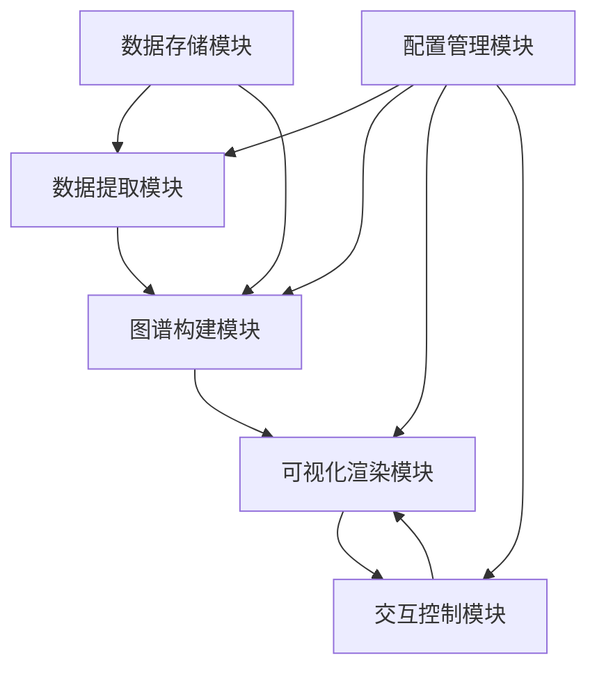

# 知识图谱可视化工具设计 - v62

## 1. 概述

本文档描述形式化架构理论项目的知识图谱可视化工具设计。该工具旨在将项目中的理论体系、概念关系和合并状态以可视化方式呈现，帮助用户理解复杂的理论关系和项目结构。

## 2. 设计目标

1. **直观展示**：以直观的方式展示形式化架构理论的结构和关系
2. **交互探索**：支持用户交互式探索知识图谱
3. **关系追踪**：追踪概念之间的关系和依赖
4. **合并状态可视化**：展示理论合并的状态和进展
5. **可扩展性**：支持知识图谱的持续扩展和更新
6. **多视图支持**：提供多种视图以满足不同的分析需求

## 3. 系统架构

### 3.1 整体架构



### 3.2 模块说明

1. **数据提取模块**
   - 从Markdown文件中提取概念和关系
   - 解析文件结构和交叉引用
   - 提取合并状态和进展信息

2. **图谱构建模块**
   - 构建概念节点和关系边
   - 计算节点属性和关系权重
   - 生成图谱数据模型

3. **可视化渲染模块**
   - 渲染知识图谱
   - 支持多种布局算法
   - 实现节点和边的样式定制

4. **交互控制模块**
   - 处理用户交互事件
   - 支持图谱导航和搜索
   - 实现过滤和聚焦功能

5. **数据存储模块**
   - 存储图谱数据模型
   - 管理图谱版本
   - 支持数据导入和导出

6. **配置管理模块**
   - 管理可视化配置
   - 管理数据提取规则
   - 管理用户偏好设置

## 4. 数据模型

### 4.1 概念节点模型

```json
{
  "id": "string",             // 概念唯一标识符
  "name": "string",           // 概念名称
  "type": "string",           // 概念类型（理论、概念、方法等）
  "description": "string",    // 概念描述
  "source": "string",         // 概念来源文件
  "attributes": {             // 概念属性
    "key1": "value1",
    "key2": "value2"
  },
  "metadata": {               // 元数据
    "created": "timestamp",
    "modified": "timestamp",
    "version": "string"
  }
}
```

### 4.2 关系边模型

```json
{
  "id": "string",             // 关系唯一标识符
  "source": "string",         // 源节点ID
  "target": "string",         // 目标节点ID
  "type": "string",           // 关系类型
  "label": "string",          // 关系标签
  "weight": "number",         // 关系权重
  "attributes": {             // 关系属性
    "key1": "value1",
    "key2": "value2"
  },
  "metadata": {               // 元数据
    "created": "timestamp",
    "modified": "timestamp",
    "version": "string"
  }
}
```

### 4.3 图谱模型

```json
{
  "id": "string",             // 图谱唯一标识符
  "name": "string",           // 图谱名称
  "description": "string",    // 图谱描述
  "nodes": [],                // 节点数组
  "edges": [],                // 边数组
  "metadata": {               // 元数据
    "created": "timestamp",
    "modified": "timestamp",
    "version": "string"
  }
}
```

## 5. 功能设计

### 5.1 数据提取功能

1. **Markdown解析**
   - 解析Markdown文件结构
   - 提取标题和层次关系
   - 识别列表和表格内容

2. **概念提取**
   - 基于关键词和模式识别提取概念
   - 提取概念定义和描述
   - 识别概念类型和属性

3. **关系提取**
   - 识别显式定义的关系
   - 基于上下文推断隐式关系
   - 提取关系类型和属性

4. **交叉引用解析**
   - 解析文件间引用
   - 构建引用图
   - 识别引用类型和上下文

### 5.2 图谱构建功能

1. **节点生成**
   - 为每个概念创建节点
   - 计算节点属性
   - 去重和合并相似节点

2. **边生成**
   - 为每个关系创建边
   - 计算边权重
   - 处理多重关系

3. **层次结构构建**
   - 构建概念层次结构
   - 构建理论体系层次结构
   - 构建文件结构层次结构

4. **聚类分析**
   - 基于关系强度进行聚类
   - 识别概念群组
   - 计算群组间关系

### 5.3 可视化功能

1. **多布局支持**
   - 力导向布局
   - 层次布局
   - 环形布局
   - 矩阵布局

2. **节点样式定制**
   - 基于类型的颜色编码
   - 基于属性的大小变化
   - 自定义图标和形状

3. **边样式定制**
   - 基于类型的颜色编码
   - 基于权重的粗细变化
   - 不同类型的线型表示

4. **标签和注释**
   - 节点标签显示控制
   - 边标签显示控制
   - 悬浮提示和详细信息

### 5.4 交互功能

1. **导航控制**
   - 缩放和平移
   - 概念导航和跳转
   - 历史记录和回溯

2. **搜索和过滤**
   - 关键词搜索
   - 属性过滤
   - 关系类型过滤

3. **详情查看**
   - 节点详情面板
   - 关系详情面板
   - 相关概念推荐

4. **编辑功能**
   - 添加自定义注释
   - 创建自定义视图
   - 标记重要概念和关系

### 5.5 分析功能

1. **路径分析**
   - 概念间最短路径
   - 关系链分析
   - 影响传播分析

2. **中心性分析**
   - 度中心性
   - 介数中心性
   - 特征向量中心性

3. **社区检测**
   - 概念社区识别
   - 理论体系边界检测
   - 交叉领域识别

4. **时间演化分析**
   - 概念演化跟踪
   - 理论体系发展分析
   - 合并进展可视化

## 6. 用户界面设计

### 6.1 主界面布局

```text
+-------------------------------------------------------+
|                      工具栏                            |
+---------------+-------------------------------------+
|               |                                     |
|               |                                     |
|  导航面板      |             图谱视图                 |
|               |                                     |
|               |                                     |
+---------------+-------------------------------------+
|                      状态栏                          |
+-------------------------------------------------------+
```

### 6.2 导航面板

1. **理论体系导航树**
   - 显示理论体系层次结构
   - 支持展开和折叠
   - 高亮当前选中项

2. **概念分类导航**
   - 按类型分组显示概念
   - 支持多级分类
   - 提供快速过滤

3. **搜索面板**
   - 关键词搜索框
   - 高级搜索选项
   - 搜索历史记录

4. **书签和收藏**
   - 用户收藏的视图
   - 重要概念书签
   - 自定义分组

### 6.3 图谱视图

1. **主视图**
   - 显示知识图谱
   - 支持交互操作
   - 多种布局切换

2. **迷你地图**
   - 显示整体结构
   - 当前视图位置指示
   - 快速导航功能

3. **详情面板**
   - 显示选中节点或边的详细信息
   - 相关概念列表
   - 来源文件链接

4. **控制面板**
   - 布局控制
   - 过滤控制
   - 样式控制

### 6.4 工具栏

1. **文件操作**
   - 打开图谱
   - 保存图谱
   - 导出图谱

2. **视图控制**
   - 缩放控制
   - 布局切换
   - 重置视图

3. **分析工具**
   - 路径分析
   - 中心性分析
   - 社区检测

4. **设置和帮助**
   - 偏好设置
   - 帮助文档
   - 关于信息

## 7. 技术选型

### 7.1 前端技术

1. **框架**
   - React/Vue.js：用于构建用户界面
   - TypeScript：提供类型安全

2. **可视化库**
   - D3.js：底层可视化引擎
   - Cytoscape.js：图谱可视化
   - Three.js：3D可视化（可选）

3. **UI组件**
   - Ant Design/Material-UI：界面组件
   - React Flow/Vue Flow：流程图组件

### 7.2 后端技术

1. **服务框架**
   - Node.js/Express：轻量级服务
   - Python/FastAPI：数据处理服务

2. **图数据库**
   - Neo4j：存储知识图谱
   - JanusGraph：分布式图数据库（可选）

3. **数据处理**
   - NLTK/spaCy：自然语言处理
   - NetworkX：图算法库

### 7.3 数据存储

1. **文件存储**
   - JSON/YAML：图谱数据格式
   - Git：版本控制

2. **数据库**
   - MongoDB：文档存储
   - Redis：缓存

## 8. 实现计划

### 8.1 阶段一：原型开发（2周）

1. **数据模型设计**
   - 定义节点和边模型
   - 设计图谱数据结构
   - 创建示例数据

2. **基础可视化实现**
   - 实现基本图谱渲染
   - 支持简单交互
   - 实现基本布局

3. **数据提取原型**
   - 实现基本Markdown解析
   - 提取简单概念和关系
   - 生成测试图谱

### 8.2 阶段二：核心功能开发（3周）

1. **数据提取增强**
   - 完善概念和关系提取
   - 实现交叉引用解析
   - 支持批量处理

2. **可视化功能完善**
   - 实现多种布局
   - 完善节点和边样式
   - 实现标签和注释

3. **交互功能实现**
   - 实现导航控制
   - 实现搜索和过滤
   - 实现详情查看

### 8.3 阶段三：高级功能开发（3周）

1. **分析功能实现**
   - 实现路径分析
   - 实现中心性分析
   - 实现社区检测

2. **用户界面完善**
   - 实现完整导航面板
   - 完善图谱视图
   - 实现工具栏功能

3. **数据管理功能**
   - 实现图谱保存和加载
   - 实现版本管理
   - 实现数据导出

### 8.4 阶段四：测试和优化（2周）

1. **功能测试**
   - 测试所有功能点
   - 修复发现的问题
   - 完善错误处理

2. **性能优化**
   - 优化大规模图谱渲染
   - 优化数据处理性能
   - 优化交互响应速度

3. **用户体验优化**
   - 优化界面布局
   - 完善操作流程
   - 添加帮助和提示

## 9. 风险与挑战

### 9.1 技术风险

1. **大规模图谱性能**
   - 风险：大规模图谱渲染和交互性能不足
   - 应对：采用分层渲染和数据聚合技术

2. **数据提取准确性**
   - 风险：自动提取的概念和关系不准确
   - 应对：结合人工验证和机器学习改进

3. **跨平台兼容性**
   - 风险：不同浏览器和设备上表现不一致
   - 应对：采用标准技术栈和兼容性测试

### 9.2 项目风险

1. **需求变更**
   - 风险：需求频繁变更导致开发延迟
   - 应对：采用敏捷开发方法，优先实现核心功能

2. **资源限制**
   - 风险：开发资源不足
   - 应对：优先级排序，合理分配资源

3. **用户接受度**
   - 风险：工具不符合用户习惯，接受度低
   - 应对：早期引入用户反馈，迭代改进

## 10. 总结

本文档详细描述了形式化架构理论项目的知识图谱可视化工具设计，包括设计目标、系统架构、数据模型、功能设计、用户界面设计、技术选型、实现计划以及风险与挑战。通过该工具的开发和应用，将大大提高形式化架构理论的可理解性和可访问性，促进理论的传播和应用。

---

**版本**: v62  
**创建时间**: 2024年7月  
**状态**: 🔄 设计中  
**最后更新**: 2024年7月
