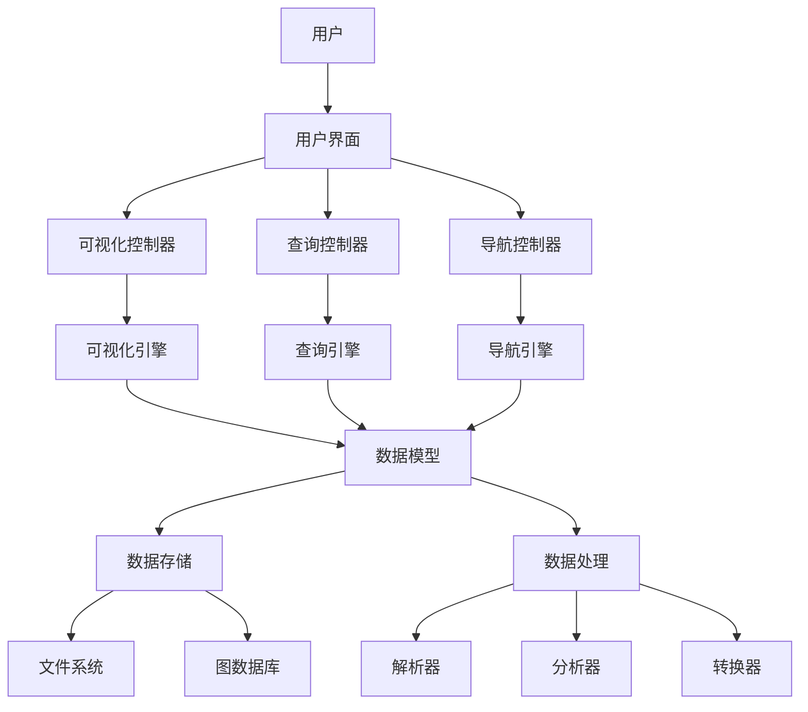

# 知识图谱可视化工具设计-v62

## 1. 概述

知识图谱可视化工具旨在为形式化架构理论项目提供直观、交互式的知识图谱可视化功能，帮助用户理解理论体系、概念关系和项目结构。本文档详细描述了该工具的设计方案，包括系统架构、数据模型、功能需求、界面设计和实现路线图。

## 2. 系统架构

### 2.1 整体架构



### 2.2 核心组件

1. **用户界面 (UI)**
   - 图谱显示区域
   - 控制面板
   - 查询界面
   - 导航界面
   - 详情面板

2. **可视化引擎 (VE)**
   - 图形渲染器
   - 布局管理器
   - 交互控制器
   - 样式管理器

3. **查询引擎 (QE)**
   - 查询解析器
   - 查询执行器
   - 结果格式化器

4. **导航引擎 (NE)**
   - 路径规划器
   - 历史记录管理器
   - 书签管理器

5. **数据模型 (DM)**
   - 节点模型
   - 关系模型
   - 属性模型
   - 图谱模型

6. **数据存储 (DS)**
   - 文件适配器
   - 数据库适配器
   - 缓存管理器

7. **数据处理 (DP)**
   - Markdown解析器
   - 知识提取器
   - 关系分析器
   - 图谱转换器

## 3. 数据模型

### 3.1 核心数据结构

#### 3.1.1 节点模型

```typescript
interface Node {
  id: string;               // 唯一标识符
  type: NodeType;           // 节点类型
  label: string;            // 显示标签
  description?: string;     // 描述信息
  properties: Property[];   // 属性列表
  source: Source;           // 来源信息
  metadata: Metadata;       // 元数据
}

enum NodeType {
  CONCEPT,                  // 概念
  THEORY,                   // 理论
  FILE,                     // 文件
  DIRECTORY,                // 目录
  EXAMPLE,                  // 示例
  TOOL,                     // 工具
  TASK                      // 任务
}
```

#### 3.1.2 关系模型

```typescript
interface Relation {
  id: string;               // 唯一标识符
  type: RelationType;       // 关系类型
  label: string;            // 显示标签
  source: string;           // 源节点ID
  target: string;           // 目标节点ID
  properties: Property[];   // 属性列表
  weight: number;           // 关系权重
  metadata: Metadata;       // 元数据
}

enum RelationType {
  IS_A,                     // 是一种
  PART_OF,                  // 是部分
  DEPENDS_ON,               // 依赖于
  REFERENCES,               // 引用
  IMPLEMENTS,               // 实现
  EXTENDS,                  // 扩展
  RELATES_TO,               // 相关
  TRANSFORMS_TO,            // 转换为
  LOCATED_IN                // 位于
}
```

#### 3.1.3 属性模型

```typescript
interface Property {
  key: string;              // 属性键
  value: any;               // 属性值
  type: PropertyType;       // 属性类型
}

enum PropertyType {
  STRING,                   // 字符串
  NUMBER,                   // 数字
  BOOLEAN,                  // 布尔值
  DATE,                     // 日期
  ARRAY,                    // 数组
  OBJECT                    // 对象
}
```

#### 3.1.4 图谱模型

```typescript
interface KnowledgeGraph {
  id: string;               // 唯一标识符
  name: string;             // 图谱名称
  description?: string;     // 描述信息
  nodes: Node[];            // 节点列表
  relations: Relation[];    // 关系列表
  metadata: Metadata;       // 元数据
  views: View[];            // 视图列表
}

interface View {
  id: string;               // 唯一标识符
  name: string;             // 视图名称
  description?: string;     // 描述信息
  filter: Filter;           // 过滤器
  layout: Layout;           // 布局
  style: Style;             // 样式
}
```

### 3.2 数据存储格式

#### 3.2.1 JSON格式

```json
{
  "id": "theory-graph-v62",
  "name": "形式化架构理论知识图谱",
  "description": "展示形式化架构理论项目的理论体系和概念关系",
  "nodes": [
    {
      "id": "n1",
      "type": "THEORY",
      "label": "形式语言理论",
      "description": "研究形式语言的理论体系",
      "properties": [
        {
          "key": "field",
          "value": "计算机科学",
          "type": "STRING"
        }
      ],
      "source": {
        "file": "形式语言理论体系/README.md",
        "line": 10
      },
      "metadata": {
        "created": "2023-06-01",
        "modified": "2023-06-10"
      }
    }
  ],
  "relations": [
    {
      "id": "r1",
      "type": "PART_OF",
      "label": "是部分",
      "source": "n2",
      "target": "n1",
      "properties": [],
      "weight": 1.0,
      "metadata": {
        "created": "2023-06-01",
        "confidence": 0.95
      }
    }
  ],
  "metadata": {
    "created": "2023-06-01",
    "modified": "2023-06-15",
    "version": "1.0"
  },
  "views": [
    {
      "id": "v1",
      "name": "理论体系视图",
      "description": "展示理论体系的层次结构",
      "filter": {
        "nodeTypes": ["THEORY", "CONCEPT"],
        "relationTypes": ["IS_A", "PART_OF"]
      },
      "layout": {
        "type": "hierarchical",
        "direction": "TB"
      },
      "style": {
        "node": {
          "THEORY": {
            "shape": "rectangle",
            "color": "#4CAF50"
          },
          "CONCEPT": {
            "shape": "ellipse",
            "color": "#2196F3"
          }
        },
        "relation": {
          "IS_A": {
            "style": "solid",
            "color": "#000000"
          },
          "PART_OF": {
            "style": "dashed",
            "color": "#666666"
          }
        }
      }
    }
  ]
}
```

#### 3.2.2 图数据库模式

使用属性图模型，如Neo4j或TigerGraph：

- 节点标签：对应NodeType
- 节点属性：对应Node的属性
- 关系类型：对应RelationType
- 关系属性：对应Relation的属性

## 4. 功能需求

### 4.1 基本功能

1. **知识图谱可视化**
   - 显示节点和关系
   - 支持多种布局算法
   - 支持缩放和平移
   - 支持节点和关系的样式定制

2. **交互功能**
   - 点击节点/关系显示详情
   - 拖拽节点调整位置
   - 展开/折叠节点
   - 高亮相关节点和路径

3. **查询功能**
   - 关键词搜索
   - 高级查询（基于属性和关系）
   - 路径查询
   - 相似性查询

4. **导航功能**
   - 导航历史记录
   - 书签管理
   - 导航路径推荐
   - 层次导航

### 4.2 高级功能

1. **知识提取**
   - 从Markdown文件提取知识
   - 识别概念和关系
   - 构建初始知识图谱

2. **图谱分析**
   - 中心性分析
   - 社区发现
   - 路径分析
   - 相似性分析

3. **图谱编辑**
   - 添加/编辑/删除节点
   - 添加/编辑/删除关系
   - 批量操作
   - 版本管理

4. **导出与分享**
   - 导出为图像
   - 导出为交互式HTML
   - 导出为JSON/CSV
   - 分享链接和嵌入代码

## 5. 界面设计

### 5.1 主界面布局

```text
+-----------------------------------------------+
|                   工具栏                       |
+-----------------------------------------------+
|        |                                      |
|        |                                      |
|        |                                      |
|  导航  |             图谱显示区域               |
|  面板  |                                      |
|        |                                      |
|        |                                      |
+-----------------------------------------------+
|                   状态栏                       |
+-----------------------------------------------+
```

### 5.2 交互设计

1. **图谱显示区域**
   - 左键点击：选择节点/关系
   - 右键点击：显示上下文菜单
   - 滚轮：缩放图谱
   - 拖拽：平移图谱
   - 双击节点：展开/折叠节点

2. **导航面板**
   - 树形结构导航
   - 搜索框
   - 过滤器
   - 书签列表
   - 历史记录

3. **工具栏**
   - 视图选择
   - 布局选择
   - 缩放控制
   - 搜索框
   - 操作按钮（导出、编辑、分析等）

4. **详情面板**
   - 显示选中节点/关系的详情
   - 显示相关节点和关系
   - 提供编辑功能
   - 显示来源信息和链接

### 5.3 视觉设计

1. **节点表示**
   - 形状：根据节点类型
   - 颜色：根据节点类型或属性
   - 大小：根据重要性或连接数
   - 标签：显示节点名称

2. **关系表示**
   - 线型：根据关系类型
   - 颜色：根据关系类型或权重
   - 粗细：根据关系权重
   - 标签：显示关系名称

3. **布局**
   - 层次布局：适合展示层次结构
   - 力导向布局：适合展示网络结构
   - 环形布局：适合展示中心-外围关系
   - 矩阵布局：适合展示密集关系

## 6. 实现技术

### 6.1 前端技术

1. **框架**
   - React/Vue.js：UI框架
   - D3.js/Cytoscape.js：图可视化库
   - TypeScript：类型安全

2. **UI组件**
   - Ant Design/Material UI：组件库
   - Monaco Editor：代码编辑器
   - React Flow：流程图组件

3. **状态管理**
   - Redux/Vuex：状态管理
   - React Query：数据获取和缓存

### 6.2 后端技术

1. **服务框架**
   - Node.js/Express：API服务
   - GraphQL：查询语言
   - WebSocket：实时通信

2. **数据存储**
   - Neo4j/TigerGraph：图数据库
   - MongoDB：文档数据库
   - Redis：缓存

3. **知识处理**
   - NLP.js：自然语言处理
   - OpenAI GPT：文本理解
   - Markdown-it：Markdown解析

### 6.3 部署方案

1. **独立应用**
   - Electron：跨平台桌面应用
   - PWA：渐进式Web应用

2. **Web服务**
   - Docker：容器化
   - Kubernetes：容器编排
   - AWS/Azure/GCP：云服务

## 7. 开发路线图

### 7.1 阶段一：基础功能（1-2个月）

1. **数据模型设计**
   - 定义核心数据结构
   - 设计存储格式
   - 实现数据转换

2. **基础可视化**
   - 实现节点和关系的可视化
   - 支持基本布局算法
   - 实现基本交互功能

3. **简单查询**
   - 实现关键词搜索
   - 实现基本过滤
   - 实现简单路径查询

### 7.2 阶段二：核心功能（2-3个月）

1. **高级可视化**
   - 实现多种布局算法
   - 支持自定义样式
   - 实现高级交互功能

2. **知识提取**
   - 实现Markdown解析
   - 实现概念和关系提取
   - 构建初始知识图谱

3. **高级查询**
   - 实现高级查询语言
   - 支持复杂过滤
   - 实现相似性查询

4. **导航功能**
   - 实现导航历史
   - 实现书签管理
   - 实现导航推荐

### 7.3 阶段三：高级功能（3-4个月）

1. **图谱分析**
   - 实现中心性分析
   - 实现社区发现
   - 实现路径分析

2. **图谱编辑**
   - 实现节点和关系编辑
   - 支持批量操作
   - 实现版本管理

3. **导出与分享**
   - 支持多种导出格式
   - 实现交互式HTML导出
   - 实现分享功能

4. **集成与优化**
   - 与其他工具集成
   - 性能优化
   - 用户体验改进

## 8. 评估与测试

### 8.1 性能指标

1. **加载性能**
   - 初始加载时间 < 3秒
   - 大型图谱加载时间 < 10秒
   - 内存占用 < 500MB

2. **交互性能**
   - 交互响应时间 < 100ms
   - 缩放/平移帧率 > 30fps
   - 查询响应时间 < 1秒

3. **可扩展性**
   - 支持节点数 > 10,000
   - 支持关系数 > 50,000
   - 支持并发用户数 > 100

### 8.2 测试计划

1. **单元测试**
   - 数据模型测试
   - 算法测试
   - 组件测试

2. **集成测试**
   - API集成测试
   - 组件集成测试
   - 数据流测试

3. **性能测试**
   - 加载性能测试
   - 交互性能测试
   - 并发性能测试

4. **用户测试**
   - 可用性测试
   - A/B测试
   - 满意度调查

## 9. 风险与挑战

### 9.1 技术风险

1. **性能风险**
   - 大型图谱渲染性能问题
   - 复杂查询性能问题
   - 内存占用过高

2. **兼容性风险**
   - 浏览器兼容性问题
   - 设备兼容性问题
   - 数据格式兼容性问题

3. **技术栈风险**
   - 技术选型不当
   - 第三方库维护问题
   - 技术栈更新过快

### 9.2 项目风险

1. **范围风险**
   - 需求不明确
   - 范围蔓延
   - 优先级冲突

2. **资源风险**
   - 开发资源不足
   - 技术能力不足
   - 时间不足

3. **用户风险**
   - 用户接受度低
   - 学习曲线陡峭
   - 用户需求变化

### 9.3 风险应对策略

1. **技术风险应对**
   - 早期性能测试和优化
   - 渐进增强的兼容性策略
   - 技术选型评估和验证

2. **项目风险应对**
   - 敏捷开发方法
   - 优先级管理
   - 定期需求评审

3. **用户风险应对**
   - 早期用户参与
   - 迭代式用户反馈
   - 提供培训和文档

## 10. 结论

知识图谱可视化工具将为形式化架构理论项目提供强大的可视化和交互功能，帮助用户理解复杂的理论体系和概念关系。通过分阶段开发，我们将首先实现基础功能，然后逐步添加高级功能，最终提供一个全面、高效、易用的知识图谱工具。

该工具不仅可以用于形式化架构理论项目，还可以扩展到其他领域的知识图谱可视化，具有广泛的应用前景。通过持续的迭代和改进，我们将不断提升工具的功能和用户体验，为知识管理和探索提供有力支持。

---

**版本**: v62  
**创建时间**: 2024年7月  
**状态**: 🔄 设计中  
**最后更新**: 2024年7月
