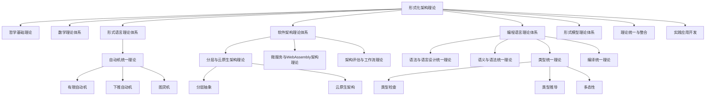

# 知识图谱生成工具

## 1. 概述

本工具用于从形式化架构理论项目中提取核心概念和关系，生成知识图谱，帮助理解项目的整体结构和概念间的关联。

## 2. 功能

1. **概念提取**: 从所有文档中提取核心概念
2. **关系识别**: 识别概念之间的关系
3. **图谱生成**: 生成可视化的知识图谱
4. **层次结构**: 展示概念的层次结构
5. **交叉引用**: 展示不同理论领域间的交叉引用

## 3. 核心概念分类

### 3.1 哲学基础理论概念

- 本体论
- 认识论
- 逻辑学
- 伦理学
- 形而上学

### 3.2 数学理论体系概念

- 集合论
- 代数
- 分析
- 几何
- 概率统计

### 3.3 形式语言理论体系概念

- 自动机
- 形式语法
- 语义理论
- 类型理论
- 计算理论
- 语言设计

### 3.4 软件架构理论体系概念

- 架构模式
- 组件
- 接口
- 分层架构
- 分布式架构
- 微服务架构
- 架构评估

### 3.5 编程语言理论体系概念

- 语法理论
- 语义理论
- 类型理论
- 编译理论
- 运行时理论
- 并发理论
- 语言设计理论

### 3.6 形式模型理论体系概念

- 状态机
- Petri网
- 时序逻辑
- 模型检查
- 自动机
- 进程代数
- 形式化方法

### 3.7 理论统一与整合概念

- 理论映射
- 统一符号体系
- 跨领域证明
- 应用框架

### 3.8 实践应用开发概念

- Rust形式化工具
- Go形式化工具
- 理论验证工具
- 架构设计工具
- 模型检测工具
- 代码生成工具

## 4. 合并后的核心概念

### 4.1 自动机统一理论概念

- 有限自动机
- 下推自动机
- 图灵机
- 状态转换系统
- 形式语言识别
- 状态可达性

### 4.2 分层与云原生架构理论概念

- 分层抽象
- 云原生架构
- 弹性层级
- 服务隔离
- 容器化架构

### 4.3 微服务与WebAssembly架构理论概念

- 微服务边界
- WebAssembly模块
- 跨平台服务
- 边缘计算
- 服务网格

### 4.4 语法与语言设计统一理论概念

- 语法抽象
- 设计原则
- 表达能力
- 语法约束
- 设计模式

### 4.5 类型统一理论概念

- 类型检查
- 类型推导
- 多态性
- 子类型关系
- 依赖类型

## 5. 知识图谱生成方法

1. **概念提取**:
   - 使用关键词提取技术
   - 基于领域词典过滤
   - 频率和重要性分析

2. **关系识别**:
   - 共现分析
   - 句法依存分析
   - 语义关系提取

3. **图谱构建**:
   - 概念作为节点
   - 关系作为边
   - 层次结构表示

4. **可视化**:
   - 使用Mermaid图表
   - 交互式知识图谱
   - 多维度展示

## 6. 示例图谱

## 7. 后续工作

1. **工具自动化**: 开发自动化工具，从文档中提取概念和关系
2. **交互式图谱**: 开发交互式知识图谱浏览工具
3. **动态更新**: 实现知识图谱的动态更新机制
4. **个性化视图**: 支持根据用户需求生成个性化知识图谱视图
