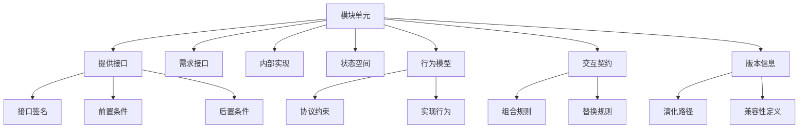

# 组件理论与接口理论概念映射 - v62

## 1. 概述

本文档提供组件理论与接口理论之间的概念映射，为后续合并这两个理论体系提供基础。组件理论关注系统的模块化结构和内部实现，而接口理论关注模块间的交互协议和契约。这两个理论在软件架构中紧密相关，合并它们可以提供更加完整的模块化系统理论框架。

## 2. 核心概念映射

### 2.1 基本概念映射表

| 组件理论概念 | 接口理论概念 | 映射关系 | 统一概念 |
|------------|------------|---------|---------|
| 组件 | 接口提供者 | 组件实现并提供接口 | 模块单元 |
| 组件依赖 | 接口需求 | 组件依赖对应接口需求 | 依赖关系 |
| 组件组合 | 接口组合 | 组件组合需要接口兼容 | 系统组合 |
| 组件行为 | 接口协议 | 组件行为应符合接口协议 | 交互行为 |
| 组件状态 | 接口状态 | 组件状态影响接口状态 | 系统状态 |
| 组件生命周期 | 接口版本 | 组件生命周期包含接口版本演化 | 演化模型 |
| 组件替换性 | 接口兼容性 | 组件替换需要接口兼容 | 替换兼容性 |
| 组件封装 | 接口抽象 | 组件通过接口实现封装 | 抽象封装 |
| 组件规范 | 接口契约 | 组件规范实现接口契约 | 行为契约 |
| 组件测试 | 接口测试 | 组件测试包含接口测试 | 验证测试 |

### 2.2 形式化定义映射

#### 组件理论形式化定义

组件 $C$ 可以形式化定义为一个五元组 $(S, B, P, R, I)$，其中：

- $S$ 是组件的状态空间
- $B$ 是组件的行为模型
- $P$ 是组件提供的功能集合
- $R$ 是组件依赖的功能集合
- $I$ 是组件的实现细节

#### 接口理论形式化定义

接口 $I$ 可以形式化定义为一个四元组 $(Sig, Pre, Post, Pro)$，其中：

- $Sig$ 是接口的签名（方法名和参数类型）
- $Pre$ 是接口的前置条件
- $Post$ 是接口的后置条件
- $Pro$ 是接口的协议（调用顺序约束）

#### 映射关系

- 组件的提供功能 $P$ 对应接口的签名 $Sig$
- 组件的行为模型 $B$ 对应接口的协议 $Pro$
- 组件的状态空间 $S$ 影响接口的前置条件 $Pre$ 和后置条件 $Post$
- 组件的依赖功能 $R$ 对应其需要的接口集合

#### 统一形式化定义

模块单元 $M$ 可以定义为一个七元组 $(S, B, P, R, I, C, V)$，其中：

- $S$ 是模块的状态空间
- $B$ 是模块的行为模型
- $P$ 是模块提供的功能集合（带签名、前置条件和后置条件）
- $R$ 是模块依赖的功能集合
- $I$ 是模块的实现细节
- $C$ 是模块的交互契约
- $V$ 是模块的版本信息

## 3. 理论关系分析

### 3.1 相互依赖关系

组件理论和接口理论之间存在密切的相互依赖关系：

1. **实现依赖**：组件通过实现接口来提供功能
2. **规范依赖**：接口为组件提供行为规范
3. **组合依赖**：系统组合需要组件和接口的协同
4. **演化依赖**：接口演化影响组件演化，反之亦然

### 3.2 理论互补性

两个理论在以下方面相互补充：

1. **关注点互补**：组件理论关注实现，接口理论关注交互
2. **抽象层次互补**：组件理论偏向具体，接口理论偏向抽象
3. **设计视角互补**：组件理论从提供者视角，接口理论从使用者视角
4. **验证方法互补**：组件验证关注内部正确性，接口验证关注交互正确性

### 3.3 理论冲突点

两个理论可能存在的冲突点：

1. **粒度不一致**：组件和接口的粒度定义可能不一致
2. **行为描述差异**：组件行为和接口协议的描述方式可能不同
3. **状态可见性**：组件内部状态对接口的可见性问题
4. **演化策略差异**：组件和接口的演化策略可能不同

## 4. 统一模型构建

### 4.1 统一概念框架

### 4.2 统一操作语义

| 操作 | 组件视角 | 接口视角 | 统一语义 |
|------|---------|---------|---------|
| 创建 | 实例化组件 | 实现接口 | 创建模块实例 |
| 连接 | 建立组件依赖 | 绑定接口 | 建立模块连接 |
| 组合 | 组件组合 | 接口组合 | 模块组合 |
| 替换 | 组件替换 | 接口实现替换 | 模块替换 |
| 验证 | 组件验证 | 接口一致性检查 | 模块验证 |
| 演化 | 组件版本更新 | 接口版本更新 | 模块演化 |

### 4.3 统一形式化验证方法

1. **类型检查**：验证模块提供和需求接口的类型兼容性
2. **契约检查**：验证模块行为是否满足交互契约
3. **协议一致性**：验证模块间交互是否符合协议约束
4. **替换性验证**：验证模块替换是否保持系统属性
5. **组合正确性**：验证模块组合是否满足系统规范

## 5. 应用场景映射

### 5.1 软件架构设计

| 组件理论应用 | 接口理论应用 | 统一应用 |
|------------|------------|---------|
| 组件分解 | 接口定义 | 模块化系统设计 |
| 组件依赖管理 | 接口依赖管理 | 依赖关系管理 |
| 组件库设计 | 接口规范设计 | 可复用模块库设计 |
| 组件配置 | 接口绑定 | 系统配置与装配 |

### 5.2 系统实现

| 组件理论应用 | 接口理论应用 | 统一应用 |
|------------|------------|---------|
| 组件实现 | 接口实现 | 模块实现 |
| 组件测试 | 接口测试 | 模块验证 |
| 组件部署 | 接口发布 | 系统部署 |
| 组件监控 | 接口监控 | 系统监控 |

### 5.3 系统演化

| 组件理论应用 | 接口理论应用 | 统一应用 |
|------------|------------|---------|
| 组件版本管理 | 接口版本管理 | 模块版本管理 |
| 组件替换 | 接口兼容性检查 | 系统演化管理 |
| 组件废弃 | 接口废弃 | 系统重构 |
| 组件迁移 | 接口适配 | 系统迁移 |

## 6. 实现技术映射

### 6.1 编程语言支持

| 组件实现技术 | 接口实现技术 | 统一实现技术 |
|------------|------------|------------|
| Java/C# 类 | Java/C# 接口 | 面向对象模块 |
| C++ 类 | C++ 抽象类 | C++ 模块 |
| Rust 结构体 | Rust trait | Rust 模块 |
| Go 结构体 | Go 接口 | Go 模块 |
| TypeScript 类 | TypeScript 接口 | TypeScript 模块 |

### 6.2 架构框架支持

| 组件框架 | 接口框架 | 统一框架 |
|---------|---------|---------|
| Spring Components | Spring Interfaces | Spring 模块系统 |
| EJB | Java EE API | Java EE 模块系统 |
| Angular Components | Angular Services | Angular 模块系统 |
| React Components | React Props | React 组件系统 |
| OSGi Bundles | OSGi Services | OSGi 模块系统 |

### 6.3 工具支持

| 组件工具 | 接口工具 | 统一工具 |
|---------|---------|---------|
| 组件库管理工具 | API 文档生成工具 | 模块系统管理工具 |
| 组件依赖分析工具 | 接口兼容性检查工具 | 依赖分析工具 |
| 组件测试工具 | 接口测试工具 | 模块验证工具 |
| 组件监控工具 | API 监控工具 | 系统监控工具 |

## 7. 合并准备

### 7.1 合并优势分析

1. **概念完整性**：提供更完整的模块化系统理论
2. **一致性增强**：消除概念重叠和冲突
3. **表达能力提升**：统一模型具有更强的表达能力
4. **实践指导价值**：为系统设计提供更全面的指导
5. **工具支持简化**：简化工具支持，避免重复开发

### 7.2 合并挑战分析

1. **概念粒度调整**：需要调整概念粒度，确保一致性
2. **形式化定义统一**：需要创建统一的形式化定义
3. **验证方法整合**：需要整合不同的验证方法
4. **工具支持迁移**：需要迁移现有工具支持
5. **学习曲线**：统一理论可能增加初始学习难度

### 7.3 合并路线图

1. **概念映射完善**：进一步完善概念映射关系
2. **统一模型设计**：设计统一的模块化系统模型
3. **形式化定义统一**：统一形式化定义和验证方法
4. **文档结构设计**：设计合并后的文档结构
5. **内容整合执行**：执行内容整合
6. **交叉引用更新**：更新所有相关交叉引用
7. **一致性检查**：检查合并后的内容一致性
8. **示例更新**：更新所有示例，使用统一模型

## 8. 结论

组件理论与接口理论在概念上有密切的映射关系，合并这两个理论可以创建更加完整和强大的模块化系统理论。本文档提供了详细的概念映射、形式化定义映射和应用场景映射，为后续的理论合并工作奠定了基础。

通过统一模型的构建，我们可以同时保留两个理论的优势，消除概念重叠和冲突，提供更加一致和完整的理论框架，为软件架构设计、实现和演化提供更好的指导。

---

**版本**: v62  
**创建时间**: 2024年7月  
**状态**: 🔄 规划中  
**最后更新**: 2024年7月
