# 统一形式化架构理论知识图谱-v62

## 1. 项目概述

本文档提供形式化架构理论项目的统一知识图谱可视化，展示不同理论体系之间的关系、核心概念之间的关系以及跨领域概念映射。这些知识图谱有助于理解形式化架构理论的整体结构和内在联系，为理论研究和应用提供指导。

v62版本的知识图谱在v61版本的基础上进行了更新和扩展，添加了理论合并关系、状态机与Petri网理论关系、组件与接口理论关系等内容，并计划进一步完善工具开发计划和理论深化研究计划相关的图谱。

## 2. 理论体系层次结构

```mermaid
graph TD
    Root["形式化架构理论"]
    
    Root --> Philosophy["哲学基础理论"]
    Root --> Math["数学理论体系"]
    Root --> FormalLang["形式语言理论体系"]
    Root --> SoftArch["软件架构理论体系"]
    Root --> ProgramLang["编程语言理论体系"]
    Root --> FormalModel["形式模型理论体系"]
    Root --> Theory["理论统一与整合"]
    Root --> Practice["实践应用开发"]
    Root --> Index["索引与导航"]
    
    Philosophy --> P1["逻辑学"]
    Philosophy --> P2["认知科学"]
    Philosophy --> P3["科学哲学"]
    
    Math --> M1["集合论"]
    Math --> M2["范畴论"]
    Math --> M3["图论"]
    Math --> M4["代数学"]
    
    FormalLang --> FL1["形式语法"]
    FormalLang --> FL2["形式语义"]
    FormalLang --> FL3["自动机理论"]
    
    SoftArch --> SA1["分层架构"]
    SoftArch --> SA2["微服务架构"]
    SoftArch --> SA3["云原生架构"]
    SoftArch --> SA4["WebAssembly架构"]
    SoftArch --> SA5["组件理论"]
    SoftArch --> SA6["接口理论"]
    
    ProgramLang --> PL1["语法理论"]
    ProgramLang --> PL2["语义理论"]
    ProgramLang --> PL3["类型理论"]
    ProgramLang --> PL4["编译理论"]
    
    FormalModel --> FM1["状态机理论"]
    FormalModel --> FM2["Petri网理论"]
    FormalModel --> FM3["进程代数"]
    FormalModel --> FM4["时序逻辑"]
    
    Theory --> T1["理论映射关系"]
    Theory --> T2["统一符号体系"]
    Theory --> T3["跨领域验证"]
    Theory --> T4["统一形式化证明"]
    
    Practice --> PR1["形式化验证"]
    Practice --> PR2["模型检查"]
    Practice --> PR3["定理证明"]
    
    Index --> I1["概念索引"]
    Index --> I2["理论导航"]
    Index --> I3["应用场景索引"]
    
    classDef merged fill:#f9f,stroke:#333,stroke-width:2px;
    class FL3,SA1,SA2,SA3,SA4,PL1,PL2,PL3,PL4 merged;
```

## 3. 顶层理论体系关系

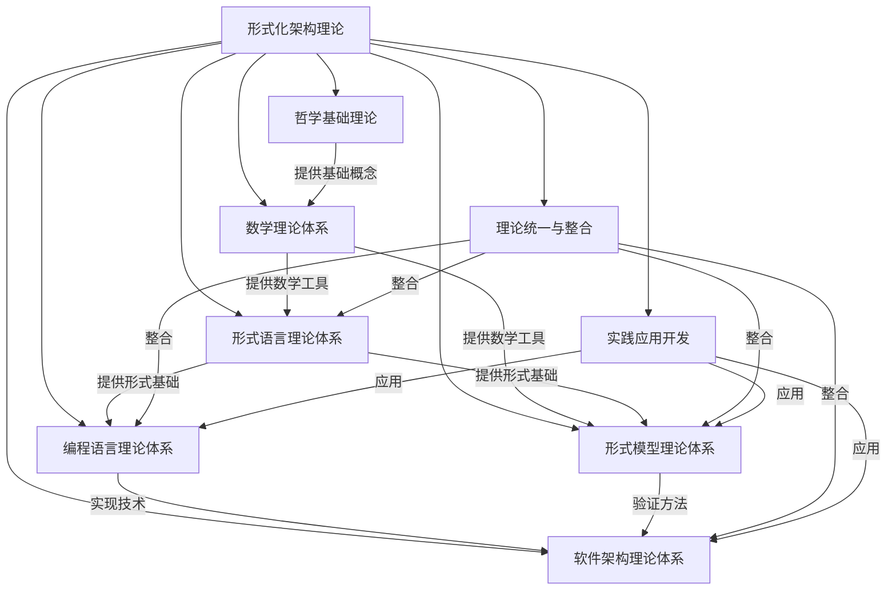

## 4. 核心概念关系图

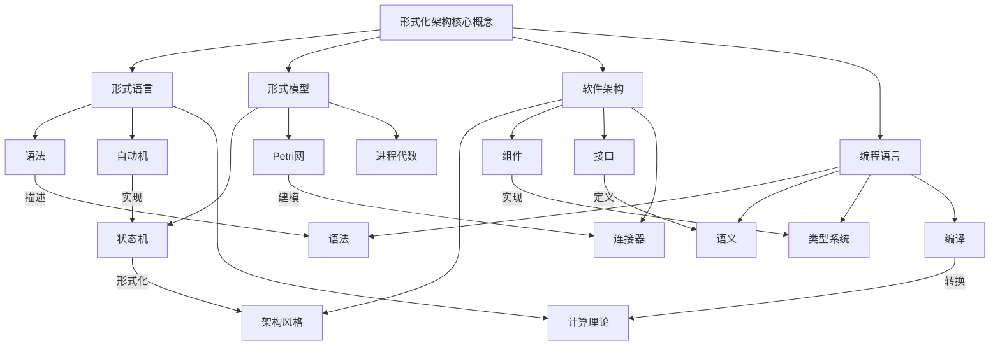

## 5. 详细概念关系

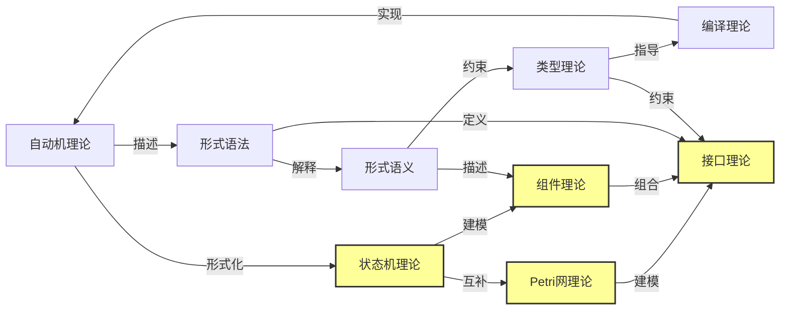

## 6. 跨领域概念映射

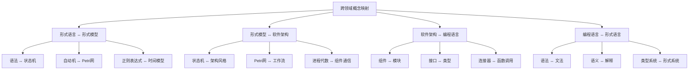

## 7. 合并后的理论体系关系

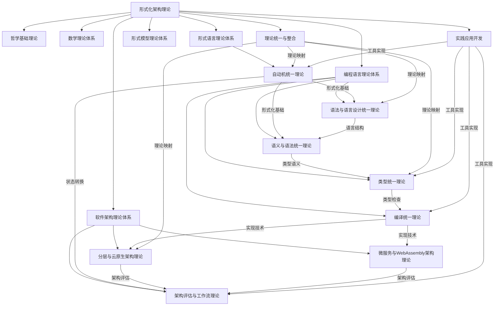

## 8. 合并后的核心理论关系

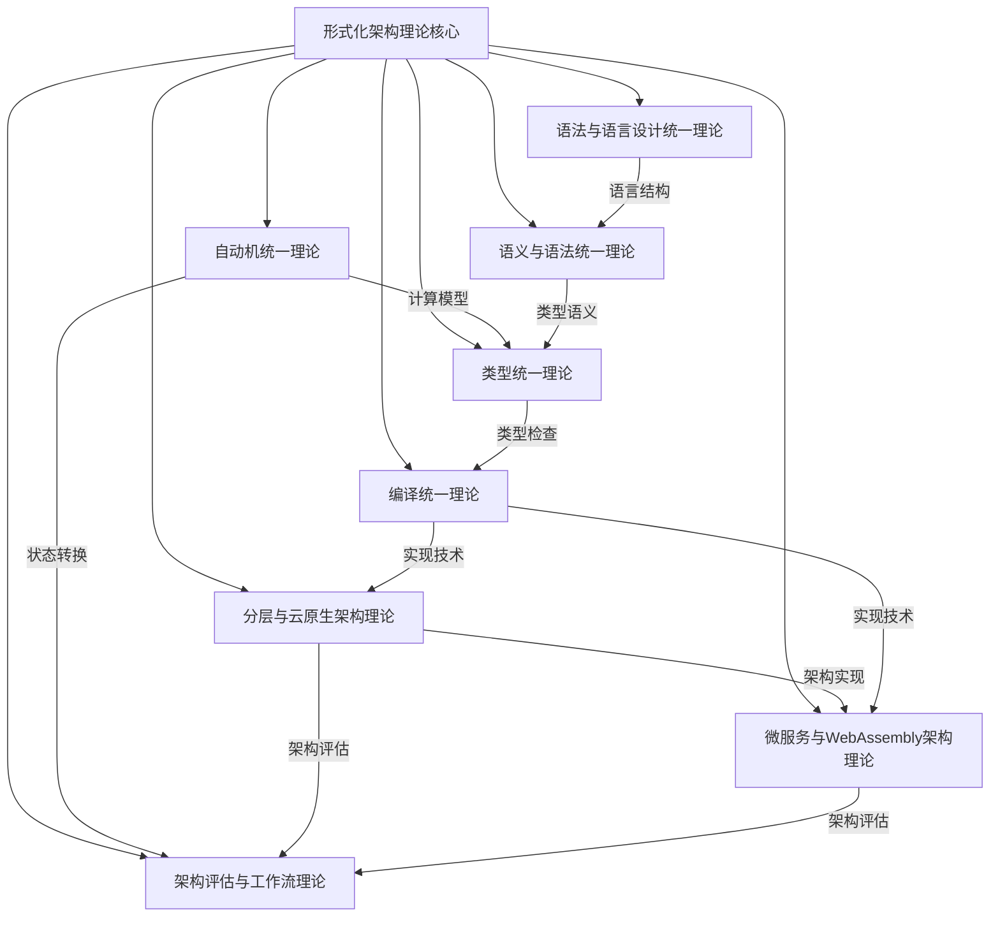

## 9. 项目进展状态图

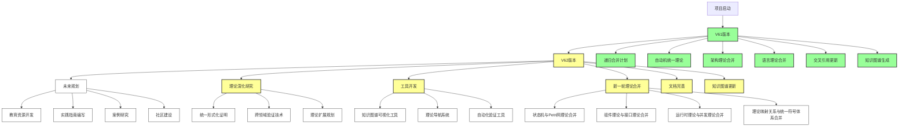

## 10. 理论合并关系图

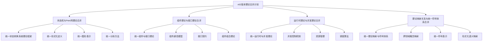

## 11. 合并候选关系图

```mermaid
graph TD
    subgraph "形式模型理论体系"
        SM["状态机理论"]
        PN["Petri网理论"]
        SM -- "合并候选" --> PN
        SM -- "共同点" --> SM_PN_Common["状态转换系统"]
        PN -- "共同点" --> SM_PN_Common
        SM -- "差异点" --> SM_Unique["离散状态"]
        PN -- "差异点" --> PN_Unique["并发表示"]
    end
    
    subgraph "软件架构理论体系"
        CT["组件理论"]
        IT["接口理论"]
        CT -- "合并候选" --> IT
        CT -- "共同点" --> CT_IT_Common["模块化设计"]
        IT -- "共同点" --> CT_IT_Common
        CT -- "差异点" --> CT_Unique["内部实现"]
        IT -- "差异点" --> IT_Unique["交互协议"]
    end
    
    subgraph "编程语言理论体系"
        RT["运行时理论"]
        CC["并发理论"]
        RT -- "合并候选" --> CC
        RT -- "共同点" --> RT_CC_Common["执行模型"]
        CC -- "共同点" --> RT_CC_Common
        RT -- "差异点" --> RT_Unique["资源管理"]
        CC -- "差异点" --> CC_Unique["同步机制"]
    end
    
    subgraph "理论统一与整合"
        MR["理论映射关系"]
        US["统一符号体系"]
        MR -- "合并候选" --> US
        MR -- "共同点" --> MR_US_Common["跨理论映射"]
        US -- "共同点" --> MR_US_Common
        MR -- "差异点" --> MR_Unique["关系定义"]
        US -- "差异点" --> US_Unique["符号定义"]
    end
    
    classDef highPriority fill:#f99,stroke:#333,stroke-width:2px;
    classDef mediumPriority fill:#ff9,stroke:#333,stroke-width:2px;
    classDef lowPriority fill:#9ff,stroke:#333,stroke-width:2px;
    
    class SM,PN,SM_PN_Common highPriority;
    class CT,IT,CT_IT_Common mediumPriority;
    class RT,CC,RT_CC_Common,MR,US,MR_US_Common lowPriority;
```

## 12. 状态机与Petri网理论关系图

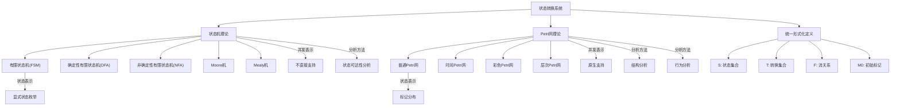

## 13. 组件与接口理论关系图

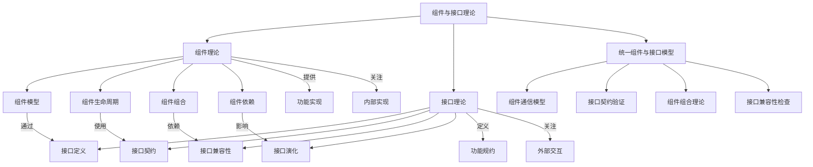

## 14. 工具开发路线图

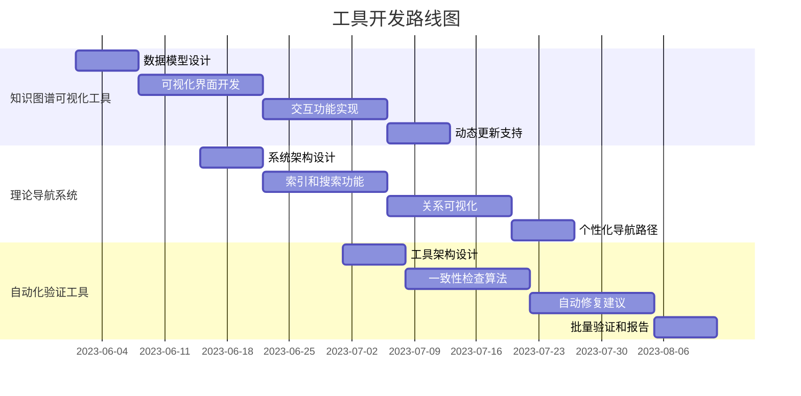

## 15. 理论合并进度跟踪

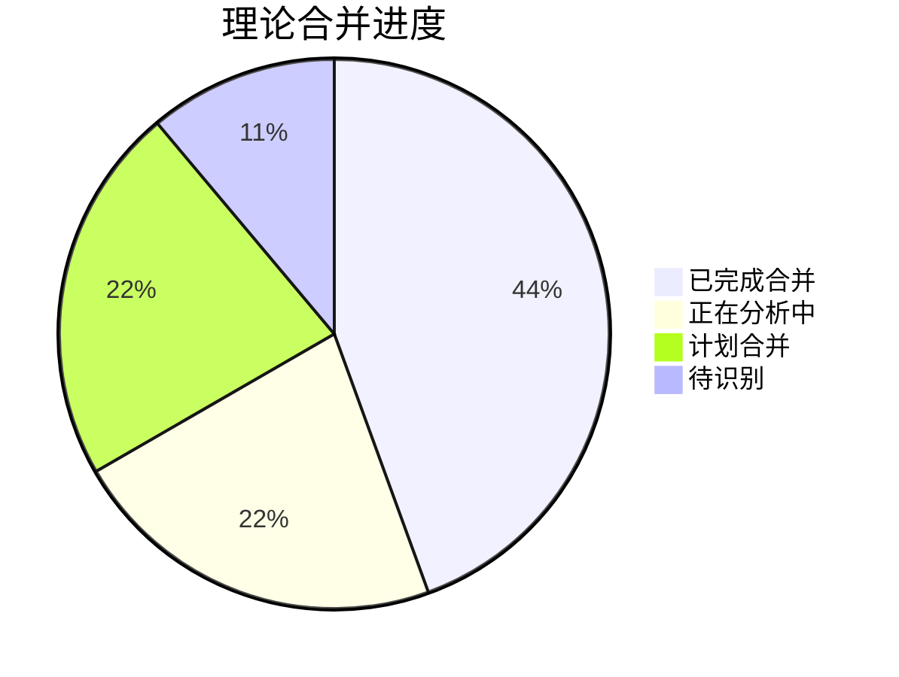

## 16. 项目整体思维导图

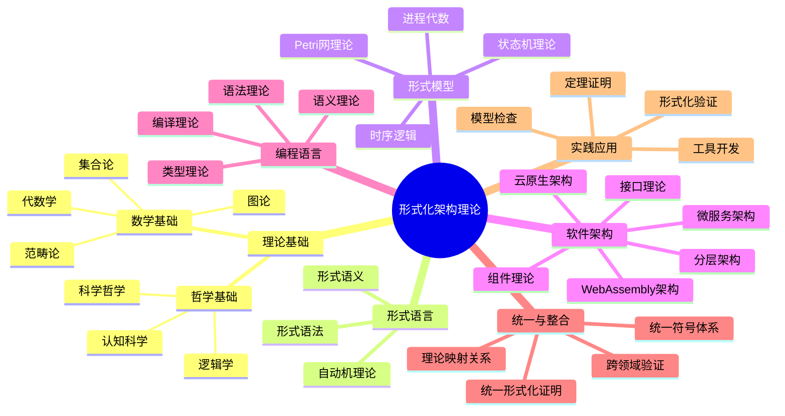

## 17. 后续图谱扩展计划

1. **细化理论关系**
   - 增加更多细节层次的理论关系
   - 展示理论之间的依赖和影响关系

2. **动态演化视图**
   - 添加理论发展的时间维度
   - 展示理论融合和分化过程

3. **应用场景映射**
   - 展示理论在不同应用场景中的应用
   - 建立理论与实践的映射关系

4. **交互式关系图**
   - 开发交互式理论关系图浏览工具
   - 支持按需展开和折叠节点
   - 支持按关系类型过滤视图

5. **3D知识图谱**
   - 开发三维知识图谱可视化
   - 提供多维度理论关系展示
   - 支持沉浸式理论探索体验

## 18. 总结

本文档提供了形式化架构理论项目的统一知识图谱可视化，展示了不同理论体系之间的关系、核心概念之间的关系、跨领域概念映射、理论合并关系、状态机与Petri网理论关系、组件与接口理论关系、工具开发计划和理论深化研究计划等。这些知识图谱有助于理解形式化架构理论的整体结构和内在联系，为理论研究和应用提供指导。

随着项目的进展，这些知识图谱将不断更新和完善，以反映最新的理论发展和研究成果。未来，我们计划进一步细化理论关系、添加动态演化视图、建立应用场景映射，并开发更加交互式的关系图浏览工具，为形式化架构理论的研究和应用提供更加全面和深入的支持。

---

**版本**: v62  
**创建时间**: 2024年7月  
**状态**: 🔄 进行中  
**最后更新**: 2024年7月
