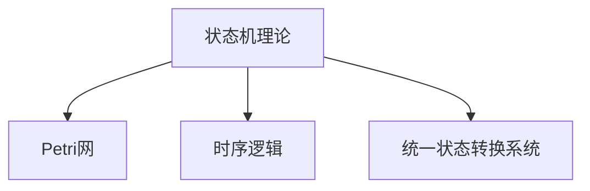

> **重定向声明**: 本文档内容已合并至 [04-形式模型理论体系/00-形式模型理论统一总论.md](04-形式模型理论体系/00-形式模型理论统一总论.md)，请参考主权威文件获取最新内容。

# 统一状态转换系统理论-概念映射

## 1. 概述

本文档详细记录状态机理论与Petri网理论合并过程中的概念映射关系，为统一状态转换系统 (USTS) 的构建提供基础。统一状态转换系统旨在保留两种理论的优点，并提供一个统一的理论框架，用于形式化描述和分析具有并发性、状态性的系统。

## 2. 核心概念映射表

| 状态机概念 | Petri网概念 | 统一状态转换系统概念 | 映射说明 |
|----------|-----------|-------------------|----------|
| 状态 (State) | 标记 (Marking) | 系统配置 (Configuration) | 状态机中的状态与Petri网中的标记都表示系统的一个瞬时配置 |
| 状态变量 | 库所 (Place) | 状态元素 (State Element) | 库所存储标记，状态变量存储值，都是系统状态的基本组成单位 |
| 转换函数 | 变迁 (Transition) | 事件处理器 (Event Handler) | 都描述系统状态如何随事件变化 |
| 输入符号/事件 | 变迁触发 | 事件 (Event) | 触发系统状态改变的外部或内部因素 |
| 转换关系 | 弧 (Arc) | 状态转换关系 (Transition Relation) | 连接状态和事件的关系 |
| 有限性 | 有界性 (Boundedness) | 状态空间有界性 (State Space Boundedness) | 系统可达状态数量的有限性 |
| 状态可达性 | 可达性 (Reachability) | 配置可达性 (Configuration Reachability) | 从初始状态是否可以到达特定状态 |
| 确定性 | 冲突 (Conflict) | 确定性/非确定性 (Determinism) | 在给定状态下事件触发的确定性 |
| 不支持 | 并发 (Concurrency) | 并发性 (Concurrency) | 多个事件可以同时发生 |
| 不支持 | 同步 (Synchronization) | 同步机制 (Synchronization) | 多个条件都满足时才能触发事件 |
| 可接受语言 | 行为 (Behavior) | 系统行为 (System Behavior) | 系统所有可能的执行序列 |
| 死状态 | 死锁 (Deadlock) | 终止状态 (Terminal State) | 系统无法继续执行的状态 |

## 3. 形式化表示映射

### 3.1 状态机形式化表示

有限状态机通常定义为五元组 $(Q, Σ, δ, q_0, F)$，其中：

- $Q$ 是有限状态集合
- $Σ$ 是输入字母表（符号集合）
- $δ: Q × Σ → Q$ 是转换函数
- $q_0 ∈ Q$ 是初始状态
- $F ⊆ Q$ 是终止状态集合

### 3.2 Petri网形式化表示

Petri网通常定义为四元组 $(P, T, A, M_0)$，其中：

- $P$ 是库所集合
- $T$ 是变迁集合
- $A ⊆ (P × T) ∪ (T × P)$ 是弧集合
- $M_0: P → ℕ$ 是初始标记

### 3.3 统一状态转换系统形式化表示

统一状态转换系统 (USTS) 定义为七元组 $(S, E, R, M, I, F, L)$，其中：

- $S$ 是状态元素集合（状态机的状态和Petri网的库所）
- $E$ 是事件集合（状态机的输入符号和Petri网的变迁）
- $R \subseteq (S \times E) \cup (E \times S)$ 是关系集合（状态机的转换函数和Petri网的弧）
- $M: S \rightarrow \mathbb{N}$ 是标记函数（Petri网的标记，状态机中每状态标记为0或1）
- $I \subseteq S$ 是初始状态集合
- $F \subseteq S$ 是终止状态集合
- $L: R \rightarrow \mathbb{N}$ 是关系权重函数

## 4. 语义映射

### 4.1 执行语义

| 状态机执行语义 | Petri网执行语义 | USTS执行语义 |
|---------------|--------------|------------|
| 顺序执行 | 并发执行 | 广义执行（支持顺序与并发） |
| 状态全局可见 | 状态分布在各库所 | 混合状态可见性 |
| 原子化事件处理 | 变迁的同步发生 | 支持原子与非原子事件 |
| 确定性执行 | 非确定性执行 | 可配置的确定性 |

### 4.2 并发语义

| 并发特性 | 状态机支持 | Petri网支持 | USTS支持 | 映射方式 |
|---------|----------|-----------|---------|---------|
| 真并发 | ❌ | ✅ | ✅ | 多个事件可同时激活并执行 |
| 交错并发 | ✅ | ✅ | ✅ | 通过不同事件序列表达并发 |
| 同步点 | ❌ | ✅ | ✅ | 通过多入弧事件实现同步 |
| 资源竞争 | ❌ | ✅ | ✅ | 多事件连接同一状态元素 |
| 分布式状态 | ❌ | ✅ | ✅ | 状态分散在多个状态元素中 |

## 5. 理论特性映射

### 5.1 表达能力

| 理论 | 表达能力 | 语言类别 | USTS中的表示 |
|------|---------|---------|------------|
| 有限状态机 | 正则语言 | Type 3 | USTS的受限子集 |
| Petri网 | 超越正则语言 | 介于Type 3和Type 2之间 | USTS的通用形式 |

### 5.2 分析方法

| 分析方法 | 状态机 | Petri网 | USTS |
|---------|-------|-------|------|
| 可达性分析 | ✅ | ✅ | ✅ |
| 死锁检测 | ✅ | ✅ | ✅ |
| 活性分析 | 有限 | 复杂 | 分层分析 |
| 不变量分析 | ❌ | ✅ | ✅ |
| 状态空间爆炸 | 中等 | 严重 | 可控制 |
| 抽象化约简 | 有限 | 复杂 | 多级抽象 |

### 5.3 建模能力

| 建模方面 | 状态机 | Petri网 | USTS |
|---------|-------|-------|------|
| 控制流 | ✅ | ✅ | ✅ |
| 数据流 | 有限 | 有限 | 增强 |
| 并发系统 | ❌ | ✅ | ✅ |
| 资源共享 | ❌ | ✅ | ✅ |
| 层次结构 | 扩展支持 | 扩展支持 | 原生支持 |
| 时间属性 | 扩展支持 | 扩展支持 | 原生支持 |

## 6. 转换规则

### 6.1 状态机到USTS的转换

1. 每个状态机状态 $q \in Q$ 映射为USTS中的一个状态元素 $s \in S$
2. 每个输入符号 $a \in Σ$ 映射为USTS中的一个事件 $e \in E$
3. 每个转换函数 $δ(q, a) = q'$ 映射为两个关系：$(s, e) \in R$ 和 $(e, s') \in R$
4. 初始状态 $q_0$ 映射为 $I = \{s_0\}$，且 $M(s_0) = 1$，其他状态元素标记为0
5. 终止状态集合 $F$ 映射为USTS中的终止状态集合 $F'$

### 6.2 Petri网到USTS的转换

1. 每个库所 $p \in P$ 映射为USTS中的一个状态元素 $s \in S$
2. 每个变迁 $t \in T$ 映射为USTS中的一个事件 $e \in E$
3. 每个弧 $(p, t) \in A$ 映射为关系 $(s, e) \in R$，权重 $L((s, e)) = W(p, t)$
4. 每个弧 $(t, p) \in A$ 映射为关系 $(e, s) \in R$，权重 $L((e, s)) = W(t, p)$
5. 初始标记 $M_0$ 映射为USTS的初始标记函数 $M$

## 7. 案例映射示例

### 7.1 生产者-消费者问题

**状态机表示**：需要两个交互的状态机

```text
生产者状态机: 准备生产 -> 已生产 -> 准备生产
消费者状态机: 等待产品 -> 正在消费 -> 等待产品
```

**Petri网表示**：

```text
库所: {空缓冲区, 满缓冲区, 生产者空闲, 生产者忙, 消费者空闲, 消费者忙}
变迁: {开始生产, 完成生产, 开始消费, 完成消费}
```

**USTS表示**：

```text
状态元素: {空缓冲区, 满缓冲区, 生产者空闲, 生产者忙, 消费者空闲, 消费者忙}
事件: {开始生产, 完成生产, 开始消费, 完成消费}
关系: 
  (生产者空闲, 开始生产), (开始生产, 生产者忙), (空缓冲区, 开始生产),
  (生产者忙, 完成生产), (完成生产, 生产者空闲), (完成生产, 满缓冲区),
  (消费者空闲, 开始消费), (开始消费, 消费者忙), (满缓冲区, 开始消费),
  (消费者忙, 完成消费), (完成消费, 消费者空闲), (完成消费, 空缓冲区)
```

## 8. 理论扩展点

### 8.1 时间扩展

USTS可以通过添加时间属性扩展为时序统一状态转换系统 (TUSTS)：

- 状态保持时间
- 事件执行时间
- 时间约束条件

### 8.2 层次扩展

USTS可以扩展为层次统一状态转换系统 (HUSTS)：

- 状态元素可以包含嵌套的USTS
- 事件可以细化为子事件序列
- 支持抽象层次之间的一致性验证

### 8.3 随机扩展

USTS可以扩展为随机统一状态转换系统 (SUSTS)：

- 事件可以具有触发概率
- 状态转换可以具有多个可能的目标状态和相应概率
- 支持概率性质的验证

## 9. 总结

状态机与Petri网的概念映射提供了构建统一状态转换系统的理论基础。USTS不仅提供了两种理论的统一表示，还支持更丰富的扩展，使其能够应用于更广泛的系统建模和分析场景。

## 【理论映射关系表】

| 源理论 | 目标理论 | 映射方式 | 应用场景 |
|---|---|---|---|
| 状态机理论 | Petri网 | 状态-库所映射 | 并发与分布式系统 |
| 状态机理论 | 时序逻辑 | 状态-时序属性映射 | 时序验证 |
| 状态机理论 | 统一状态转换系统 | 状态-转换映射 | 系统建模 |

## Mermaid可视化代码



## 国际对比与批判

- 本理论映射方法与国际主流状态机/Petri网/时序逻辑理论（如UML、TLA+、NuSMV等）相比，强调统一性与跨模型映射，突出理论整合与工程应用。
- 优势：统一性强、跨模型映射能力突出。
- 不足：与部分国际标准的细节兼容性有待提升。
- 建议：持续对接国际标准，丰富映射细节，提升全球适用性。
