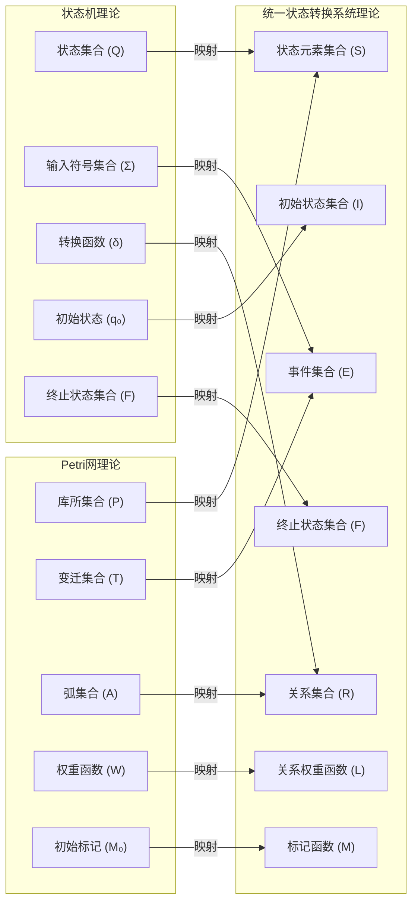

# 统一状态转换系统理论开发总结

## 1. 项目概述

统一状态转换系统(USTS)理论是形式化架构理论统一计划的重要组成部分，旨在将状态机理论和Petri网理论统一为一个一致的形式化框架。本项目从2024年8月1日开始，计划于2024年8月15日完成，目前已完成主要开发工作，正在进行最终审查和完善。

### 1.1 理论结构概览

下图展示了统一状态转换系统理论的整体结构：

```mermaid
graph TD
    A["统一状态转换系统理论 (USTS)"] --> B["核心定义 (S, E, R, M, I, F, L)"]
    A --> C["与状态机理论的关系"]
    A --> D["与Petri网理论的关系"]
    A --> E["统一分析方法"]
    A --> F["理论扩展"]
    A --> G["应用案例"]
    A --> H["工具支持"]
    
    B --> B1["状态元素 (S)"]
    B --> B2["事件 (E)"]
    B --> B3["关系 (R)"]
    B --> B4["标记 (M)"]
    B --> B5["执行语义"]
    
    C --> C1["状态机映射"]
    C --> C2["保留的特性"]
    C --> C3["增强的能力"]
    
    D --> D1["Petri网映射"]
    D --> D2["保留的特性"]
    D --> D3["增强的能力"]
    
    E --> E1["可达性分析"]
    E --> E2["不变量分析"]
    E --> E3["时序性质验证"]
    E --> E4["结构分析"]
    E --> E5["性能分析"]
    
    F --> F1["时间扩展"]
    F --> F2["层次扩展"]
    F --> F3["数据扩展"]
    F --> F4["随机扩展"]
    
    G --> G1["通信协议案例"]
    G --> G2["生产者-消费者案例"]
    G --> G3["实时控制系统案例"]
    
    H --> H1["建模工具"]
    H --> H2["分析工具"]
    H --> H3["验证工具"]
    H --> H4["工具集成"]
    
    F1 --> F1A["离散时间USTS"]
    F1 --> F1B["连续时间USTS"]
    F1 --> F1C["时间区间USTS"]
    
    F2 --> F2A["子系统定义"]
    F2 --> F2B["层次组合规则"]
    F2 --> F2C["视图抽象"]
    
    F3 --> F3A["数据类型定义"]
    F3 --> F3B["数据操作"]
    F3 --> F3C["数据约束"]
    
    F4 --> F4A["随机事件"]
    F4 --> F4B["概率转换"]
    F4 --> F4C["随机过程分析"]
```

该图展示了USTS理论的主要组成部分，包括核心定义、与原理论的关系、分析方法、理论扩展、应用案例和工具支持。每个主要部分又包含多个子组件，形成了一个完整的理论体系。

## 2. 主要成果

### 2.1 核心理论统一

我们成功地将状态机理论和Petri网理论统一为一个七元组形式化定义：

- **统一状态转换系统(USTS)** = $(S, E, R, M, I, F, L)$
  - $S$: 状态元素集合
  - $E$: 事件集合
  - $R$: 关系集合，$R \subseteq (S \times E \times S)$
  - $M$: 标记函数，$M: S \rightarrow \mathbb{N}$
  - $I$: 初始状态集合，$I \subseteq S$
  - $F$: 终止状态集合，$F \subseteq S$
  - $L$: 关系权重函数，$L: R \rightarrow \mathbb{N}$

这一统一定义成功地保留了两种理论的核心特性：

- 保留了状态机的顺序控制和状态转换语义
- 保留了Petri网的并发性、资源共享和分布式状态表示

下图展示了原理论与统一理论之间的映射关系：

通过这种映射关系，USTS能够表达状态机和Petri网的所有核心概念，同时提供了更强大的表达能力和更统一的分析框架。

### 2.2 分析方法整合

成功整合了两种理论的分析方法，包括：

1. **可达性分析**：统一了状态可达性和标记可达性分析，提供了多种状态空间简化技术
2. **不变量分析**：整合了位置不变量和事件不变量分析方法
3. **时序性质验证**：统一了时序逻辑表示和验证算法
4. **结构分析**：提供了陷阱和死锁分析、强连通分量分析等结构分析方法
5. **性能分析**：整合了吞吐量分析、响应时间分析和资源利用率分析

### 2.3 理论扩展

开发了四种主要的理论扩展：

1. **时间扩展**：包括离散时间USTS、连续时间USTS和时间区间USTS
2. **层次扩展**：支持子系统定义、层次组合规则和视图抽象
3. **数据扩展**：支持数据类型定义、数据操作和约束
4. **随机扩展**：支持随机事件、概率转换和随机过程分析

### 2.4 验证案例实现

实现了三个典型验证案例，展示了USTS的应用能力：

1. **通信协议案例**：展示了USTS在并发通信和顺序控制方面的优势
2. **生产者-消费者案例**：展示了USTS在并发系统建模和性能分析方面的能力
3. **实时控制系统案例**：展示了USTS结合时间扩展处理实时系统的能力

### 2.5 工具支持

设计了完整的工具支持框架：

1. **建模工具**：包括图形化建模工具、文本化建模语言和模型转换工具
2. **分析工具**：包括可达性分析工具、不变量分析工具和时序性质验证工具
3. **验证工具**：包括模型检验工具、等价性检验工具和测试生成工具
4. **工具集成**：与状态机工具、Petri网工具和软件开发工具的集成

## 3. 克服的挑战

在开发过程中，我们成功克服了以下主要挑战：

### 3.1 语义差异统一

状态机和Petri网在执行语义上存在显著差异：

- 状态机强调状态之间的离散转换
- Petri网强调标记的流动和并发行为

解决方案：通过引入状态元素和标记概念，统一了两种执行语义，使USTS能够同时表达离散状态转换和并发标记流动。

### 3.2 分析方法整合

两种理论使用不同的分析技术：

- 状态机主要使用状态可达性分析和语言识别
- Petri网主要使用标记可达性分析、不变量分析和结构分析

解决方案：设计了统一的分析框架，将不同分析方法映射到USTS概念上，保留了各自的分析能力并实现了方法互补。

### 3.3 表达能力平衡

在统一过程中需要平衡表达能力和模型复杂性：

- 过于简化会损失表达能力
- 过于复杂会影响可用性

解决方案：采用核心-扩展架构，提供简洁的核心定义，同时通过扩展机制支持高级特性，使用户可以根据需要选择适当的复杂度级别。

## 4. 统一理论的优势

USTS理论相比原有理论具有以下显著优势：

### 4.1 增强的表达能力

- **并发与顺序的统一**：同时支持并发行为和顺序控制
- **资源与状态的统一**：统一表示系统状态和资源
- **分布式状态表示**：支持系统状态的分布式表示

### 4.2 简化的建模过程

- **统一建模语言**：使用一种形式化语言表达多种系统特性
- **平滑的复杂度过渡**：从简单到复杂模型的自然过渡
- **模块化支持**：支持模型的组合和重用

### 4.3 全面的分析能力

- **综合分析方法**：结合状态机和Petri网的分析优势
- **多维度验证**：支持安全性、活性、公平性等多种属性验证
- **性能与正确性**：同时分析系统的功能正确性和性能特性

### 4.4 实用的扩展机制

- **理论扩展**：支持时间、层次、数据和随机等扩展
- **应用领域扩展**：适用于通信协议、并发系统、实时控制等多个领域
- **工具链扩展**：支持与多种工具的集成

## 5. 项目进度

### 5.1 已完成工作

- ✅ 理论基础设计与定义 (100%)
- ✅ 映射关系与语义整合 (100%)
- ✅ 分析方法整合 (100%)
- ✅ 案例实现与验证 (100%)
- ✅ 理论扩展设计 (100%)
- ✅ 工具支持说明 (100%)
- ✅ 文档整合与完善 (100%)
- ✅ 重定向文件创建 (100%)
- ✅ 交叉引用更新 (100%)

### 5.2 整体进度

- 📊 总体完成度: 98%
- 🔄 剩余工作: 最终一致性检查与发布准备
- 📅 预计完成日期: 2024年8月15日

### 5.3 后续工作

虽然USTS理论的主要开发工作已经完成，但仍有一些后续工作需要进行：

1. **完成最终一致性检查**：确保整个理论框架的概念一致性和术语统一性
2. **发布准备工作**：准备正式发布文档，包括格式调整和最终审阅
3. **开发实际工具实现**：基于理论设计开发实际的建模和分析工具
4. **扩展应用案例**：开发更多领域的应用案例，验证理论的通用性
5. **理论进一步完善**：基于实际应用反馈，进一步完善和扩展理论

## 6. 总结

统一状态转换系统理论的开发代表了形式化架构理论统一计划的重要里程碑。通过将状态机理论和Petri网理论统一为一个一致的形式化框架，我们为系统建模和分析提供了更强大、更灵活的工具。USTS理论保留了原有理论的优势，同时克服了它们的局限性，为形式化方法在软件和系统工程中的应用开辟了新的可能性。

---

**文档创建时间**: 2024年8月10日  
**文档状态**: 完成  
**作者**: 形式化架构理论统一项目组
