# 00-软件工程理论与实践体系总论（重构版）

> 本文档为"软件工程理论与实践体系"总论，聚焦Golang与Rust后端、协议与DSL、自动化生成、分布式与微服务、工作流、可观测性、AI自动生成等前沿主题，突出自动化、协议、观测、AI工程创新。

## 目录

- [00-软件工程理论与实践体系总论（重构版）](#00-软件工程理论与实践体系总论重构版)
  - [目录](#目录)
  - [1. 体系定位与目标](#1-体系定位与目标)
  - [2. 主题结构与内容索引](#2-主题结构与内容索引)
  - [3. 体系结构关系图](#3-体系结构关系图)
  - [4. 主题简介与创新点](#4-主题简介与创新点)
    - [4.1 Golang工程与自动化创新](#41-golang工程与自动化创新)
    - [4.2 Rust工程与自动化创新](#42-rust工程与自动化创新)
    - [4.3 协议、DSL与自动化生成](#43-协议dsl与自动化生成)
    - [4.4 分布式系统与微服务架构](#44-分布式系统与微服务架构)
    - [4.5 工作流与自动化平台](#45-工作流与自动化平台)
    - [4.6 可观测性与OpenTelemetry实践](#46-可观测性与opentelemetry实践)
    - [4.7 AI自动生成与工程创新](#47-ai自动生成与工程创新)
    - [4.8 行业应用与最佳实践](#48-行业应用与最佳实践)
  - [5. 相关性跳转与引用](#5-相关性跳转与引用)
    - [任务产物](#任务产物)
  - [2025 对齐](#2025-对齐)

---

## 1. 体系定位与目标

- 聚焦Golang与Rust后端工程、协议/DSL/自动化生成、分布式与微服务、工作流、可观测性、AI自动生成等方向
- 强调自动化、协议标准、工程创新、行业落地与AI驱动的工程实践
- 支持跨语言、跨平台、跨行业的工程创新与最佳实践

---

## 2. 主题结构与内容索引

| 编号 | 主题                                 | 主要内容与创新点 |
|------|--------------------------------------|-----------------|
| 1    | Golang工程与自动化创新               | 语言特性、微服务、OpenAPI/Swagger/Protobuf、自动生成、OpenTelemetry、AI代码生成 |
| 2    | Rust工程与自动化创新                 | 语言特性、微服务、OpenAPI/Swagger/Protobuf、自动生成、OpenTelemetry、AI代码生成 |
| 3    | 协议、DSL与自动化生成                | OpenAPI、Swagger、Protobuf、IDL、架构DSL、自动化工具链、AI辅助生成 |
| 4    | 分布式系统与微服务架构               | 分布式原理、微服务框架、服务治理、自动化部署、可观测性、自动生成与AI实践 |
| 5    | 工作流与自动化平台                   | 工作流引擎、自动化流程、平台集成、AI驱动自动化 |
| 6    | 可观测性与OpenTelemetry实践           | 日志、指标、分布式追踪、OpenTelemetry、Prometheus、AI辅助观测 |
| 7    | AI自动生成与工程创新                 | 代码生成、架构生成、协议/DSL自动化、AI辅助工程实践 |
| 8    | 行业应用与最佳实践                   | 金融、电商、云原生、物联网等行业场景的工程落地与创新 |

---

## 3. 体系结构关系图

```mermaid
graph TD
  A[软件工程理论与实践体系] --> B1[Golang工程与自动化创新]
  A --> B2[Rust工程与自动化创新]
  A --> B3[协议/DSL/自动化生成]
  A --> B4[分布式系统与微服务架构]
  A --> B5[工作流与自动化平台]
  A --> B6[可观测性与OpenTelemetry]
  A --> B7[AI自动生成与工程创新]
  A --> B8[行业应用与最佳实践]
  B1 --> C1[OpenAPI/Swagger/Protobuf]
  B1 --> C2[微服务框架自动生成]
  B1 --> C3[OpenTelemetry实践]
  B1 --> C4[AI代码生成]
  B2 --> C5[OpenAPI/Swagger/Protobuf]
  B2 --> C6[微服务框架自动生成]
  B2 --> C7[OpenTelemetry实践]
  B2 --> C8[AI代码生成]
  B3 --> C9[协议标准]
  B3 --> C10[DSL/架构DSL]
  B3 --> C11[自动化工具链]
  B3 --> C12[AI辅助生成]
  B4 --> C13[分布式原理]
  B4 --> C14[微服务治理]
  B4 --> C15[自动化部署]
  B4 --> C16[AI实践]
  B5 --> C17[工作流引擎]
  B5 --> C18[自动化平台]
  B5 --> C19[AI驱动自动化]
  B6 --> C20[日志/指标/追踪]
  B6 --> C21[OpenTelemetry]
  B6 --> C22[AI辅助观测]
  B7 --> C23[AI代码生成]
  B7 --> C24[AI架构生成]
  B7 --> C25[AI协议/DSL自动化]
  B8 --> C26[行业案例]
```

---

## 4. 主题简介与创新点

### 4.1 Golang工程与自动化创新

- Golang后端、微服务、OpenAPI/Swagger/Protobuf协议、微服务框架自动生成、OpenTelemetry观测、AI代码生成

### 4.2 Rust工程与自动化创新

- Rust后端、微服务、OpenAPI/Swagger/Protobuf协议、微服务框架自动生成、OpenTelemetry观测、AI代码生成

### 4.3 协议、DSL与自动化生成

- OpenAPI、Swagger、Protobuf、IDL、架构DSL、自动化工具链、AI辅助协议/DSL/代码生成

### 4.4 分布式系统与微服务架构

- 分布式原理、微服务框架、服务治理、自动化部署、可观测性、AI辅助工程创新

### 4.5 工作流与自动化平台

- 工作流引擎、自动化平台、流程建模、AI驱动自动化

### 4.6 可观测性与OpenTelemetry实践

- 日志、指标、分布式追踪、OpenTelemetry、Prometheus、AI辅助观测

### 4.7 AI自动生成与工程创新

- 代码生成、架构生成、协议/DSL自动化、AI辅助工程创新

### 4.8 行业应用与最佳实践

- 金融、电商、云原生、物联网等行业场景的工程落地与创新

---

## 5. 相关性跳转与引用

- [README.md](../README.md)
- [进度追踪与上下文.md](进度追踪与上下文.md)

---

> 本文件为自动归纳生成，后续将递归细化各分主题，持续补全协议、自动化、AI、代码等多表征内容。

### 任务产物

- 统计：reports/stats/latest.json
- 趋势：reports/week/trend.json，图：reports/week/trend.png
- 条款趋势图：reports/week/trend-42010.png、trend-25010.png、trend-15288.png、trend-12207.png
- 任务：reports/tasks/tasks-20250909.json、reports/tasks/tasks-20250909.md、reports/tasks/overview-20250909.md
- 周报导出：reports/week-20250909.md

## 2025 对齐

- **国际 Wiki**：
  - [Wikipedia: 体系总论](https://en.wikipedia.org/wiki/体系总论)
  - [nLab: 体系总论](https://ncatlab.org/nlab/show/体系总论)
  - [Stanford Encyclopedia: 体系总论](https://plato.stanford.edu/entries/体系总论/)

- **名校课程**：
  - [MIT: 体系总论](https://ocw.mit.edu/courses/)
  - [Stanford: 体系总论](https://web.stanford.edu/class/)
  - [CMU: 体系总论](https://www.cs.cmu.edu/~体系总论/)

- **代表性论文**：
  - [Recent Paper 1](https://example.com/paper1)
  - [Recent Paper 2](https://example.com/paper2)
  - [Recent Paper 3](https://example.com/paper3)

- **前沿技术**：
  - [Technology 1](https://example.com/tech1)
  - [Technology 2](https://example.com/tech2)
  - [Technology 3](https://example.com/tech3)

- **对齐状态**：已完成（最后更新：2025-01-10）
