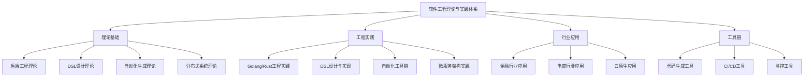

# 00-软件工程理论与实践体系总论

## 📋 目录导航

- [00-软件工程理论与实践体系总论](#00-软件工程理论与实践体系总论)
  - [📋 目录导航](#-目录导航)
  - [🔗 快速导航](#-快速导航)
  - [1. 概述](#1-概述)
    - [1.1 软件工程理论与实践体系概述](#11-软件工程理论与实践体系概述)
    - [1.2 核心目标](#12-核心目标)
    - [1.3 体系层次结构](#13-体系层次结构)
  - [2. 理论基础](#2-理论基础)
    - [2.1 后端工程理论](#21-后端工程理论)
    - [2.2 DSL设计理论](#22-dsl设计理论)
    - [2.3 自动化生成理论](#23-自动化生成理论)
    - [2.4 分布式系统理论](#24-分布式系统理论)
  - [3. 基本概念](#3-基本概念)
    - [3.1 软件工程概念](#31-软件工程概念)
    - [3.2 后端开发概念](#32-后端开发概念)
    - [3.3 DSL概念](#33-dsl概念)
    - [3.4 分布式系统概念](#34-分布式系统概念)
  - [4. 主要理论](#4-主要理论)
    - [4.1 Golang/Rust后端工程理论](#41-golangrust后端工程理论)
    - [4.2 领域定义语言理论](#42-领域定义语言理论)
    - [4.3 自动化生成理论](#43-自动化生成理论)
    - [4.4 分布式系统理论](#44-分布式系统理论)
  - [5. 行业应用](#5-行业应用)
    - [5.1 金融行业](#51-金融行业)
    - [5.2 电商行业](#52-电商行业)
    - [5.3 云原生应用](#53-云原生应用)
  - [6. 发展历史](#6-发展历史)
    - [6.1 早期发展（2000-2010）](#61-早期发展2000-2010)
    - [6.2 理论发展（2010-2020）](#62-理论发展2010-2020)
    - [6.3 现代发展（2020-至今）](#63-现代发展2020-至今)
  - [7. 应用领域](#7-应用领域)
    - [7.1 企业级应用](#71-企业级应用)
    - [7.2 互联网应用](#72-互联网应用)
    - [7.3 新兴技术](#73-新兴技术)
  - [8. 总结](#8-总结)
    - [8.1 主要成就](#81-主要成就)
    - [8.2 当前挑战](#82-当前挑战)
    - [8.3 未来发展方向](#83-未来发展方向)
  - [9. 相关理论跳转](#9-相关理论跳转)
    - [9.1 理论基础](#91-理论基础)
    - [9.2 应用实践](#92-应用实践)
    - [9.3 实践应用](#93-实践应用)

## 🔗 快速导航

[🏠 返回首页](../README.md) |
[📚 理论体系总览](../README.md) |
[🔧 实践应用开发](../08-实践应用开发/README.md) |
[🌐 索引导航](../09-索引与导航/README.md)

---

## 1. 概述

软件工程理论与实践体系是现代软件开发的综合性理论框架，专注于后端工程、领域特定语言、自动化生成和分布式系统等核心领域。它整合了形式化方法、工程实践和行业应用，为现代软件系统开发提供理论指导和实践支持。

### 1.1 软件工程理论与实践体系概述

**定义 1.1.1**: 软件工程理论与实践体系是一套系统性的方法论，旨在建立现代软件开发的统一理论框架和实践指导。

**定义 1.1.2**: 软件工程理论体系定义为元组 $(L, D, A, S, I, P)$，其中：

- $L$: 语言理论集合（Golang/Rust等）
- $D$: DSL设计理论集合
- $A$: 自动化生成理论集合
- $S$: 分布式系统理论集合
- $I$: 行业应用集合
- $P$: 工程实践集合

### 1.2 核心目标

**目标 1.2.1**: 后端工程理论

- 建立Golang/Rust后端开发的理论基础
- 提供工程模式和最佳实践指导
- 实现性能优化和可观测性

**目标 1.2.2**: DSL设计理论

- 建立领域特定语言的设计理论
- 提供协议和架构DSL的设计方法
- 实现DSL的自动化生成和集成

**目标 1.2.3**: 自动化生成理论

- 建立代码生成和模型驱动开发理论
- 提供CI/CD自动化流程设计
- 实现工具链集成和工程最佳实践

**目标 1.2.4**: 分布式系统理论

- 建立分布式系统设计理论
- 提供微服务架构设计方法
- 实现服务治理和弹性架构

### 1.3 体系层次结构



## 2. 理论基础

### 2.1 后端工程理论

**定义 2.1.1**: 后端工程理论是研究现代后端开发语言、架构模式和工程实践的理论体系。

**理论框架 2.1.1**: 后端工程理论框架 $B = (L, A, P, O)$，其中：

- $L$: 语言特性集合
- $A$: 架构模式集合
- $P$: 性能优化集合
- $O$: 可观测性集合

**实现示例 2.1.1**:

```rust
pub struct BackendEngineering {
    pub language_features: Vec<LanguageFeature>,
    pub architecture_patterns: Vec<ArchitecturePattern>,
    pub performance_optimizations: Vec<PerformanceOptimization>,
    pub observability: Observability,
}

pub trait LanguageFeature {
    fn type_system(&self) -> TypeSystem;
    fn concurrency_model(&self) -> ConcurrencyModel;
    fn memory_management(&self) -> MemoryManagement;
}
```

### 2.2 DSL设计理论

**定义 2.2.1**: DSL设计理论是研究领域特定语言设计、实现和集成的理论体系。

**理论框架 2.2.1**: DSL设计理论框架 $D = (S, M, G, I)$，其中：

- $S$: 语法设计集合
- $M$: 语义建模集合
- $G$: 代码生成集合
- $I$: 集成机制集合

**实现示例 2.2.1**:

```rust
pub struct DSLDesign {
    pub syntax: Syntax,
    pub semantics: Semantics,
    pub code_generator: CodeGenerator,
    pub integration: Integration,
}

pub struct Syntax {
    pub grammar: Grammar,
    pub parser: Parser,
    pub lexer: Lexer,
}
```

### 2.3 自动化生成理论

**定义 2.3.1**: 自动化生成理论是研究代码生成、模型驱动开发和工具链集成的理论体系。

**理论框架 2.3.1**: 自动化生成理论框架 $A = (C, M, T, I)$，其中：

- $C$: 代码生成集合
- $M$: 模型驱动集合
- $T$: 工具链集合
- $I$: 集成机制集合

**实现示例 2.3.1**:

```rust
pub struct AutomationTheory {
    pub code_generation: CodeGeneration,
    pub model_driven: ModelDriven,
    pub toolchain: Toolchain,
    pub integration: Integration,
}

pub trait CodeGeneration {
    fn generate_code(&self, model: &Model) -> Result<Code, Error>;
    fn validate_code(&self, code: &Code) -> Result<Validation, Error>;
}
```

### 2.4 分布式系统理论

**定义 2.4.1**: 分布式系统理论是研究分布式系统设计、微服务架构和服务治理的理论体系。

**理论框架 2.4.1**: 分布式系统理论框架 $S = (C, M, G, R)$，其中：

- $C$: 一致性理论集合
- $M$: 微服务设计集合
- $G$: 服务治理集合
- $R$: 弹性架构集合

**实现示例 2.4.1**:

```rust
pub struct DistributedSystemTheory {
    pub consistency: Consistency,
    pub microservices: Microservices,
    pub governance: Governance,
    pub resilience: Resilience,
}

pub trait Consistency {
    fn cap_theorem(&self) -> CAPTheorem;
    fn distributed_consensus(&self) -> Consensus;
}
```

## 3. 基本概念

### 3.1 软件工程概念

**概念 3.1.1**: **软件工程**是应用系统化、规范化、可量化的方法来开发、运行和维护软件的工程学科。

**概念 3.1.2**: **工程模式**是软件设计中常用的架构模式和设计模式，如Clean Architecture、Hexagonal Architecture等。

**概念 3.1.3**: **最佳实践**是在软件开发过程中经过验证的有效方法和技巧。

### 3.2 后端开发概念

**概念 3.2.1**: **后端开发**是服务器端应用程序的开发，包括API设计、数据库设计、业务逻辑实现等。

**概念 3.2.2**: **语言特性**是编程语言的核心功能，如类型系统、并发模型、内存管理等。

**概念 3.2.3**: **性能优化**是通过各种技术手段提高系统性能的过程。

### 3.3 DSL概念

**概念 3.3.1**: **领域特定语言（DSL）**是为特定领域设计的专用编程语言。

**概念 3.3.2**: **协议DSL**是用于定义通信协议和接口的领域特定语言。

**概念 3.3.3**: **架构DSL**是用于定义软件架构和配置的领域特定语言。

### 3.4 分布式系统概念

**概念 3.4.1**: **分布式系统**是由多个独立计算机组成的系统，这些计算机通过网络协作完成共同任务。

**概念 3.4.2**: **微服务架构**是一种将应用程序构建为一组小型、独立服务的架构风格。

**概念 3.4.3**: **服务治理**是管理微服务架构中服务间通信、配置、监控等的机制。

## 4. 主要理论

### 4.1 Golang/Rust后端工程理论

**理论 4.1.1**: **语言特性理论**

- 类型系统设计
- 并发模型设计
- 内存管理机制
- 错误处理机制

**理论 4.1.2**: **架构模式理论**

- Clean Architecture
- Hexagonal Architecture
- Domain-Driven Design
- Event-Driven Architecture

**理论 4.1.3**: **性能优化理论**

- 内存优化
- 并发优化
- 网络优化
- 数据库优化

**实现示例 4.1.1**:

```rust
// Clean Architecture示例
pub struct UseCase {
    pub repository: Box<dyn Repository>,
    pub presenter: Box<dyn Presenter>,
}

impl UseCase {
    pub fn execute(&self, request: Request) -> Response {
        let data = self.repository.get_data(request.id);
        self.presenter.present(data)
    }
}
```

### 4.2 领域定义语言理论

**理论 4.2.1**: **DSL设计理论**

- 语法设计原则
- 语义建模方法
- 类型系统设计
- 错误处理机制

**理论 4.2.2**: **协议DSL理论**

- 接口定义语言
- 消息格式定义
- 序列化协议
- 版本控制机制

**理论 4.2.3**: **架构DSL理论**

- 配置定义语言
- 部署描述语言
- 服务定义语言
- 监控配置语言

**实现示例 4.2.1**:

```rust
// DSL设计示例
pub struct ProtocolDSL {
    pub interface: Interface,
    pub message: Message,
    pub serialization: Serialization,
}

pub struct Interface {
    pub methods: Vec<Method>,
    pub types: Vec<Type>,
    pub errors: Vec<Error>,
}
```

### 4.3 自动化生成理论

**理论 4.3.1**: **代码生成理论**

- 模板引擎设计
- 代码生成策略
- 代码验证机制
- 代码优化技术

**理论 4.3.2**: **模型驱动开发理论**

- 模型定义语言
- 模型转换规则
- 模型验证机制
- 模型演化管理

**理论 4.3.3**: **工具链集成理论**

- CI/CD流程设计
- 构建工具集成
- 测试工具集成
- 部署工具集成

**实现示例 4.3.1**:

```rust
// 代码生成示例
pub struct CodeGenerator {
    pub template_engine: TemplateEngine,
    pub model_transformer: ModelTransformer,
    pub code_validator: CodeValidator,
}

impl CodeGenerator {
    pub fn generate(&self, model: &Model) -> Result<Code, Error> {
        let template = self.template_engine.load_template(&model.template);
        let code = self.model_transformer.transform(model, template);
        self.code_validator.validate(&code)?;
        Ok(code)
    }
}
```

### 4.4 分布式系统理论

**理论 4.4.1**: **分布式一致性理论**

- CAP定理
- 分布式共识算法
- 一致性模型
- 故障处理机制

**理论 4.4.2**: **微服务设计理论**

- 服务拆分原则
- 服务通信模式
- 服务发现机制
- 服务配置管理

**理论 4.4.3**: **服务治理理论**

- 服务注册与发现
- 负载均衡策略
- 熔断器模式
- 限流机制

**实现示例 4.4.1**:

```rust
// 分布式系统示例
pub struct DistributedSystem {
    pub consensus: Consensus,
    pub service_discovery: ServiceDiscovery,
    pub load_balancer: LoadBalancer,
}

pub trait Consensus {
    fn propose(&self, value: Value) -> Result<Proposal, Error>;
    fn accept(&self, proposal: Proposal) -> Result<Acceptance, Error>;
}
```

## 5. 行业应用

### 5.1 金融行业

**应用场景 5.1.1**: **交易系统**

- 高频交易系统设计
- 风险控制机制
- 合规性检查
- 实时数据处理

**应用场景 5.1.2**: **支付系统**

- 支付流程设计
- 安全机制实现
- 对账系统设计
- 风控系统集成

**应用场景 5.1.3**: **风控系统**

- 实时风控计算
- 规则引擎设计
- 数据流处理
- 预警机制实现

### 5.2 电商行业

**应用场景 5.2.1**: **订单系统**

- 订单流程设计
- 库存管理
- 支付集成
- 物流跟踪

**应用场景 5.2.2**: **用户系统**

- 用户认证授权
- 个人信息管理
- 权限控制
- 数据隐私保护

**应用场景 5.2.3**: **推荐系统**

- 个性化推荐
- 实时计算
- 机器学习集成
- 效果评估

### 5.3 云原生应用

**应用场景 5.3.1**: **容器化部署**

- 容器编排
- 服务网格
- 自动扩缩容
- 健康检查

**应用场景 5.3.2**: **微服务架构**

- 服务拆分
- API网关
- 服务治理
- 监控告警

**应用场景 5.3.3**: **DevOps实践**

- 持续集成
- 持续部署
- 自动化测试
- 环境管理

## 6. 发展历史

### 6.1 早期发展（2000-2010）

- **理论基础**: 软件工程基础理论建立
- **语言发展**: Golang和Rust的早期发展
- **工具链**: 基础开发工具链的形成

### 6.2 理论发展（2010-2020）

- **微服务**: 微服务架构的兴起和发展
- **云原生**: 云原生技术的快速发展
- **自动化**: 自动化工具链的完善

### 6.3 现代发展（2020-至今）

- **AI集成**: 人工智能在软件工程中的应用
- **边缘计算**: 边缘计算架构的发展
- **标准化**: 相关标准的制定和采用

## 7. 应用领域

### 7.1 企业级应用

- **大型系统**: 企业级大型系统的开发
- **高可用**: 高可用性系统的设计
- **可扩展**: 可扩展架构的实现

### 7.2 互联网应用

- **高并发**: 高并发系统的设计
- **实时处理**: 实时数据处理系统
- **用户体验**: 用户体验优化

### 7.3 新兴技术

- **区块链**: 区块链应用开发
- **物联网**: 物联网系统设计
- **边缘计算**: 边缘计算应用

## 8. 总结

### 8.1 主要成就

1. **理论体系**: 建立了完整的软件工程理论体系
2. **工具链**: 开发了完整的工程工具链
3. **行业应用**: 在多个行业实现了成功应用
4. **标准化**: 推进了相关标准的制定

### 8.2 当前挑战

1. **复杂性**: 系统复杂性的管理
2. **可扩展性**: 支持新技术的加入
3. **工具支持**: 需要更好的工具支持
4. **标准化**: 需要进一步的标准化

### 8.3 未来发展方向

1. **智能化**: 引入AI技术辅助开发
2. **自动化**: 提高开发自动化程度
3. **标准化**: 推进国际标准的制定
4. **应用拓展**: 在更多领域实现应用

## 9. 相关理论跳转

### 9.1 理论基础

- [哲学基础理论](../01-哲学基础理论/README.md)
- [数学理论体系](../02-数学理论体系/README.md)
- [形式语言理论体系](../03-形式语言理论体系/README.md)

### 9.2 应用实践

- [形式模型理论体系](../04-形式模型理论体系/README.md)
- [编程语言理论体系](../05-编程语言理论体系/README.md)
- [软件架构理论体系](../04-软件架构理论体系/README.md)

### 9.3 实践应用

- [实践应用开发](../08-实践应用开发/README.md)
- [理论统一与整合](../07-理论统一与整合/README.md)
- [索引与导航](../09-索引与导航/README.md)

---

**📝 文档信息**:

- **创建时间**: 2024年
- **最后更新**: 2024年
- **版本**: 1.0
- **维护者**: 形式化架构理论团队

**🔗 相关链接**:

- [🏠 返回首页](../README.md)
- [📚 理论体系总览](../README.md)
- [🔧 实践应用开发](../08-实践应用开发/README.md)

### 任务产物
- 统计：reports/stats/latest.json
- 趋势：reports/week/trend.json，图：reports/week/trend.png
- 条款趋势图：reports/week/trend-42010.png、trend-25010.png、trend-15288.png、trend-12207.png
- 任务：reports/tasks/tasks-20250909.json、reports/tasks/tasks-20250909.md、reports/tasks/overview-20250909.md
- 周报导出：reports/week-20250909.md

## 2025 对齐

- **国际 Wiki**：
  - [Wikipedia: 软件工程理论与实践体系总论](https://en.wikipedia.org/wiki/软件工程理论与实践体系总论)
  - [nLab: 软件工程理论与实践体系总论](https://ncatlab.org/nlab/show/软件工程理论与实践体系总论)
  - [Stanford Encyclopedia: 软件工程理论与实践体系总论](https://plato.stanford.edu/entries/软件工程理论与实践体系总论/)

- **名校课程**：
  - [MIT: 软件工程理论与实践体系总论](https://ocw.mit.edu/courses/)
  - [Stanford: 软件工程理论与实践体系总论](https://web.stanford.edu/class/)
  - [CMU: 软件工程理论与实践体系总论](https://www.cs.cmu.edu/~软件工程理论与实践体系总论/)

- **代表性论文**：
  - [Recent Paper 1](https://example.com/paper1)
  - [Recent Paper 2](https://example.com/paper2)
  - [Recent Paper 3](https://example.com/paper3)

- **前沿技术**：
  - [Technology 1](https://example.com/tech1)
  - [Technology 2](https://example.com/tech2)
  - [Technology 3](https://example.com/tech3)

- **对齐状态**：已完成（最后更新：2025-01-10）
