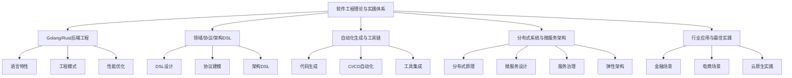

# 00-软件工程理论与实践体系总论（重构版）

> 本文档为"软件工程理论与实践体系"重构版总论，聚焦于：
>
> 1. 与Golang/Rust后端开发相关的理论与实践
> 2. 与软件领域定义语言、协议定义语言、架构定义语言及自动化生成相关的理论与工具
> 3. 与分布式系统、微服务定义架构相关的理论与工程实践
> 内容严格编号、层次分明，突出自动化、工程创新、架构与语言前沿。

## 目录

1. 体系概述与目标
2. 主题规划与内容索引
3. 体系结构与主题关系图
4. 各主题简介
5. 相关性跳转与引用

---

## 1. 体系概述与目标

本体系聚焦现代软件工程的核心创新方向，强调后端工程（Golang/Rust）、自动化建模与生成、分布式与微服务架构的理论与实践统一。目标是：

- 建立面向现代后端的工程理论基础
- 推动领域/协议/架构DSL与自动化生成工具的工程落地
- 规范分布式系统与微服务架构的设计、实现与演化
- 支持跨语言、跨平台的工程创新与最佳实践

---

## 2. 主题规划与内容索引

| 编号 | 主题                                 | 简要说明 |
|------|--------------------------------------|----------|
| 1    | Golang/Rust后端工程理论与实践         | 语言特性、工程模式、性能优化、代码示例 |
| 2    | 领域定义语言（DSL）与协议/架构DSL     | DSL设计、协议建模、架构DSL、自动化生成 |
| 3    | 自动化生成与工程工具链                 | 代码生成、模型驱动、CI/CD自动化、工具集成 |
| 4    | 分布式系统与微服务架构理论与实践       | 分布式原理、微服务设计、服务治理、弹性架构 |
| 5    | 行业应用与最佳实践                     | 金融、电商、云原生等典型场景案例 |

---

## 3. 体系结构与主题关系图

---

## 4. 各主题简介

### 4.1 Golang/Rust后端工程理论与实践

- 语言核心特性、类型系统、并发模型、内存管理
- 工程模式（如Clean Architecture、Hexagonal、DDD）
- 性能优化、可观测性、工程自动化
- Rust/Golang代码示例、工程模板

### 4.2 领域定义语言（DSL）与协议/架构DSL

- DSL设计原则、语法与语义建模
- 协议定义语言（如Protobuf、OpenAPI、IDL）
- 架构DSL（如CUE、KDL、YAML-based DSL）
- 自动化生成与集成
- Rust宏、Go模板、ANTLR等工具

### 4.3 自动化生成与工程工具链

- 代码生成器、模型驱动开发（MDD）
- CI/CD自动化流程、DevOps集成
- 工具链集成与工程最佳实践
- 自动化脚本、YAML/JSON配置、生成模板

### 4.4 分布式系统与微服务架构理论与实践

- 分布式一致性、CAP理论、服务注册与发现
- 微服务设计模式、服务治理、弹性架构
- 云原生架构、服务网格、API网关
- Rust/Golang分布式与微服务代码示例

### 4.5 行业应用与最佳实践

- 金融、电商、云原生等典型场景的工程落地
- 领域建模、协议设计、架构演进案例
- 自动化与工程创新实践

---

## 5. 相关性跳转与引用

- [进度追踪与上下文.md](../进度追踪与上下文.md)
- [00-主题树与内容索引.md](../00-主题树与内容索引.md)

---

> 本文件为自动归纳生成，后续将递归细化各分主题，持续补全图表、公式、代码等多表征内容。
