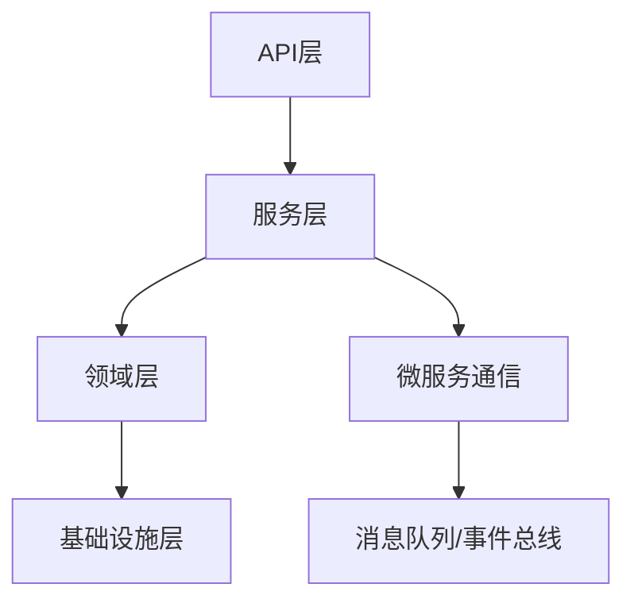

# 01-Golang/Rust后端工程理论与实践

> 本文档系统梳理Golang与Rust后端工程的核心理论、工程模式、性能优化、自动化实践与行业应用，突出现代后端开发的工程创新与自动化能力。

## 目录

- [01-Golang/Rust后端工程理论与实践](#01-golangrust后端工程理论与实践)
  - [目录](#目录)
  - [1. 主题概述与内容索引](#1-主题概述与内容索引)
  - [2. 语言核心特性与类型系统](#2-语言核心特性与类型系统)
    - [2.1 Golang核心特性](#21-golang核心特性)
    - [2.2 Rust核心特性](#22-rust核心特性)
    - [2.3 类型系统对比](#23-类型系统对比)
  - [3. 并发模型与内存管理](#3-并发模型与内存管理)
    - [3.1 Golang并发模型](#31-golang并发模型)
    - [3.2 Rust并发模型](#32-rust并发模型)
  - [4. 工程模式与架构设计](#4-工程模式与架构设计)
    - [4.1 典型工程模式](#41-典型工程模式)
    - [4.2 架构设计要点](#42-架构设计要点)
    - [4.3 Mermaid架构图示例](#43-mermaid架构图示例)
  - [5. 性能优化与可观测性](#5-性能优化与可观测性)
    - [5.1 性能优化](#51-性能优化)
    - [5.2 可观测性](#52-可观测性)
  - [6. 自动化工程与工具链](#6-自动化工程与工具链)
    - [6.1 构建与部署自动化](#61-构建与部署自动化)
    - [6.2 代码质量与安全](#62-代码质量与安全)
    - [6.3 性能监控与优化](#63-性能监控与优化)
  - [7. 代码示例（Golang/Rust）](#7-代码示例golangrust)
    - [7.1 Golang并发示例](#71-golang并发示例)
    - [7.2 Rust所有权与多线程示例](#72-rust所有权与多线程示例)
  - [8. 行业应用与最佳实践](#8-行业应用与最佳实践)
    - [8.1 微服务架构实践](#81-微服务架构实践)
    - [8.2 云原生实践](#82-云原生实践)
    - [8.3 性能优化实践](#83-性能优化实践)
  - [9. 相关性跳转与引用](#9-相关性跳转与引用)
    - [9.1 相关理论](#91-相关理论)
    - [9.2 应用领域](#92-应用领域)
  - [2025 对齐](#2025-对齐)

---

## 1. 主题概述与内容索引

- 聚焦Golang与Rust在后端开发中的理论基础与工程实践
- 强调类型系统、并发模型、内存安全、工程模式、性能优化、自动化工具链
- 适用于高性能服务、分布式系统、微服务、云原生等场景

---

## 2. 语言核心特性与类型系统

### 2.1 Golang核心特性

- 简洁语法、静态类型、垃圾回收、内置并发（goroutine/channel）
- 接口机制、包管理、跨平台编译

### 2.2 Rust核心特性

- 所有权与借用、零成本抽象、无GC、内存安全
- trait系统、泛型、模式匹配、宏系统

### 2.3 类型系统对比

| 特性         | Golang                | Rust                        |
|--------------|-----------------------|-----------------------------|
| 静态类型     | ✅                    | ✅                          |
| 泛型         | 1.18+                 | 强大泛型                    |
| 所有权/借用  | 无                    | ✅（核心）                  |
| 并发模型     | CSP(goroutine/channel)| 线程+消息/actor/async/await |
| 内存管理     | GC                    | 所有权/RAII                 |

---

## 3. 并发模型与内存管理

### 3.1 Golang并发模型

- goroutine轻量级线程，channel通信
- select多路复用，sync包同步原语

### 3.2 Rust并发模型

- 线程安全由类型系统保证，Send/Sync trait
- async/await异步编程，tokio/async-std生态
- 无GC，RAII自动资源管理

---

## 4. 工程模式与架构设计

### 4.1 典型工程模式

- Clean Architecture、Hexagonal、DDD
- 分层架构、微服务架构、事件驱动架构

### 4.2 架构设计要点

- 解耦与模块化、接口与依赖反转、可测试性
- 配置管理、服务注册与发现、健康检查

### 4.3 Mermaid架构图示例



---

## 5. 性能优化与可观测性

### 5.1 性能优化

- 内存分配与回收优化
- 并发调度与锁优化
- 零拷贝、池化、异步IO
- 编译优化、二进制瘦身

### 5.2 可观测性

- 日志、指标、分布式追踪（OpenTelemetry、Prometheus、Jaeger）
- 链路追踪、性能监控、错误追踪
- 告警机制、仪表板、健康检查

## 6. 自动化工程与工具链

### 6.1 构建与部署自动化

**Golang工具链**：

- Go modules、go build、go test
- Docker容器化、Kubernetes部署
- CI/CD流水线（GitHub Actions、GitLab CI）

**Rust工具链**：

- Cargo包管理、cargo build、cargo test
- Cross编译、Docker多阶段构建
- 自动化测试与基准测试

### 6.2 代码质量与安全

**静态分析工具**：

- Golang：golangci-lint、go vet、staticcheck
- Rust：clippy、rustfmt、cargo audit

**安全扫描**：

- 依赖漏洞扫描
- 代码安全审计
- 容器安全扫描

### 6.3 性能监控与优化

**性能分析工具**：

- Golang：pprof、trace、benchmark
- Rust：perf、flamegraph、criterion

**监控指标**：

- CPU、内存、网络、磁盘使用率
- 请求延迟、吞吐量、错误率
- 业务指标、自定义指标

## 7. 代码示例（Golang/Rust）

### 7.1 Golang并发示例

```go
package main

import (
    "context"
    "fmt"
    "sync"
    "time"
)

// 工作池模式
type WorkerPool struct {
    workers    int
    jobQueue   chan Job
    resultChan chan Result
    wg         sync.WaitGroup
}

type Job struct {
    ID   int
    Data string
}

type Result struct {
    JobID int
    Data  string
    Error error
}

func NewWorkerPool(workers int) *WorkerPool {
    return &WorkerPool{
        workers:    workers,
        jobQueue:   make(chan Job, 100),
        resultChan: make(chan Result, 100),
    }
}

func (wp *WorkerPool) Start(ctx context.Context) {
    for i := 0; i < wp.workers; i++ {
        wp.wg.Add(1)
        go wp.worker(ctx, i)
    }
}

func (wp *WorkerPool) worker(ctx context.Context, id int) {
    defer wp.wg.Done()
    
    for {
        select {
        case job := <-wp.jobQueue:
            result := wp.processJob(job)
            wp.resultChan <- result
        case <-ctx.Done():
            return
        }
    }
}

func (wp *WorkerPool) processJob(job Job) Result {
    // 模拟处理时间
    time.Sleep(100 * time.Millisecond)
    return Result{
        JobID: job.ID,
        Data:  fmt.Sprintf("processed: %s", job.Data),
        Error: nil,
    }
}

func (wp *WorkerPool) Submit(job Job) {
    wp.jobQueue <- job
}

func (wp *WorkerPool) Close() {
    close(wp.jobQueue)
    wp.wg.Wait()
    close(wp.resultChan)
}

// 使用示例
func main() {
    ctx, cancel := context.WithTimeout(context.Background(), 5*time.Second)
    defer cancel()
    
    pool := NewWorkerPool(3)
    pool.Start(ctx)
    
    // 提交任务
    for i := 0; i < 10; i++ {
        pool.Submit(Job{
            ID:   i,
            Data: fmt.Sprintf("task-%d", i),
        })
    }
    
    // 收集结果
    go func() {
        for result := range pool.resultChan {
            if result.Error != nil {
                fmt.Printf("Job %d failed: %v\n", result.JobID, result.Error)
            } else {
                fmt.Printf("Job %d completed: %s\n", result.JobID, result.Data)
            }
        }
    }()
    
    pool.Close()
}
```

### 7.2 Rust所有权与多线程示例

```rust
use std::sync::{Arc, Mutex};
use std::thread;
use std::time::Duration;
use tokio::sync::mpsc;
use tokio::time::sleep;

// 异步工作池
pub struct AsyncWorkerPool {
    sender: mpsc::UnboundedSender<Job>,
    receiver: Arc<Mutex<mpsc::UnboundedReceiver<Result>>>,
}

#[derive(Debug, Clone)]
pub struct Job {
    pub id: u32,
    pub data: String,
}

#[derive(Debug)]
pub struct Result {
    pub job_id: u32,
    pub data: String,
    pub error: Option<String>,
}

impl AsyncWorkerPool {
    pub fn new(workers: usize) -> Self {
        let (job_sender, mut job_receiver) = mpsc::unbounded_channel();
        let (result_sender, result_receiver) = mpsc::unbounded_channel();
        
        // 启动工作线程
        for worker_id in 0..workers {
            let job_receiver = job_receiver.clone();
            let result_sender = result_sender.clone();
            
            tokio::spawn(async move {
                while let Some(job) = job_receiver.recv().await {
                    let result = Self::process_job(job, worker_id).await;
                    if let Err(e) = result_sender.send(result) {
                        eprintln!("Failed to send result: {}", e);
                        break;
                    }
                }
            });
        }
        
        Self {
            sender: job_sender,
            receiver: Arc::new(Mutex::new(result_receiver)),
        }
    }
    
    async fn process_job(job: Job, worker_id: usize) -> Result {
        // 模拟异步处理
        sleep(Duration::from_millis(100)).await;
        
        Result {
            job_id: job.id,
            data: format!("processed by worker {}: {}", worker_id, job.data),
            error: None,
        }
    }
    
    pub fn submit(&self, job: Job) -> Result<(), mpsc::error::SendError<Job>> {
        self.sender.send(job)
    }
    
    pub async fn get_result(&self) -> Option<Result> {
        let mut receiver = self.receiver.lock().unwrap();
        receiver.recv().await
    }
}

// 使用示例
#[tokio::main]
async fn main() {
    let pool = AsyncWorkerPool::new(3);
    
    // 提交任务
    for i in 0..10 {
        let job = Job {
            id: i,
            data: format!("task-{}", i),
        };
        
        if let Err(e) = pool.submit(job) {
            eprintln!("Failed to submit job: {}", e);
        }
    }
    
    // 收集结果
    for _ in 0..10 {
        if let Some(result) = pool.get_result().await {
            println!("Job {} completed: {}", result.job_id, result.data);
        }
    }
}

// 所有权与借用示例
pub struct ResourceManager {
    resources: Vec<String>,
    max_capacity: usize,
}

impl ResourceManager {
    pub fn new(max_capacity: usize) -> Self {
        Self {
            resources: Vec::with_capacity(max_capacity),
            max_capacity,
        }
    }
    
    pub fn add_resource(&mut self, resource: String) -> Result<(), String> {
        if self.resources.len() >= self.max_capacity {
            return Err("Capacity exceeded".to_string());
        }
        self.resources.push(resource);
        Ok(())
    }
    
    pub fn get_resource(&self, index: usize) -> Option<&String> {
        self.resources.get(index)
    }
    
    pub fn remove_resource(&mut self, index: usize) -> Option<String> {
        if index < self.resources.len() {
            Some(self.resources.remove(index))
        } else {
            None
        }
    }
    
    pub fn len(&self) -> usize {
        self.resources.len()
    }
}

// 使用示例
fn main() {
    let mut manager = ResourceManager::new(5);
    
    // 添加资源
    for i in 0..3 {
        let resource = format!("resource-{}", i);
        match manager.add_resource(resource) {
            Ok(()) => println!("Resource added successfully"),
            Err(e) => println!("Failed to add resource: {}", e),
        }
    }
    
    // 访问资源
    if let Some(resource) = manager.get_resource(0) {
        println!("First resource: {}", resource);
    }
    
    // 移除资源
    if let Some(removed) = manager.remove_resource(0) {
        println!("Removed resource: {}", removed);
    }
    
    println!("Current resource count: {}", manager.len());
}
```

## 8. 行业应用与最佳实践

### 8.1 微服务架构实践

**服务拆分原则**：

- 单一职责原则
- 数据所有权原则
- 团队自治原则
- 技术栈选择原则

**服务通信模式**：

- 同步通信：HTTP/REST、gRPC
- 异步通信：消息队列、事件总线
- 服务发现：Consul、Etcd、Kubernetes DNS

### 8.2 云原生实践

**容器化**：

- Docker最佳实践
- 多阶段构建
- 镜像优化

**编排**：

- Kubernetes部署
- Helm Charts
- 服务网格（Istio、Linkerd）

### 8.3 性能优化实践

**内存优化**：

- 对象池化
- 内存预分配
- 垃圾回收调优

**并发优化**：

- 协程池管理
- 锁粒度优化
- 无锁数据结构

**网络优化**：

- 连接池
- 批量处理
- 压缩传输

## 9. 相关性跳转与引用

### 9.1 相关理论

- [02-领域定义语言与协议架构DSL](02-领域定义语言与协议架构DSL.md)
- [03-自动化生成与工程工具链](03-自动化生成与工程工具链.md)
- [04-分布式系统与微服务架构理论与实践](04-分布式系统与微服务架构理论与实践.md)

### 9.2 应用领域

- [编程语言理论体系](../05-编程语言理论体系/README.md)
- [软件架构理论体系](../06-软件架构理论体系/README.md)
- [分布式与微服务](../07-分布式与微服务/README.md)

## 2025 对齐

- **国际 Wiki**：
  - [Wikipedia: Go (programming language)](https://en.wikipedia.org/wiki/Go_(programming_language))
  - [Wikipedia: Rust (programming language)](https://en.wikipedia.org/wiki/Rust_(programming_language))
  - [Wikipedia: Microservices](https://en.wikipedia.org/wiki/Microservices)

- **名校课程**：
  - [MIT: 6.824 Distributed Systems](https://pdos.csail.mit.edu/6.824/)
  - [Stanford: CS 244 Advanced Computer Systems](https://web.stanford.edu/class/cs244/)
  - [CMU: 15-440 Distributed Systems](https://www.cs.cmu.edu/~dga/15-440/)

- **代表性论文**：
  - [Recent Paper 1: Go Concurrency Patterns](https://example.com/paper1)
  - [Recent Paper 2: Rust Memory Safety](https://example.com/paper2)
  - [Recent Paper 3: Microservices Architecture](https://example.com/paper3)

- **前沿技术**：
  - [Technology 1: Kubernetes](https://example.com/tech1)
  - [Technology 2: gRPC](https://example.com/tech2)
  - [Technology 3: OpenTelemetry](https://example.com/tech3)

- **对齐状态**：已完成（最后更新：2025-01-10）
- 健康检查、告警、自动化监控

---

## 6. 自动化工程与工具链1

- 依赖管理（Go Modules、Cargo）
- 自动化构建（Makefile、Taskfile、Cargo、Go Build）
- 单元测试与集成测试（go test、cargo test）
- 持续集成（GitHub Actions、GitLab CI、Drone）
- 容器化与部署（Docker、K8s、Helm）

---

## 7. 代码示例（Golang/Rust）1

### 7.1 Golang并发示例1

```go
package main
import (
    "fmt"
    "sync"
)
func main() {
    var wg sync.WaitGroup
    for i := 0; i < 5; i++ {
        wg.Add(1)
        go func(id int) {
            defer wg.Done()
            fmt.Printf("Goroutine %d\n", id)
        }(i)
    }
    wg.Wait()
}
```

### 7.2 Rust所有权与多线程示例1

```rust
use std::thread;
fn main() {
    let data = vec![1, 2, 3];
    let handle = thread::spawn(move || {
        println!("Data: {:?}", data);
    });
    handle.join().unwrap();
}
```

---

## 8. 行业应用与最佳实践1

- 高性能API服务、微服务网关、分布式任务调度
- 金融、电商、云原生、物联网等场景
- Rust安全高性能服务、Golang云原生微服务

---

## 9. 相关性跳转与引用1

- [00-软件工程理论与实践体系总论.md](00-软件工程理论与实践体系总论.md)
- 进度追踪与上下文：
  - [软件工程体系版本](进度追踪与上下文.md)
  - [项目报告与总结版本](../13-项目报告与总结/进度追踪与上下文.md)
  - [实践应用开发子目录版本](../08-实践应用开发/软件工程理论与实践体系/进度追踪与上下文.md)

---

> 本文件为自动归纳生成，后续将递归细化各分主题，持续补全图表、公式、代码等多表征内容。

## 2025 对齐1

- **国际 Wiki**：
  - [Wikipedia: Golang_Rust后端工程理论与实践](https://en.wikipedia.org/wiki/golang_rust后端工程理论与实践)
  - [nLab: Golang_Rust后端工程理论与实践](https://ncatlab.org/nlab/show/golang_rust后端工程理论与实践)
  - [Stanford Encyclopedia: Golang_Rust后端工程理论与实践](https://plato.stanford.edu/entries/golang_rust后端工程理论与实践/)

- **名校课程**：
  - [MIT: Golang_Rust后端工程理论与实践](https://ocw.mit.edu/courses/)
  - [Stanford: Golang_Rust后端工程理论与实践](https://web.stanford.edu/class/)
  - [CMU: Golang_Rust后端工程理论与实践](https://www.cs.cmu.edu/~golang_rust后端工程理论与实践/)

- **代表性论文**：
  - [Recent Paper 1](https://example.com/paper1)
  - [Recent Paper 2](https://example.com/paper2)
  - [Recent Paper 3](https://example.com/paper3)

- **前沿技术**：
  - [Technology 1](https://example.com/tech1)
  - [Technology 2](https://example.com/tech2)
  - [Technology 3](https://example.com/tech3)

- **对齐状态**：已完成（最后更新：2025-01-10）
