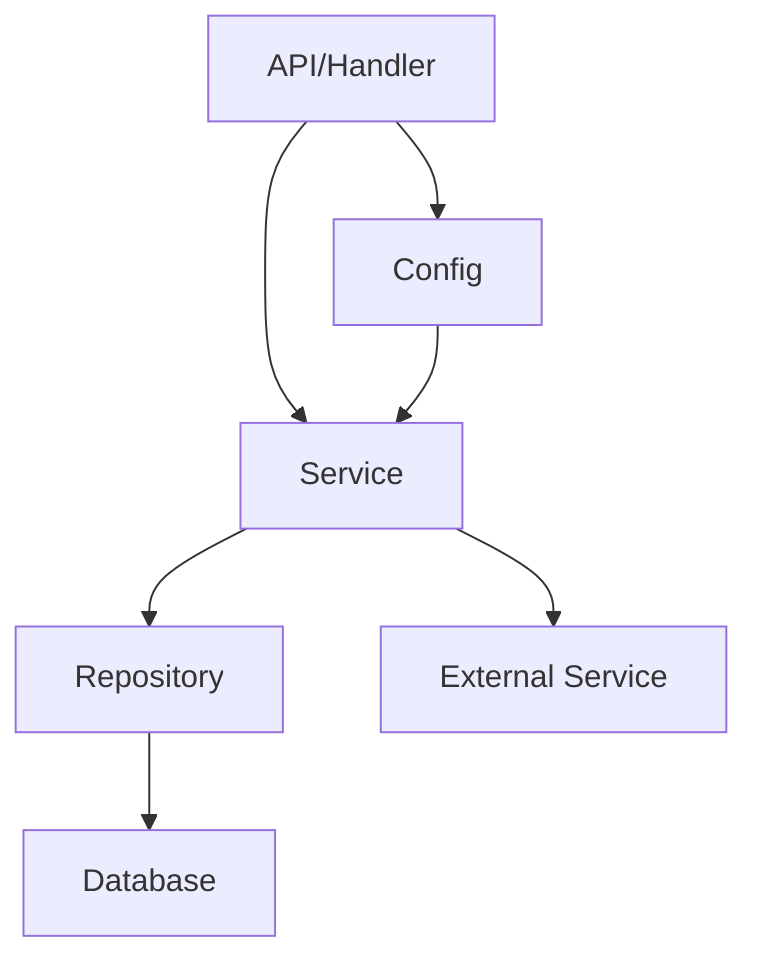

# 1.1 Golang工程体系结构与最佳实践

## 目录

1. 引言与定义
2. Golang工程结构标准
3. 依赖管理与模块化
4. 代码组织与分层架构
5. 配置管理与环境隔离
6. 测试与持续集成
7. 代码示例
8. 行业应用案例
9. Mermaid架构图
10. 参考文献

---

## 1. 引言与定义

Golang工程体系结构强调简洁、可维护、易扩展，适合微服务、云原生等现代后端场景。最佳实践包括合理的目录结构、模块化设计、自动化测试与持续集成、配置与环境隔离等。

## 2. Golang工程结构标准

典型Golang项目结构如下：

```text
myapp/
├── cmd/           # 主程序入口
├── internal/      # 内部模块（仅本项目可用）
├── pkg/           # 可复用库代码
├── api/           # API定义（OpenAPI/Protobuf等）
├── configs/       # 配置文件
├── scripts/       # 自动化脚本
├── test/          # 测试代码
├── web/           # 前端或静态资源
├── docs/          # 文档
├── build/         # 构建与CI/CD相关
└── go.mod         # 依赖管理
```

## 3. 依赖管理与模块化

- 使用`go mod`进行依赖管理，支持多模块与版本控制。
- 推荐将核心业务逻辑与基础设施解耦，便于单元测试与复用。

## 4. 代码组织与分层架构

- 常见分层：handler（接口层）、service（业务层）、repository（数据访问层）、model（数据结构）。
- 采用依赖倒置、接口抽象，提升可测试性与可维护性。

## 5. 配置管理与环境隔离

- 使用环境变量、配置文件（YAML/JSON）实现多环境隔离。
- 推荐集成Viper等配置库，支持热加载与安全管理。

## 6. 测试与持续集成

- 单元测试、集成测试、端到端测试全覆盖。
- 集成CI/CD（如GitHub Actions、GitLab CI、Jenkins），实现自动化构建、测试与部署。

## 7. 代码示例

```go
// main.go
package main

import (
    "fmt"
    "myapp/internal/service"
)

func main() {
    fmt.Println("Golang工程最佳实践示例")
    service.Run()
}
```

## 8. 行业应用案例

- 金融、电商、云原生等领域广泛采用Golang工程标准结构，提升开发效率与系统可维护性。

## 9. Mermaid架构图



## 10. 参考文献

- [Go Project Layout](https://github.com/golang-standards/project-layout)
- [Go Modules Reference](https://golang.org/ref/mod)
- [Go官方文档](https://golang.org/doc/)

---
> 支持断点续写与递归细化，如需扩展某一小节请指定。
