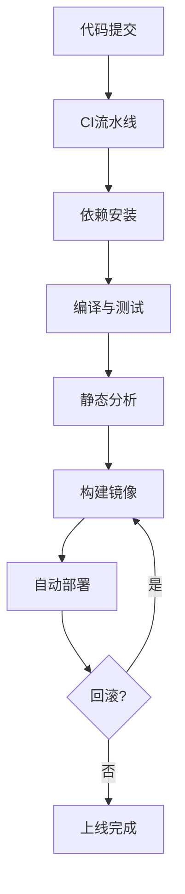

# 1.2 工程自动化与CI/CD理论

## 目录

1. 引言与定义
2. CI/CD理论基础与形式化模型
3. Golang工程自动化流程
4. 主流CI/CD工具链（GitHub Actions、GitLab CI、Jenkins等）
5. 自动化构建与测试配置示例
6. 自动化部署与回滚实践
7. 行业应用案例
8. Mermaid自动化流程图
9. 参考文献

---

## 1. 引言与定义

工程自动化是现代软件开发的核心，CI/CD（持续集成/持续交付）通过自动化构建、测试、部署，提升开发效率与交付质量。Golang生态高度契合自动化理念，支持多种CI/CD工具链与自动化脚本。

## 2. CI/CD理论基础与形式化模型

- **CI/CD定义**：CI（Continuous Integration）指代码变更后自动集成与测试，CD（Continuous Delivery/Deployment）指自动化交付与部署。
- **形式化模型**：
  - CI/CD可建模为有向图G=(V,E)，节点为阶段（如build、test、deploy），边为依赖关系。
  - 状态转移系统S=(S,→,I,F)，每次提交触发状态迁移。
  - 时态逻辑表达：□(commit → ◇test)，□(test_fail → ¬deploy)。

## 3. Golang工程自动化流程

- 代码提交（push/merge）自动触发流水线
- 自动化依赖安装、编译、单元测试、集成测试
- 代码静态分析与质量检查（如golint、go vet）
- 自动化构建Docker镜像、推送镜像仓库
- 自动化部署到测试/生产环境，支持回滚

## 4. 主流CI/CD工具链

- **GitHub Actions**：YAML配置，云原生集成，适合开源与企业项目
- **GitLab CI**：内置CI/CD，支持多Runner与复杂流水线
- **Jenkins**：插件丰富，支持自定义流水线与分布式构建
- **Drone、CircleCI、Travis CI**等

## 5. 自动化构建与测试配置示例

### GitHub Actions示例

```yaml
name: Go CI
on:
  push:
    branches: [ main ]
jobs:
  build:
    runs-on: ubuntu-latest
    steps:
      - uses: actions/checkout@v2
      - name: Set up Go
        uses: actions/setup-go@v3
        with:
          go-version: '1.21'
      - name: Install dependencies
        run: go mod download
      - name: Run tests
        run: go test ./...
      - name: Lint
        run: go vet ./...
      - name: Build
        run: go build -v ./...
```

### Jenkinsfile示例

```groovy
pipeline {
  agent any
  stages {
    stage('Checkout') {
      steps { checkout scm }
    }
    stage('Build') {
      steps { sh 'go build -v ./...' }
    }
    stage('Test') {
      steps { sh 'go test ./...' }
    }
    stage('Lint') {
      steps { sh 'go vet ./...' }
    }
    stage('Docker Build') {
      steps { sh 'docker build -t myapp:latest .' }
    }
  }
}
```

## 6. 自动化部署与回滚实践

- 使用Docker/Kubernetes实现自动化部署与弹性伸缩
- 集成Helm、ArgoCD等工具实现声明式部署与自动回滚
- 支持蓝绿部署、金丝雀发布等高级策略

## 7. 行业应用案例

- 金融、电商、云原生企业广泛采用Golang+CI/CD自动化，提升交付效率与系统可靠性

## 8. Mermaid自动化流程图



## 9. 参考文献

- [CI/CD Pipeline Reference](https://martinfowler.com/articles/continuousIntegration.html)
- [Go官方CI/CD指南](https://golang.org/doc/tutorial/)
- [GitHub Actions官方文档](https://docs.github.com/en/actions)
- [Jenkins官方文档](https://www.jenkins.io/doc/)

---
> 支持断点续写与递归细化，如需扩展某一小节请指定。
