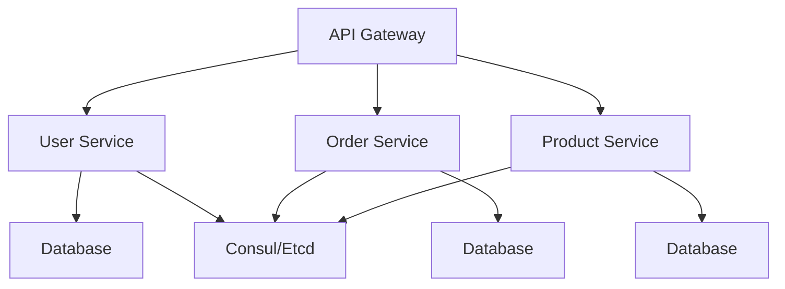

# 2.1 微服务架构设计与实现

## 目录

1. 引言与定义
2. 微服务架构核心原则
3. Golang微服务分层结构
4. 服务注册与发现机制
5. 通信协议与API设计（REST/gRPC）
6. 代码示例
7. 行业应用案例
8. Mermaid微服务架构图
9. 参考文献

---

## 1. 引言与定义

微服务架构是一种将应用拆分为一组小型、自治服务的设计方法。Golang以其高并发、易部署、生态丰富等优势，成为微服务开发的主流语言之一。

## 2. 微服务架构核心原则

- 单一职责、自治部署、去中心化治理
- 独立扩展、容错隔离、自动化运维
- API优先、契约驱动、持续交付

## 3. Golang微服务分层结构

- API/Handler层：对外暴露REST/gRPC接口
- Service层：业务逻辑处理
- Repository层：数据访问与持久化
- Infrastructure层：外部依赖（如消息队列、缓存、第三方服务）

## 4. 服务注册与发现机制

- 常用方案：Consul、Etcd、Eureka、Kubernetes内置服务发现
- 支持健康检查、自动注册与注销、负载均衡

## 5. 通信协议与API设计

- RESTful API：基于HTTP/JSON，适合通用场景
- gRPC：基于Protobuf，支持高性能二进制通信、接口自动生成
- OpenAPI/Swagger用于REST接口文档与代码生成

## 6. 代码示例

### RESTful微服务（Gin框架）

```go
package main
import (
    "github.com/gin-gonic/gin"
)
func main() {
    r := gin.Default()
    r.GET("/ping", func(c *gin.Context) {
        c.JSON(200, gin.H{"message": "pong"})
    })
    r.Run(":8080")
}
```

### gRPC微服务（Protobuf定义与实现）

```proto
// service.proto
type PingRequest {
  string message = 1;
}
type PingReply {
  string reply = 1;
}
service PingService {
  rpc Ping(PingRequest) returns (PingReply);
}
```

## 7. 行业应用案例

- 金融、电商、云原生平台广泛采用Golang微服务架构，提升系统弹性与可维护性

## 8. Mermaid微服务架构图



## 9. 参考文献

- [微服务架构模式](https://microservices.io/patterns/index.html)
- [Go微服务最佳实践](https://github.com/go-kit/kit)
- [gRPC官方文档](https://grpc.io/docs/)

---
> 支持断点续写与递归细化，如需扩展某一小节请指定。
