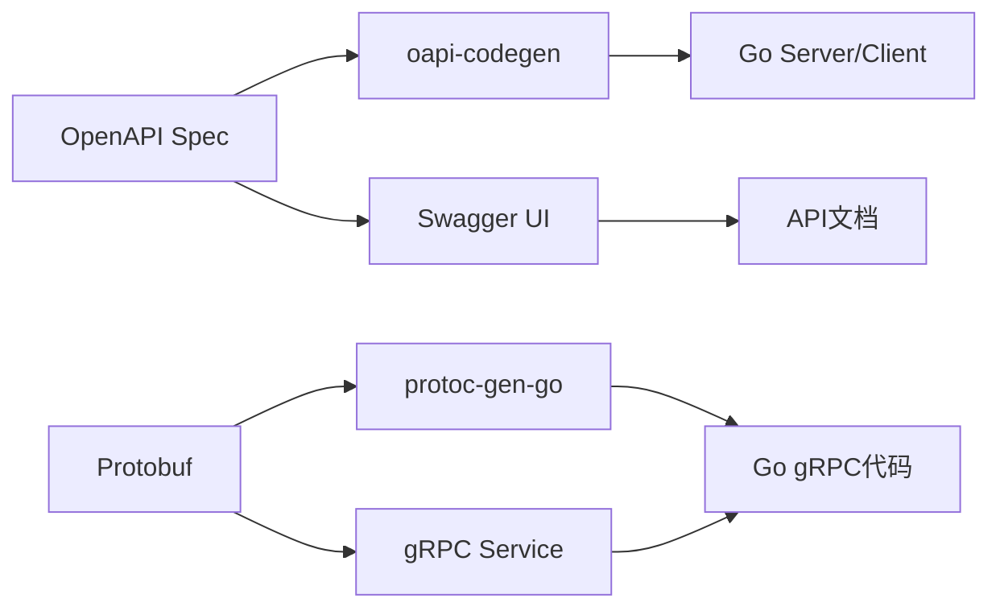

# 2.2 OpenAPI/Swagger/Protobuf协议标准

## 目录

1. 引言与协议简介
2. OpenAPI/Swagger标准与生态
3. Protobuf协议与gRPC集成
4. 自动化API文档与代码生成
5. 代码与配置示例
6. 行业应用案例
7. Mermaid协议关系图
8. 参考文献

---

## 1. 引言与协议简介

OpenAPI/Swagger和Protobuf是现代微服务架构中主流的API协议标准。它们支持接口自动化、文档生成、代码生成与多语言互操作，极大提升了Golang微服务的开发效率与一致性。

## 2. OpenAPI/Swagger标准与生态

- **OpenAPI**（原Swagger）：描述RESTful API的开放标准，支持自动生成文档、客户端/服务端代码。
- 生态工具：Swagger UI、Swagger Editor、oapi-codegen、openapi-generator、swaggo/swag等。
- 优势：接口契约驱动开发、自动化测试、文档与代码同步。

## 3. Protobuf协议与gRPC集成

- **Protobuf**：Google推出的高性能二进制序列化协议，广泛用于gRPC服务定义。
- **gRPC**：基于Protobuf的高性能RPC框架，支持多语言、自动生成代码、流式通信。
- 生态工具：protoc、protoc-gen-go、buf、grpc-gateway等。

## 4. 自动化API文档与代码生成

- OpenAPI/Swagger：通过注解或YAML/JSON文件，自动生成接口文档与Go代码（如oapi-codegen、swaggo/swag）。
- Protobuf/gRPC：通过.proto文件自动生成Go服务端与客户端代码（protoc-gen-go、protoc-gen-go-grpc）。
- 支持接口Mock、自动化测试、API版本管理。

## 5. 代码与配置示例

### OpenAPI自动生成Go代码

```bash
oapi-codegen -generate types,server,spec -package api -o api/api.gen.go api/openapi.yaml
```

### Swagger注解生成文档

```go
// @Summary Ping接口
// @Description 健康检查
// @Tags Health
// @Success 200 {object} map[string]string
// @Router /ping [get]
func Ping(c *gin.Context) {
    c.JSON(200, gin.H{"message": "pong"})
}
```

### Protobuf定义与Go代码生成

```proto
syntax = "proto3";
package api;
service Greeter {
  rpc SayHello (HelloRequest) returns (HelloReply) {}
}
message HelloRequest {
  string name = 1;
}
message HelloReply {
  string message = 1;
}
```

```bash
protoc --go_out=. --go-grpc_out=. api/greeter.proto
```

## 6. 行业应用案例

- 金融、电商、云原生平台广泛采用OpenAPI/Swagger/Protobuf标准，实现多语言互操作与自动化集成

## 7. Mermaid协议关系图



## 8. 参考文献

- [OpenAPI官方文档](https://swagger.io/specification/)
- [Swagger生态工具](https://swagger.io/tools/)
- [Protobuf官方文档](https://developers.google.com/protocol-buffers)
- [gRPC官方文档](https://grpc.io/docs/)
- [oapi-codegen](https://github.com/deepmap/oapi-codegen)
- [swaggo/swag](https://github.com/swaggo/swag)

---
> 支持断点续写与递归细化，如需扩展某一小节请指定。
