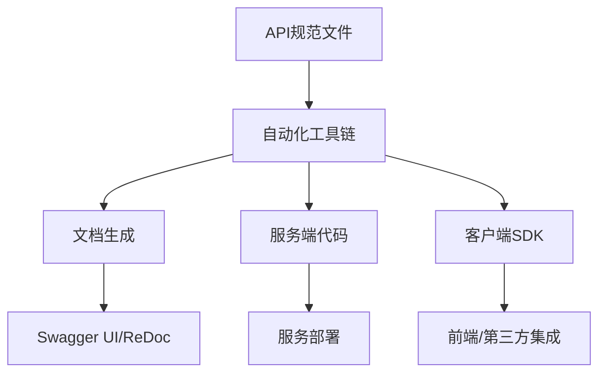

# 2.3 自动化API文档与代码生成

## 目录

1. 引言与自动化流程概述
2. 主流工具与生态（swaggo、oapi-codegen、openapi-generator、protoc等）
3. 自动化API文档生成实践
4. 自动化服务端/客户端代码生成
5. 集成CI/CD与自动化测试
6. 代码与配置示例
7. 行业应用案例
8. Mermaid自动化流程图
9. 参考文献

---

## 1. 引言与自动化流程概述

自动化API文档与代码生成是现代Golang微服务开发的核心环节。通过标准协议（OpenAPI/Swagger/Protobuf）与自动化工具链，实现接口文档、服务端/客户端代码、Mock服务等的自动生成，提升开发效率与一致性。

## 2. 主流工具与生态

- **swaggo/swag**：基于注解自动生成Swagger文档，集成Gin、Echo等主流框架
- **oapi-codegen**：根据OpenAPI规范自动生成Go类型、服务端/客户端代码
- **openapi-generator**：支持多语言API代码生成
- **protoc/protoc-gen-go**：Protobuf/gRPC接口与代码生成
- **grpc-gateway**：gRPC与RESTful API自动转换

## 3. 自动化API文档生成实践

- 通过注解、YAML/JSON规范或.proto文件，自动生成接口文档（Swagger UI、ReDoc等）
- 支持接口Mock、自动化测试、API版本管理
- 文档与代码同步，减少手工维护成本

## 4. 自动化服务端/客户端代码生成

- OpenAPI/Swagger：自动生成Go类型、路由、请求/响应结构体、客户端SDK
- Protobuf/gRPC：自动生成服务端与客户端代码，支持多语言互操作
- 支持接口契约驱动开发，提升系统一致性与可维护性

## 5. 集成CI/CD与自动化测试

- 在CI/CD流水线中集成API文档与代码生成步骤，保证接口变更自动同步
- 自动化测试覆盖API契约、Mock服务、回归测试等

## 6. 代码与配置示例

### Swag注解生成Swagger文档

```go
// @Summary 获取用户信息
// @Description 根据ID获取用户
// @Tags User
// @Param id path int true "用户ID"
// @Success 200 {object} User
// @Router /user/{id} [get]
func GetUser(c *gin.Context) { /* ... */ }
```

### oapi-codegen生成Go代码

```bash
oapi-codegen -generate types,server,spec -package api -o api/api.gen.go api/openapi.yaml
```

### Protobuf/gRPC代码生成

```bash
protoc --go_out=. --go-grpc_out=. api/service.proto
```

## 7. 行业应用案例

- 金融、电商、SaaS等行业通过自动化API文档与代码生成提升开发效率与接口一致性

## 8. Mermaid自动化流程图



## 9. 参考文献

- [swaggo/swag](https://github.com/swaggo/swag)
- [oapi-codegen](https://github.com/deepmap/oapi-codegen)
- [openapi-generator](https://github.com/OpenAPITools/openapi-generator)
- [Protobuf官方文档](https://developers.google.com/protocol-buffers)
- [gRPC官方文档](https://grpc.io/docs/)

---
> 支持断点续写与递归细化，如需扩展某一小节请指定。
