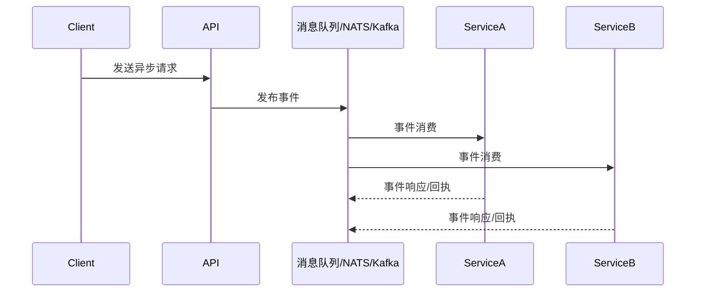

# 2.5 异步协议与事件驱动集成

## 目录

1. 引言与异步协议简介
2. 主流异步协议与实现
3. 事件驱动架构（EDA）与微服务集成
4. 自动化集成与最佳实践
5. 代码与配置示例
6. 行业应用案例
7. Mermaid异步通信架构图
8. 参考文献

---

## 1. 引言与异步协议简介

异步协议和事件驱动架构（EDA）是现代分布式系统和微服务架构的关键。通过消息队列、流式通信、事件总线等机制，实现服务间解耦、高并发与弹性扩展。

## 2. 主流异步协议与实现

- **WebSocket**：基于TCP的全双工通信协议，适合实时推送与前后端异步交互
- **gRPC-Streaming**：gRPC支持的流式异步通信，适合高性能服务间数据流
- **NATS**：轻量级高性能消息队列，支持发布/订阅、请求/响应、流式传输
- **Kafka**：分布式流处理平台，适合大规模事件驱动与数据管道
- **RabbitMQ/AMQP**：企业级消息中间件，支持多种消息模式

## 3. 事件驱动架构（EDA）与微服务集成

- 事件总线/消息队列实现服务解耦与异步通信
- 支持事件溯源、CQRS、Saga等分布式事务模式
- 结合Golang生态（如go-micro、watermill、segmentio/kafka-go等）实现高效EDA

## 4. 自动化集成与最佳实践

- 在CI/CD中集成异步协议与事件驱动组件的自动化部署与测试
- 自动化健康检查、消息追踪、事件重放等
- 支持多协议混合、异步与同步API协同

## 5. 代码与配置示例

### gRPC-Streaming服务端示例

```go
// proto定义
service Chat {
  rpc StreamMessages(stream Message) returns (stream Message);
}

// Go实现
func (s *server) StreamMessages(stream pb.Chat_StreamMessagesServer) error {
    for {
        msg, err := stream.Recv()
        if err == io.EOF { break }
        stream.Send(&pb.Message{Text: "Ack: " + msg.Text})
    }
    return nil
}
```

### NATS发布/订阅示例

```go
nc, _ := nats.Connect(nats.DefaultURL)
nc.Subscribe("updates", func(m *nats.Msg) {
    fmt.Printf("Received: %s\n", string(m.Data))
})
nc.Publish("updates", []byte("hello async!"))
```

## 6. 行业应用案例

- 金融、电商、物联网等场景广泛采用异步协议与EDA提升系统弹性与实时性

## 7. Mermaid异步通信架构图



## 8. 参考文献

- [gRPC Streaming官方文档](https://grpc.io/docs/guides/concepts/)
- [NATS官方文档](https://docs.nats.io/)
- [Kafka官方文档](https://kafka.apache.org/documentation/)
- [Watermill事件驱动库](https://watermill.io/)

---
> 支持断点续写与递归细化，如需扩展某一小节请指定。
