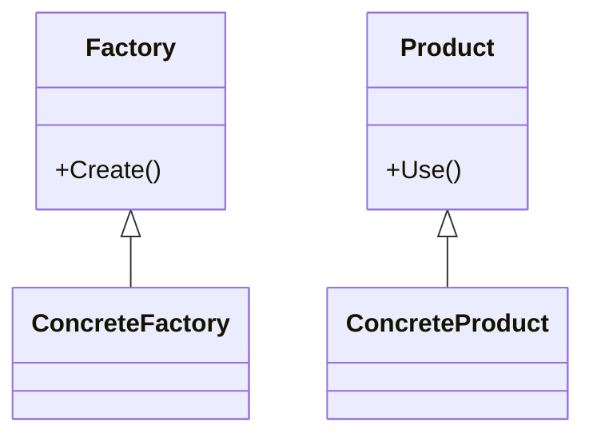

# 3.1 Golang常用设计模式实现

## 目录

1. 引言与设计模式概述
2. 单例模式
3. 工厂方法模式
4. 抽象工厂模式
5. 装饰器模式
6. 观察者模式
7. 自动化生成与工程集成
8. 代码示例
9. 行业应用案例
10. Mermaid模式结构图
11. 参考文献

---

## 1. 引言与设计模式概述

设计模式是提升Golang工程可维护性、可扩展性的重要手段。结合自动化工具链，可实现模式代码自动生成与工程集成。

## 2. 单例模式

- 保证全局唯一实例，常用于配置、连接池等
- Go实现：sync.Once、全局变量

## 3. 工厂方法模式

- 通过工厂方法创建对象，解耦实例化逻辑
- Go实现：接口+工厂函数

## 4. 抽象工厂模式

- 提供一组相关对象的创建接口，适合多产品族场景
- Go实现：接口+具体工厂结构体

## 5. 装饰器模式

- 动态扩展对象功能，常用于中间件、日志等
- Go实现：函数式装饰、接口包装

## 6. 观察者模式

- 实现事件订阅与通知，适合事件驱动架构
- Go实现：通道、回调、事件总线

## 7. 自动化生成与工程集成

- 结合代码生成工具（如Go Generate、模板引擎）自动生成模式代码
- 集成CI/CD自动化测试与部署

## 8. 代码示例

### 单例模式

```go
var instance *Config
var once sync.Once
func GetConfig() *Config {
    once.Do(func() {
        instance = &Config{/*...*/}
    })
    return instance
}
```

### 工厂方法模式

```go
type Product interface { Use() }
type Factory interface { Create() Product }
```

## 9. 行业应用案例

- 金融、电商、云原生等领域广泛采用设计模式提升系统可维护性

## 10. Mermaid模式结构图



## 11. 参考文献

- [GoF设计模式](https://refactoring.guru/design-patterns/go)
- [Go设计模式实践](https://github.com/senghoo/golang-design-pattern)

---
> 支持断点续写与递归细化，如需扩展某一小节请指定。
