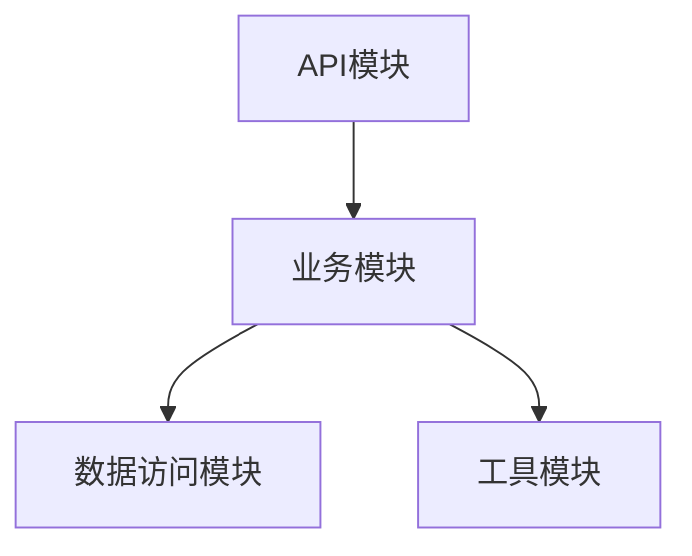

# 3.2 自动化生成与模块化工程

## 目录

1. 引言与自动化生成概述
2. 自动化生成工具与生态
3. 模块化设计原则
4. 工程集成与自动化实践
5. 代码与配置示例
6. 行业应用案例
7. Mermaid模块依赖图
8. 参考文献

---

## 1. 引言与自动化生成概述

自动化生成与模块化设计是提升Golang工程效率与可维护性的关键。通过代码生成工具、模板引擎、自动化脚本等，实现工程结构标准化与高效集成。

## 2. 自动化生成工具与生态

- go generate、Go模板、oapi-codegen、protoc、stringer等
- 支持API、数据结构、Mock、测试用例等自动生成

## 3. 模块化设计原则

- 单一职责、低耦合高内聚、接口抽象、依赖倒置
- 支持多模块协作与独立部署

## 4. 工程集成与自动化实践

- 结合Makefile、CI/CD、自动化脚本实现模块自动集成与测试
- 自动化生成与模块注册、依赖管理

## 5. 代码与配置示例

### go generate自动生成

```go
//go:generate stringer -type=Pill
```

### oapi-codegen生成API模块

```bash
oapi-codegen -generate types,server -package api -o api/api.gen.go api/openapi.yaml
```

## 6. 行业应用案例

- 金融、电商、SaaS等行业通过自动化生成与模块化提升工程效率

## 7. Mermaid模块依赖图



## 8. 参考文献

- [Go官方自动化工具](https://golang.org/pkg/go/)
- [Go模块化最佳实践](https://github.com/golang-standards/project-layout)

---
> 支持断点续写与递归细化，如需扩展某一小节请指定。
