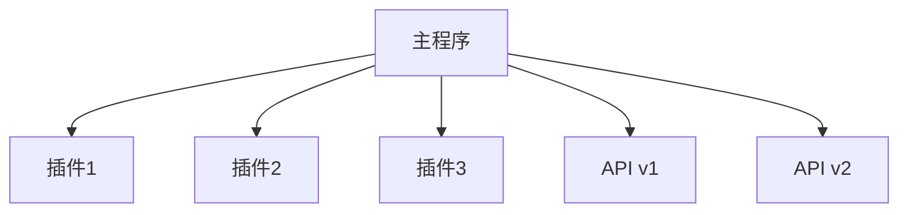

# 3.3 插件系统与API版本控制

## 目录

1. 引言与插件机制概述
2. Golang插件系统原理
3. API版本管理策略
4. 自动化集成与最佳实践
5. 代码与配置示例
6. 行业应用案例
7. Mermaid插件架构图
8. 参考文献

---

## 1. 引言与插件机制概述

插件系统与API版本控制是提升Golang工程可扩展性与兼容性的关键。通过动态加载、接口抽象与版本管理，实现灵活的功能扩展与平滑升级。

## 2. Golang插件系统原理

- Go 1.8+支持plugin包，动态加载.so插件
- 通过接口定义插件契约，支持热插拔与功能扩展
- 常用于网关、数据处理、业务扩展等场景

## 3. API版本管理策略

- 路径/参数/头部区分API版本（如/v1/user、X-API-Version）
- 采用OpenAPI/Swagger支持多版本文档与代码生成
- 版本弃用与平滑迁移机制

## 4. 自动化集成与最佳实践

- 在CI/CD中集成插件构建与API版本测试
- 自动化生成多版本SDK与文档

## 5. 代码与配置示例

### Go插件加载示例

```go
import "plugin"
p, _ := plugin.Open("plugin.so")
sym, _ := p.Lookup("Handler")
handler := sym.(func())
handler()
```

### API多版本路由示例

```go
r := gin.Default()
r.GET("/v1/user", v1Handler)
r.GET("/v2/user", v2Handler)
```

## 6. 行业应用案例

- 金融、电商、SaaS等行业通过插件与版本控制实现灵活扩展与兼容

## 7. Mermaid插件架构图



## 8. 参考文献

- [Go插件机制官方文档](https://pkg.go.dev/plugin)
- [API版本管理最佳实践](https://cloud.google.com/apis/design/versioning)

---
> 支持断点续写与递归细化，如需扩展某一小节请指定。
