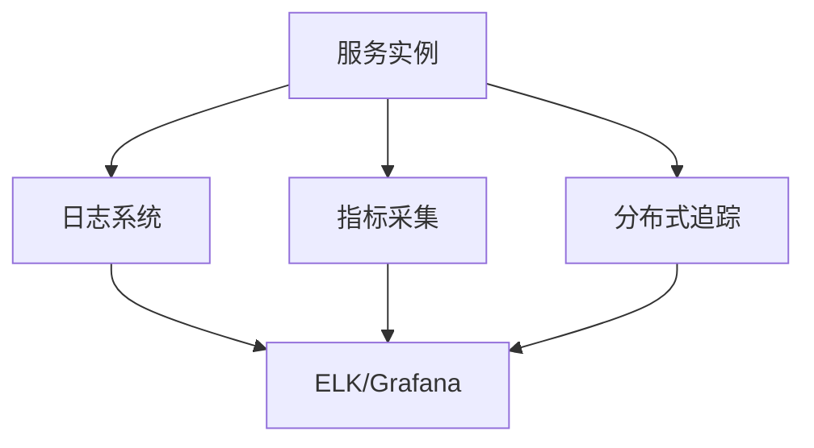

# 4.1 日志、指标、分布式追踪原理

## 目录

1. 引言与核心概念
2. 日志系统原理与最佳实践
3. 指标采集与监控体系
4. 分布式追踪机制
5. 主流工具与生态
6. 自动化集成与工程实践
7. 代码与配置示例
8. 行业应用案例
9. Mermaid观测架构图
10. 参考文献

---

## 1. 引言与核心概念

日志、指标与分布式追踪是现代微服务可观测性的三大支柱。通过统一采集、分析与可视化，提升系统可维护性与故障定位效率。

## 2. 日志系统原理与最佳实践

- 结构化日志、分级输出、集中采集
- 常用库：logrus、zap、zerolog

## 3. 指标采集与监控体系

- 关键指标：QPS、延迟、错误率、资源利用率
- Prometheus采集与Grafana可视化

## 4. 分布式追踪机制

- TraceID、SpanID、上下游关联
- OpenTelemetry、Jaeger、Zipkin等

## 5. 主流工具与生态

- 日志：logrus、zap、ELK
- 指标：Prometheus、Grafana
- 追踪：OpenTelemetry、Jaeger、Zipkin

## 6. 自动化集成与工程实践

- 统一采集、自动注入、CI/CD集成观测配置
- 支持多环境、自动化告警与自愈

## 7. 代码与配置示例

### logrus日志示例

```go
import "github.com/sirupsen/logrus"
logrus.WithField("user", "alice").Info("login success")
```

### Prometheus指标采集

```go
import "github.com/prometheus/client_golang/prometheus"
var opsProcessed = prometheus.NewCounter(prometheus.CounterOpts{
    Name: "myapp_processed_ops_total",
    Help: "The total number of processed events",
})
prometheus.MustRegister(opsProcessed)
```

### OpenTelemetry追踪

```go
import "go.opentelemetry.io/otel"
tracer := otel.Tracer("myapp")
ctx, span := tracer.Start(ctx, "operation")
defer span.End()
```

## 8. 行业应用案例

- 金融、电商、云原生平台广泛采用统一观测体系提升可维护性

## 9. Mermaid观测架构图



## 10. 参考文献

- [OpenTelemetry官方文档](https://opentelemetry.io/docs/)
- [Prometheus官方文档](https://prometheus.io/docs/)
- [logrus](https://github.com/sirupsen/logrus)
- [zap](https://github.com/uber-go/zap)

---
> 支持断点续写与递归细化，如需扩展某一小节请指定。
