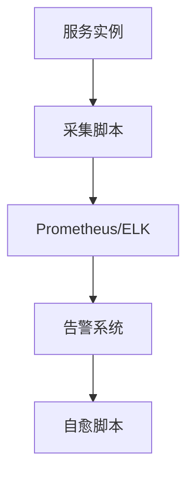

# 4.3 自动化观测与监控脚本

## 目录

1. 引言与自动化观测概述
2. 自动化采集与告警机制
3. 主流监控脚本与工具
4. CI/CD集成与自动化运维
5. 代码与配置示例
6. 行业应用案例
7. Mermaid监控流程图
8. 参考文献

---

## 1. 引言与自动化观测概述

自动化观测与监控脚本是保障Golang微服务稳定运行的关键。通过自动采集、告警与自愈，提升系统可用性与运维效率。

## 2. 自动化采集与告警机制

- 定时采集日志、指标、追踪数据
- 自动化阈值告警、异常检测、事件通知
- 支持自愈脚本与自动重启

## 3. 主流监控脚本与工具

- shell/python/golang脚本、Prometheus Alertmanager、Grafana告警、ELK自动化
- 支持多云与混合环境自动化观测

## 4. CI/CD集成与自动化运维

- 在CI/CD中集成观测脚本，自动部署与配置监控
- 自动化测试观测链路、回归监控配置

## 5. 代码与配置示例

### Prometheus自动化采集脚本

```yaml
scrape_configs:
  - job_name: 'myapp'
    static_configs:
      - targets: ['localhost:8080']
```

### shell健康检查与自愈

```sh
#!/bin/bash
if ! curl -sf http://localhost:8080/health; then
  systemctl restart myapp
fi
```

## 6. 行业应用案例

- 金融、电商、云原生平台通过自动化观测脚本提升运维智能化

## 7. Mermaid监控流程图



## 8. 参考文献

- [Prometheus Alertmanager](https://prometheus.io/docs/alerting/latest/alertmanager/)
- [Grafana告警](https://grafana.com/docs/grafana/latest/alerting/)
- [ELK自动化监控](https://www.elastic.co/guide/en/observability/current/index.html)

---
> 支持断点续写与递归细化，如需扩展某一小节请指定。
