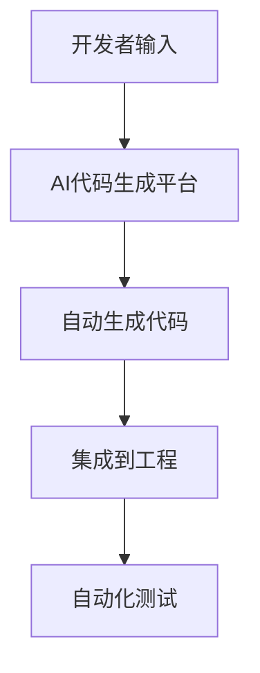

# 5.1 AI驱动的代码自动生成

## 目录

1. 引言与AI生成原理
2. 主流AI代码生成工具与平台
3. 自动化集成与工程实践
4. 代码与配置示例
5. 行业应用案例
6. Mermaid生成流程图
7. 参考文献

---

## 1. 引言与AI生成原理

AI驱动的代码自动生成利用大模型、代码补全、自然语言转代码等技术，提升Golang工程开发效率与智能化水平。

## 2. 主流AI代码生成工具与平台

- GitHub Copilot、TabNine、CodeGeeX、ChatGPT API等
- 支持函数补全、单元测试生成、API文档自动生成

## 3. 自动化集成与工程实践

- 在IDE、CI/CD中集成AI代码生成工具
- 自动生成接口、测试、文档、脚本等
- 结合代码审查与安全检测

## 4. 代码与配置示例

### Copilot自动补全示例

```go
// 输入函数签名，自动补全实现
func Add(a int, b int) int {
    // Copilot自动生成实现
}
```

### ChatGPT API自动生成代码

```go
// 通过API调用生成代码片段
```

## 5. 行业应用案例

- 金融、电商、SaaS等行业通过AI自动生成提升开发效率与创新能力

## 6. Mermaid生成流程图



## 7. 参考文献

- [GitHub Copilot](https://github.com/features/copilot)
- [TabNine](https://www.tabnine.com/)
- [CodeGeeX](https://codegeex.cn/)
- [OpenAI API](https://platform.openai.com/docs/)

---
> 支持断点续写与递归细化，如需扩展某一小节请指定。
