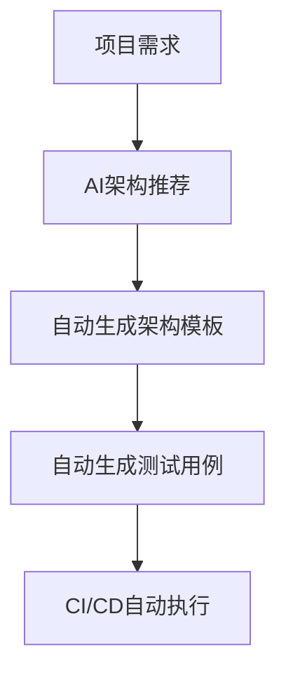

# 5.2 架构推荐与自动化测试生成

## 目录

1. 引言与AI架构推荐原理
2. 自动化测试生成工具与平台
3. 集成实践与工程应用
4. 代码与配置示例
5. 行业应用案例
6. Mermaid流程图
7. 参考文献

---

## 1. 引言与AI架构推荐原理

AI与自动化工具可根据项目需求、历史数据、最佳实践自动推荐架构方案，并生成测试用例，提升工程质量与创新能力。

## 2. 自动化测试生成工具与平台

- GoConvey、gotests、Testify、AI辅助测试生成（Copilot、ChatGPT等）
- 支持单元测试、集成测试、Mock、回归测试自动生成

## 3. 集成实践与工程应用

- 在CI/CD中集成自动化测试生成与执行
- 结合AI推荐架构模板、自动生成测试用例与文档

## 4. 代码与配置示例

### gotests自动生成单元测试

```bash
gotests -w -all myfile.go
```

### Copilot自动生成测试

```go
// 输入函数签名，自动补全测试用例
func TestAdd(t *testing.T) {
    // Copilot自动生成测试
}
```

## 5. 行业应用案例

- 金融、电商、SaaS等行业通过AI架构推荐与自动化测试提升工程质量

## 6. Mermaid流程图



## 7. 参考文献

- [GoConvey](https://github.com/smartystreets/goconvey)
- [gotests](https://github.com/cweill/gotests)
- [Testify](https://github.com/stretchr/testify)
- [GitHub Copilot](https://github.com/features/copilot)

---
> 支持断点续写与递归细化，如需扩展某一小节请指定。
